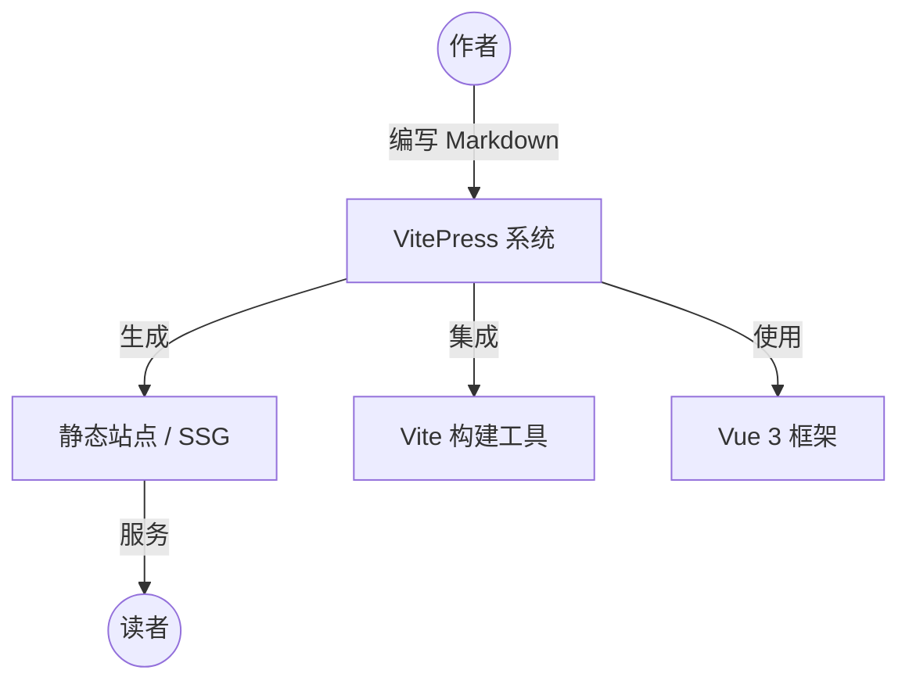
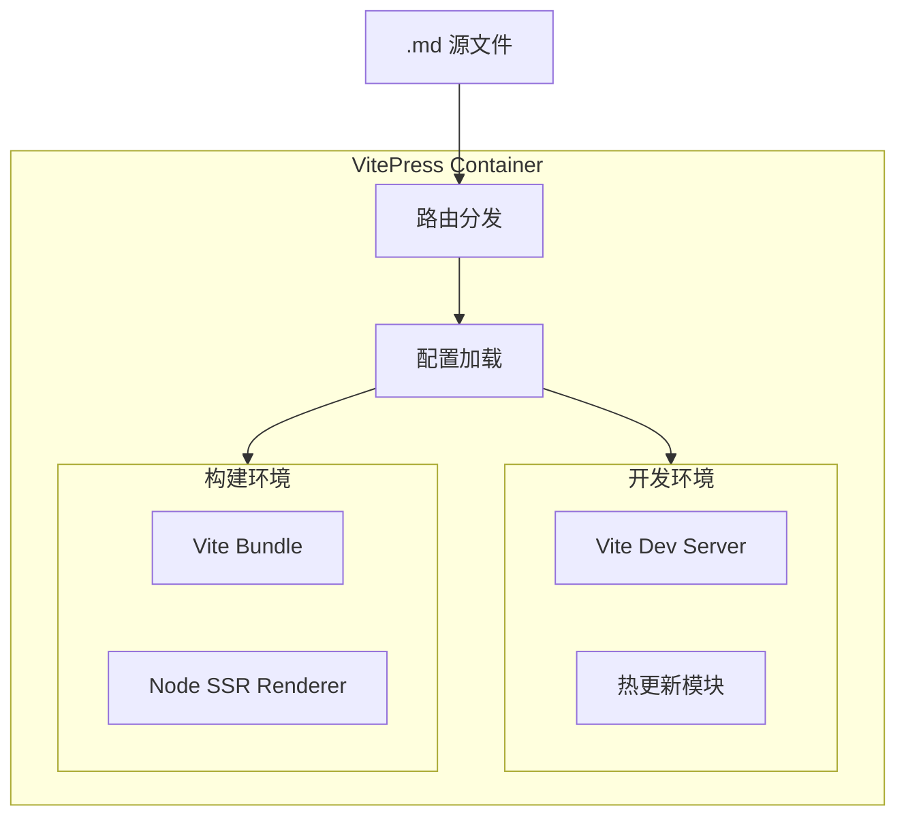
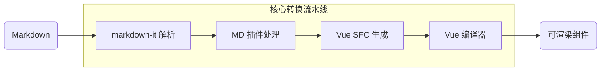
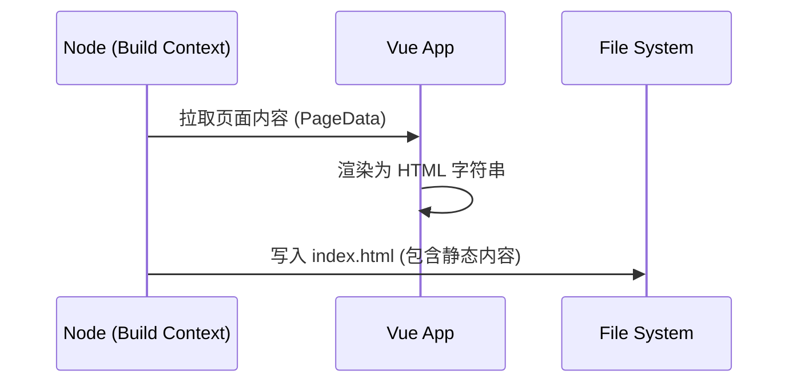

# VitePress 深度架构解析

本文遵循 **C4 模型** 思想，自顶向下对 VitePress 的整体架构与核心原理进行“缩放式”解析。

---

## L1: 上下文视图 (System Context)
从最高层级看，VitePress 是一个将 Markdown 源文件转换为极速、SEO 友好的静态站点的处理引擎。

---

## L2: 容器视图 (Containers) - 运行模式
Zoom in 进入 VitePress 内部，其核心分为 **开发模式 (Dev)** 与 **构建模式 (Build/SSG)** 两个独立的容器环境。

---

## L3: 组件视图 (Components) - 核心转换流水线
Zoom in 进入核心逻辑，看一个 Markdown 文件是如何变为 HTML 的。这是 VitePress 的核心骨架。

**关键机制解析：**
1.  **Markdown-it 扩展**：VitePress 所有的魔法（如 Mermaid、Markmap、代码高亮）都在 `markdown-it` 阶段通过 Token 转换实现。
2.  **SFC 生成**：Markdown 不仅仅被转为 HTML，而是被包装成了 Vue 单文件组件 (SFC)。这意味着你可以在 Markdown 中直接使用 Vue 组件。

---

## L4: 代码级别视图 (Code/Logic) - SSG & Hydration
Zoom in 进入最后一层，理解 VitePress 为什么快——“双端渲染”与“水合”机制。

### 1. 构建时 (SSG)
在构建阶段，VitePress 会为每个路由运行一次 Node.js 端渲染。

### 2. 运行时 (Hydration)
当读者打开页面时，浏览器会经历“水合”过程：
- **静态部分**：直接展示由 SSG 生成的 HTML，实现“秒开”。
- **动态部分**：加载轻量级 JS，激活 Vue 组件，使页面具备交互能力。

---

## 总结
VitePress 的卓越之处在于它将 **Markdown 的简洁** 与 **Vue 的动态能力** 完美结合，并通过 **Vite** 极大地缩短了开发反馈循环。
