# 简易Agent框架发展史

最初的Agent，是将预先定义的一些工具函数提供给模型推理选择，应用层将工具结果回传给模型，模型继续推理，直到问题解决，当然现在这个应用层统一叫做harness。

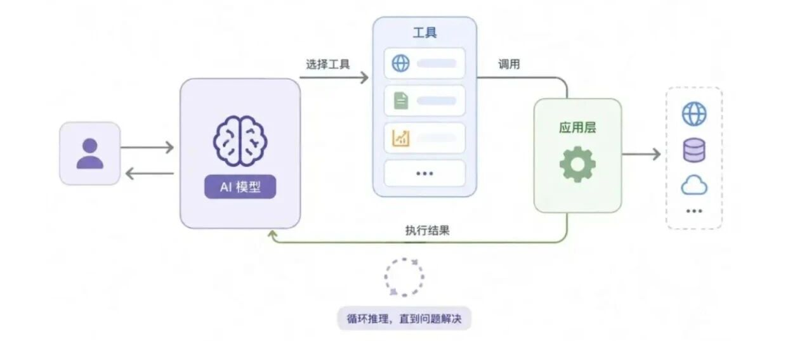

Agent的定义是能够基于环境自主感知，作出决策（如调用工具），最终完成预定目标的任务自执行系统。

自主：不是靠人一步步驱动提供提示，而是可以基于任务目标+环境进行决策；

感知：对环境变化和变量的感知，即可以观察环境；

工具：agent执行任务或者与环境进行交互，主要靠的是工具，有什么用的工具，agent就具备什么样的能力；

目标：agent围绕于这一预设的目标进行执行，agent完成的标准在于预设的目标完成了；

所以，一个典型的Agent包含以下几个核心模块：

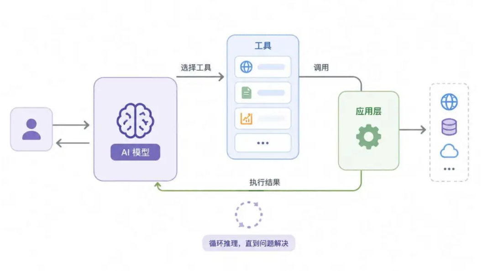

## 大模型

基座模型，提供基础的语言理解/推理/生成能力。它是整个agent的中枢神经，扮演着大脑的角色。

## 角色与人格

每个agent都被预设了应答风格/思考方式/身份与行为约束，以得到符合预期场景的输出。

## 记忆

记忆可以帮助agent更好的完成长周期任务，因为它需要记得昨天发生了什么事情。记忆可以围绕于本次会话的记忆，以及适用于所有对话的记忆，适当提供任务的跟踪性以及个性化响应；

记忆的存储有多种方式，比如可以通过向量数据库的方式实现语义检索/相似语义的召回。

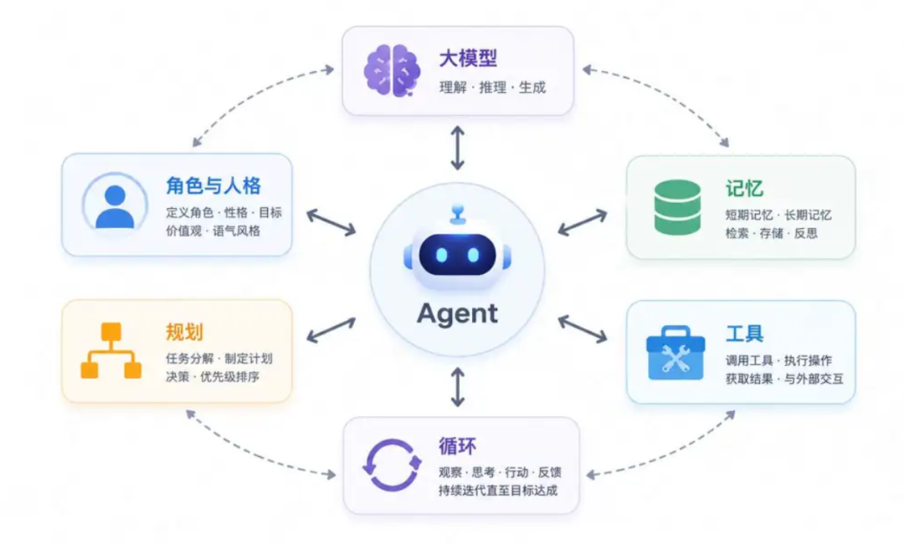

知识图谱可以做结构化的实体与关系存取，可以基于意图精确推理和多步查询。

openclaw更简单，将记忆存储到本地md文件中。

还可以对记忆进行摘要，比如在每次对话之后，让模型生成一段简短摘要，只保存重点，节省存储空间，方便查询对话检索。

## 工具

不给模型配备工具，它就是一个chatbot，工具是模型与环境交互的接口。

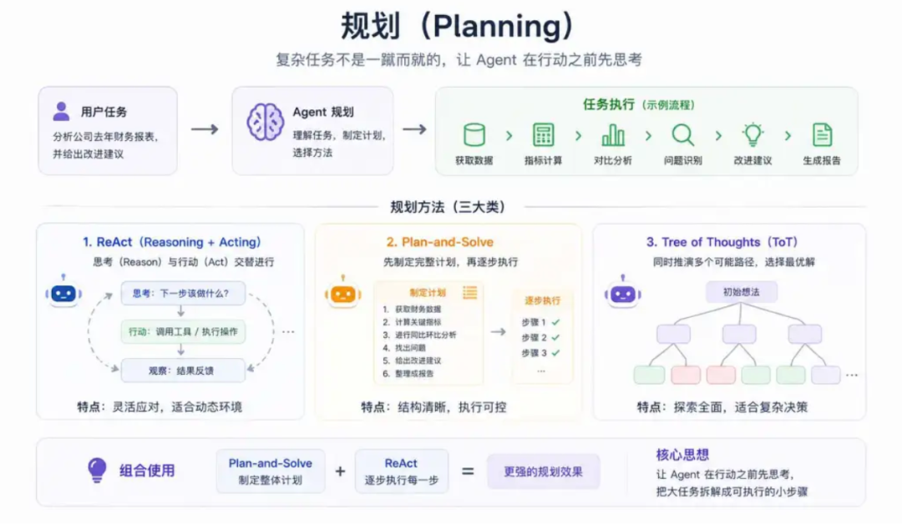

模型之所以可以选择对的工具，在于工具有完整的名称/秒数/参数/返回值说明，agent在推理过程中，可以根据以上描述信息选取合适的工具完成具体工作。

常见的工具有，信息获取类工具，比如查询网页/查询api/查询数据库等；文件操作类工具，比如读写文件/创建目录等；代码执行类工具，比如运行python/运行sql/运行shell；通信类工具，比如发邮件/发短信/打电话等；

工具越丰富，agent等能力边界越宽。

## 规划

基座模型可以将复杂任务分解为可执行的子步骤，或者给到子agent进行推理与执行。

将大任务拆为小步骤需要很强的推理能力（planning），常见的模式有ReAct，一边思考一边执行；plan-and-solve，先生成整个任务计划，再逐步执行；tree of thoughts，一边执行一边推理多种可能的路径。

## 循环

agent在反复执行的过程，包含感知/思考/工具执行/记忆/结果观察--再思考，直到任务完成。

一个agent就是一个大loop，从接收用户输入开始，模型思考任务如何拆解，怎么做，需不需要调用工具，如果决定调用工具，选取工具，获得工具结果，继续思考，直到最后模型认为不需要继续调用工具了，可以直接回答用户问题，整个loop结束。

所以loop会串联起模型-工具-记忆，以决定下一步怎么做还是可以直接回复用户结果了。

有的任务比较长，可能需要运行几个小时甚至几天，为了确保整个运行过程稳定可控，就涉及到记忆管理/长任务规划/错误处理/信息压缩/人机协作等工作。

那如何实现一个轻量级的agent呢？

我们可以主要围绕于工具调用/定时任务/记忆系统/多模型兼容/多平台支持几个角度实现。

比如内核轻量级，支持多种channel，支持openrouter等各种模型提供商api，支持mcp工具实现代码执行/网络搜索/文件操作，内置cron可以周期性提醒和自动化工作流，记忆系统支持持久记忆和重要上下文保存，skill渐进式加载。

以上扩展配置通过一个config.json实现配置，通过一个agents.md定义身份，通过skill和tools扩展能力。

核心组建有四个：

agentLoop + contextBuilder + toolRegistry + agentHook

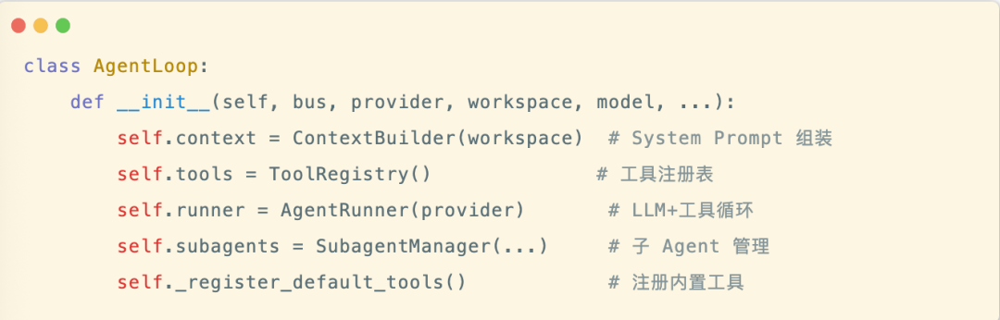

## agentLoop

agentLoop是整个agent的心脏，是所有逻辑的入口，负责接收消息/构建上下文/调用llm/执行工具/响应结果，形成一个完整的处理闭环，它像一个指挥官，将各个模块组装在一起，按照固定流程运转。

## contextBuilder

contextBuilder负责从多个信源组装完整的systemPrompt，让agent知道自己是谁/能做什么/该怎么做。前三步很好理解，第五步只是将skill的名称和描述注入到prompt中，而不是把skill全部内容塞进去。当agent决定采用哪个skill时，通过readfile工具，读取对应的skill.md内容。这是遵循 skill 的渐进式披露设计原则。渐进式披露实现上可以采用三级加载系统，第一级加载元数据，这部分数据永远在 contex 中。通过 skillSummary 将所有 skill 的摘要注入 systemPrompt 中，这样agent 看到的是一个技能清单，模型可以知道有什么工具可以用，但不需要知道具体怎么用。第二级是技能的全文注入，有些技能是需要全文提前注入的，这可以在SKILL.md 的 frontmatter 中可以标记，比如 always：true，说明这类 skill 要求完整内容注入到 systemPrompt 中，比如记忆的 skill 就需要完整提前注入进去，因为记忆随时需要。第三级是按需加载，在 systemPrompt 中会有提示，告诉 LLM 需要时，可以通过 readFile 方式加载 skill 详细信息。这样 agent 在需要某个 skill 时，会主动调用 readFile 工具读取完整的 SKILL.md，然后按照后续指令执行。一个标准的SKILL.md格式：

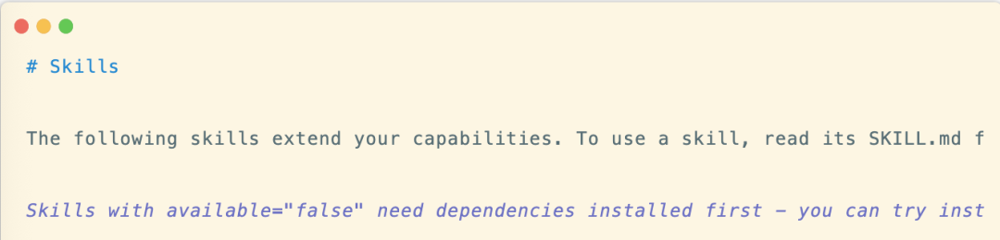

## toolRegistry

toolRegistry用于管理所有可用工具，提供 JSON Schema 格式的工具定义给到 LLM，便于 LLM 在推理过程选择合适的工具。可以内置一些常用工具，如：

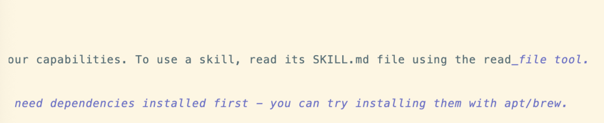

同时也可以自定义工具，如：

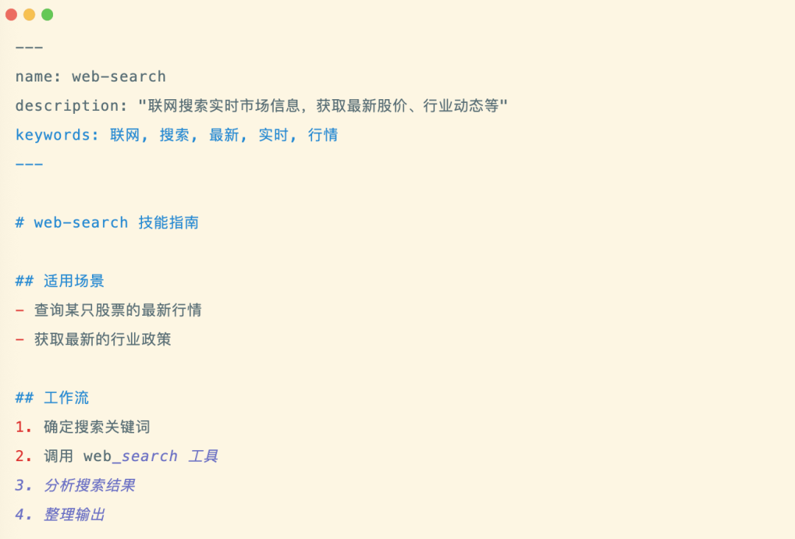

## agentHook

agentHook是整个生命周期的钩子，基于这套钩子可以提供一些扩展机制，类似于 openClaw 的 Hook，在一些 agent关键生命周期节点插入自定义的逻辑。每个方法默认是空的，不执行任何逻辑，这种非侵入式的设计，让架构保持简洁和扩展性。agentLoop 每一轮迭代都会按顺序执行这些钩子。

以一个 text-to-sql agent为例。

项目结构：

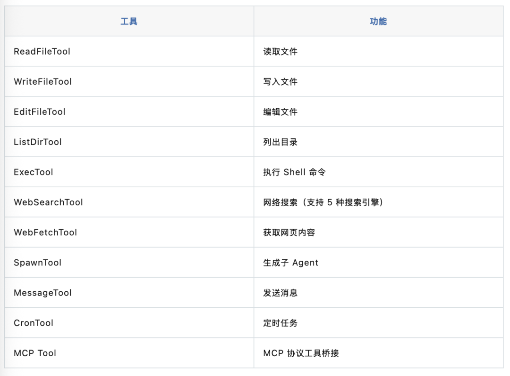

## 定义工具

元数据：包括了 name/description/parameters 会被 toolRegistry 收集，转变为 llm function calling 的 schema 发送给模型。

安全校验：代码层面强制只允许 select 和 pragma，防止误操作。

执行 sql：连接数据库，执行查询，获取结果。

结果限制：最多返回 50 行，防止大表撑爆上下文窗口。

## 组装 Agent

通过 configJson 配置进行组装，包括 readFile 读取文件加载SKILL.md，writeFile 写文件，exec 执行 shell 命令，querydb 只读 sql。

agent.md：

在 agentmd 里，约束了 queryDb 执行 sql，不要用 exec。

编写 skill：

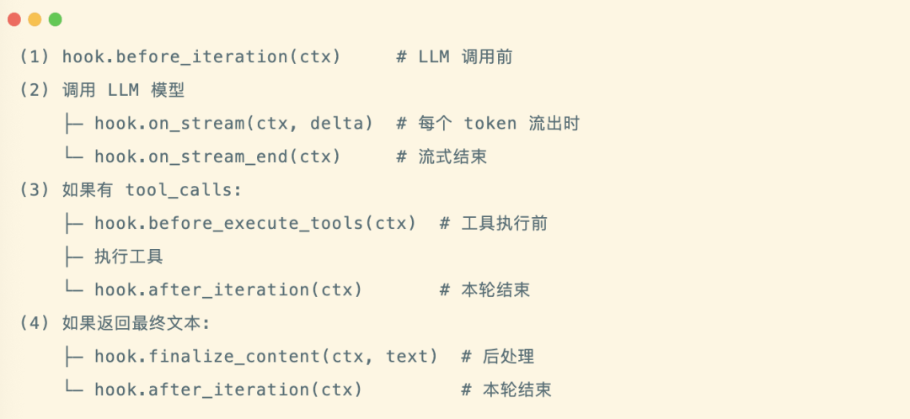

以上基本上实现了一个 agent 的基本框架，agent 会先探索数据库结构，再编写并执行查询，最后生成答案。

如果执行过程报错，agent 会根据 error recovery skill的指导自行修正， 这就是 skill 的价值，不断将领域最佳实践沉淀下来，比如如何探究 schema 如何写 sql 如何纠错，这些封装到 skill 里面后，agent 就实现了自进化。

所以一个 agent 实现可以遵循的原则，配置优先，通过 config 文件实现配置，而无需大量的胶水代码。通过 skill 渐进式批量和三级加载方式，避免 token 和上下文窗口的浪费。显示注册工具，便于 agent 选取和调用工具，通过 hook 方式提供 agent 全生命周期的钩子，实现能力的拔插。

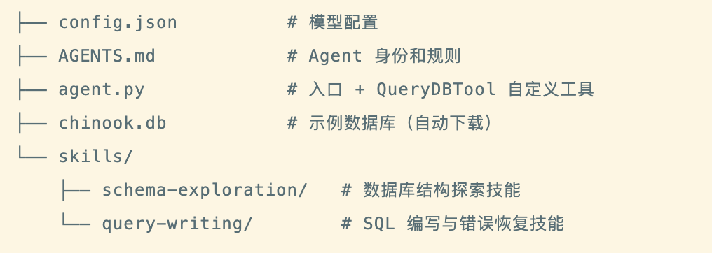
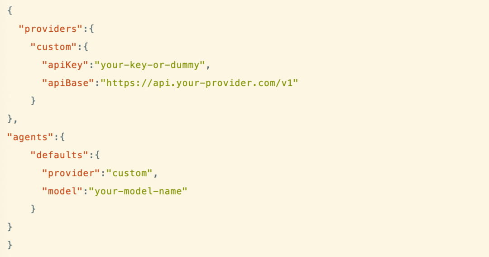
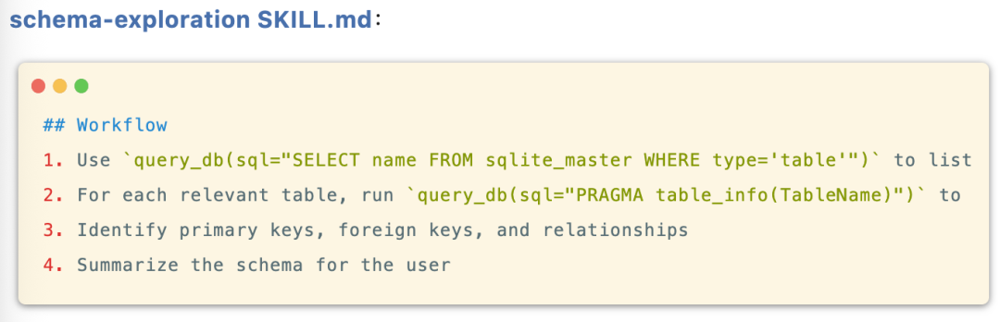
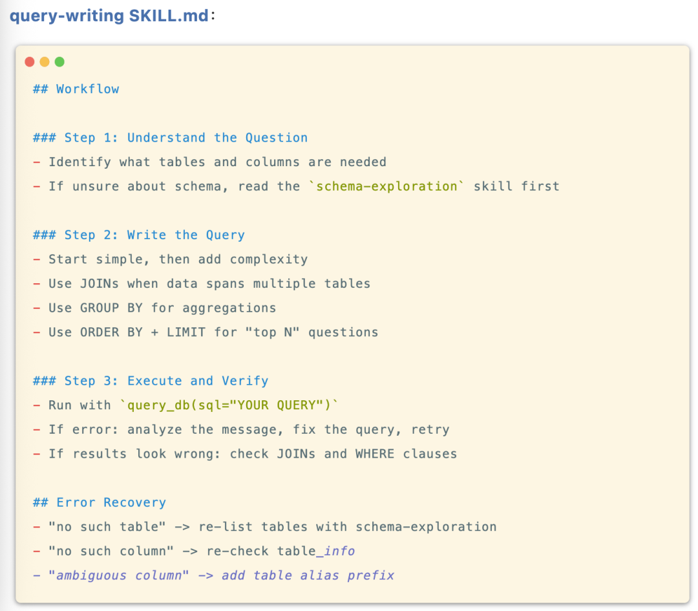

