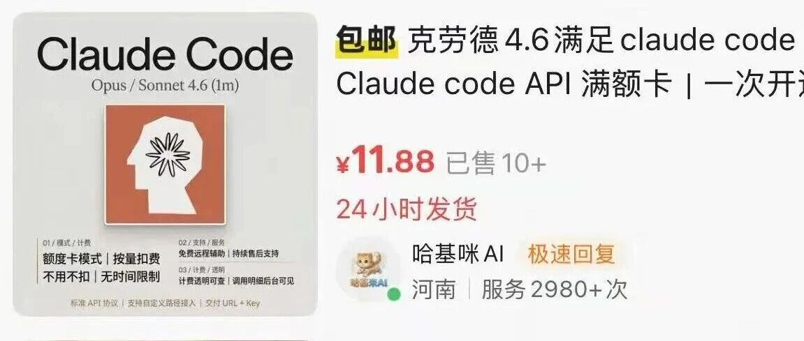

# 我花了半个月，把AI中转站这门生意从头到尾扒透

> 利润、搭建、教程、内幕全在这里

## 前言

前阵子朋友圈冒出来一批做AI中转站的。咸鱼挂着十块钱的Claude Code车位，淘宝一搜AI就给你推一堆面板源码，小红书里一半帖子在教你怎么搭，另一半在骂哪家又跑路了。

OpenAI和Anthropic官方API太贵，国内用卡、付款、IP一连串问题都卡着你。于是有人批量搞海外账号打通成一个池子，套层壳重新对外卖，接口跟官方一模一样，价格能低到官方的三到五折。这就是中转站。

**注意：本文所有教程均只作为参考，不涉及任何教导的违法行行为。**

---

## 一、利润

以Claude Code Max方案为例。闲鱼一个Business号成本50到150，一个Max账号一个月大约能提供1500美金左右的官方额度消耗能力。你把它切成5、10、50美金不等的车位倒手卖。

真正跑起来的工作室号池100到500之间，月流水5万到30万，净利1万到8万。认识一个做了两年的朋友号池200个，团队他加一个兼职客服，一个月净到手三五万。他说这生意最反直觉的一点，是钱不是赚号差价赚的，是赚人没空操心赚的。用户图的就是省事，少配一行变量、少看一封报警，他就愿意为你多付20%。所以稳定性和售后才是真护城河。

这行的暴利点是**超售**。官方Business账号按座位计费一个席位只能一人用，但大部分用户一天调API不超过两小时。运营方就把同一个账号切给五到十个用户共享，负载调度做好用户感知不到冲突。成本不变收入翻五倍，毛利率从30%拉到70%。这就是为什么有人敢打三折价，他们是把你们几个人打包塞进同一个账号。

混合API利润结构更复杂。同一个模型ID在不同分组能挂五到七个价位，便宜的0.35倍，贵的2.4倍，差出将近七倍。跟航空公司舱位一个逻辑，把同一份算力切成不同SKU卖给不同付费意愿的人。

最骚的玩法是定价跟时段挂钩。白天美西凌晨调用便宜，晚高峰加倍计费。后台看着是稳定供货，实际上整个号池被切成了动态调度的拼车系统。

---

## 二、上下游链条

这门生意上下游链条比想的长。上游是卡商、号商、IP代理、逆向方，中游是中转站本体（API面板+支付+分销+号池运维），下游是Cursor里用Claude Code的开发者和二次分销商。

你几乎不可能吃掉全链路，大部分人只能占一两个环节，但每个环节做到极致都能赚钱。

想下场做，准备这几样：

- 一台腾讯云VPS（Ubuntu 24.04 LTS，年付几百）
- 一个域名（最便宜10块一年）
- 一个Cloudflare账号托管域名做Tunnel
- 一个Neon PostgreSQL免费版存数据
- 一个Upstash Redis免费版做缓存
- 闲鱼买两个靠谱的Business号

**提醒一个坑**：Neon和Upstash一定要选跟VPS同地区，不然跨区延迟能把体验搞烂。

懒得自己搭的淘宝600块能请人帮搭，但建议自己搭一遍，花钱买服务对方装完就走，后面风控崩盘你还是不知道怎么救。

---

## 三、搭建教程

### 第一步：装Cloudflare WARP

整条链路的灵魂。直接用服务器IP调Anthropic风控分分钟干掉你。挂WARP之后出境流量走CF网络伪装成普通用户。

```bash
warp-cli registration new
warp-cli connect
# 切proxy模式监听40000端口
curl ifconfig.me  # 验证返回warp=on
```

**偷懒不做号池三天废一半**。见过一个朋友图省事跳过这一步，上线第二天整段IP被风控连带同一台VPS上其他号集体阵亡，换IP又被秒杀，折腾两周才明白。

### 第二步：域名托管给Cloudflare

腾讯云DNS改成CF给的两个ns地址，十分钟生效。隐藏真实IP避免DDoS，白嫖HTTPS。

### 第三步：Cloudflare Tunnel内网穿透

Zero Trust里Add a Tunnel拿token。让服务器不用开放公网端口，用户通过CF边缘节点访问，躲在一个巨大的保镖后面。

### 第四步：Docker起Sub2Api

```bash
curl -fsSL https://get.docker.com | sh
# 写docker-compose.yml把Neon、Upstash、Cloudflared的token填进去
docker-compose up -d
```

**有个坑**：装了WARP就把HTTP_PROXY几行注释掉，不然容器请求走两次代理延迟爆炸。

### 第五步：进面板配账号测效果

新建分组添加账号，闲鱼买的号登进去拿subscription链接粘面板生成API Key。Cursor里改base_url指到域名，测一轮Sonnet 4.6不卡不降智计费准就算跑通。

整套第一次四到六小时，第二次一小时。但搭完你会发现这只是10%的工作量。剩下90%是凌晨两点号被风控群里炸锅，是用户填错base_url得从头讲，是Stripe发邮件要冻结你，是二道贩子拿你的API倒手出事反过来找你。这些没一个能靠技术解决。

---

## 四、内幕

### 最大坑：模型造假

2026年CISPA的论文《Real Money, Fake Models》审计17家主流中转站近45%在造假。你前端调GPT-4后台给你路由到开源GLM或Qwen，短时间感知不到，时间长了发现代码能力明显差，已经充进去几百美金。

**两个最简单的鉴假方法**：

1. **看响应ID前缀**：Anthropic官方返回`msg_`开头，AWS Bedrock渠道返回`msg_bdrk_`开头。抓一次响应看ID就知道有没有偷偷换后端。

2. **有些中转连错误信息都不脱敏**直接把`upstream_provider`打出来，抓包一看ID是`msg_bdrk`开头，直接暴露AWS Bedrock后端。

其他风险：流量虚扣（多计10%到30%）、卷款跑路、数据泄露、高并发掉线。

中转站的真实威胁等级，从模型替换到credential盗窃，风险一级级往上叠。

### 三个产业内幕

**一是号源**。闲鱼上三百块的Max号来自三条路：教育邮箱批量注册、美国本土真人代实名。一百块以下基本是洗过几轮的垃圾号，充三百美金第二天号没了。

**二是逆向**。所有主流中转站背后都养着一组逆向工程师追着官方反爬更新跑，灰产圈月薪三五万。小型中转方养不起只能跟着上游社区走，上游一断更48小时崩一半。

**三是分销金字塔**。能追溯到源头的就七八家大号池，同一个Max月度车位小站198源头89，中间109块被三四层二道贩子分掉。终端用户直接找源头，看开票能力、SLA承诺、Telegram群里大佬背书。

### 合规层面

转卖API在Anthropic的ToS里禁止，但国内法律没对应条款，你承担的是账号封禁和支付冻结不是人身风险。做到年流水千万级别税务会突然成为天大的问题，这也是为什么中转站老板很少高调露脸。

### 数据安全

你的每行代码、每段对话、每个商业问题，都从你的电脑出发过中转方的服务器再到模型那边。中间这一站想看就能看，想存就能存。你以为是点对点，其实是点对点对点。这门生意之所以信任成本这么高，根源就在这里。

---

## 最后

扒这半个月越扒越觉得，这是一个非常典型的AI套利。上游是硅谷顶级公司用最贵算力堆出来的智能，下游是一群想用AI改变生活的普通开发者。中间这层人用逆向、闲鱼号、Cloudflare、Docker，硬生生搭出一条让下游能用上的桥。

你可以骂他们灰色，但不能否认他们确实在磨平一种信息差。在这个时代最好的AI工具明明已经存在，但因为各种原因大部分中国开发者够不到。有人愿意冒着风险做这件事，哪怕动机是赚钱，其实也是在给整个生态输血。

想做这门生意别只想赚快钱，把稳定性和售后做扎实，利润率压到合理区间。这个赛道里能熬三年以上的玩家都活得不错，三个月跑路的那批大多翻车了。想用中转站选源头，便宜到反常的站子要么造假要么倒计时跑路。

**说到底这是一个关于信任的生意。**

---

> 作者：艺枢ArtPivot / 拟像AIGC
> 原文：https://mp.weixin.qq.com/s/GDZHJaaohJRw540_IzcEAA