# 王侯：如何快速摸清一门行业？

如何快速了解一个行业？

这是一个在互联网上很有热度也很持久的问题，这个问题特别好，非常有利于我们的创业/副业/自由职业的项目选择，以及后期的商业决策。

其实，想快速摸清一门行业，最好的办法就是请专业的咨询公司，进行有针对性的调查、调研，电视剧《我的前半生》中，以靳东、袁泉、雷佳音那伙人为代表的这类公司就是咨询公司，他们就是专门干这个的。

但很可惜，这是废话，说了等于没说，因为那是大企业才能做的事，动辄几十上百万的服务费。

还有很多人说，想了解一门行业，必须参考权威的行业报告，这话没错，因为如果没有大数据的支撑，非常容易片面和感性。人们都知道做商业一定要借势，顺势而为才能成功，问题是怎样站在上帝视角又快又准的发现这个势，很多时候，所谓“风口”、“趋势”、“商机”，就清清楚楚白纸黑字的写在各种行业报告中，而非网络平台上分享的各种“赚钱项目/技巧/套路”中，这些报告，你查了，你也知道，你不查，永远不知道。很多项目、模式很普通，但背后的趋势却很宏大，正是由于背后有这种大数据、大趋势的支撑，所以即使看起来平平无奇的项目或模式，也照样能赚钱。所以，想了解一门行业，看行业报告，准没错。

但很可惜，这也是一句正确的废话，说了等于没说。为什么呢？当你去做了就会发现有个要命的问题：

行业报告浩如烟海，多如牛毛，我怎么知道哪些报告对我有用？因为大多数报告的名称很宏观很简短，比如XXXX年中国互联网流量报告、XXXX年XX经济洞察报告、XXXX年XX行业发展趋势研究报告等等...

浩如烟海：

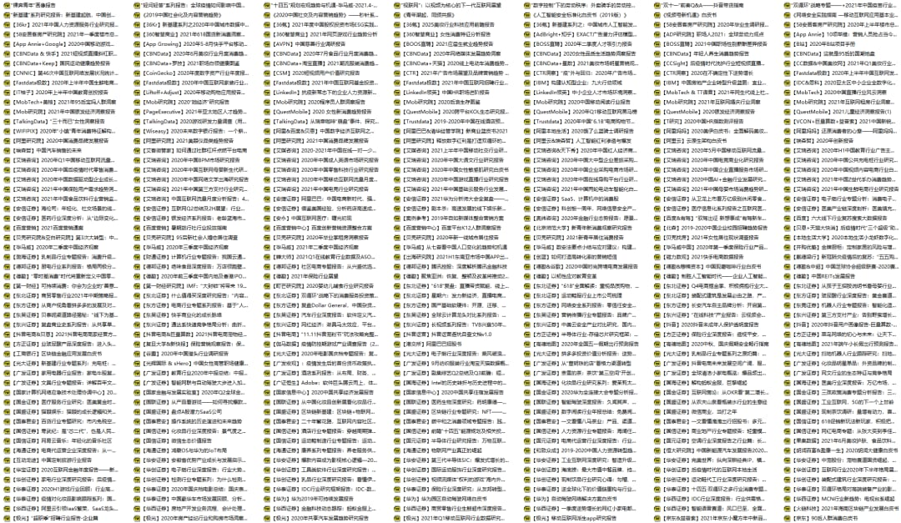

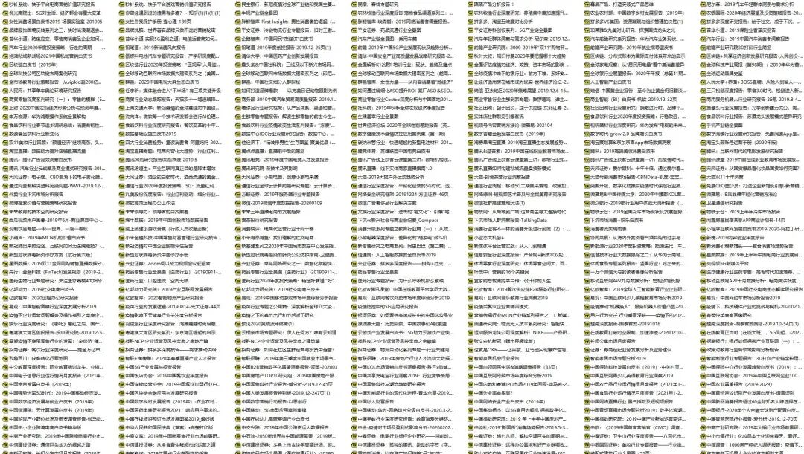

标题抽象：

比如你想了解湿巾这个行业，你却很难找到一份为你量身定制的、在报告名称中明明白白写着“湿巾”这两个字的行业报告，但我们也绝对相信在这些海量的报告中，一定存在某些内容会对湿巾这种产品展开研究和论述，比如各种零售类、电商类、母婴类、日用品类的行业报告，关键是这些报告的数量也有成千上万，如果不打开全篇浏览的话，天知道它们具体讲了什么；而如果逐篇查找的话，等你搞懂了一个行业，你孙子都上大学了...说好的“快速”呢？

所以归根结底，我们的问题就从“怎样快速摸清一门行业”，推演到了“怎样快速的在海量行业报告中提取到精准的目标信息”，注意啊，必须要快速，慢了不行，而且信息必须精准，需要屏蔽掉大量无关的干扰信息。只要解决了这个问题，就能把“看报告”这句正确的废话，变成我们了解一门行业的绝招。

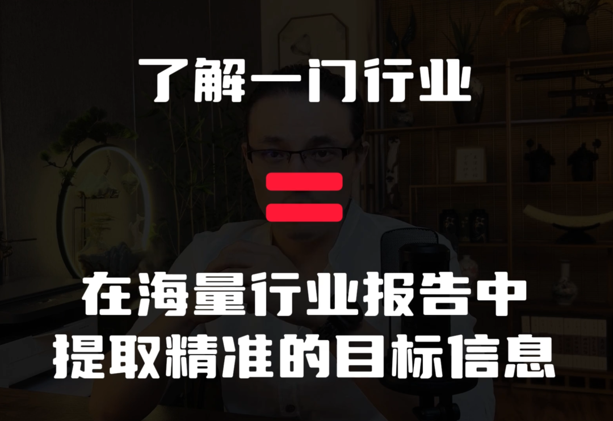

本次分享的方法，可以把原本查阅海量报告所耗费的时间，从几天、几个月甚至几年，缩短到几分钟，瞬间触达，主打一个“快速高效”。而且，这种玩法不仅适用于商业，也适用于【学生学习】、【数据分析】、【自媒体创作】等所有跟文字工作相关的领域，甚至可以说，除非你从事的是那种纯体力劳动，都可以把它作为你的方法论和武器库。

PS：

我平时也喜欢在文章中时不时插入一些相关的行业报告截图，很多读者在后台私信问我：你那些乱七八糟的行业报告都是从哪里找来的？所以刚好也借这次机会，也顺带回答一下这个问题。

记住八个字：

电子笔记，商业神器。

大伙儿都知道电子笔记，但它和行业有什么关系呢？它也能帮我们赚钱吗？

是的，可以。

我们能够利用电子笔记深入、准确地快速了解一个行业的趋势和动向，找到各种大大小小的宏观和微观上的风口和蓝海，对做项目，对我们的创业、副业、自由职业都特别有用。草根阶层赚钱，没有过硬的技术、资金、人脉等，更加需要学会利用各类工具达成商业目的，特别是面临重大决策或调整时，千万不要凭感觉一拍脑门碰运气，或盲目相信网上所谓的专家老师。否则，我们拼的就不是商业了，而是八字过硬。

我们先说电子笔记，一带而过；

再说基本玩法，也是几句话带过；

然后着重讨论商业上的高级玩法。

电子笔记，主流的电子笔记无非就是市面上那几种（印象，有道，为知，语雀等），就不列举了，毕竟这篇内容不是各家电子笔记的测评。这些产品在细节上多少会有区别和强弱，但大致功能上大差不差，我自己是用【有道云笔记】和【印象笔记】这两款，【有道】是轻量化的产品，所以我把它用于生活；【印象】是专业性最强的，所以我把它用于工作。之前的文章里也曾经对电子笔记做过探讨，是从另一个角度展开的，参见：

《工具贴：电子文件管理系统》

接下来说基础用法。

长时间以来我发现大部分人根本就不太会用，电子笔记绝对不是把文档从线下搬到线上这么简单，它可以极大的为我们的生活和工作提供便利，除了云端存储不容易丢失，还能实现内容排版与屏幕的自适应，打通电脑端与手机端，这是传统的txt、word、PPT、PDF格式的文档所做不到的。

再比如，电子笔记中的内容，十分便于搜索。这也是传统格式的文档做不到的，虽然它们也可以在电脑上进行搜索，但只能搜索文档的标题，做不到全文检索，你想搜索内容的话，只能把所有文档都依次打开分别去搜索内容。如果这么麻烦的话，搜索的意义又何在呢？

另外，电子笔记有一个十分好用但往往被人们忽视的功能，起码在我的周围很少看到有人在用，那就是可以把笔记生成一个页面链接。这个功能对于传送文档资料特别实用，尤其是在工作场景或者某些稍显正式的生活场景中，你把那些图文混杂的信息整理到一篇笔记中，然后生成一条链接发送给对方，就像一封邮件，这也是一种对他人的尊重。否则零散的一条一条的发送，当啷当啷的，那不就等于在不断强奸别人的耳朵吗？而且你发送的顺序和别人接收的顺序往往会被打乱，很不利于理解。亲友之间用随意的沟通方式倒没啥，但在商业上就会显得过于随意、业余，比如甲乙方之间、合作方之间、同事之间，起码在我这里，如果你明明只有一件事需要沟通，却动辄一条一条信息轰炸我，我是肯定会在心里鄙视你的。

除了工作，在生活中也有很多场合需要注意，举个例子，去年过年时我奶奶脑梗住院，正好我有一名高中同学是医学院的高材生，在省立医院工作，并且又正好在脑科，所以我就想着把我奶奶的病情请她看一眼，给出意见。那么这个时候就需要把病人的N次诊断记录和几十张CT片子按顺序整理好，再发送给对方以节省对方的时间精力，减少彼此的沟通成本，所以一条笔记链接搞定所有。请人家帮忙，一定要给予对方足够的尊重，而不是把这些相关信息无序化、碎片化的发过去，如果那样做人的话，我相信我的人脉会一定会走下坡路。生成链接发送的话，不但容易理解，而且对方想在手机上看就在手机上看，想在电脑上看就在电脑上看，屏幕窗口自适应，同样是图文编辑，但这是txt，word、PPT和PDF所解决不了的。除此之外，也支持你后期随时远程修改内容，链接还是那个链接，但是你在后台已经编辑过了，页面就会重新显示更新后的内容，便于实时纠错和维护。

另外，如果有各种程序、压缩包、小文件什么的，也可以作为附件插入到笔记中方便对方下载，而不是在手机上传来传去的。

好了，基础功能简单一提，下面我们谈高级玩法。先解释基本思路，然后演示使用效果。

这种玩法的核心思想就是一句话：

以电子笔记为平台，快速构建自己的专业信息数据库/检索库。

想实现这个意图的话，需要满足：

一、独立文档必须能以附件的形式上传，并在笔记页面直观显示内容。比如一份PDF上传到笔记中，应该是内容可视化的效果：

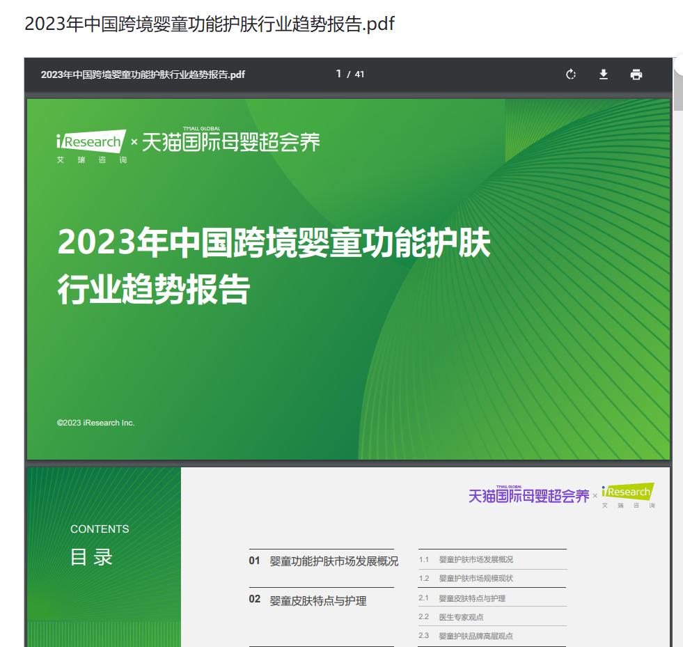

而不是这种黑箱视觉效果：

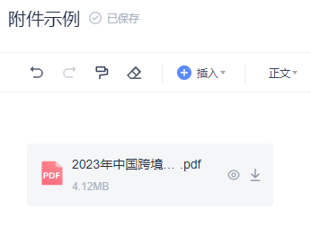

因为凡是专业的内容，都是以独立文档的形式存在的，比如各种文献、论文、行业报告、电子书等。浅显的、基本的、科普性的信息，你可以靠搜索引擎和自媒体，但一旦涉及到一些专业性强的东西，那些内容只能成事不足败事有余，不被坑就不错了，专业的事还是得靠专业的文档和书籍；

二、能够把这些专业文档批量上传，注意，是批量。比如，我的笔记中有专门存放行业报告和电子书的版块，行业报告数量是两千多份，电子书有几百本，所以必须能批量操作才行，一个一个上传的话，能把人累出腱鞘炎：

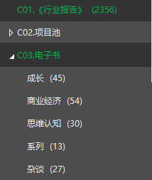

三、能够全局搜索附件文档中的内容，也就是一次性对全部文档进行全文检索，而不是仅仅搜索文档标题，这也是最重要也最难实现的功能。否则的话，即使你全部批量导入进去却无法搜索全文，也没有任何意义，毕竟，我们是在打造数据搜索库，是为了方便后期的查找和调用，而不是作为读物一个个的去学习它们，如果你妄想把这些资料都通读一遍的话，可能要等你孙子都上大学了也学不完，何况越是专业的东西越难理解、难记忆，这可不是看流水账小说。而如果我们压根就没有想去学习它们，而只是把它作为一个数据库、资料池去随用随取的话，就非常nice了，搜索一键直达，我们只需要找到相应的段落着重研究就可以了。所以，必须借助外物来代替我们的“翻阅”和“记忆”，腾出更多的时间和精力去“总结”和“思考”。玩商业一定要摆脱一种典型的学生思维：“只有记在心里的才真正是自己的东西”，这是一种很幼稚的想法，如果单论记忆能力，你肉体上的大脑连一台两百块钱的老年手机都比不过，它可以轻松存储至少一千条电话号码，但累死你也不行，商业只会看你任务完成的结果，而不会在意你完成任务的过程。就像在战场上，杀敌就是杀敌，你是用炮弹杀的还是徒手杀的，在本质上没有什么区别，徒手杀敌固然精神可嘉，但谁都不会去主动提倡。

综上，同时能满足上述条件的笔记软件，就只剩下【印象笔记】这一家了，但是它的“搜索附件文本内容”这项功能，付费用户才能使用，如果你只是临时用一下的话，也可以去万能的某宝买那种短期的“账户升级兑换码”，很便宜。

这条内容不是广告，但谁叫别家的软件不给力呢？我是个国货爱好者，但在笔记软件和相机的选择上，我没能做到支持国产，算是一种遗憾，也衷心希望国产品牌能迅速进步，在功能上超越洋货，届时我一定第一个支持。

说回主题，当我们掌握了基本的原理，确定了合适的工具，那就继续谈怎么用它玩转商业。

前文讲，我们不但要把报告作为依据，还要横向参考大量的报告，这也是前文讲述的方法的价值所在：

1.专业的行业报告一般都是PDF格式，图文高度混合，就像这样，不能把内容直接复制到笔记中，所以只能以附件形式上传：

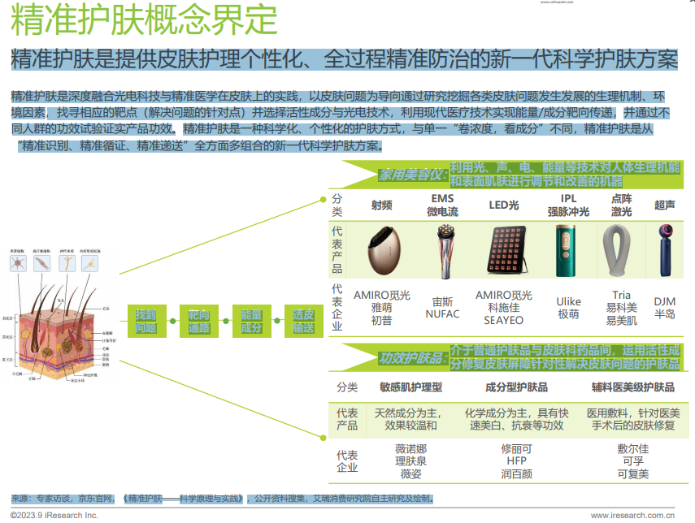

2.我们需要调用大量的行业报告，这就是为什么我们需要批量操作的功能；

3.这些报告的信息量实在是太大了，而且都是这种画风，不可能靠大脑记忆，所以我们才需要前面提到的附件文档内全文检索功能：

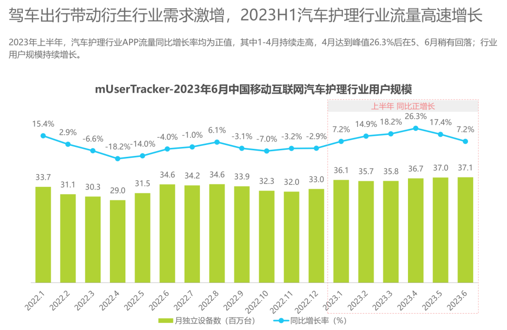

这样一来，才能实现搭建专业数据库的目的，下面我们先演示一下操作效果。

打个比方，如果我想了解“烤鱼”这个餐饮类细分行业的状况，那就直接在我的由这几千份行业报告组建的数据库中直接搜索“烤鱼”二字。搜索结果中出现了以下几篇内容：

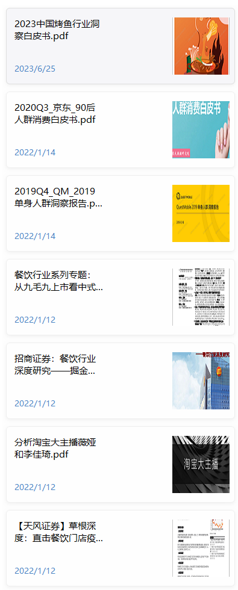

比较幸运的是，我们看到一份专门研究烤鱼行业的报告叫做《2023中国烤鱼行业洞察白皮书》：

数据库中的报告数量越多，碰到这种无缝适配的资源的概率就越大。这份报告，直接无脑通篇研究就是了，准没错，它为我们提供了很多有价值的信息，比如：

宏观趋势

发展前景

政策扶持

受众分析

市场分布

获客渠道

口味研究

工艺研究

菜品搭配

顾客心理

消费场景

消费均价

消费频率

玩法迭代

头部品牌

行业舆情

运营措施

进阶方向

等等等等...

经过提取+整理后的视觉效果如下：

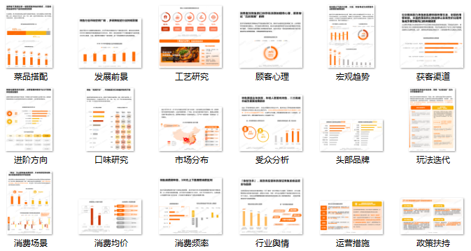

所以，大伙不要对行业报告有偏见：

第一，行业报告不一定宏大到普通人看不懂，它也可以很实操、很接地气，甚至是针对一些犄角旮旯的特别微小的领域的研究，比如有的报告专门拆解各行业的营销玩法；有的报告甚至详细到把某领域内全网头部IP拿出来逐个分析套路；

第二，行业报告并非只是简单枯燥的陈列数据，它也可以很有趣，比如有的报告专门研究各类人群，大城小镇的男男女女老老少少；有的报告侧重研究互联网的流量趋势，各家平台各种动向，可以搞清楚国民的注意力到底在哪里。

接下来，我们看其它几份报告，虽然这几份报告的文件名称中并不包含“烤鱼”二字，但我们却准确地找到了它们，它们在内容中含有对烤鱼行业进行论述的部分，只搜索标题的话肯定就把它们漏掉了。

况且很多时候，很难找到一份针对性特别强，刚刚好适用于我们的需求的报告，就势必需要这种广撒网捕捉零散信息然后再自行进行整合分析的路径了，这也是我们这种玩法的意义所在。在这几份报告中：

《草根深度：直击餐饮门店疫后恢复情况》这篇报告提供了几家知名烤鱼店的经验情况，比较具体，例如实体面积、装修样式、团购套餐、菜单设置、客单均价、桌位数量、员工数量、上座率、排队情况、折扣政策等：

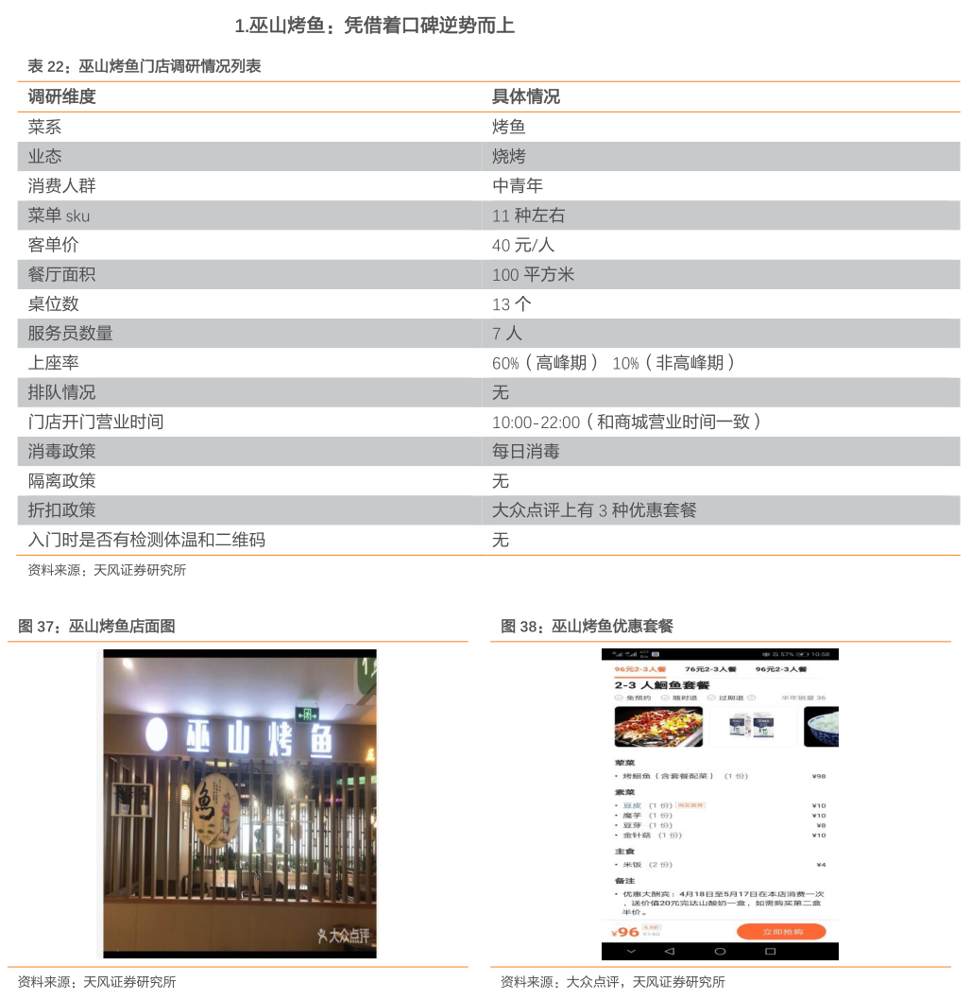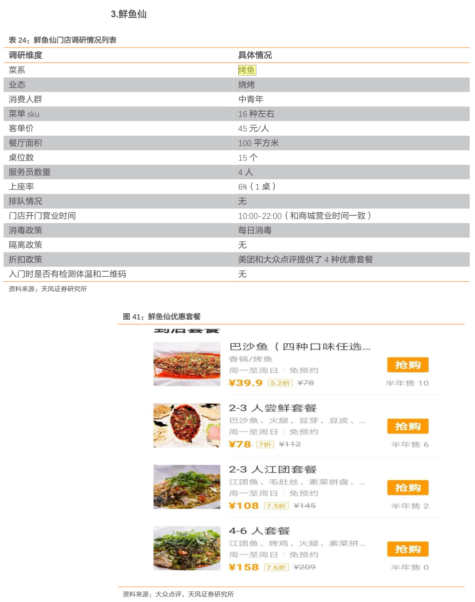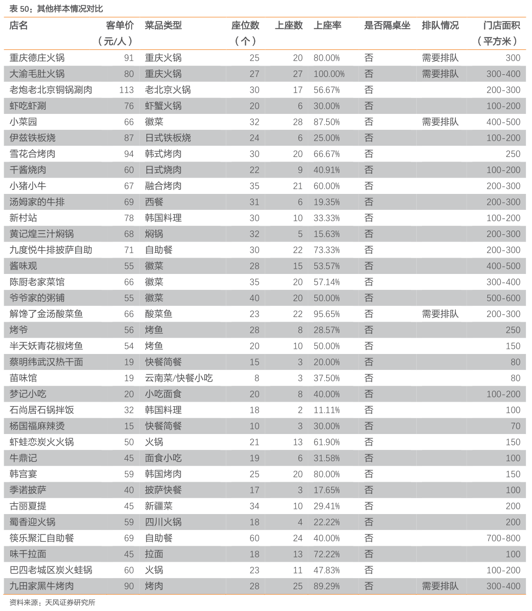

《京东90后人群消费白皮书》，这篇报告让我们知道，90后懒宅群体也会在家利用电烤箱来烤鱼吃：

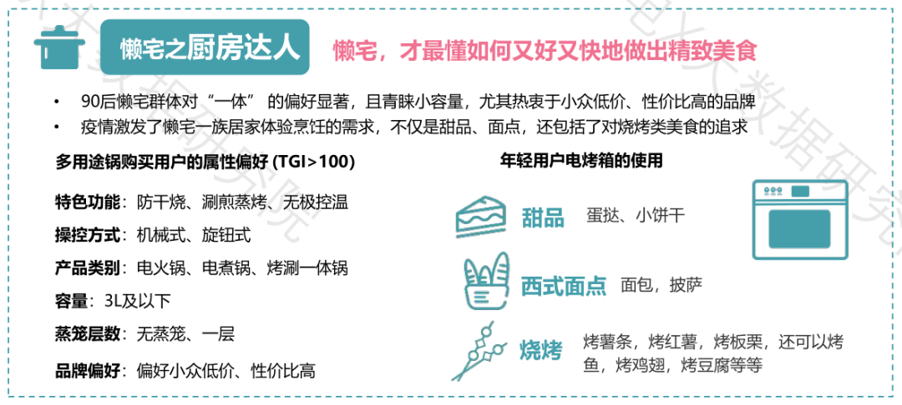

《淘宝大主播：分析淘宝大主播薇娅和李佳琦》，这篇报告展示了李佳琦在某次直播带货中，烤鱼产品的价格、折扣、销量，以及和其它产品的参数对比等：

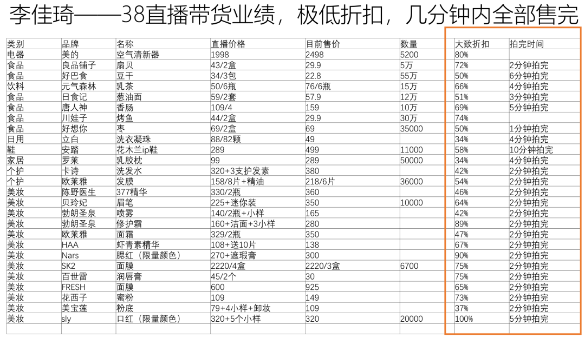

《餐饮行业深度研究——掘金万亿市场，龙头竞速百舸争流》，这篇报告提供了某综合餐饮连锁品牌旗下烤鱼门店的经营情况等：

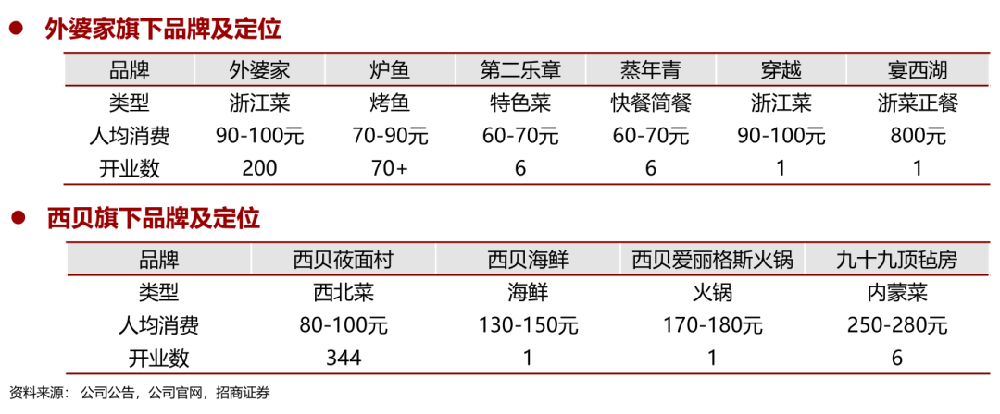

好了，说到这里，核心方法已经大致讲清楚了，非常简单，完全配得上“快速”这两个字，我敢说，真的没有比这更加直观、高效、准确的方法了。

接下来我们谈一个商业之外的但却更重要的也是我最想说的问题：

除了利用行业报告来商业分析，这套方法还能做什么？

回归到本质，本次内容我们并不是在讲行业报告的用法，其实是在讲“如何以电子笔记为平台，快速构建自己的专业信息数据库/检索库。”掌握了这套工具和方法，可以解决很多专业度比较高的问题。

比如在学习过程中，你对某个领域很感兴趣，但又没有时间精力大量通读那些非常专业的著作、教材，甚至你压根就读不懂，那就把这些书籍的电子版都下载下来，转换成PDF格式，用同样的方法构建一个数据库就行了，把它当做自己专属的词典或搜索引擎去使用，然后根据搜索的结果着重去研究某些段落或章节就可以了，是不是很省事很高效？

做自媒体也可以利用这种方法扩展自己的视野，提升文案的专业度，比如我的数据库中有几百本电子书，涉及到经济学、社会学、MBA、心理学、谋略学、思维认知、个人成长、历史文化等这些话题普适性很强的领域。比如，如果我在这个数据库中搜索“高跟鞋”三个字，就能迅速调取出各个学科各家门派对这个事物的观点和论述，而且每一条都是有深度的精品内容；再比如，如果我想了解，除了袁崇焕和石达开，还有哪些历史人物死于凌迟酷刑？如果你去网上搜的话就会发现，所有这个话题下的作者统统都在的写这两个人，抄来抄去的都是重复性信息，就算你翻一百页也依然是来来回回那几个人，翻来覆去的口水话、车轱辘话能把人看吐了，何况还都是被加工过的二手信息，但如果我在我自建的高质量数据库中去搜的话，分分钟一览无余，那么这时候如果我来做一期关于凌迟酷刑的内容，把所有相关人物都列出来进行大盘点，写文章也好做视频也好，是不是都会更高明、更出彩、 更有辨识度呢？

另外，你也完全可以根据自身情况定制数据库来做喜欢的事，比如我还有一个存放了三千多份的TED演讲文稿的数据库，文档资料是从某宝上淘来的，这又是一个非常有价值的资源池，对不对？就这么个小小的数据库，其中的养分完全能满足一个独立自媒体账号的内容需求：

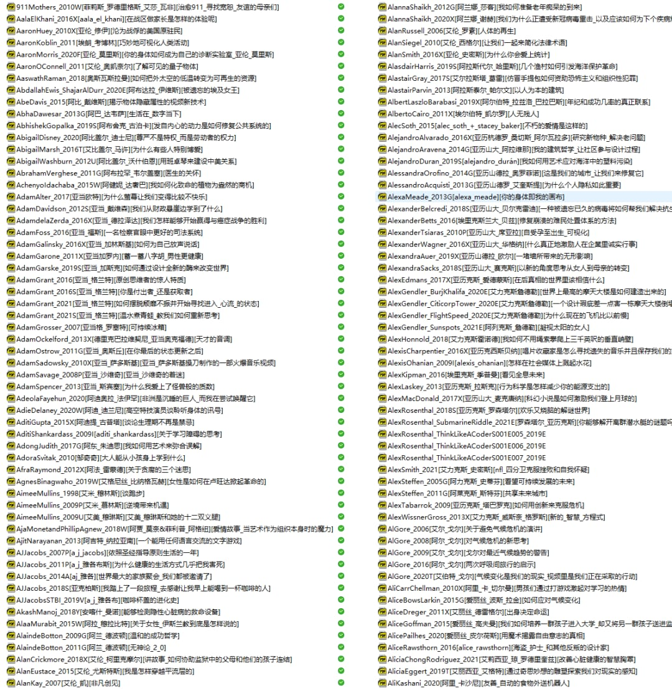

一句话，只要你能找到成规模的、有价值的、高质量的文档资源，都可以这么玩，各人有各人的玩法。实在找不到你想要的文档资源的话，那就去万能的某宝，几乎是要啥有啥。

另外还有个技术上的小问题，那就是“格式问题”：

直接说答案，文档最好是TXT或PDF格式，当你最初寻找、下载或购买的时候，就尽量找这种格式的文件，纯文字的话TXT最佳，图文混合的话PDF最佳，格式不对的话，那就通过工具批量转换，特别是电子书，一般都是EPUB/AZW3/MOBI这些格式，我也推荐两个转换工具，去搜索这两个关键词：PDF24、NeatReader，基本能搞定所有格式转换问题。

......

商业没那么难，

没那么高不可攀，

只要你有心，外加

学会利用各类资源和工具，

你也完全可以像大佬们一样，

站得高、看得远，运筹帷幄，

大佬们并不比我们多个脑袋。

本次就先说这些，交卷，供参考。

常读用户可将本号设为星标，

避免漏掉重要的消息和资源，

或把公众号名片添加至手机桌面：

我没开打赏功能

文末点赞和在看

将来必定有钱赚

