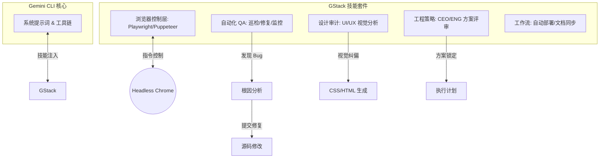
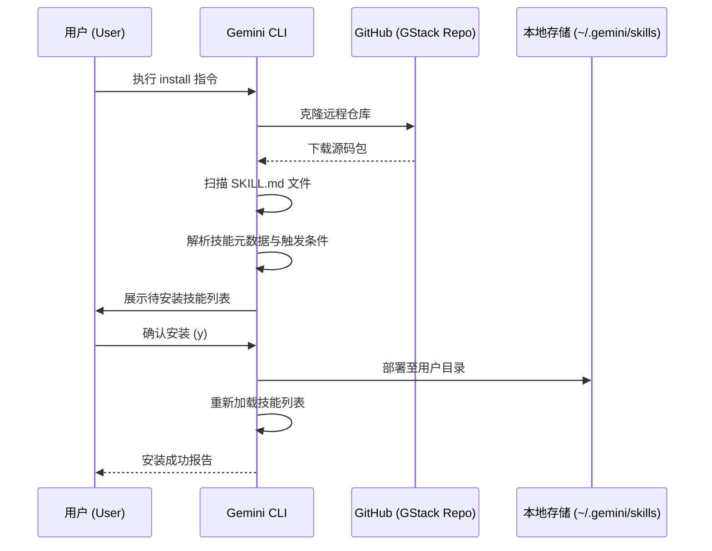
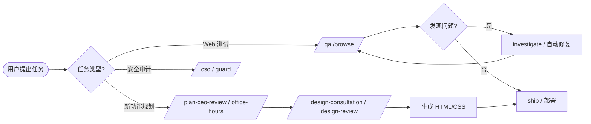

# GStack 技能包安装报告 (GStack Skills Installation Report)

**日期：** 2026年4月8日
**来源：** [https://github.com/garrytan/gstack](https://github.com/garrytan/gstack)
**安装范围：** 用户级别 (~/.gemini/skills)

---

## 1. 系统架构设计 (Architecture Design)

GStack 作为一个高度模块化的技能套件，通过 Gemini CLI 的技能注入机制，将浏览器控制、自动化测试、设计审计及工程策略深度集成到开发流程中。

---

## 2. 安装逻辑流程 (Installation Logic)

安装过程遵循标准的技能包发现、验证及分发逻辑。

---

## 3. 使用逻辑流程 (Usage Workflow)

GStack 的核心能力通常围绕 **"QA-修复-验证"** 或 **"方案-评审-实现"** 的闭环运行。

---

## 4. 技能清单与核心功能 (Skill List)

### 浏览器与 QA 自动化
*   **gstack / browse:** 极速无头浏览器，支持网页导航、截图、元素交互及断言。
*   **qa / qa-only:** 系统化测试 Web 应用。`qa` 模式可自动修复 Bug，`qa-only` 仅产出报告。
*   **open-gstack-browser:** 启动带侧边栏的可视化 Chrome 浏览器，支持实时监控 AI 操作。

### 设计与前端润色
*   **design-review:** 以设计师视角进行视觉 QA，识别并修复间距、层级及一致性问题。
*   **design-html:** 生成生产级别的、无依赖的原生 HTML/CSS。
*   **design-shotgun:** 并行生成多种设计变体，用于视觉头脑风暴。

### 工程策略与方案评审
*   **plan-ceo-review:** “创始人模式”评审，挑战前提，扩大或缩减范围。
*   **plan-eng-review:** 架构、数据流及测试覆盖率深度评审。
*   **autoplan:** 自动化执行全套评审流程。

### 工作流与安全
*   **ship / land-and-deploy:** 完整的代码上线与验证闭环。
*   **cso:** 首席安全官模式，进行依赖、机密信息及基础设施审计。
*   **freeze / guard:** 安全围栏，限制编辑范围及拦截高危指令。

---

## 5. 总结
GStack 的安装显着增强了 Gemini CLI 在 **Web 自动化控制**、**复杂工程方案决策** 以及 **端到端交付** 方面的能力，为项目提供了从规划到部署的全生命周期支持。
