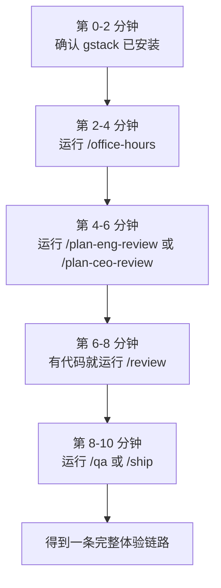
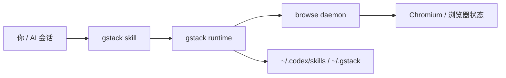
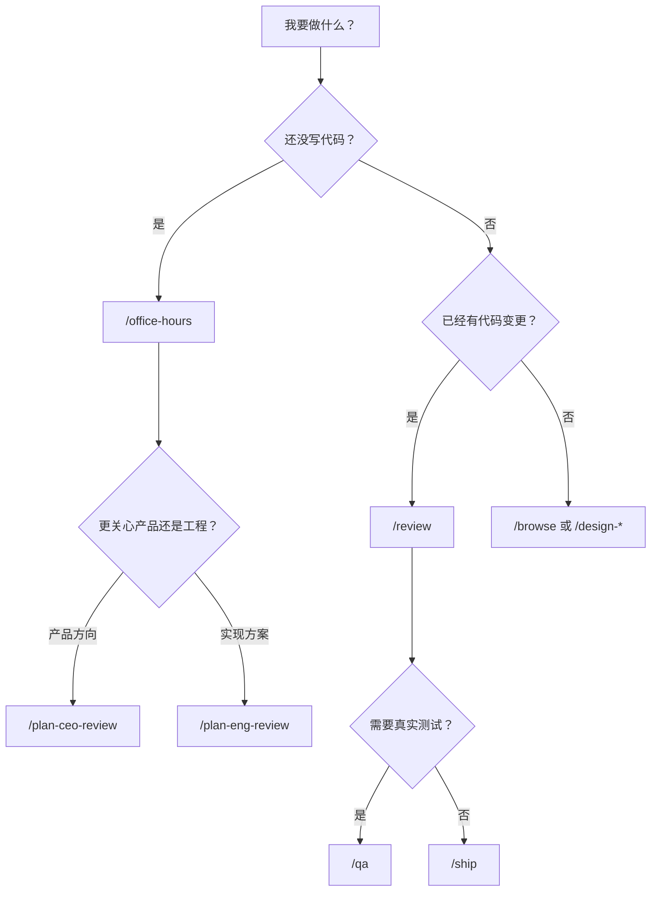

# gstack 10 分钟上手版

这是一份面向第一次接触 `gstack` 的速通说明。目标不是解释所有细节，而是让你在 10 分钟内跑通一条最有代表性的使用路径。

官方来源：

- GitHub：<https://github.com/garrytan/gstack>
- README：<https://github.com/garrytan/gstack/blob/main/README.md>
- 技能详解：<https://github.com/garrytan/gstack/blob/main/docs/skills.md>

---

## 1. 10 分钟路线图



## gstack 极简架构图



这条路线的目标是让你快速感受 gstack 的工作方式：

- 它不是随便调用一个 skill
- 它更像把 AI 带入完整研发流程
- 每个 skill 会给后续 skill 提供上下文

---

## 2. 第一次到底该怎么试

如果你今天只想体验一次最典型的使用方式，直接按下面做：

### 场景 A：你只有一个想法，还没写代码

1. 运行 `/office-hours`
2. 再运行 `/plan-ceo-review`
3. 然后运行 `/plan-eng-review`

这条链路适合：

- 新产品点子
- 新功能设计
- 还没开始实现的需求

### 场景 B：你已经有代码，想做质量检查

1. 运行 `/review`
2. 再运行 `/qa`
3. 如果准备发版，再运行 `/ship`

这条链路适合：

- 当前分支已经有 diff
- 需要 code review
- 需要测试和发版

### 场景 C：你的网站或文档需要可视化测试

1. 运行 `/browse`
2. 如果需要可见浏览器，运行 `/open-gstack-browser`
3. 如果页面要登录，先运行 `/setup-browser-cookies`

---

## 3. 最短决策图



---

## 4. 先记住这 8 个技能就够了

| skill | 作用 | 什么时候先用它 |
|---|---|---|
| `/office-hours` | 把想法讲清楚 | 新点子、新需求 |
| `/plan-ceo-review` | 从 CEO 视角挑战计划 | 想看方向和野心 |
| `/plan-eng-review` | 从工程视角锁定计划 | 准备开始实现 |
| `/review` | 审查当前代码改动 | 分支上已有 diff |
| `/qa` | 测试并修问题 | 需要确认可上线 |
| `/ship` | 发版、推送、开 PR | 准备交付 |
| `/browse` | 浏览器测试与截图 | 需要真实页面操作 |
| `/gstack-upgrade` | 升级 gstack | 工具版本落后时 |

如果你只想先学最小集合，这 8 个足够。

---

## 5. 典型上手路径

### 路径 1：产品想法 → 可执行计划

```text
/office-hours
→ /plan-ceo-review
→ /plan-eng-review
```

### 路径 2：已有代码 → 质量检查 → 发版

```text
/review
→ /qa
→ /ship
```

### 路径 3：页面体验 → 浏览器验证

```text
/setup-browser-cookies
→ /browse
→ /open-gstack-browser
```

---

## 6. 什么时候不要一开始就用复杂技能

第一次上手时，不建议一上来就全套使用 `/autoplan`、`/cso`、`/land-and-deploy`。这些技能很强，但更适合你已经熟悉基础链路之后再上。

更稳的顺序是：

1. 先体验 `/office-hours`
2. 再体验 `/review`
3. 再体验 `/qa`
4. 最后再尝试 `/ship` 或 `/autoplan`

---

## 7. 10 分钟结束时你应该得到什么

完成这 10 分钟后，理想状态下你应该已经知道：

- gstack 不是一堆随机命令，而是流程化工作台
- 规划类 skill 和执行类 skill 的区别
- 什么时候该先 review，什么时候该先 QA
- 浏览器 skill 和代码 skill 是怎么配合的

如果只留一句记忆点：

**先把问题说清楚，再让 AI 按流程推进，而不是直接让 AI 写代码。**
