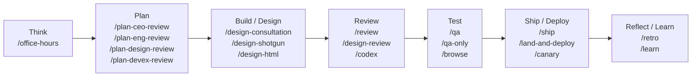
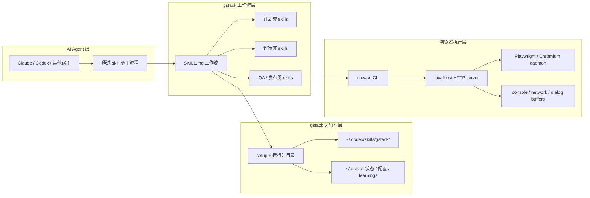
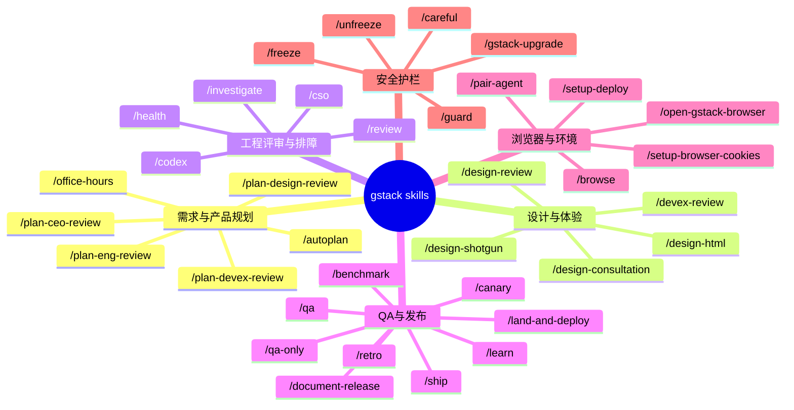

# gstack 使用说明书

本文档根据 `garrytan/gstack` 的官方 GitHub 介绍整理，目标是给中文用户提供一份可直接上手的使用说明，重点覆盖：

- gstack 是什么
- 怎么安装和开始使用
- 每个 skill 的核心功能、适用场景、典型调用方式

官方来源：

- GitHub 仓库：<https://github.com/garrytan/gstack>
- README：<https://github.com/garrytan/gstack/blob/main/README.md>
- 技能详解：<https://github.com/garrytan/gstack/blob/main/docs/skills.md>

## gstack 流程全景图



## gstack 系统架构图



---

## 1. gstack 是什么

gstack 不是单个命令，而是一套围绕 AI 编码代理设计的“软件工厂工作流”。它把一个 AI 编码会话拆成多个专业角色，例如：

- 产品负责人
- CEO / Founder
- 工程经理
- 设计师
- 代码审查者
- QA
- 发布工程师
- 安全负责人

它的核心理念不是“让 AI 回答问题”，而是“让 AI 按完整研发流程推进任务”。

官方推荐的工作链路是：

**Think → Plan → Build → Review → Test → Ship → Reflect**

对应到 gstack 的使用，一般是：

1. 用 `/office-hours` 讨论需求和产品方向
2. 用 `/plan-*` 系列把计划锁定
3. 用设计技能生成设计或 HTML
4. 用 `/review`、`/qa`、`/cso` 做质量和风险控制
5. 用 `/ship`、`/land-and-deploy` 完成上线
6. 用 `/retro`、`/learn` 沉淀经验

---

## 2. 快速开始

### 2.1 安装

README 中的默认安装方式是先克隆源码，再运行 `setup`：

```bash
git clone --single-branch --depth 1 https://github.com/garrytan/gstack.git ~/.claude/skills/gstack
cd ~/.claude/skills/gstack
./setup
```

如果你主要在 Codex 环境里使用，可以在本地 clone 后执行：

```bash
cd <gstack-clone-dir>
./setup --host codex
```

### 2.2 第一次该怎么用

官方推荐的入门顺序很简单：

1. `/office-hours`
2. `/plan-ceo-review`
3. `/plan-eng-review`
4. `/review`
5. `/qa`

如果你只想先感受一遍完整链路，可以按这个顺序试。

### 2.3 选择 skill 的简单原则

- 还没开始写代码：先用 `/office-hours`、`/plan-*`
- 已经有代码，想做质量控制：用 `/review`、`/qa`、`/cso`
- 准备发版：用 `/ship`、`/land-and-deploy`
- 想看设计方案：用 `/design-shotgun`、`/design-html`
- 想测试网站或浏览器流程：用 `/browse`、`/open-gstack-browser`

---

## 3. skill 分类总览

为了方便使用，可以把 gstack 的技能分成 7 组：

1. 需求与产品规划
2. 设计与体验
3. 工程评审与问题排查
4. QA 与发布
5. 浏览器与环境辅助
6. 安全、健康与记忆
7. 安全护栏与升级工具

### skill 分类图



---

## 4. 需求与产品规划类

### `/office-hours`

**定位**：产品想法澄清与方向讨论入口。

**主要功能**：

- 用 YC 风格的“强制问题”帮助你判断一个点子值不值得做
- 区分 Startup 模式和 Builder 模式
- 在动手实现前，先把需求、用户、切入点、边界想清楚
- 输出设计文档，作为后续 plan/review 的输入

**适用场景**：

- “我有个想法，帮我梳理一下”
- “这个产品值得做吗？”
- “我想先想清楚再开始写”

### `/plan-ceo-review`

**定位**：CEO / Founder 视角的计划重审。

**主要功能**：

- 重新定义问题，而不是只接受当前方案
- 挑战需求边界和产品野心
- 提供 4 种模式：扩范围、选择性扩范围、保持范围、缩范围
- 帮你发现“这个计划还不够大 / 不够 sharp / 不够聚焦”的地方

**适用场景**：

- “这个方案是不是还不够强？”
- “帮我从 CEO 视角重新看一遍”
- “这个功能应该做大还是做小？”

### `/plan-eng-review`

**定位**：工程经理视角的实现计划审查。

**主要功能**：

- 锁定架构、数据流、边界条件、错误处理、测试面
- 补齐隐藏假设
- 关注性能、可维护性、复杂度和风险
- 让计划在开工前更可落地

**适用场景**：

- “帮我 review 这个实现方案”
- “这个架构合理吗？”
- “我准备开干了，先把 plan 锁一下”

### `/plan-design-review`

**定位**：设计师视角的 plan review。

**主要功能**：

- 针对 UI/UX 方案逐项打分
- 说明“什么样才算 10 分”
- 在计划阶段提前修设计问题
- 适合还没实现时的设计审查

**适用场景**：

- “帮我看这个设计方案”
- “这个 UI 计划够好吗？”
- “先做 plan review，再开发”

### `/plan-devex-review`

**定位**：开发者体验（DX）计划审查。

**主要功能**：

- 审查 API、CLI、SDK、文档等 developer-facing 产品
- 关注 onboarding、TTHW、反馈速度、可理解性
- 提供 DX EXPANSION / DX POLISH / DX TRIAGE 三种模式
- 在开工前把 DX 风险暴露出来

**适用场景**：

- “帮我 review API 设计”
- “这个 CLI 对开发者友好吗？”
- “我要做一个 SDK / 平台 / 文档站”

### `/autoplan`

**定位**：自动化 review 流水线。

**主要功能**：

- 自动串联 CEO / design / eng / DX review
- 尽量代替用户完成中间判断
- 把只剩下“品味选择”的问题留到最后确认
- 适合你已经有 plan，希望一键跑完整审查

**适用场景**：

- “帮我自动 review 这个计划”
- “我不想手动回答一堆中间问题”
- “把该过的 review 一次跑完”

---

## 5. 设计与体验类

### `/design-consultation`

**定位**：从零建立设计系统。

**主要功能**：

- 理解产品定位和竞品环境
- 产出完整设计系统：颜色、字体、布局、间距、动效
- 生成字体/配色预览页
- 写出 `DESIGN.md` 作为项目设计基线

**适用场景**：

- 新项目还没有设计系统
- 需要品牌规范
- 需要统一 UI 风格

### `/design-shotgun`

**定位**：快速生成多种设计方案。

**主要功能**：

- 一次生成多版视觉设计
- 打开对比面板让你挑方案
- 根据反馈继续迭代
- 适合“我知道不好看，但不知道应该长什么样”

**适用场景**：

- “给我几个版本看看”
- “这个页面太普通了，来点方案”
- “我不喜欢当前设计，重想”

### `/design-html`

**定位**：把设计稿或想法落成可用 HTML/CSS。

**主要功能**：

- 把设计结果变成可运行页面
- 生成生产级 Pretext-native HTML
- 针对 landing page、dashboard、form 等不同类型采用不同策略
- 处理文本重排、内容高度、自适应布局

**适用场景**：

- “把这个设计做出来”
- “把 mockup 变成页面”
- “直接给我能用的 HTML”

### `/design-review`

**定位**：已实现页面的视觉审查与修复。

**主要功能**：

- 检查视觉一致性、层级、留白、节奏、AI slop 痕迹
- 发现问题后直接修代码
- 用前后截图做验证
- 适合已经有页面，需要 polish

**适用场景**：

- “帮我做设计 QA”
- “这个页面看起来不对劲”
- “上线前帮我 polish 一遍”

### `/devex-review`

**定位**：上线后对开发者体验做真实测试。

**主要功能**：

- 真正走一遍 onboarding / getting started 流程
- 测试文档、CLI、开发流程中的摩擦点
- 比较计划中的 DX 和实际 DX 是否一致
- 适合 API / SDK / 平台型产品的体验验证

**适用场景**：

- “帮我测一下开发者接入体验”
- “文档是不是真的能用？”
- “按新手视角试一遍”

---

## 6. 工程评审与问题排查类

### `/review`

**定位**：PR / diff 级别的工程审查。

**主要功能**：

- 分析当前 diff 相对 base branch 的风险
- 关注 SQL 安全、条件副作用、LLM 边界、结构性问题
- 自动修一部分显而易见的问题
- 在代码合并前做防线

**适用场景**：

- “帮我 review 这个 PR”
- “看看这次改动有没有坑”
- “准备合并前过一遍”

### `/investigate`

**定位**：系统性调试与根因分析。

**主要功能**：

- 遵循 investigate → analyze → hypothesize → implement 四阶段
- 强制先找 root cause，再动手修
- 适合错误、500、回归、异常行为等问题
- 避免“瞎改几处试试看”

**适用场景**：

- “为什么坏了？”
- “帮我 debug 一下”
- “昨天还好好的，今天不行了”

### `/codex`

**定位**：调用 OpenAI Codex CLI 做第二视角审查。

**主要功能**：

- 支持三种模式：review / challenge / consult
- 做独立 diff review
- 做对抗性挑战，尝试找出系统性漏洞
- 做开放式第二意见咨询

**适用场景**：

- “再给我一个模型的第二意见”
- “用 Codex review 一下”
- “让另一个 agent 挑毛病”

### `/health`

**定位**：代码健康度仪表盘。

**主要功能**：

- 汇总 typecheck、lint、tests、dead code、shell lint 等结果
- 计算 0-10 的综合健康评分
- 跟踪趋势变化
- 适合做阶段性质量检查

**适用场景**：

- “跑一遍健康检查”
- “这个代码库现在健康吗？”
- “给我一个质量分数”

### `/cso`

**定位**：安全审计技能。

**主要功能**：

- 覆盖 OWASP Top 10 + STRIDE
- 检查 secrets、依赖供应链、CI/CD、LLM/AI 风险
- 提供 daily / comprehensive 两种扫描模式
- 适合对外系统、敏感数据、生产链路

**适用场景**：

- “做一次安全审计”
- “帮我看威胁模型”
- “跑一遍漏洞检查”

---

## 7. QA、发布与交付类

### `/qa`

**定位**：完整 QA 测试并修 bug。

**主要功能**：

- 用浏览器和代码修复循环测试应用
- 分层执行：Quick / Standard / Exhaustive
- 找到 bug 后直接修复并回归验证
- 自动补回归测试

**适用场景**：

- “帮我测试并修掉问题”
- “这个功能能不能上线？”
- “跑一轮 QA”

### `/qa-only`

**定位**：只测试、不改代码的 QA 报告模式。

**主要功能**：

- 生成健康评分
- 输出截图、复现步骤、问题列表
- 不触碰源码

**适用场景**：

- “只给我 bug report”
- “你别修，先查出问题”

### `/ship`

**定位**：发版前的综合交付技能。

**主要功能**：

- 识别并合并 base branch
- 跑测试、审查 diff、更新版本号与 CHANGELOG
- commit、push、创建 PR
- 如果项目没有测试基础设施，会帮助补齐

**适用场景**：

- “准备发版”
- “创建 PR”
- “把这次改动推上去”

### `/land-and-deploy`

**定位**：合并并完成部署。

**主要功能**：

- 合并 PR
- 等待 CI 和部署完成
- 用 canary 检查生产环境健康
- 把“代码已审核”推进到“生产已验证”

**适用场景**：

- “帮我合并上线”
- “部署并验证”

### `/canary`

**定位**：部署后的 canary 监控。

**主要功能**：

- 持续观察线上页面
- 捕获 console error、性能回退、页面故障
- 定期截图并和基线对比

**适用场景**：

- “部署后盯一会儿”
- “确认生产环境健康”

### `/benchmark`

**定位**：性能基线与回归检测。

**主要功能**：

- 建立加载时间、Core Web Vitals、资源大小基线
- 对比修改前后性能
- 用于页面速度、bundle size、lighthouse 相关场景

**适用场景**：

- “看看这次性能有没有退化”
- “跑一次 benchmark”

### `/document-release`

**定位**：发布后的文档同步。

**主要功能**：

- 根据 diff 更新 README / ARCHITECTURE / CONTRIBUTING / CLAUDE.md
- 修正文档漂移
- 清理 TODO、润色 CHANGELOG

**适用场景**：

- “代码变了，文档也要同步”
- “做一次 post-ship docs”

### `/retro`

**定位**：周期性研发复盘。

**主要功能**：

- 分析提交历史、工作模式、质量趋势
- 支持团队视角输出
- 用于周报、sprint retro、阶段总结

**适用场景**：

- “这周我们交付了什么？”
- “做一份工程 retro”

### `/learn`

**定位**：项目知识与经验沉淀。

**主要功能**：

- 查看、搜索、裁剪、导出历史 learnings
- 把过去踩过的坑沉淀下来
- 让后续会话变得更“有记忆”

**适用场景**：

- “我们之前在这个问题上学到了什么？”
- “导出经验”
- “清理陈旧 learnings”

---

## 8. 浏览器与环境辅助类

### `/browse`

**定位**：高速无头浏览器工具。

**主要功能**：

- 打开页面、点击、截图、填表、检查状态
- 做网站 QA、部署验证、用户流程演练
- 输出带证据的测试结果

**适用场景**：

- “打开这个网站看看”
- “帮我在浏览器里走一遍流程”
- “截个图”

### `/open-gstack-browser`

**定位**：打开带侧边栏和反检测能力的可见浏览器。

**主要功能**：

- 启动可视化 GStack Browser
- 支持侧边栏交互和活动流
- 适合需要真实浏览器窗口、人工旁观、复杂交互的场景

**适用场景**：

- “给我打开一个可见浏览器”
- “我要看 AI 是怎么点的”

### `/setup-browser-cookies`

**定位**：把真实浏览器 cookie 导入测试环境。

**主要功能**：

- 从 Chrome / Arc / Brave / Edge 等导入 cookie
- 让 headless 浏览器拥有登录态
- 是测试登录后页面的前置步骤

**适用场景**：

- “导入 cookie”
- “测试登录后页面”

### `/pair-agent`

**定位**：让另一个 AI agent 共享你的浏览器。

**主要功能**：

- 生成 setup key
- 给远程 agent 分配独立标签页和权限
- 支持 OpenClaw、Hermes、Codex、Cursor 等

**适用场景**：

- “把浏览器共享给另一个 agent”
- “让两个 agent 一起看网页”

### `/setup-deploy`

**定位**：部署配置初始化。

**主要功能**：

- 自动识别部署平台
- 生成 `/land-and-deploy` 所需的配置
- 把生产 URL、health check、状态命令写入 CLAUDE.md

**适用场景**：

- “先把部署配置好”
- “后面想一键 deploy”

---

## 9. 安全护栏与维护工具类

### `/careful`

**定位**：危险命令告警。

**主要功能**：

- 在 `rm -rf`、强推、删库等操作前提醒
- 用户仍可覆盖
- 适合共享环境、生产环境、敏感操作

**适用场景**：

- “小心点”
- “我现在在 prod 上操作”

### `/freeze`

**定位**：限制编辑范围。

**主要功能**：

- 把 Edit / Write 限定在某个目录
- 防止调试时顺手改到其他模块
- 适合问题定位和局部重构

**适用场景**：

- “只允许改这个目录”
- “先把变更范围锁住”

### `/guard`

**定位**：`/careful` + `/freeze` 的组合模式。

**主要功能**：

- 同时限制危险命令和编辑范围
- 提供最大化的安全保护

**适用场景**：

- “给我开最高级别安全模式”

### `/unfreeze`

**定位**：解除 `/freeze` 的编辑范围限制。

**主要功能**：

- 扩大可编辑范围
- 保留会话中的 hook 机制，只是解除限制

**适用场景**：

- “取消目录锁定”
- “允许全局修改”

### `/gstack-upgrade`

**定位**：升级 gstack 自身。

**主要功能**：

- 检测安装类型（全局 / vendored）
- 拉取升级并同步
- 展示新版本变化

**适用场景**：

- “升级 gstack”
- “把工具更新到最新”

---

## 10. OpenClaw 原生技能附录

除主 gstack 工作流外，仓库还提供 4 个可直接在 OpenClaw 中使用的原生技能：

### `gstack-openclaw-office-hours`

- 产品方向讨论
- 适合 brainstorm、判断是否值得做、动手前澄清方向

### `gstack-openclaw-ceo-review`

- CEO / Founder 视角计划审查
- 适合 challenge plan、扩范围或收范围

### `gstack-openclaw-investigate`

- 根因分析型调试
- 适合报错、异常行为、回归问题

### `gstack-openclaw-retro`

- 周期性工程复盘
- 适合“这周做了什么”“本阶段有什么经验”

---

## 11. 推荐使用路径

### 路径 A：从想法到计划

```text
/office-hours
→ /plan-ceo-review
→ /plan-eng-review
→ /plan-design-review 或 /plan-devex-review
```

### 路径 B：从设计到落地

```text
/design-consultation
→ /design-shotgun
→ /design-html
→ /design-review
```

### 路径 C：从代码到上线

```text
/review
→ /qa 或 /qa-only
→ /ship
→ /land-and-deploy
→ /canary
```

### 路径 D：从故障到修复

```text
/investigate
→ /review
→ /qa
```

---

## 12. 选 skill 的速查表

| 目标 | 优先 skill |
|---|---|
| 判断一个产品点子值不值得做 | `/office-hours` |
| 从 CEO 视角挑战计划 | `/plan-ceo-review` |
| 审查架构与工程计划 | `/plan-eng-review` |
| 审查 UI/UX 计划 | `/plan-design-review` |
| 审查 API/SDK/CLI 体验 | `/plan-devex-review` |
| 生成设计系统 | `/design-consultation` |
| 看多版设计方案 | `/design-shotgun` |
| 把设计变成 HTML | `/design-html` |
| 对现有页面做视觉 QA | `/design-review` |
| 审查 PR / diff | `/review` |
| 排查 bug / 根因分析 | `/investigate` |
| 测试并修 bug | `/qa` |
| 只出 bug 报告 | `/qa-only` |
| 发版 / 创建 PR | `/ship` |
| 合并并部署 | `/land-and-deploy` |
| 线上监控 | `/canary` |
| 性能基线与回归 | `/benchmark` |
| 安全审计 | `/cso` |
| 同步发布后文档 | `/document-release` |
| 做周报 / retro | `/retro` |
| 测网站 / 截图 / 点页面 | `/browse` |
| 导入登录 cookie | `/setup-browser-cookies` |
| 配置部署环境 | `/setup-deploy` |
| 一键跑完整 plan review | `/autoplan` |
| 沉淀和查询历史经验 | `/learn` |
| 用 Codex 做第二意见 | `/codex` |
| 危险操作告警 | `/careful` |
| 锁定编辑范围 | `/freeze` |
| 同时开安全告警和编辑锁 | `/guard` |
| 解除编辑锁 | `/unfreeze` |
| 打开可见浏览器 | `/open-gstack-browser` |
| 共享浏览器给其他 agent | `/pair-agent` |
| 跑代码健康度检查 | `/health` |
| 升级 gstack | `/gstack-upgrade` |

---

## 13. 一句话总结

如果只记一条：**gstack 最适合的用法不是“遇到什么就随便叫一个 skill”，而是按研发流程串起来用。**

最常见、最有效的一条链路是：

```text
/office-hours → /plan-eng-review → /review → /qa → /ship
```

当你把它当成一套流程，而不是一组零散命令时，gstack 的价值才会真正出来。
