# 深度长文｜2026产品经理AI实践手册

AI 正在重新组织产品经理的工作方式。最开始，我只让它帮忙做一些具体任务：写 PPT、整理材料、改方案。后来，我开始把它放进真实的工作场景：基于一个已有产品，参与新功能的需求分析、原型设计和 PRD 编写。

现在，我走到了第三个阶段：让 AI 参与一个产品需求定义到上线的完整过程。

这篇文章不讨论“哪个 AI 工具最好用”，也不整理 Prompt 大全。我想按产品经理真实的工作流程，把目前实际跑过的方法拆开来讲：

**项目初始化 → 市场分析 → 需求调研 → 需求分析 → 原型 → PRD → 需求评审 → 研发 → 测试上线 → 运营反馈**

文末还有我实践后总结的 **3大心法** 和 **产品项目初始化prompt** 。

开始之前：先给 Agent 一个产品项目

如果只是让 AI 帮你写一个 PPT，把背景和要求说清楚就够了。但如果你希望它从需求调研一路参与到测试上线，情况就完全不同。

真实产品里的大部分判断都依赖历史。每次都要重新解释，它就仍然只是一个临时工具。

所以，开始一个新的产品项目时，我通常先给 Agent 建一个可以长期工作的项目空间。

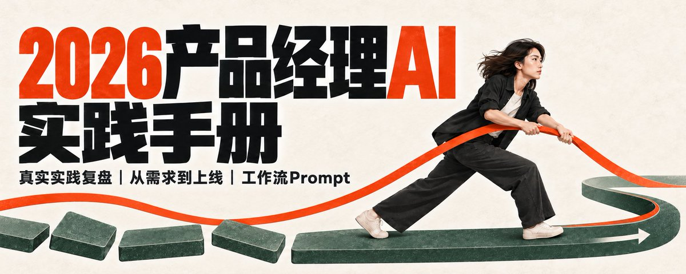

## 先让它认识这个产品

我会尽可能把已有材料整理进去，比如产品介绍、历史 PRD、当前系统截图和设计规范。

运行过一段时间的产品，资料通常不会很干净：有的已经过期，有的是未来规划，还有一些只是讨论过但没有落地的方案。

初始化的第一步，就是让 Agent 帮忙梳理清楚三件事：**这个产品现在是什么、已经知道什么、还不知道什么。**

## 再告诉它，在这个项目里应该怎么工作

除了产品资料，我还会给项目一套协作规则，解决几个更基础的问题：

- 什么内容可以当事实；
- 文件应该放在哪里；
- 修改需求后，哪些内容需要同步更新。

这些规则一旦建立，后面每一个需求都不用重新解释。

长期使用 Agent，需要先建立一套稳定的协作方式。后面的每个需求，就不用再从头教它怎么工作。

## 用一个 Prompt 完成初始化

为了避免每次从头搭项目，我后来把这套流程整理成了一份初始化 Prompt。

**完整版放在文章最后的附录里。**

```
### 1. 建立统一的项目结构

按照“原始输入 → 产品认知与规划 → 需求池 → 单需求 → 版本 → 验收复盘”的流程组织项目目录，保证材料归类清晰、后续可持续维护。

### 2. 建立统一的事实与需求管理规则

所有原始材料先登记来源，再进入分析；每类信息只保留一个唯一维护位置。需求采用统一编号、状态和版本规则，确保来源可追溯、状态可跟踪。

### 3. 建立 AI 协作边界

Markdown 作为长期维护的事实源，Word、PDF、PPT 等作为交付产物。AI 可参与分析、整理和产出，但涉及正式需求、状态变更和文件修改时，应先确认再落盘。
```

项目空间准备好以后，再进入具体的产品工作。

1\. 市场分析：别信一个答案，先把事实查实

AI 特别适合做市场分析。一个以前要查半天的问题，现在几分钟就能整理出一套看起来很完整的答案。但这里也最容易踩坑。

AI 输出的是它根据现有信息整理出来的答案，不能直接当作事实。

不同模型的训练数据不同，实时搜索能力不同，能搜到的信息源也不同。

同一个问题换几个 AI 去问，结果经常不一样。我之前调研 Agent 用户量时，就把同一个问题分别交给 GPT、Gemini、Grok、DeepSeek 和豆包，得到的数字经常对不上。

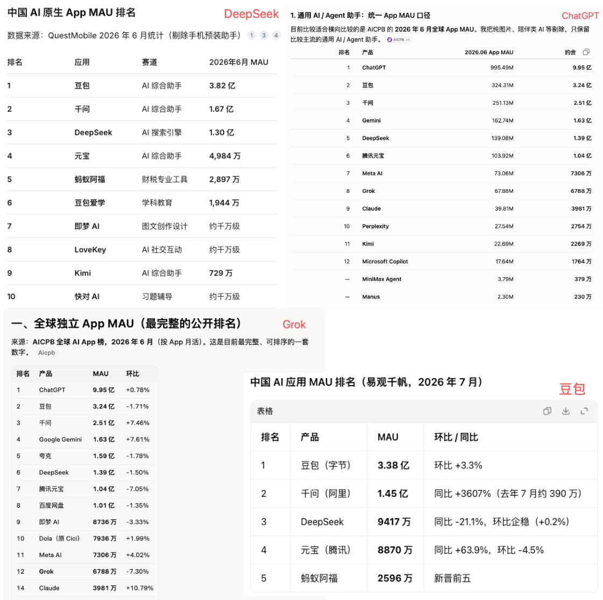

现在做市场分析，我会先让它们尽可能找全资料，再回到原始来源判断。公司官方数据、财报、行业研究报告、App 日活和月活追踪网站、权威媒体，都可以成为线索。

但最后还是要回答一个很朴素的问题：**这个数字能不能找到可信的出处？**

我的做法是：用多个 AI 扩大信息面，用多个来源交叉验证，最后由人来判断哪些事实可以用。

2\. 需求调研：AI 找得到公开信息，找不到你公司里的真相

公开信息，AI 已经能帮我们找很多了。但落到具体产品，还有大量重要信息是它根本接触不到的，比如：

- 客户最关心什么；
- 领导为什么要做这个方向；
- 研发觉得哪个方案实现成本最高；
- 公司内部当前的优先级是什么。

这些信息可能来自一次客户访谈、一场内部会议，甚至只是你和研发在工位上的一次聊天。过去，它们往往只留在产品经理脑子里；如果希望 AI 长期参与项目，这种方式就不够了。

**你知道，不等于 AI 知道。**

我现在会把这些信息持续整理进项目，把隐性的认知变成 Agent 能够使用的上下文。

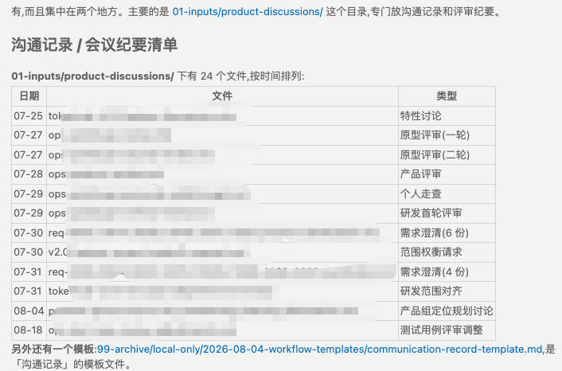

AI 可以处理已经被表达出来的信息。产品经理仍然要负责找到那些还没有被写下来的信息。

3\. 需求分析：AI 做加法，产品经理做减法

到了需求分析，AI 的优势很明显：它很擅长把一个问题想全。问题也恰恰出在这里。

## 先判断：哪些真的值得做

我之前做过一个很简单的需求：修改端口号。核心逻辑并不复杂，但让 AI 往下分析后，它开始不断补充：

- 各种输入校验；
- 批量修改时部分成功、部分失败；
- 返回哪些成功、哪些失败；
- 每一条失败的具体原因；
- 各种异常状态和反馈逻辑。
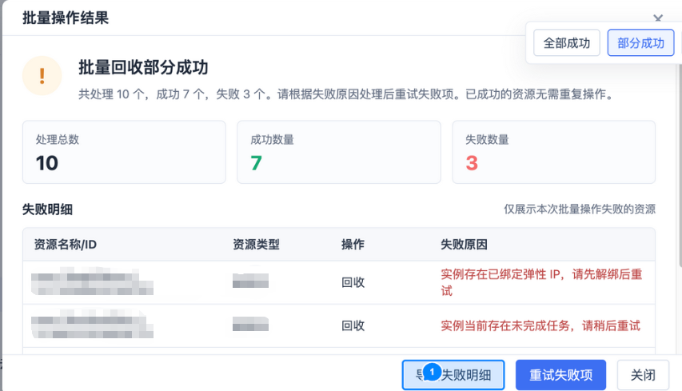

每一项单独拿出来都挺合理。但加在一起，一个原本简单的修改功能就被越做越复杂。

如果这些东西不经过判断，直接原样丢给研发，研发大概率会问：

**这些东西真的都要做吗？**

这时候，该由产品经理开始删了：哪些是核心需求？哪些能力可以放到后续版本？哪些设计的复杂度和收益根本不匹配？

## 再判断：留下来的东西，你自己懂不懂

还有一个同样重要的问题。

AI 可以把需求分析得很细，但最终写进需求的每一个关键决策，产品经理自己都要理解，并且做过判断。不能让 AI 生成完方案，就直接转给研发。

否则研发问一句：

“为什么这里要这么设计？”

产品经理还要回去问 AI，那其实已经变成了一个传话筒。

AI 可以给建议、补细节、找遗漏，但哪些内容最终进入需求，以及为什么这么设计，责任仍然在产品经理。

我的要求很简单：最终留下来的每一个关键设计，我都要能讲清楚为什么。

可以看我的产品上一个版本设计，需要和AI对齐的需求包有20个共100多个需求点，如下图：

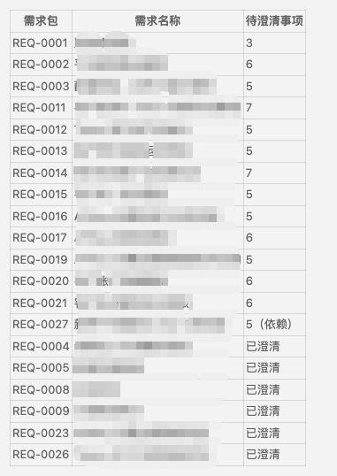

4\. 原型设计：先把设计约束交代清楚

到了原型设计，AI 已经可以很快生成 HTML 原型。我发现，效果好不好，关键看产品的设计约束有没有交代清楚。

如果公司已有固定的前端组件、页面规范和交互规则，我会把已有页面、组件库和 UI 规范一起放进项目。否则，AI 生成的页面可能单独看挺好看，放回现有产品却完全不像同一个系统。

没提供设计约束之前：

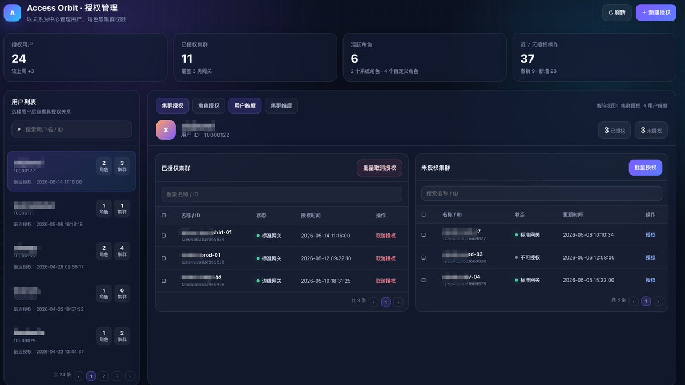

提供设计约束之后：

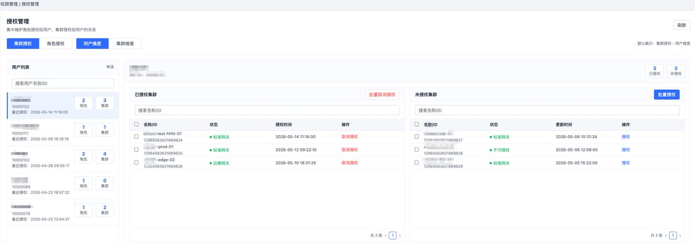

如果公司还没有完整的设计规范，我会给 AI 更多参考：找几个设计成熟的同类产品页面，或者使用设计类 Skill，让它先理解目标风格再出方案。

5\. PRD：下一位读者可能是 AI

AI 能帮忙写文档已经不新鲜了。我现在更关心的是另外两个问题。

## 第一个问题：如何写出符合公司规范的 PRD

如果公司已有固定的 PRD 格式，我会直接把模板和过去写得比较好的 PRD 放进项目，包括文档结构、字段要求和验收标准。这样生成的内容会沿用团队熟悉的写法，不会每次换一套格式。

我之前做一个项目时，专门整理过一份 PRD 参考资料。后面再做新需求，AI 会直接按照这套规范生成。

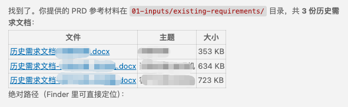

## 第二个问题：PRD 开始有两类读者

以前 PRD 主要是给研发、测试和其他协作人员看的。

现在，研发和测试自己也开始大量使用 AI。PRD 的下一棒，很可能会交到另一个 Agent 手里。

这就多了一个需要考虑的问题：

**需求交给另一个 AI 以后，信息会不会丢？**

同一份结构化内容，我现在会生成一份适合人阅读的 PRD，也可以保留一份信息更完整的 Markdown，给研发和测试的 Agent 继续使用。

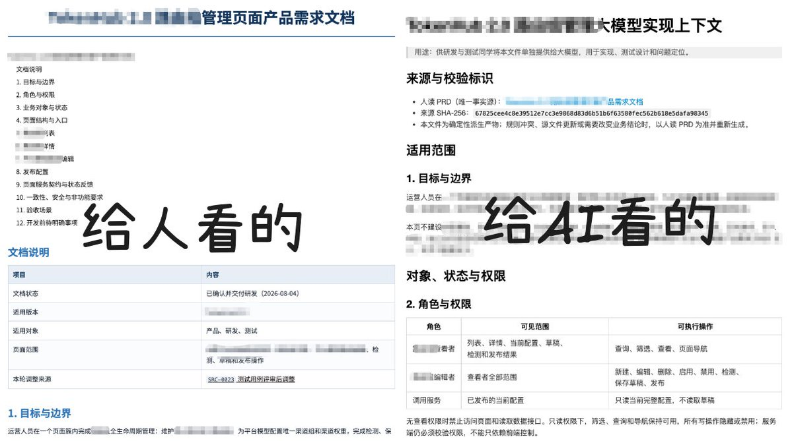

过去，PRD 主要解决人与人之间的交接。以后，它还要承担人与 AI、AI 与 AI 之间的信息交接。

6\. 需求评审：每一次决策，都要重新写回项目

需求评审之后，方案经常会变化。领导可能会决定某个功能先不做，研发可能提出新的限制，测试也可能发现原来的规则有问题。

过去，这些变化往往只留在会议纪要里，甚至散落在几个人的聊天记录中。但如果 AI 后面还要参与研发、测试和下一版本规划，就必须把变化同步回项目。

每次评审，都会更新一部分项目事实。

比如某个功能在评审会上被删掉，我不会只告诉 AI：“把这个功能删掉。”

我还会把背景一起写进去：

- 什么时间？
- 哪次会议？
- 为什么调整？

过几个月以后，你很可能已经忘了当时的原因。这时候可以直接问：“这个功能当时为什么删掉了？”

如果前面的决策记录一直维护得比较完整，AI 就可以回到当时的会议和结论里找答案。

**每一次重要决策，都要重新写回项目上下文。**

否则，AI 只能记住结果，找不到当时的理由。

7\. 研发阶段：项目在变，AI 的认知也必须跟着变

需求评审结束，不代表方案就彻底定了。进入研发后，项目还会继续变化。我会把这些变化继续维护进项目，因为研发反馈会成为新的产品事实。

比如 PRD 最开始写的是方案 A，研发过程中发现实现不了，最后改成了方案 B。

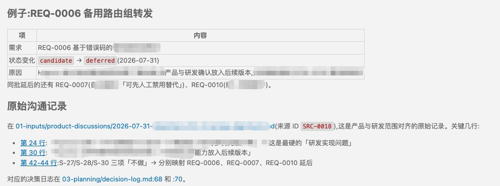

如果只改了代码，没有把这个变化同步回项目，那么下一次再让 AI 分析这个功能，它很可能还会基于方案 A 继续往下推。

**如果掌握的项目现实已经过期了，能力再强也没用。**

把研发变更同步回来之后，AI 才能跟着项目一起变化，不会停在“写需求”的阶段。

8\. 测试上线：让 AI 从写需求走到验需求

到了测试阶段，AI 的角色还可以再往前走一步。借助 Computer Use、浏览器操作等能力，它已经可以按照需求逐项检查实现结果，参与实际验收。

但验收不能完全交给 AI。功能到底好不好用、体验是否合理、有没有达到业务目标，最后仍然需要产品经理判断。

9\. 运营反馈：上线不是终点，为下个版本铺路

产品上线以后，项目还在继续。用户反馈、线上问题、客户新需求和延期功能，都会不断产生新的信息。如果希望 AI 参与完整的产品周期，这些信息也要持续回到项目里。

积累一段时间后，就可以让 AI 帮忙整理下一版本的输入：

“整理一下当前所有用户反馈、线上问题、延期功能和新需求，列出下个版本值得考虑的功能，并标注每一项的来源和背景。”

AI 可以整理和推荐，最终优先级仍然由产品经理决定。

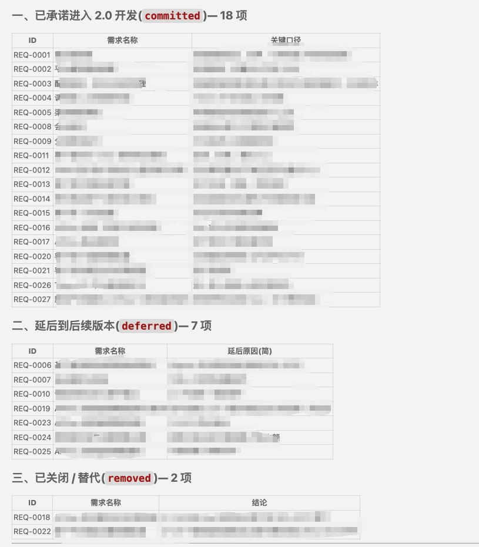

到这里，整个流程才算闭环：上线后的反馈，重新成为下一轮需求的输入。

10\. 跑完整个流程后，我总结了三个心法

这些方法分散在不同阶段，但实际跑下来，很多问题最后都指向三件事。

## 第一，充分：给足上下文

AI 能不能把事情做好，很大程度取决于它知道多少。从项目初始化、需求调研，到评审和研发，其实一直在做同一件事：持续把真实的项目上下文补给 AI。

结果不对时，先别急着怪模型。它很可能缺少一些你已经知道的背景。

## 第二，约束：主动做减法

AI 很容易把事情做得很“完整”：需求分析时补异常、补状态、补规则；原型设计时补页面和交互；写 PRD 时也越写越细。

产品经理要在有限资源里挑出最值得做的事。哪些真的需要，哪些可以以后再做，哪些复杂度根本不值得，都需要有人拍板。

这种取舍贯穿整个产品流程。

## 第三，慢下来：先想清楚，再让 AI 加速

这是我现在感受最深的一点。

以前做一个原型、写一份 PRD、整理一份分析报告，都需要不少时间，人会在过程中边做边想。现在几分钟就能出一版，产出快了，思考却未必跟得上。常常还没想清楚，就已经做了一堆东西。

**AI 越快，人越要先想清楚。**

不要因为生成成本趋近于零，就把思考成本也降到零。

写在最后：AI 时代，产品经理真正值钱的是什么

很多过去属于产品经理的“基本功”，正在快速变便宜。写 PRD、画原型、整理会议纪要、做竞品分析、画流程图，AI 都已经可以做得很快。

如果一个产品经理的核心价值只是这些，会越来越危险。

但在前面的整个流程里，也有一些事情 AI 还替代不了：

- 客户想要什么；
- 领导为什么要做这件事；
- 研发的技术边界在哪里；
- 十个看起来都合理的需求，到底先做哪三个。

这些事情背后是同一种能力：在真实世界里获取信息、理解约束，然后做判断。

AI 可以处理已经表达出来的信息，也可以很快生成方案、补齐细节。产品经理要把没有写下来的背景带回来，删掉不值得做的方案，并且知道什么时候该停。

AI 时代，产品经理的核心竞争力是：

**能给 AI 足够真实的上下文，做出正确的取舍，并对最后的结果负责。**

**附录：**

1、《产品项目初始化Prompt：让Agent参与产品全流程》(https://x.com/run_maotui/status/2100156767137415210)

2、文章配图来自：Punk Skill(https://github.com/adrianpunk/Punk-Skill)
