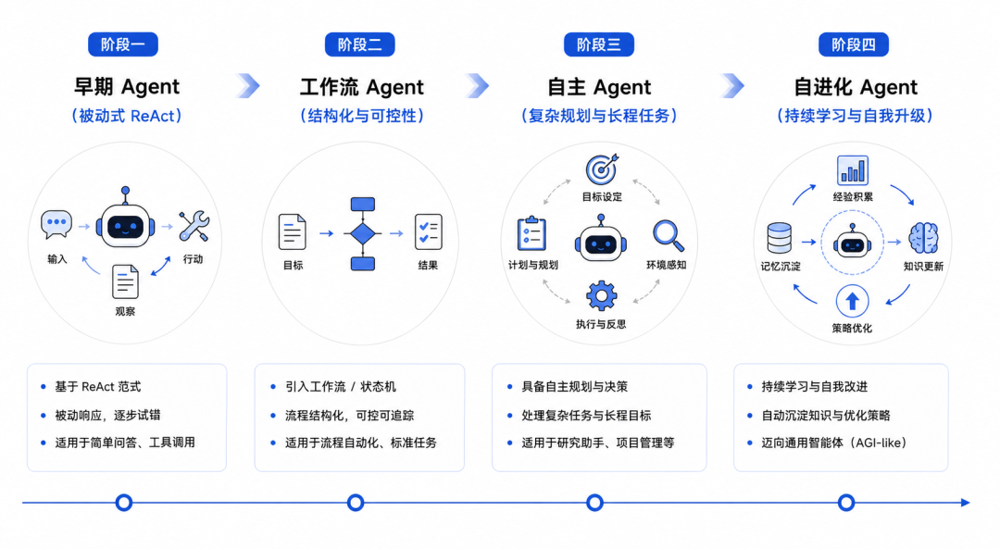
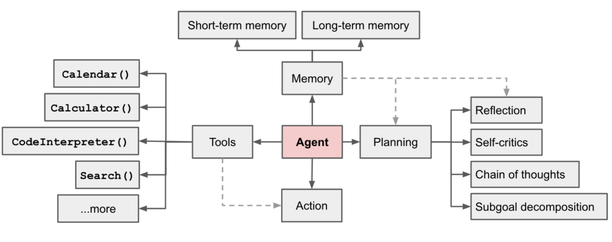
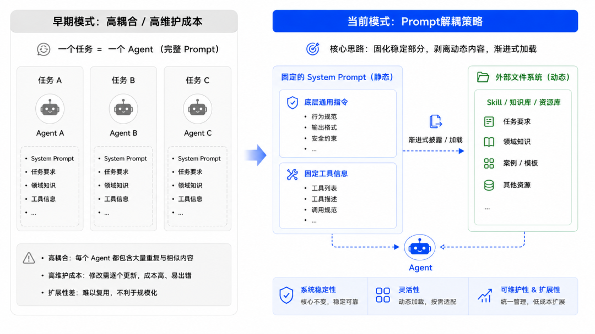
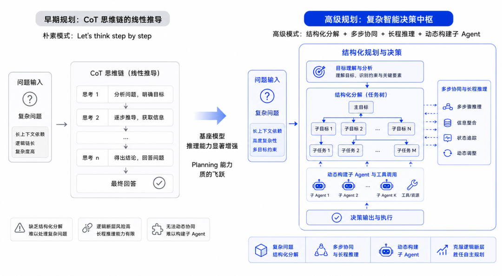
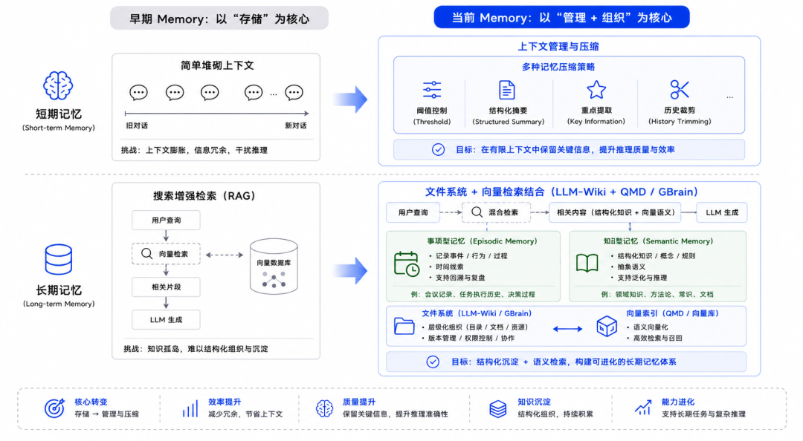
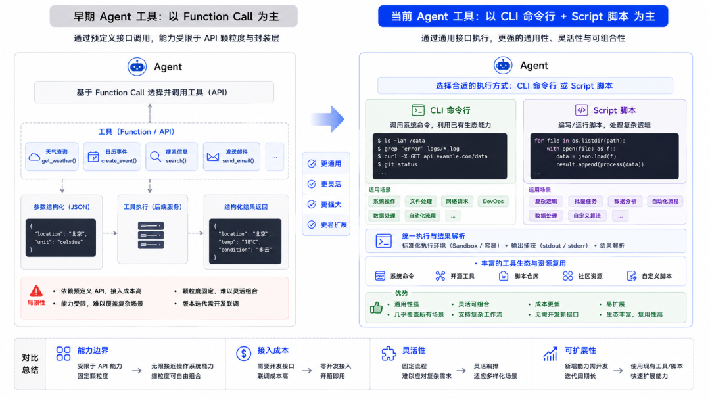
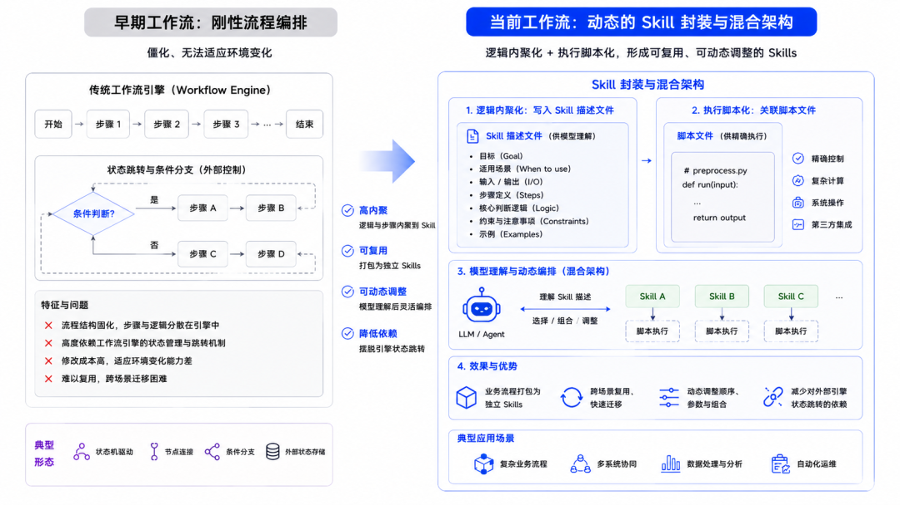
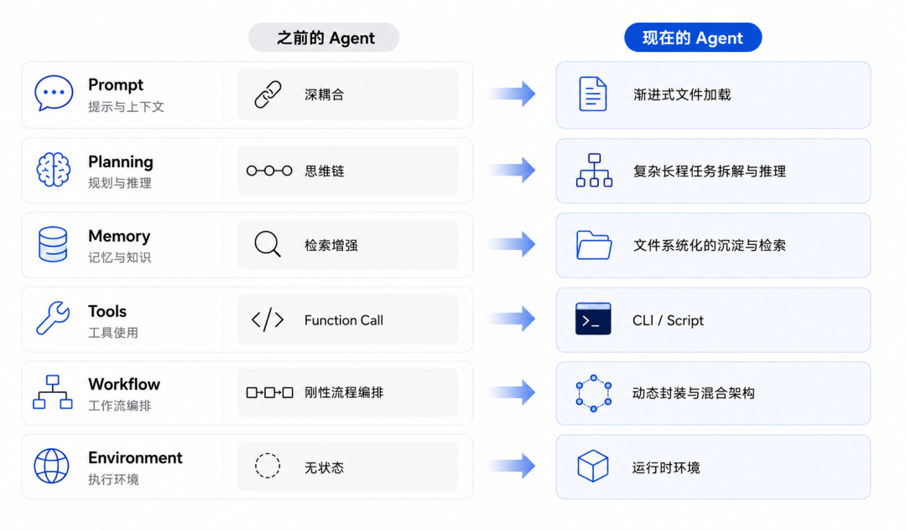

# Agent 核心技术概念与范式演变

> Agent 技术不是一蹴而就的。Prompt、Planning、Memory、Tools、Workflow、Environment — 这六个维度在 2023-2026 年间发生了深刻重构。"形"未变，"神"已大不同。

---

## Agent 发展的四个阶段

| 阶段 | 时期 | 特征 | 代表 |
|------|------|------|------|
| **早期 Agent** | 2023 | 被动式 ReAct，一问一答，单步推理 | AgentGPT, AutoGen, MetaGPT |
| **Workflow Agent** | 2024 | 工程化约束弥补模型不确定性，硬编码流程 | LangGraph, Dify |

| **自主 Agent** | 2025 | 复杂规划、长程任务、自我校验 | Claude Code, Codex, Manus, OpenClaw |
| **自进化 Agent** | 2026 | 沉淀 Skill/知识库，越用越好用 | Hermes Agent, LLM-Wiki |

---

## 六个核心维度的演变

### 1. Prompt：深耦合 → 渐进式加载

**早期**：一个任务一个 Agent，System Prompt 里塞满人设、目标、约束、示例 — 一段"小作文"。

**现在**：
- System Prompt 极度精简，只保留底层行为规范
- 任务要求、领域知识拆解到外部文件系统（SKILL.md、CLAUDE.md、SOUL.md）
- 渐进式披露加载，实现"动静分离"

### 2. Planning：思维链 → 复杂长程任务

**早期**：依赖"Let's think step by step"引导线性推理。

**现在**：
- 结构化分解：目标 → 子任务 + Todo List
- 多步协同：动态调整计划，处理极长上下文
- 子 Agent 动态构建：从"单体思考"到"协同作战"

核心驱动力：基座模型推理能力升级。

### 3. Memory：检索增强 → 文件系统化

**早期**：短期记忆 = 对话上下文；长期记忆 = RAG 向量检索。

**现在**：
- **短期记忆**：从"存储"转向"管理压缩" — 阈值控制、结构化摘要、重点提取
- **长期记忆**：
  - 事项型（Episodic）→ MEMORY.md 文件系统记录
  - 知识型（Semantic）→ LLM-Wiki、GBrain 本地化知识库 + RAG 混合

核心趋势：文件系统化沉淀 + 向量检索混合管理。

### 4. Tools：Function Call → CLI / Script

**早期**：每个能力封装成 API，注册 Function Call Schema — 开发维护成本极高。

**现在**：
- **CLI 原生化**：grep、cat、vim 等命令是模型的"先天知识"，无需额外 Schema
- **Script 脚本化**：工具逻辑封装为独立脚本，内部处理鉴权和细节
- **Skill 集成**：第三方 CLI 通过 Skill 包装，--help 即可自主理解

核心转变：从"人为适配模型"到"利用模型原生能力"。

### 5. Workflow：刚性编排 → 动态混合封装

**早期**：硬编码状态机/流水线，固定第一步→第二步→第三步。

**现在**：
- 逻辑内聚化：步骤定义写入 SKILL.md
- 执行脚本化：无需外部引擎，Script 代码级编排
- 混合架构：Skill 为主（灵活性），Workflow 兜底（确定性）

### 6. Environment：无状态 → 运行时环境

**早期**：Agent 无状态调用，不需要运行环境。

**现在**：
- **本地桌面**：高便利性，直接操作用户文件系统（OpenClaw 模式）
- **沙箱环境**：Docker/K8s 隔离，企业级安全边界

---

## 总结

Agent 的"形"未变（仍是 Prompt + Planning + Memory + Tools），但"神"已大不同：

| 维度 | 过去 | 现在 |
|------|------|------|
| Prompt | 单体小作文 | 解耦 + 渐进式加载 |
| Planning | 线性 CoT | 复杂长程任务拆解 |
| Memory | 向量检索 | 文件系统 + 向量混合 |
| Tools | API 封装 | 原生 CLI + Script |
| Workflow | 刚性编排 | Skill 内化 + 混合架构 |
| Environment | 无状态 | 隔离 Runtime |

核心思想不变：**通过工程化手段构建确定性，以承载模型的不确定性。**

