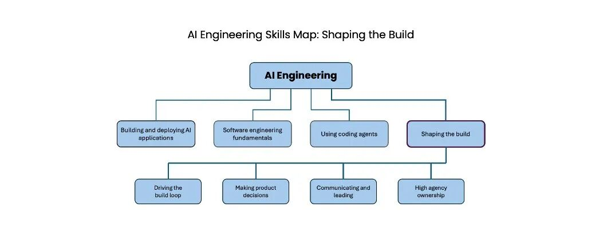

# AI 工程技能图谱：塑造构建

当你精通 AI 工程时，你最好的工作不会只是实现别人写好规格的产品。相反，你会主动塑造构建过程。在现代 AI 工具加速并扩展单个开发者能力之前，科技公司已经形成了一种实践：由产品经理（PM）和设计师定义要构建什么，然后由开发者来构建。也许还会有项目经理额外推动时间线。然而，这些角色正在变得模糊。一个精通 AI 工程的开发者不仅会构建软件，也会参与这些其他角色的工作。（同样，产品经理和设计师也在获得 AI 工程技能，并参与软件构建。）这种变化正在极大地加速软件开发。当你知道如何塑造构建过程时，就可以更快行动，而不必等待 PM 想清楚该做什么。塑造构建过程的关键技能包括：驱动构建循环做出产品决策沟通与领导高主动性的所有权意识驱动构建循环。大多数软件都是通过一个循环构建出来的：你写一些代码，然后获得一些反馈，再决定下一步做什么。作为一名熟练的 AI 工程师，你在驱动这个循环中发挥关键作用，会反复决定下一步该做什么来推动项目向前。你偏向行动，并以 AI 所带来的高速度来驱动这个循环。例如，你可能会决定构建一个快速原型来测试某个技术概念或用户功能，构建一个 MVP（最小可行产品）给用户试用以展示价值，添加功能，或者投入建设企业级系统。你会频繁以小批量发布，以保持速度。你知道什么时候该从用户或其他利益相关者那里获取反馈，或者什么时候该运行技术实验（例如训练一个模型）来收集信息，以决定下一步。你会在做这些决策时综合考虑产品愿景、项目阶段、技术可行性、关键风险、工作量和预算。对于更成熟的项目，你知道如何定义关键指标，并通过项目管理推动这些指标改善。做出产品决策。开发者不必成为 PM，但你会做出产品规格没有覆盖到的决策。如果别人要求你在没有规格的情况下构建，你知道如何制定规格。你具备产品感，能够选择满足真实用户需求的产品方向，而不必等待 PM 来做每一个决策。你也至少具备基本的设计感，能够构建出不只是功能可用、而且使用起来令人愉悦的东西。你还具备一些基本的商业感，因此可以思考上市策略、市场规模、单位经济模型、损益（P&L）等问题，并做出在经济上合理的取舍。你做出产品决策的能力植根于你的用户同理心。此外，你会持续通过多种方法打磨这种同理心，例如与 2-3 位用户进行快速非正式访谈、对数百名用户进行调研、大规模 A/B 测试，或者分析成千上万乃至数百万用户的行为。你会利用由此获得的输入来改进自己对用户的理解。沟通与领导。你的 AI 工程技能使你能够参与比传统软件开发更广范围的工作。我之前写过，专业化开发者（比如前端开发者）如今更可能承担更广泛的全栈角色。AI 工程技能进一步打开了扩展工作范围的大门：你可能会参与影响项目的其他职能，例如市场、财务、法务等等。这使得你与这些其他职能沟通的能力比以往更加重要——你可以通过在利益相关者之间达成一致并进行协调，在推动项目向前方面发挥关键作用。（沟通技能也是与用户交流、打磨用户同理心的重要基础。）此外，由于 AI 技术正在快速演进，许多工程领域之外的人也在努力理解这项技术、它对自己工作的影响，以及它所带来的新实践和新产品。你在 AI 工程方面的技术能力会让你走在前面，并让你在塑造这些认知方面发挥独特作用。例如，你可以解释为什么某些计划在技术上可行或不可行。这使你能够帮助带领更广泛的组织向前发展。高自主性的主人翁意识。AI 工程技能给了你大量创造影响的机会。然而，许多人，包括一些高管，还不了解 AI 能做什么，因此也不知道哪些项目方向是好的。这为具备技术能力的人创造了一个弥合差距的机会：你可以发现问题、提出解决方案，并把它们执行出来，既尊重组织的优先事项和约束，也不必等待自上而下的精确指令。这项技能需要高度的自主性，也就是你能识别机会、判断什么最重要，并采取行动。此外，你知道如何端到端地负责一项计划，为出现的问题承担责任，在不确定中行动，在挫折中坚持，并且不只是用任务是否完成来衡量自己的工作，而是根据你创造的价值来衡量。最后，你会投入精力提升自己的技能。你会跟踪技术前沿，掌握新工具，调优自己的工作流，并持续学习，让自己随着时间推移变得更强。不仅能构建，还能塑造构建的方向，这让 AI 工程比传统软件开发更令人兴奋。你的自主权更大，职责范围更广，做出的决策也更多。但要把这些事做好，需要更全面的技能。DeepLearning.AI（https://deeplearning.ai/）的重点就是帮助你，如果你愿意的话，成长为熟练的 AI 工程人才。我期待前方的道路！

当你精通 AI 工程时，你最好的工作不会只是实现别人写好规格的产品。相反，你会主动塑造构建过程。

在现代 AI 工具加速并扩展单个开发者能力之前，科技公司已经形成了一种实践：由产品经理（PM）和设计师定义要构建什么，然后由开发者来构建。也许还会有项目经理额外推动时间线。然而，这些角色正在变得模糊。一个精通 AI 工程的开发者不仅会构建软件，也会参与这些其他角色的工作。（同样，产品经理和设计师也在获得 AI 工程技能，并参与软件构建。）

这种变化正在极大地加速软件开发。当你知道如何塑造构建过程时，就可以更快行动，而不必等待 PM 想清楚该做什么。

塑造构建过程的关键技能包括：

驱动构建循环

做出产品决策

沟通与领导

高主动性的所有权意识

驱动构建循环。大多数软件都是通过一个循环构建出来的：你写一些代码，然后获得一些反馈，再决定下一步做什么。作为一名熟练的 AI 工程师，你在驱动这个循环中发挥关键作用，会反复决定下一步该做什么来推动项目向前。你偏向行动，并以 AI 所带来的高速度来驱动这个循环。

例如，你可能会决定构建一个快速原型来测试某个技术概念或用户功能，构建一个 MVP（最小可行产品）给用户试用以展示价值，添加功能，或者投入建设企业级系统。你会频繁以小批量发布，以保持速度。你知道什么时候该从用户或其他利益相关者那里获取反馈，或者什么时候该运行技术实验（例如训练一个模型）来收集信息，以决定下一步。你会在做这些决策时综合考虑产品愿景、项目阶段、技术可行性、关键风险、工作量和预算。对于更成熟的项目，你知道如何定义关键指标，并通过项目管理推动这些指标改善。

做出产品决策。开发者不必成为 PM，但你会做出产品规格没有覆盖到的决策。如果别人要求你在没有规格的情况下构建，你知道如何制定规格。

你具备产品感，能够选择满足真实用户需求的产品方向，而不必等待 PM 来做每一个决策。你也至少具备基本的设计感，能够构建出不只是功能可用、而且使用起来令人愉悦的东西。你还具备一些基本的商业感，因此可以思考上市策略、市场规模、单位经济模型、损益（P&L）等问题，并做出在经济上合理的取舍。你做出产品决策的能力植根于你的用户同理心。此外，你会持续通过多种方法打磨这种同理心，例如与 2-3 位用户进行快速非正式访谈、对数百名用户进行调研、大规模 A/B 测试，或者分析成千上万乃至数百万用户的行为。你会利用由此获得的输入来改进自己对用户的理解。

沟通与领导。你的 AI 工程技能使你能够参与比传统软件开发更广范围的工作。我之前写过，专业化开发者（比如前端开发者）如今更可能承担更广泛的全栈角色。AI 工程技能进一步打开了扩展工作范围的大门：你可能会参与影响项目的其他职能，例如市场、财务、法务等等。这使得你与这些其他职能沟通的能力比以往更加重要——你可以通过在利益相关者之间达成一致并进行协调，在推动项目向前方面发挥关键作用。（沟通技能也是与用户交流、打磨用户同理心的重要基础。）

此外，由于 AI 技术正在快速演进，许多工程领域之外的人也在努力理解这项技术、它对自己工作的影响，以及它所带来的新实践和新产品。你在 AI 工程方面的技术能力会让你走在前面，并让你在塑造这些认知方面发挥独特作用。例如，你可以解释为什么某些计划在技术上可行或不可行。这使你能够帮助带领更广泛的组织向前发展。

高自主性的主人翁意识。AI 工程技能给了你大量创造影响的机会。然而，许多人，包括一些高管，还不了解 AI 能做什么，因此也不知道哪些项目方向是好的。这为具备技术能力的人创造了一个弥合差距的机会：你可以发现问题、提出解决方案，并把它们执行出来，既尊重组织的优先事项和约束，也不必等待自上而下的精确指令。这项技能需要高度的自主性，也就是你能识别机会、判断什么最重要，并采取行动。此外，你知道如何端到端地负责一项计划，为出现的问题承担责任，在不确定中行动，在挫折中坚持，并且不只是用任务是否完成来衡量自己的工作，而是根据你创造的价值来衡量。

最后，你会投入精力提升自己的技能。你会跟踪技术前沿，掌握新工具，调优自己的工作流，并持续学习，让自己随着时间推移变得更强。

不仅能构建，还能塑造构建的方向，这让 AI 工程比传统软件开发更令人兴奋。你的自主权更大，职责范围更广，做出的决策也更多。但要把这些事做好，需要更全面的技能。DeepLearning.AI（https://deeplearning.ai/）的重点就是帮助你，如果你愿意的话，成长为熟练的 AI 工程人才。

我期待前方的道路！

## 加入ThinkInAI社区

如果你也对AI充满兴趣，欢迎加入我们的ThinkInAI社区，在这里，你可以：

获取最新AI工具资讯

参与实战经验分享

结识志同道合的伙伴

共同探讨AI应用方向

扫描文末二维码，加入ThinkInAI社区，一起拥抱AI新时代！

