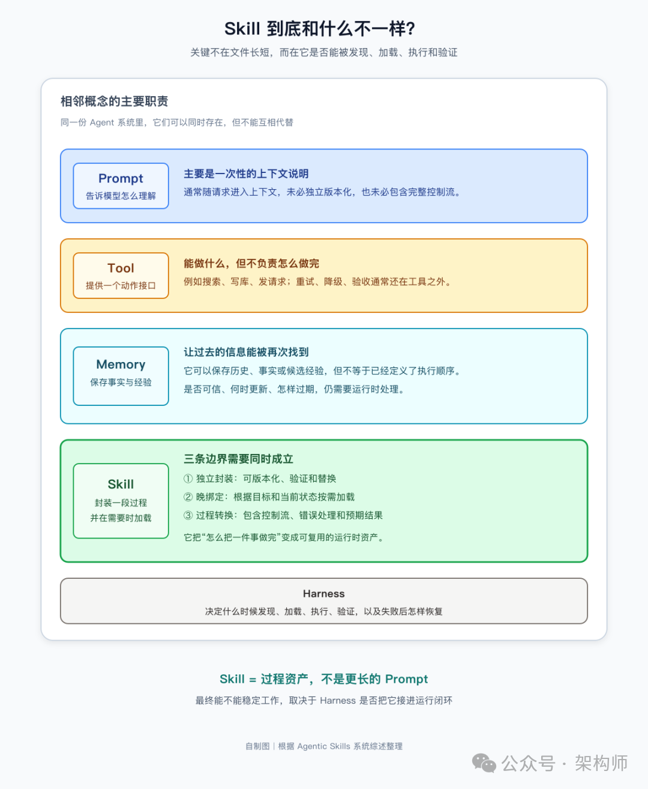
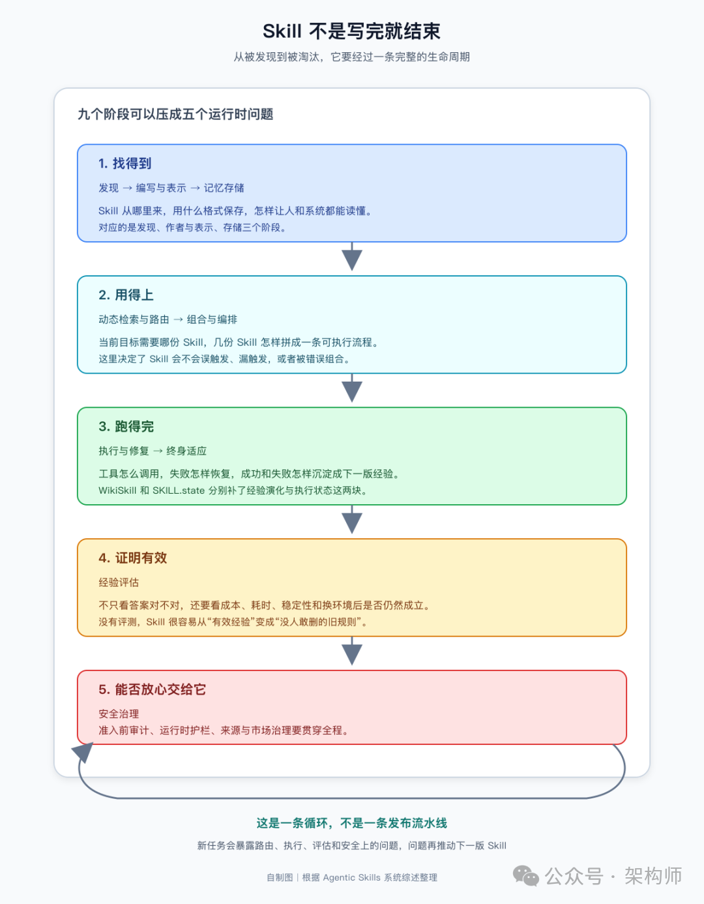
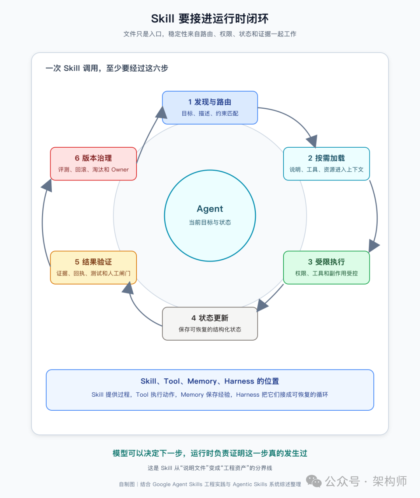

# 来自Google 的Agentic Skill 综述

架构师（JiaGouX）我们都是架构师！架构未来，你来不来？写过SKILL.md的团队，大概都经历过类似的落差。文件写完了，格式也对，交给 Agent 确实能跑。过几周再看，有的被误触发，有的该用时找不到，有的跑到一半卡在中间状态，还有的因为依赖的 API 改了而悄悄失效。文件还在，能力已经不可靠了。Google 最近公开的 Agent Skills 生产流程，和一篇由 Google 团队参与完成的 Agentic Skill 系统综述，恰好从两个方向回应了这个落差。一份是工程复盘，讲 Skill 怎么生产、测试和维护；一份是学术框架，把 Skill 拆成六元组和九阶段生命周期，试着把发现、路由、执行、评估和安全放进同一张图里。一份来自工程线，一份来自研究线。放在同一个问题下看，它们其实都在回答：一份做事方法，怎样才算真正进入了 Agent 的运行时。综述先把边界划清楚了这篇综述做的第一件事，是给 Skill 一个形式化定义。六元组：激活条件（A）、过程指令（I）、适用约束（C）、工具接口（T）、执行策略（π）和预期效果（E）。这个形式未必需要原样搬进每个项目，但它提供了一个检查清单：只有说明、没有触发和效果，更接近 Prompt；只有接口、没有过程，更接近 Tool；只保存历史、没有执行逻辑，则更接近 Memory。这篇综述给了三条判定标准：封装模块化。Skill 是独立的外部资产，可以单独编写、版本化、验证和更新，不需要改模型权重或全局 Harness 代码。晚绑定动态加载。Skill 不常驻在上下文里，而是根据当前状态和目标按需加载。系统提示在会话开始时就全部注入，Skill 只在被需要时才出现。过程性状态转换。Skill 编码的是"怎么做"的操作知识，包括错误处理和控制流，而不是记录事实或保存历史。Agent Skill 与 Prompt、Tool、Memory、Harness 的边界图 1：Skill 夹在上下文、工具、记忆和运行时之间，核心是封装一段可加载、可执行、可验证的过程。自制图。用这三条标准去过滤，很多模糊地带就清楚了。一段全局 JSON 格式指令不是 Skill，因为它没有模块化和按需加载；一个搜索 API 不是 Skill，因为它没有过程编排；但一个附带超时重试、缓存降级和 DOM 解析逻辑的 API 封装，就是综述所说的"工具执行技能"。一段对话记录也不是 Skill，因为它不包含执行逻辑。综述还给出了安全约束的形式化表述：Skill 激活当且仅当其声明的工具集是当前上下文允许工具集的子集，否则即为权限提升。这个定义把"Skill 能不能用某个工具"从口头约定变成了可检查的条件。Google 的工程实践：Skill 是一份要持续维护的过程资产综述回答了"到底是什么"，Google 的工程实践则展示了"怎么做"。Google 的 Skill 不是谁写完谁提交的孤立文档。它有统一目录、自动检查、提交时评测和每周质量检查，还要有人长期负责。Repo Maintainer 维护仓库的共同规则，Skill Owner 负责某一份 Skill 随产品、API 和评测结果一起变化。这件事听起来像常规软件工程，但对 Skill 尤其重要。普通文档过期，最多让人多查几页；过期的 Skill 可能让 Agent 直接走错工具、漏掉一个前置条件，甚至执行一个已经不适用的流程。架构上有一条核心原则：优先引用远程 MCP 工具，CLI 和 API 调用只作为兜底。远程 MCP 服务器更容易纳入统一鉴权和 IAM 级别的权限治理，比裸调 CLI/API 更适合放进长期维护的运行环境。这和综述里"安全治理"阶段的思路是一致的，Skill 的工具声明不只是功能描述，也是权限边界。导出规则也值得留意。Skill 先在内部构建和验证，达标后才通过自动化规则发布到 GitHub，同时剥离内部资产、Owner 信息和评测套件。同一份 Skill 在内部和外部是两个形态，公开的只是经过脱敏的一个切面。评测不只看答案对不对。完成任务用了多少 Token、花了多长时间、这种收益在不同运行环境里是否成立，都在考察范围内。Google 用准确率和效率两个维度打出 2×2 矩阵来判断一个 Skill 到底有没有带来提升。一个 Skill 如果让结果看起来更完整，却让调用成本和失败重试一起上升，未必是改进。从工程角度看，Skill 更像一份需要持续维护的过程资产，而不是一次性提示词。Owner、版本、测试样例和淘汰机制，都是这个判断的自然推论。九阶段生命周期：一条还没完全闭合的链路综述把 Skill 的完整生命分成九个阶段：自主发现、编写与表示、记忆存储、动态检索与路由、组合与编排、执行与修复、终身适应、经验评估、安全治理。Google 的工程实践覆盖了其中的大部分环节，但在"安全治理"和"终身适应"上还在演进。把它们压缩成运行时视角，这条链路可以写成：发现与路由 → 按需加载 → 受限执行 → 状态更新 → 结果验证 → 版本治理Agentic Skill 九阶段生命周期图 2：综述里的九个阶段，可以归并成“找得到、用得上、跑得完、证明有效、能否放心交给它”五个运行时问题。自制图。Harrison Chase 在讨论 Agent 架构时用过一个说法：harness 是"围绕模型的、可编排的执行外壳"，它决定的不是模型能说什么，而是哪些信息在什么时候以什么方式进入模型，以及模型的输出怎样被校验和落地。Skill 的工程化程度，最终取决于这条链路是否闭合，而不在于目录里有多少份SKILL.md。Karpathy 谈 context engineering 时也说过类似的话：工业级 LLM 应用的难点不只是写一个 prompt，而是把任务描述、资料、工具、状态、历史和压缩结果，恰当地装进下一步的上下文。Simon Willison 在讨论 Claude Skills 时补了一句：Skills 的意义不在于给模型更多文本，而在于把"什么时候需要什么"从临时判断变成了可复用的配置。Skill 是 Context Engineering 的一个可版本化载体，但它不能替代 Context System，也不能替代 Harness。这也解释了为什么最近反复看到两条看似相反的路线：一条强调 Markdown、文件和按需检索，另一条强调结构化状态、事件流和严格的执行协议。它们并不是在争论"文本好还是结构好"，而是在处理不同生命周期的信息。经验需要人能读、能改、能审查；当前状态需要机器能校验、能合并、能恢复；执行证据需要留档，临时推理可以过期。综述里几个容易被忽略的细节这份综述里还有几处容易被略过的内容，这里挑三个。安全不是附加章节，而是贯穿全生命周期的问题。综述指出，自然语言指令本身就是容易被注入的入口。恶意 Skill 可以携带后门、窃取凭证、绕过护栏，而且风险会穿过多个生命周期阶段。防御体系对应三层：准入前静态审计、运行时护栏、市场治理（加密溯源签名）。现实是，Skill 在调用前无法被完全验证，这正是安全问题难以一次解决的原因。Skill 库也会产生技术债。综述提到了 SkillOps 的五维健康度治理：剪除低价值 Skill、偿还"技能技术债"。触发描述冲突、重复流程、过期链接、失效脚本、无人维护的 Owner、越来越长的参考目录，这些问题和代码仓库的技术债没有本质区别。数量增长本身不是能力增长，能不能找到、能不能执行、能不能证明有效，才是更接近真实的指标。Skill 的收益是有条件的。综述引用了一项负面结果：程序性技能在网络安全 CTF 任务上零增益。论文提出了"环境反馈带宽假说"来解释：当环境本身能提供丰富诊断信息时，外置技能的边际收益递减。Skill 更适合那些环境反馈稀疏、试错成本高、领域约束强的任务，而不是所有任务都值得写成 Skill。WikiSkill 和 SKILL.state：补全生命周期的两块拼图综述给出了完整框架，同一天发表的两篇论文则分别填补了"终身适应"和"执行与修复"两个阶段。WikiSkill 处理的是 Skill 的生产端。它在执行轨迹和可执行 Skill 之间插入了一层持久 Wiki：执行轨迹 → 经验模式 → Skill 提案 → 验证闸门 → 新版本 Skill最精妙的设计是一处不对称：Skill 可以回滚，Wiki 永不回滚。失败的提案连同拒绝理由也会留在 Wiki 里，下次提案时能看到"这个方向试过、为什么不行"。Skill 是易错的假设，Wiki 是沉淀的知识，知识不该因为一次假设失败而清零。论文还发现了一个有意思的现象：进化后的 Skill 可以让小模型在部分任务上超过裸跑的大模型，实验里的 9B 模型就反超了 27B 模型。但跨模型迁移也可能失效：小模型沉淀的 Skill 里塞满了模型特异的 workaround，交给更强的模型后反而拖累成绩。通用程序性知识可以跨模型迁移，模型特异的补丁则可能造成负迁移。这对 Skill 的维护策略有直接影响：写 Skill 时要区分哪些是领域通用的，哪些只是针对特定模型的补丁。SKILL.state 处理的是 Skill 的消费端。它把执行重构为显式状态转移：每一步只把不可变的 Skill 说明、结构化的当前状态和最新环境观察交给模型；模型返回状态补丁和动作；运行时校验补丁，合并出新状态，然后丢弃这一步的推理历史。单步提示词长度保持在 O(1)，累计 token 从 O(T²) 降到 O(T)。这条边界很重要，但也不能推得太远。论文讨论的前提是结构化状态足以支持下一步决策。如果任务需要回看完整轨迹来审计，或者早期的一条观察直到很久以后才被发现重要，直接丢弃历史就可能损失信息。状态机不是“历史都不重要”，而是要求系统提前说清楚：什么是未来执行真正需要的最小充分状态。带回项目里的六个问题比起先看一份 Skill 写了多少页，现在更常问的是六个问题：它在什么条件下被触发，误触发和漏触发分别会带来什么代价。输入和输出是什么，哪些信息还要回到权威系统确认，而不是直接相信上下文记忆。哪些动作可以交给脚本或工具确定性完成，哪些判断仍然需要模型参与。中途失败以后，系统怎样继续，哪些副作用可以重试，哪些在重试前需要先查询结果。"完成"由什么证据确认，谁有权覆盖模型的完成判断。谁负责维护，怎样评测，什么时候降级、回滚或淘汰。这不是一张写作清单，更像是把 Skill 放回软件系统以后，几个绕不过去的责任问题。不同团队的答案当然会不同，但只要其中几项始终说不清，Skill 大概率还停留在"写给模型看的说明"这一步。高重复、边界明确、结果可验证的流程，适合沉淀成 Skill。一次性探索、事实变化很快、验收标准本身还没有形成的任务，硬写成 Skill 反而可能把临时判断固化成错误规则。Aaron Levie 在公开讨论里提到过类似判断：随着模型越来越能处理原先由工程脚手架承担的事情，架构需要持续删改，而不是只做叠加。以后再画架构图Google 的实践和这篇综述，一份来自生产线，一份来自学术梳理，但它们指向的方向是一致的。以后再画 Agent 架构图，Skill 大概不会再被画成一个孤立的文件图标。它更适合被画在那条不断查找、加载、执行、验证和更新的运行循环里。Skill 进入 Agent Runtime 的闭环图 3：Skill 提供过程，Tool 执行动作，Memory 保存经验，Harness 把它们接成可恢复的运行时闭环。自制图。经验怎样被提炼，知识怎样长期保存，Skill 怎样被路由，状态怎样推进，权限怎样收口，结果怎样验证，失败怎样恢复。这些问题只要缺一块，Skill 就很容易退化成一份"看起来很懂"的提示词。边界接起来以后，Skill 才有机会成为一种真正可复用的工程资产：它能被加载，也能被替换；能带来经验复利，也能在验证失败时回滚；能帮助模型做事，但不会把权限、事实和完成标准一起交给模型决定。参考资料Google Cloud：Behind the scenes: How we build, test, and scale Google Agent Skills（https://cloud.google.com/blog/topics/developers-practitioners/behind-the-scenes-how-we-build-test-and-scale-google-agent-skills/）Google Skills GitHub 仓库（https://github.com/google/skills）Towards a Systems Foundation for Agentic Skills: Architecture, Lifecycle, and Security（https://arxiv.org/abs/2608.29596）WikiSkill: Compiling Agent Experience into Persistent Knowledge for Skill Evolution（https://arxiv.org/abs/2608.27454）SKILL.state: Scalable Long-Horizon Agent Skills（https://arxiv.org/abs/2608.26263）Andrej Karpathy：关于 context engineering 的公开讨论（https://x.com/karpathy/status/1937902205765607626）Simon Willison：Claude Skills are bigger than MCP（https://simonwillison.net/2025/Sep/12/claude-skills/）Aaron Levie：关于 Agent 时代专业能力与架构取舍的公开讨论（https://x.com/levie/status/2006521312693637597）如喜欢本文，请点击右上角，把文章分享到朋友圈如有想了解学习的技术点，请留言给若飞安排分享因公众号更改推送规则，请点“在看”并加“星标”第一时间获取精彩技术分享·END·相关阅读：Loop Engineering，应该赞成还是反对？Claude 做方案，Codex 写代码：多模型协作怎么交接才稳架构排熵：Loop Engineering 的持续清理系统CLAUDE.md 拆解：Agent 进仓库前的上下文入口Harness工程还没唱罢，Environment工程已然登场设计 Self-Harness 架构：会自我改进的Harness版权申明：内容来源网络，仅供学习研究，版权归原创者所有。如有侵权烦请告知，我们会立即删除并表示歉意。谢谢!架构师我们都是架构师！关注架构师(JiaGouX)，添加“星标”获取每天技术干货，一起成为牛逼架构师技术群请加若飞：1321113940进架构师群投稿、合作、版权等邮箱：admin@137x.com

架构师（JiaGouX）

我们都是架构师！架构未来，你来不来？

写过SKILL.md的团队，大概都经历过类似的落差。

文件写完了，格式也对，交给 Agent 确实能跑。过几周再看，有的被误触发，有的该用时找不到，有的跑到一半卡在中间状态，还有的因为依赖的 API 改了而悄悄失效。文件还在，能力已经不可靠了。

Google 最近公开的 Agent Skills 生产流程，和一篇由 Google 团队参与完成的 Agentic Skill 系统综述，恰好从两个方向回应了这个落差。一份是工程复盘，讲 Skill 怎么生产、测试和维护；一份是学术框架，把 Skill 拆成六元组和九阶段生命周期，试着把发现、路由、执行、评估和安全放进同一张图里。

一份来自工程线，一份来自研究线。放在同一个问题下看，它们其实都在回答：一份做事方法，怎样才算真正进入了 Agent 的运行时。

## 综述先把边界划清楚了

这篇综述做的第一件事，是给 Skill 一个形式化定义。

六元组：激活条件（A）、过程指令（I）、适用约束（C）、工具接口（T）、执行策略（π）和预期效果（E）。这个形式未必需要原样搬进每个项目，但它提供了一个检查清单：只有说明、没有触发和效果，更接近 Prompt；只有接口、没有过程，更接近 Tool；只保存历史、没有执行逻辑，则更接近 Memory。

这篇综述给了三条判定标准：

封装模块化。Skill 是独立的外部资产，可以单独编写、版本化、验证和更新，不需要改模型权重或全局 Harness 代码。

晚绑定动态加载。Skill 不常驻在上下文里，而是根据当前状态和目标按需加载。系统提示在会话开始时就全部注入，Skill 只在被需要时才出现。

过程性状态转换。Skill 编码的是"怎么做"的操作知识，包括错误处理和控制流，而不是记录事实或保存历史。

图 1：Skill 夹在上下文、工具、记忆和运行时之间，核心是封装一段可加载、可执行、可验证的过程。自制图。

用这三条标准去过滤，很多模糊地带就清楚了。一段全局 JSON 格式指令不是 Skill，因为它没有模块化和按需加载；一个搜索 API 不是 Skill，因为它没有过程编排；但一个附带超时重试、缓存降级和 DOM 解析逻辑的 API 封装，就是综述所说的"工具执行技能"。一段对话记录也不是 Skill，因为它不包含执行逻辑。

综述还给出了安全约束的形式化表述：Skill 激活当且仅当其声明的工具集是当前上下文允许工具集的子集，否则即为权限提升。这个定义把"Skill 能不能用某个工具"从口头约定变成了可检查的条件。

## Google 的工程实践：Skill 是一份要持续维护的过程资产

综述回答了"到底是什么"，Google 的工程实践则展示了"怎么做"。

Google 的 Skill 不是谁写完谁提交的孤立文档。它有统一目录、自动检查、提交时评测和每周质量检查，还要有人长期负责。Repo Maintainer 维护仓库的共同规则，Skill Owner 负责某一份 Skill 随产品、API 和评测结果一起变化。

这件事听起来像常规软件工程，但对 Skill 尤其重要。普通文档过期，最多让人多查几页；过期的 Skill 可能让 Agent 直接走错工具、漏掉一个前置条件，甚至执行一个已经不适用的流程。

架构上有一条核心原则：优先引用远程 MCP 工具，CLI 和 API 调用只作为兜底。远程 MCP 服务器更容易纳入统一鉴权和 IAM 级别的权限治理，比裸调 CLI/API 更适合放进长期维护的运行环境。这和综述里"安全治理"阶段的思路是一致的，Skill 的工具声明不只是功能描述，也是权限边界。

导出规则也值得留意。Skill 先在内部构建和验证，达标后才通过自动化规则发布到 GitHub，同时剥离内部资产、Owner 信息和评测套件。同一份 Skill 在内部和外部是两个形态，公开的只是经过脱敏的一个切面。

评测不只看答案对不对。完成任务用了多少 Token、花了多长时间、这种收益在不同运行环境里是否成立，都在考察范围内。Google 用准确率和效率两个维度打出 2×2 矩阵来判断一个 Skill 到底有没有带来提升。一个 Skill 如果让结果看起来更完整，却让调用成本和失败重试一起上升，未必是改进。

从工程角度看，Skill 更像一份需要持续维护的过程资产，而不是一次性提示词。Owner、版本、测试样例和淘汰机制，都是这个判断的自然推论。

## 九阶段生命周期：一条还没完全闭合的链路

综述把 Skill 的完整生命分成九个阶段：自主发现、编写与表示、记忆存储、动态检索与路由、组合与编排、执行与修复、终身适应、经验评估、安全治理。

Google 的工程实践覆盖了其中的大部分环节，但在"安全治理"和"终身适应"上还在演进。把它们压缩成运行时视角，这条链路可以写成：

> 发现与路由 → 按需加载 → 受限执行 → 状态更新 → 结果验证 → 版本治理

发现与路由 → 按需加载 → 受限执行 → 状态更新 → 结果验证 → 版本治理

图 2：综述里的九个阶段，可以归并成“找得到、用得上、跑得完、证明有效、能否放心交给它”五个运行时问题。自制图。

Harrison Chase 在讨论 Agent 架构时用过一个说法：harness 是"围绕模型的、可编排的执行外壳"，它决定的不是模型能说什么，而是哪些信息在什么时候以什么方式进入模型，以及模型的输出怎样被校验和落地。Skill 的工程化程度，最终取决于这条链路是否闭合，而不在于目录里有多少份SKILL.md。

Karpathy 谈 context engineering 时也说过类似的话：工业级 LLM 应用的难点不只是写一个 prompt，而是把任务描述、资料、工具、状态、历史和压缩结果，恰当地装进下一步的上下文。Simon Willison 在讨论 Claude Skills 时补了一句：Skills 的意义不在于给模型更多文本，而在于把"什么时候需要什么"从临时判断变成了可复用的配置。

Skill 是 Context Engineering 的一个可版本化载体，但它不能替代 Context System，也不能替代 Harness。这也解释了为什么最近反复看到两条看似相反的路线：一条强调 Markdown、文件和按需检索，另一条强调结构化状态、事件流和严格的执行协议。它们并不是在争论"文本好还是结构好"，而是在处理不同生命周期的信息。经验需要人能读、能改、能审查；当前状态需要机器能校验、能合并、能恢复；执行证据需要留档，临时推理可以过期。

## 综述里几个容易被忽略的细节

这份综述里还有几处容易被略过的内容，这里挑三个。

安全不是附加章节，而是贯穿全生命周期的问题。综述指出，自然语言指令本身就是容易被注入的入口。恶意 Skill 可以携带后门、窃取凭证、绕过护栏，而且风险会穿过多个生命周期阶段。防御体系对应三层：准入前静态审计、运行时护栏、市场治理（加密溯源签名）。现实是，Skill 在调用前无法被完全验证，这正是安全问题难以一次解决的原因。

Skill 库也会产生技术债。综述提到了 SkillOps 的五维健康度治理：剪除低价值 Skill、偿还"技能技术债"。触发描述冲突、重复流程、过期链接、失效脚本、无人维护的 Owner、越来越长的参考目录，这些问题和代码仓库的技术债没有本质区别。数量增长本身不是能力增长，能不能找到、能不能执行、能不能证明有效，才是更接近真实的指标。

Skill 的收益是有条件的。综述引用了一项负面结果：程序性技能在网络安全 CTF 任务上零增益。论文提出了"环境反馈带宽假说"来解释：当环境本身能提供丰富诊断信息时，外置技能的边际收益递减。Skill 更适合那些环境反馈稀疏、试错成本高、领域约束强的任务，而不是所有任务都值得写成 Skill。

## WikiSkill 和 SKILL.state：补全生命周期的两块拼图

综述给出了完整框架，同一天发表的两篇论文则分别填补了"终身适应"和"执行与修复"两个阶段。

WikiSkill 处理的是 Skill 的生产端。它在执行轨迹和可执行 Skill 之间插入了一层持久 Wiki：

> 执行轨迹 → 经验模式 → Skill 提案 → 验证闸门 → 新版本 Skill

执行轨迹 → 经验模式 → Skill 提案 → 验证闸门 → 新版本 Skill

最精妙的设计是一处不对称：Skill 可以回滚，Wiki 永不回滚。失败的提案连同拒绝理由也会留在 Wiki 里，下次提案时能看到"这个方向试过、为什么不行"。Skill 是易错的假设，Wiki 是沉淀的知识，知识不该因为一次假设失败而清零。

论文还发现了一个有意思的现象：进化后的 Skill 可以让小模型在部分任务上超过裸跑的大模型，实验里的 9B 模型就反超了 27B 模型。但跨模型迁移也可能失效：小模型沉淀的 Skill 里塞满了模型特异的 workaround，交给更强的模型后反而拖累成绩。通用程序性知识可以跨模型迁移，模型特异的补丁则可能造成负迁移。这对 Skill 的维护策略有直接影响：写 Skill 时要区分哪些是领域通用的，哪些只是针对特定模型的补丁。

SKILL.state 处理的是 Skill 的消费端。它把执行重构为显式状态转移：每一步只把不可变的 Skill 说明、结构化的当前状态和最新环境观察交给模型；模型返回状态补丁和动作；运行时校验补丁，合并出新状态，然后丢弃这一步的推理历史。单步提示词长度保持在 O(1)，累计 token 从 O(T²) 降到 O(T)。

这条边界很重要，但也不能推得太远。论文讨论的前提是结构化状态足以支持下一步决策。如果任务需要回看完整轨迹来审计，或者早期的一条观察直到很久以后才被发现重要，直接丢弃历史就可能损失信息。

状态机不是“历史都不重要”，而是要求系统提前说清楚：什么是未来执行真正需要的最小充分状态。

## 带回项目里的六个问题

比起先看一份 Skill 写了多少页，现在更常问的是六个问题：

它在什么条件下被触发，误触发和漏触发分别会带来什么代价。

输入和输出是什么，哪些信息还要回到权威系统确认，而不是直接相信上下文记忆。

哪些动作可以交给脚本或工具确定性完成，哪些判断仍然需要模型参与。

中途失败以后，系统怎样继续，哪些副作用可以重试，哪些在重试前需要先查询结果。

"完成"由什么证据确认，谁有权覆盖模型的完成判断。

谁负责维护，怎样评测，什么时候降级、回滚或淘汰。

这不是一张写作清单，更像是把 Skill 放回软件系统以后，几个绕不过去的责任问题。不同团队的答案当然会不同，但只要其中几项始终说不清，Skill 大概率还停留在"写给模型看的说明"这一步。

高重复、边界明确、结果可验证的流程，适合沉淀成 Skill。一次性探索、事实变化很快、验收标准本身还没有形成的任务，硬写成 Skill 反而可能把临时判断固化成错误规则。Aaron Levie 在公开讨论里提到过类似判断：随着模型越来越能处理原先由工程脚手架承担的事情，架构需要持续删改，而不是只做叠加。

## 以后再画架构图

Google 的实践和这篇综述，一份来自生产线，一份来自学术梳理，但它们指向的方向是一致的。

以后再画 Agent 架构图，Skill 大概不会再被画成一个孤立的文件图标。它更适合被画在那条不断查找、加载、执行、验证和更新的运行循环里。

图 3：Skill 提供过程，Tool 执行动作，Memory 保存经验，Harness 把它们接成可恢复的运行时闭环。自制图。

经验怎样被提炼，知识怎样长期保存，Skill 怎样被路由，状态怎样推进，权限怎样收口，结果怎样验证，失败怎样恢复。这些问题只要缺一块，Skill 就很容易退化成一份"看起来很懂"的提示词。边界接起来以后，Skill 才有机会成为一种真正可复用的工程资产：它能被加载，也能被替换；能带来经验复利，也能在验证失败时回滚；能帮助模型做事，但不会把权限、事实和完成标准一起交给模型决定。

## 参考资料

Google Cloud：Behind the scenes: How we build, test, and scale Google Agent Skills（https://cloud.google.com/blog/topics/developers-practitioners/behind-the-scenes-how-we-build-test-and-scale-google-agent-skills/）

Google Skills GitHub 仓库（https://github.com/google/skills）

Towards a Systems Foundation for Agentic Skills: Architecture, Lifecycle, and Security（https://arxiv.org/abs/2608.29596）

WikiSkill: Compiling Agent Experience into Persistent Knowledge for Skill Evolution（https://arxiv.org/abs/2608.27454）

SKILL.state: Scalable Long-Horizon Agent Skills（https://arxiv.org/abs/2608.26263）

Andrej Karpathy：关于 context engineering 的公开讨论（https://x.com/karpathy/status/1937902205765607626）

Simon Willison：Claude Skills are bigger than MCP（https://simonwillison.net/2025/Sep/12/claude-skills/）

Aaron Levie：关于 Agent 时代专业能力与架构取舍的公开讨论（https://x.com/levie/status/2006521312693637597）

如喜欢本文，请点击右上角，把文章分享到朋友圈

如有想了解学习的技术点，请留言给若飞安排分享

因公众号更改推送规则，请点“在看”并加“星标”第一时间获取精彩技术分享

·END·

相关阅读：

版权申明：内容来源网络，仅供学习研究，版权归原创者所有。如有侵权烦请告知，我们会立即删除并表示歉意。谢谢!

架构师

我们都是架构师！

关注架构师(JiaGouX)，添加“星标”

获取每天技术干货，一起成为牛逼架构师

技术群请加若飞：1321113940进架构师群

投稿、合作、版权等邮箱：admin@137x.com
