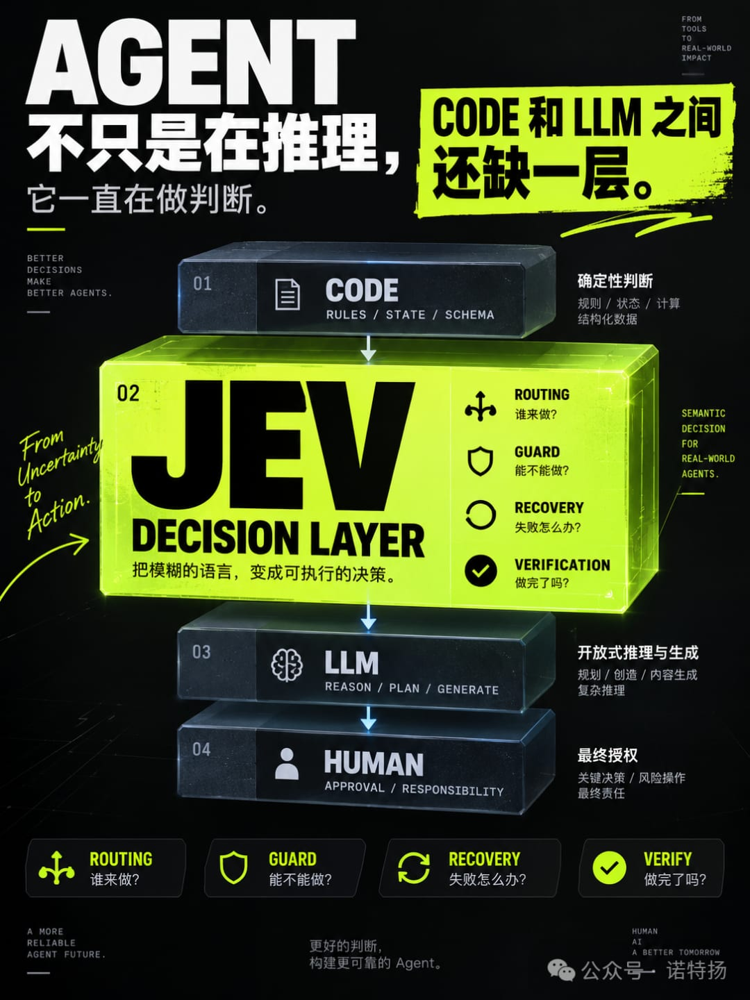

# JEV 为什么突然火了？因为 Agent 里缺的可能不是模型，而是“决策层”

Agent 不只是在推理：从 JEV 看缺失的 Decision LayerAgent 真正复杂的地方，不只是“会不会调用工具”，而是它在整个执行过程中，需要不断做判断。JEV 的出现让我重新注意到一个问题：这些判断，真的都应该交给大模型吗？过去讨论 Agent，注意力通常集中在几个词上：Tool、Skill、MCP、Sub-Agent、Memory、Workflow。这些当然重要，但如果把一次 Agent 任务完整拆开，会发现还有一层经常被忽略：判断。收到任务以后，它要判断这是什么任务；决定是否需要工具；决定调用哪个 Tool 或 Skill；执行前判断风险；失败以后判断是 retry、fallback 还是 stop；执行完以后还要判断：任务到底有没有真的完成。这些判断以前往往混在 LLM 的推理里。JEV 让我开始重新看这一层：如果 Agent 内部存在大量“语义判断”，那它们是不是应该成为一层独立的系统能力？这篇文章分三部分：Agent 到底有哪些判断；JEV 到底是什么能力；两者放在一起以后，会出现什么新的架构可能。一、Agent 到底在判断什么？先不谈 JEV。只看一个普通 Agent，从收到用户请求到最终结束，中间到底发生了什么。假设用户说：检查这个 Blender 项目，发现问题就修复，但不要删除任何原始文件。表面上看，这是一个任务。但 Agent 真正执行时，会连续遇到很多判断。1. Admission：这件事能不能进入执行？Agent 首先要判断输入本身。例如：这是普通问答、命令还是需要进入 Agent Loop 的任务？请求是否存在明显风险？是否需要读取项目文件？是否超出了当前 Agent 的能力范围？是否应该先让用户确认？这一类判断解决的是：这件事能不能做？它属于执行前的入口判断。2. Routing：应该交给谁？进入任务以后，Agent 很快会遇到第二类问题：用哪个模型？调哪个 Tool？调哪个 Skill？是否需要调用 Sub-Agent？多个候选能力里应该选哪一个？例如：用户：检查 IFC 模型里的门窗属性候选能力：- blender-general- blender-ifc- spreadsheet- web-searchAgent 要完成一次路由：→ blender-ifc这一类判断解决的是：谁来做？3. Context：现在应该让模型知道什么？Agent 的上下文不是越多越好。它还需要决定：哪些历史消息应该保留？哪些文件与当前任务相关？哪些 Skill 说明需要加载？哪些检索结果值得放进上下文？是否需要 Compact？哪些旧信息已经没有价值？这一类判断解决的是：当前决策需要哪些信息？很多 Agent 的性能问题，本质上并不是模型不够强，而是上下文管理失控。4. Execution：下一步具体怎么行动？接下来进入真正的执行。Agent 会判断：现在应该调用工具，还是直接回答？调哪个工具？参数是什么？多个动作应该并行还是串行？当前操作是否安全？是否需要用户批准？这里要注意一个区别：“调用哪个工具”和“工具参数具体是什么”并不是同一种问题。前者可能只是：read / bash / blender / web后者可能需要生成复杂参数、路径、过滤条件甚至代码。这已经开始涉及不同类型的智能。5. Recovery：失败以后怎么办？真实 Agent 很少一次成功。工具可能报错，文件可能不存在，API 可能超时，执行结果也可能与预期不同。于是 Agent 要继续判断：retry？修改参数？换一个 Tool？fallback？询问用户？停止？这类判断解决的是：出错以后往哪里走？如果没有这一层，Agent 就只是一个“会调用工具的聊天机器人”，而不是一个真正能持续完成任务的执行系统。6. Completion：到底做完了吗？这是最容易被忽略的一类判断。很多 Agent 的实际停止条件只是：模型不再调用 Tool。但“不再调用 Tool”并不等于“任务真的完成”。例如：用户要求：找到所有昨天修改的 IFC 文件→ 检查门窗属性→ 修复问题→ 输出 ExcelAgent 可能成功执行了 IFC 检查，然后就停止。从 Agent Loop 看，它“正常结束”了。但从用户任务看，它根本没有完成。所以最后还需要判断：工具执行成功了吗？结果是否符合原始要求？是否遗漏了步骤？是否需要再次验证？是否应该继续？任务是否真正完成？这一类判断解决的是：做完了吗？7. 把 Agent 的判断压缩一下如果不看具体框架，Agent 的判断大致可以归成六类：类型核心问题Admission能不能做？Routing谁来做？Context应该知道什么？Execution怎么做？Recovery出错怎么办？Completion做完了吗？这时候会出现一个很有意思的现象：Agent 并不是一个大模型从头推理到尾。它更像是在一个循环里不断经历：判断→ 行动→ 获取新状态→ 再判断→ 再行动也就是说，Agent 的运行过程里，本身就存在大量 Decision Point。问题来了：这些判断是不是都应该交给 LLM？二、JEV 到底是什么？JEV 是 TypeSafe AI 在 2026 年 9 月发布的第一个 System One Model。它和传统聊天模型最大的区别，不是“参数更小”或者“速度更快”，而是它根本没有把自由文本生成作为核心接口。传统 LLM 更像：输入→ 推理→ 一段文本JEV 更像：State→ Question→ Typed Decision + ProbabilityTypeSafe 对它的描述很直接：unstructured state in, typed probabilistic decisions out也就是：输入状态，输出结构化的概率决策。1. JEV 的三个原生判断原语JEV 最底层其实只有三类问题。Noul：是不是？它回答 Yes / No 类型问题，并返回概率。例如：这个操作是否可能删除原始文件？输出不是简单的：true而更接近：true: 0.94也就是说，程序不仅知道判断结果，还知道模型有多确定。Choice：选哪个？它从一个已经定义好的集合中选择。例如：失败以后应该：A. retryB. fallbackC. ask_userD. stopJEV 可以返回各选项的概率分布和最终选择。这个能力很适合软件系统，因为答案空间本身就是明确的。Score：程度有多高？Score 用来判断一个状态处于什么程度。例如风险可以提前定义：0 = 无风险1 = 轻微2 = 中等3 = 高风险4 = 严重风险JEV 根据当前 state 给出评分和置信信息。所以它解决的不是：“请分析一下风险。”而是：“按照这个已经定义好的风险尺度，它处在哪一级？”2. 三个原语可以组合出什么？Noul、Choice、Score 本身很简单。但组合起来以后，就能覆盖大量软件决策。Classification判断一个对象属于哪一类：billingtechnicalsalesfraudDetection判断某件事是否存在：是否存在 Prompt Injection？是否包含敏感信息？是否有欺诈迹象？是否超出用户授权范围？Scoring判断程度：风险紧急程度相关性质量复杂度Routing在几个路径里选一个：哪个模型？哪个 Tool？哪个 Skill？哪个 Workflow？哪个 Sub-Agent？Filtering / Ranking对已有候选进行过滤或排序。例如 RAG 已经找到了 50 条结果：检索→ JEV 判断相关性→ 保留高相关内容→ 再交给 LLMJEV 不是搜索引擎。它是在已有候选里做判断。Guardrail在动作发生前判断：这个命令危险吗？这个动作是否可能产生不可逆修改？是否应该要求人工确认？然后程序再根据阈值决定：低风险 → 自动执行高风险 → 询问用户Verification动作完成以后再判断：结果是否满足要求？任务是否完成？输出是否违反规则？Agent 是否遗漏关键步骤？这时 JEV 充当的是一个 verifier。GatingJEV 的概率输出还允许软件自己定义自动化边界。例如：confidence > 0.9→ 自动执行0.6 ~ 0.9→ 再交给更强模型< 0.6→ 人工确认它不是简单地替软件做决定，而是提供一个可以被程序使用的概率信号。3. JEV 不是什么？理解 JEV 最重要的地方，其实是知道它不擅长什么。它不是：聊天模型；长文写作模型；代码生成模型；开放式规划模型；搜索引擎；Tool Executor；万能知识模型。例如：“帮我设计一个完整的 Blender 自动建模方案。”这不是 JEV 的任务。但：“这个任务应该进入建模 / IFC / 材质 / 渲染哪条流程？”就是非常典型的 JEV 问题。可以把这个区别压缩成一句话：LLM 擅长创造答案，JEV 擅长在定义好的决策空间里判断。三、当 Agent 的判断遇到 JEV把前面两部分放到一起以后，真正有意思的东西才出现。Agent 内部有大量 Decision Point。JEV 又恰好擅长：是不是？选哪个？程度如何？两者的交集并不是“所有 Agent 决策”。真正高度匹配的，主要有四类。1. Routing：谁来做？Agent 中最明显的一类判断就是能力路由。例如：用户请求↓这是哪类任务？↓用哪个 Skill？↓用哪个 Tool？↓需要 Sub-Agent 吗？↓用哪个模型？过去通常有三种实现：规则if keyword contains "IFC"→ blender-ifc优点是快。缺点是语义能力弱。LLM Router把候选能力全部给大模型：请根据任务选择最合适的 Tool。语义能力强，但为了一个简单的选择调用完整 LLM，成本和延迟都偏重。JEV候选集合已经存在：blender-generalblender-ifcspreadsheetwebJEV 只需要完成一次 Choice。这正好处在：if/else 太弱LLM 又太重中间的位置。2. Guard：能不能做？Agent 越自动化，执行前判断越重要。例如：准备修改 43 个文件需要判断：是否可能破坏项目？是否违反“不能删除原文件”的要求？是否应该要求用户确认？这里可以形成一套组合：确定性危险→ Code 直接拦截语义风险→ JEV 判断高风险 / 低置信→ HumanJEV 并不是替代权限系统。它更像是在传统 Policy 与自然语言之间增加了一层语义风险判断。3. Recovery：失败以后怎么办？这是我觉得非常适合 JEV、但容易被忽略的场景。Agent 执行失败以后，下一步通常不是无限开放的。很多时候其实只有：retryfallbackask_usercontinuestop这天然就是一个 Choice 问题。例如：Blender Tool 返回：无法找到指定 collectionAgent 可以把当前状态交给 JEV：下一步：retrychange_toolask_userstopJEV 负责判断路径。真正需要生成新参数的时候，再交回 LLM。这样：JEV→ 决定往哪里走LLM→ 决定具体怎么走分工开始变得非常清晰。4. Verification：真的做完了吗？这个方向可能比 Tool Routing 更重要。现在很多 Agent 的结束条件是：模型停止 Tool Call→ Agent End但真正应该问的是：用户原始目标完成了吗？例如原任务：检查 IFC→ 修复→ 导出 Excel执行记录里只有：检查完成修复完成这时 JEV 可以判断：task_complete = falseAgent 就不能结束。这会形成：LLM：“完成了。”↓JEV Verification“还没有导出 Excel。”↓继续 Agent Loop它相当于给 Agent 增加了一个独立的结束判断。四、但不是所有决策都应该交给 JEV把 JEV 加入 Agent，并不意味着再增加一个“万能模型”。反而应该更明确地分工。最终我觉得 Agent 内部至少应该存在四种判断机制。1. Code：确定性判断能计算出来的问题，直接用代码。例如：文件存在吗？HTTP Status 是 200 吗？token 超限了吗？Tool 注册了吗？exit code 是 0 吗？这些问题不需要任何 AI。2. JEV：语义闭集判断规则无法可靠解决，但答案空间已经定义。例如：这是哪类任务？应该调用哪个 Skill？风险属于哪个等级？失败以后 retry 还是 fallback？任务完成了吗？这就是 JEV 最自然的位置。3. LLM：开放式推理与生成如果答案本身还不存在，就需要生成。例如：任务应该怎么拆？下一步具体方案是什么？Tool 参数应该怎么构造？这段代码应该怎么修改？最终报告怎么写？这还是 LLM 的领域。4. Human：最终授权还有一类决定不应该完全自动化。例如：是否删除文件？是否覆盖项目？是否发送邮件？是否花钱？是否执行高风险操作？JEV 可以判断风险。LLM 可以解释后果。但真正的授权仍然属于用户。五、于是一个新的 Agent Decision Stack 出来了把四者放在一起：一个决策出现│▼能否确定性计算？/           \YES            NO│              │▼              ▼CODE      答案是否预定义？/           \YES            NO│              │▼              ▼JEV            LLM│▼是否涉及最终授权？/          \YES           NO│             │▼             ▼HUMAN          执行可以再进一步压缩：Code负责确定性判断JEV负责语义闭集判断LLM负责开放式推理与生成Human负责最终授权这可能才是 JEV 对 Agent 最有意思的地方。它不是给 Agent 再增加一个“更小的模型”。而是在 Code 和 LLM 之间，补上了一层以前经常被忽略的东西：Semantic Decision Layer六、一个完整例子还是最开始的任务：检查这个 Blender 项目，发现问题就修复，但不要删除任何原始文件。一次 Agent 运行可能变成：① 项目文件存在吗？→ Code② 这是普通 Blender 任务还是 IFC 任务？→ JEV③ 应该调用哪个 Skill？→ JEV④ 检查流程应该怎么设计？→ LLM⑤ Tool 参数怎么生成？→ LLM⑥ 当前修改是否违反“不删除原始文件”？→ Code + JEV⑦ 是否属于高风险操作？→ JEV⑧ 是否需要用户批准？→ JEV 判断是否触发 Human⑨ Tool exit code 是否正常？→ Code⑩ 输出在语义上是否说明修改成功？→ JEV⑪ 如果失败，retry / fallback / ask / stop？→ JEV⑫ Retry 时参数怎么调整？→ LLM⑬ 是否已经满足原始任务？→ JEV⑭ 最终报告怎么写？→ LLM这时候 Agent 已经不是：用户↓大模型↓Tool↓大模型↓Tool↓结束而更像：Code↕JEV↕LLM↕Tools↕Human不同类型的判断被放回了更合适的位置。七、JEV 真正改变的可能不是模型，而是架构过去很多 Agent 的默认设计其实是：规则能解决→ Code规则解决不了→ LLM这导致大量非常小的语义判断也被送进大模型。例如：选哪个 Tool？是不是高风险？是否应该 retry？任务完成了吗？这些问题当然可以让 LLM 回答。但它们并不一定需要开放式生成。JEV 带来的真正启发可能是：Code↓Semantic Decision↓LLM在确定性代码和开放式推理之间，原来还存在一大片“语义闭集判断”。这类问题的共同特征是：普通规则不够；需要理解语义；但答案空间已经存在；软件需要直接使用结果；最好还能知道模型有多确定。这正是 Decision Model 的位置。结语JEV 现在还很新。它是否能在各种真实 Agent 场景中稳定工作，还需要更多实际测试。但它至少让我重新看到了一件事：Agent 的判断，不应该被看成一个整体。有些判断应该由代码完成。有些需要语义判断，但不需要开放式生成。有些必须依赖 LLM 的规划和创造能力。还有一些最终应该留给人。所以讨论 JEV 最有意思的问题，并不是：JEV 能不能替代 LLM？而是：Agent 内部原本全部压给 LLM 的判断，有多少其实应该被拆出来？如果这种拆分成立，那么未来 Agent 的核心架构可能不只是：Model + Tool + Memory + Skill还会多出一层越来越明确的：Decision Layer而 JEV，只是目前让这一层突然变得非常显眼的第一个例子。参考资料截至 2026-09-18：TypeSafe AI — Introducing System One Models and JevTypeSafe AI — Workflow EvalsTypeSafe AI — Agent Trace ObservabilityVercel AI Gateway — JevVercel — TypeSafe AI's Jev now available on AI Gateway

# Agent 不只是在推理：从 JEV 看缺失的 Decision Layer

> Agent 真正复杂的地方，不只是“会不会调用工具”，而是它在整个执行过程中，需要不断做判断。JEV 的出现让我重新注意到一个问题：这些判断，真的都应该交给大模型吗？

Agent 真正复杂的地方，不只是“会不会调用工具”，而是它在整个执行过程中，需要不断做判断。JEV 的出现让我重新注意到一个问题：这些判断，真的都应该交给大模型吗？

过去讨论 Agent，注意力通常集中在几个词上：Tool、Skill、MCP、Sub-Agent、Memory、Workflow。

这些当然重要，但如果把一次 Agent 任务完整拆开，会发现还有一层经常被忽略：

判断。

收到任务以后，它要判断这是什么任务；决定是否需要工具；决定调用哪个 Tool 或 Skill；执行前判断风险；失败以后判断是 retry、fallback 还是 stop；执行完以后还要判断：任务到底有没有真的完成。

这些判断以前往往混在 LLM 的推理里。

JEV 让我开始重新看这一层：如果 Agent 内部存在大量“语义判断”，那它们是不是应该成为一层独立的系统能力？

这篇文章分三部分：

Agent 到底有哪些判断；

JEV 到底是什么能力；

两者放在一起以后，会出现什么新的架构可能。

# 一、Agent 到底在判断什么？

先不谈 JEV。

只看一个普通 Agent，从收到用户请求到最终结束，中间到底发生了什么。

假设用户说：

> 检查这个 Blender 项目，发现问题就修复，但不要删除任何原始文件。

检查这个 Blender 项目，发现问题就修复，但不要删除任何原始文件。

表面上看，这是一个任务。

但 Agent 真正执行时，会连续遇到很多判断。

## 1. Admission：这件事能不能进入执行？

Agent 首先要判断输入本身。

例如：

这是普通问答、命令还是需要进入 Agent Loop 的任务？

请求是否存在明显风险？

是否需要读取项目文件？

是否超出了当前 Agent 的能力范围？

是否应该先让用户确认？

这一类判断解决的是：

> 这件事能不能做？

这件事能不能做？

它属于执行前的入口判断。

## 2. Routing：应该交给谁？

进入任务以后，Agent 很快会遇到第二类问题：

用哪个模型？

调哪个 Tool？

调哪个 Skill？

是否需要调用 Sub-Agent？

多个候选能力里应该选哪一个？

例如：

Agent 要完成一次路由：

这一类判断解决的是：

> 谁来做？

谁来做？

## 3. Context：现在应该让模型知道什么？

Agent 的上下文不是越多越好。

它还需要决定：

哪些历史消息应该保留？

哪些文件与当前任务相关？

哪些 Skill 说明需要加载？

哪些检索结果值得放进上下文？

是否需要 Compact？

哪些旧信息已经没有价值？

这一类判断解决的是：

> 当前决策需要哪些信息？

当前决策需要哪些信息？

很多 Agent 的性能问题，本质上并不是模型不够强，而是上下文管理失控。

## 4. Execution：下一步具体怎么行动？

接下来进入真正的执行。

Agent 会判断：

现在应该调用工具，还是直接回答？

调哪个工具？

参数是什么？

多个动作应该并行还是串行？

当前操作是否安全？

是否需要用户批准？

这里要注意一个区别：

“调用哪个工具”和“工具参数具体是什么”并不是同一种问题。

前者可能只是：

后者可能需要生成复杂参数、路径、过滤条件甚至代码。

这已经开始涉及不同类型的智能。

## 5. Recovery：失败以后怎么办？

真实 Agent 很少一次成功。

工具可能报错，文件可能不存在，API 可能超时，执行结果也可能与预期不同。

于是 Agent 要继续判断：

这类判断解决的是：

> 出错以后往哪里走？

出错以后往哪里走？

如果没有这一层，Agent 就只是一个“会调用工具的聊天机器人”，而不是一个真正能持续完成任务的执行系统。

## 6. Completion：到底做完了吗？

这是最容易被忽略的一类判断。

很多 Agent 的实际停止条件只是：

> 模型不再调用 Tool。

模型不再调用 Tool。

但“不再调用 Tool”并不等于“任务真的完成”。

例如：

用户要求：

Agent 可能成功执行了 IFC 检查，然后就停止。

从 Agent Loop 看，它“正常结束”了。

但从用户任务看，它根本没有完成。

所以最后还需要判断：

工具执行成功了吗？

结果是否符合原始要求？

是否遗漏了步骤？

是否需要再次验证？

是否应该继续？

任务是否真正完成？

这一类判断解决的是：

> 做完了吗？

做完了吗？

## 7. 把 Agent 的判断压缩一下

如果不看具体框架，Agent 的判断大致可以归成六类：

类型

核心问题

Admission

能不能做？

Routing

谁来做？

Context

应该知道什么？

Execution

怎么做？

Recovery

出错怎么办？

Completion

做完了吗？

这时候会出现一个很有意思的现象：

Agent 并不是一个大模型从头推理到尾。

它更像是在一个循环里不断经历：

也就是说，Agent 的运行过程里，本身就存在大量 Decision Point。

问题来了：

这些判断是不是都应该交给 LLM？

# 二、JEV 到底是什么？

JEV 是 TypeSafe AI 在 2026 年 9 月发布的第一个 System One Model。

它和传统聊天模型最大的区别，不是“参数更小”或者“速度更快”，而是它根本没有把自由文本生成作为核心接口。

传统 LLM 更像：

JEV 更像：

TypeSafe 对它的描述很直接：

> unstructured state in, typed probabilistic decisions out

unstructured state in, typed probabilistic decisions out

也就是：

输入状态，输出结构化的概率决策。

## 1. JEV 的三个原生判断原语

JEV 最底层其实只有三类问题。

### Noul：是不是？

它回答 Yes / No 类型问题，并返回概率。

例如：

输出不是简单的：

而更接近：

也就是说，程序不仅知道判断结果，还知道模型有多确定。

### Choice：选哪个？

它从一个已经定义好的集合中选择。

例如：

JEV 可以返回各选项的概率分布和最终选择。

这个能力很适合软件系统，因为答案空间本身就是明确的。

### Score：程度有多高？

Score 用来判断一个状态处于什么程度。

例如风险可以提前定义：

JEV 根据当前 state 给出评分和置信信息。

所以它解决的不是：

> “请分析一下风险。”

“请分析一下风险。”

而是：

> “按照这个已经定义好的风险尺度，它处在哪一级？”

“按照这个已经定义好的风险尺度，它处在哪一级？”

## 2. 三个原语可以组合出什么？

Noul、Choice、Score 本身很简单。

但组合起来以后，就能覆盖大量软件决策。

### Classification

判断一个对象属于哪一类：

### Detection

判断某件事是否存在：

### Scoring

判断程度：

### Routing

在几个路径里选一个：

### Filtering / Ranking

对已有候选进行过滤或排序。

例如 RAG 已经找到了 50 条结果：

JEV 不是搜索引擎。

它是在已有候选里做判断。

### Guardrail

在动作发生前判断：

然后程序再根据阈值决定：

### Verification

动作完成以后再判断：

这时 JEV 充当的是一个 verifier。

### Gating

JEV 的概率输出还允许软件自己定义自动化边界。

例如：

它不是简单地替软件做决定，而是提供一个可以被程序使用的概率信号。

## 3. JEV 不是什么？

理解 JEV 最重要的地方，其实是知道它不擅长什么。

它不是：

聊天模型；

长文写作模型；

代码生成模型；

开放式规划模型；

搜索引擎；

Tool Executor；

万能知识模型。

例如：

这不是 JEV 的任务。

但：

就是非常典型的 JEV 问题。

可以把这个区别压缩成一句话：

> LLM 擅长创造答案，JEV 擅长在定义好的决策空间里判断。

LLM 擅长创造答案，JEV 擅长在定义好的决策空间里判断。

# 三、当 Agent 的判断遇到 JEV

把前面两部分放到一起以后，真正有意思的东西才出现。

Agent 内部有大量 Decision Point。

JEV 又恰好擅长：

两者的交集并不是“所有 Agent 决策”。

真正高度匹配的，主要有四类。

## 1. Routing：谁来做？

Agent 中最明显的一类判断就是能力路由。

例如：

过去通常有三种实现：

### 规则

优点是快。

缺点是语义能力弱。

### LLM Router

把候选能力全部给大模型：

语义能力强，但为了一个简单的选择调用完整 LLM，成本和延迟都偏重。

### JEV

候选集合已经存在：

JEV 只需要完成一次 Choice。

这正好处在：

中间的位置。

## 2. Guard：能不能做？

Agent 越自动化，执行前判断越重要。

例如：

需要判断：

这里可以形成一套组合：

JEV 并不是替代权限系统。

它更像是在传统 Policy 与自然语言之间增加了一层语义风险判断。

## 3. Recovery：失败以后怎么办？

这是我觉得非常适合 JEV、但容易被忽略的场景。

Agent 执行失败以后，下一步通常不是无限开放的。

很多时候其实只有：

这天然就是一个 Choice 问题。

例如：

Agent 可以把当前状态交给 JEV：

JEV 负责判断路径。

真正需要生成新参数的时候，再交回 LLM。

这样：

分工开始变得非常清晰。

## 4. Verification：真的做完了吗？

这个方向可能比 Tool Routing 更重要。

现在很多 Agent 的结束条件是：

但真正应该问的是：

例如原任务：

执行记录里只有：

这时 JEV 可以判断：

Agent 就不能结束。

这会形成：

它相当于给 Agent 增加了一个独立的结束判断。

# 四、但不是所有决策都应该交给 JEV

把 JEV 加入 Agent，并不意味着再增加一个“万能模型”。

反而应该更明确地分工。

最终我觉得 Agent 内部至少应该存在四种判断机制。

## 1. Code：确定性判断

能计算出来的问题，直接用代码。

例如：

这些问题不需要任何 AI。

## 2. JEV：语义闭集判断

规则无法可靠解决，但答案空间已经定义。

例如：

这就是 JEV 最自然的位置。

## 3. LLM：开放式推理与生成

如果答案本身还不存在，就需要生成。

例如：

这还是 LLM 的领域。

## 4. Human：最终授权

还有一类决定不应该完全自动化。

例如：

JEV 可以判断风险。

LLM 可以解释后果。

但真正的授权仍然属于用户。

# 五、于是一个新的 Agent Decision Stack 出来了

把四者放在一起：

可以再进一步压缩：

这可能才是 JEV 对 Agent 最有意思的地方。

它不是给 Agent 再增加一个“更小的模型”。

而是在 Code 和 LLM 之间，补上了一层以前经常被忽略的东西：

# Semantic Decision Layer

# 六、一个完整例子

还是最开始的任务：

> 检查这个 Blender 项目，发现问题就修复，但不要删除任何原始文件。

检查这个 Blender 项目，发现问题就修复，但不要删除任何原始文件。

一次 Agent 运行可能变成：

这时候 Agent 已经不是：

而更像：

不同类型的判断被放回了更合适的位置。

# 七、JEV 真正改变的可能不是模型，而是架构

过去很多 Agent 的默认设计其实是：

这导致大量非常小的语义判断也被送进大模型。

例如：

这些问题当然可以让 LLM 回答。

但它们并不一定需要开放式生成。

JEV 带来的真正启发可能是：

在确定性代码和开放式推理之间，原来还存在一大片“语义闭集判断”。

这类问题的共同特征是：

普通规则不够；

需要理解语义；

但答案空间已经存在；

软件需要直接使用结果；

最好还能知道模型有多确定。

这正是 Decision Model 的位置。

# 结语

JEV 现在还很新。

它是否能在各种真实 Agent 场景中稳定工作，还需要更多实际测试。

但它至少让我重新看到了一件事：

> Agent 的判断，不应该被看成一个整体。

Agent 的判断，不应该被看成一个整体。

有些判断应该由代码完成。

有些需要语义判断，但不需要开放式生成。

有些必须依赖 LLM 的规划和创造能力。

还有一些最终应该留给人。

所以讨论 JEV 最有意思的问题，并不是：

> JEV 能不能替代 LLM？

JEV 能不能替代 LLM？

而是：

> Agent 内部原本全部压给 LLM 的判断，有多少其实应该被拆出来？

Agent 内部原本全部压给 LLM 的判断，有多少其实应该被拆出来？

如果这种拆分成立，那么未来 Agent 的核心架构可能不只是：

还会多出一层越来越明确的：

而 JEV，只是目前让这一层突然变得非常显眼的第一个例子。

## 参考资料

截至 2026-09-18：

TypeSafe AI — Introducing System One Models and Jev

TypeSafe AI — Workflow Evals

TypeSafe AI — Agent Trace Observability

Vercel AI Gateway — Jev

Vercel — TypeSafe AI's Jev now available on AI Gateway
