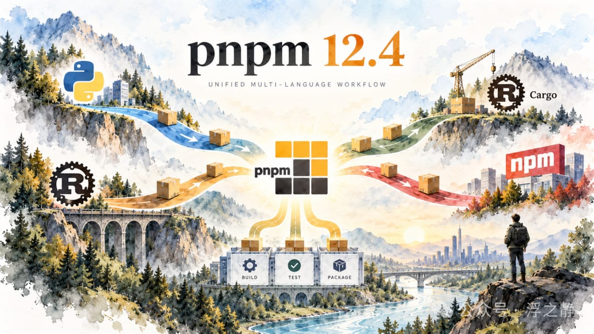

# pnpm 12.4：统一多语言开发工作流

之前也写过不少开发系列，pnpm 12.4 补充进去，感觉 AI 开发工作流又完善了一点。参考阅读：技术栈推荐：围绕 AI 反馈闭环做选型、Agent 开发指南：技术太多，该怎么学？、浅谈 AI 编程、第一个 Agent 从 Pi 开始、TS 7：AI 生成式代码的拐点

之前也写过不少开发系列，pnpm 12.4 补充进去，感觉 AI 开发工作流又完善了一点。参考阅读：技术栈推荐：围绕 AI 反馈闭环做选型、Agent 开发指南：技术太多，该怎么学？、浅谈 AI 编程、第一个 Agent 从 Pi 开始、TS 7：AI 生成式代码的拐点

一个仓库同时包含前端、Python 服务和 Rust 模块时，安装依赖只是第一步。依赖准备好之后，还要安排构建顺序、运行测试、处理缓存，再把这些步骤搬进 CI。各个工具可以处理自己的语言生态，团队仍要维护它们之间的执行关系。

pnpm 12.4[1]开始将这些环节放进同一套工作区配置：一条pnpm install可以安装 npm、Python 和 Cargo 依赖，新增的pipeline则继续处理安装之后的构建与验证。配套的可选服务pnpr[2]，将共享缓存和制品托管延伸到团队环境。

沿着这条变化看，pnpm 正在尝试减少多语言项目中需要额外维护的连接代码：哪些目录需要初始化、任务之间如何衔接、已有结果能否复用，以及本地和 CI 如何执行同一套流程。

## 统一依赖安装

统一入口最直接的作用，是让开发者不必分别进入几个目录，重复执行各套依赖安装步骤。在工作区启用python.enabled和cargo.enabled后，pnpm 可以在一次安装中处理三个生态的依赖，共用网络请求、鉴权、制品校验和内容寻址存储。各语言的依赖规则仍然独立。

Python 依赖[3]继续写在pyproject.toml中，锁定结果使用标准的pylock.toml。pnpm 为项目管理.venv，并在执行pnpm run、pnpm exec时，将对应环境的可执行文件目录放到PATH前面。脚本可以直接调用pytest、ruff等工具，无需额外激活环境。已有的、由其他工具创建的.venv不会被覆盖。

Rust 项目[4]也保留Cargo.toml和Cargo.lock。pnpm 下载并校验 crate，将源码放进共享存储，再通过目录链接和.cargo/config.toml中的源替换配置，交给 Cargo 使用。实际编译仍由 Cargo 完成，Rust 依赖也不会被写进pnpm-lock.yaml。

此前的Rust 重写[5]降低了引入这套入口的额外成本：pnpm 12 已经是原生可执行程序，可以独立于 Node.js 安装和运行。纯 Python、Rust 项目无需仅为运行 pnpm 再准备 JavaScript 运行环境；Python 解释器和 Rust 工具链仍需按项目要求准备。

这一层解决的是“怎样把依赖准备好”。要让仓库真正跑起来，还需要把安装之后的任务组织起来。

## 编排构建与测试

假设前端构建依赖一个内部组件库，测试又依赖构建结果，那么简单地把几条命令并排写进脚本还不够。执行顺序需要明确，互不相关的任务应当能够并行，某个任务失败后，也要区分哪些检查可以继续。

pipeline将这些关系放进工作区配置。下面的示例展示安装开关和任务关系；目录、输出路径，以及各项目的实际脚本，需要按仓库调整。packages用于声明工作区范围，省略它时只包含根项目。

这里，^build表示等待选中范围内的工作区依赖完成构建，test则等待当前项目的build。default声明的是一组任务，执行顺序由dependsOn决定。配置中的任务名也不会自动生成命令：项目仍需提供对应脚本，缺失脚本的节点会被跳过。

执行pnpm pipeline时，pnpm 先按锁文件安装依赖，再运行受基准版本以来的改动影响的项目及其依赖方。任务失败后，不依赖该失败任务的检查仍可继续，最终集中报告结果。需要扩大到全部工作区项目时，可以使用--full；根项目是否参与，由includeWorkspaceRoot控制。

这样，仓库维护者可以将“怎样完成一次有效验证”直接写进配置。本地开发者和 CI 复用这套定义，减少分别维护构建顺序和检查命令的工作。

## 减少重复构建

统一执行入口解决了调度问题，缓存进一步决定哪些工作可以省略。

上面的outputs同时声明任务输出和缓存资格。outputs: []表示任务不产生需要恢复的文件，但仍允许缓存执行结果；它并不表示关闭缓存。命中缓存后，pnpm 可以恢复输出并重放日志。需要每次重新执行的任务，可以设置cache: false。测试若生成覆盖率报告等文件，也应相应调整输出声明。

Rust 更能说明为什么需要区分不同层次的缓存。Cargo 本来就有全局下载和源码缓存；pnpm 将 crate 纳入共享存储，主要减少这一层的重复下载和存放。各项目的构建目录仍会保存编译后的依赖、增量数据和构建脚本输出。默认情况下，这些内容位于target中，共享源码不会自动合并它们。

对于重复创建工作目录的场景，pipeline另外提供了 Cargo 构建状态复用。为对应任务配置cargoTargetDir: target后，可以在同一仓库的不同 worktree 之间恢复不可变的构建状态快照，再执行实际任务。这个目录必须相对项目定位，并被 Git 忽略。它与普通任务缓存有所区别：恢复状态之后，任务仍然会运行。

因此，这项能力更适合被理解为“减少重新建立构建状态的成本”。它有机会缩短切换分支、重建工作目录后的等待时间，但快照和恢复后的产物仍然占用空间，不能据此认为各项目的target都会消失。

## 明确 Agent 的执行依据

在多个 Agent 分别创建 worktree、尝试不同实现的工作流中，环境准备和验证会被反复执行。统一安装入口可以减少每个任务重新判断环境的次数，共享依赖和构建状态则有机会降低重复执行成本。

更重要的是，仓库可以提前给出明确的任务关系。Agent 无需每次从 README、零散脚本和 CI 文件中重新拼出执行顺序，而可以先读取流水线的任务图：

这条命令输出任务及其依赖关系，不安装依赖、不运行工作区钩子，也不执行实际任务。它为自动化工具提供了可读取的执行计划，但任务图只反映已经声明的关系，不能证明仓库已经包含全部必要检查。

缓存也让验证配置承担了更多责任。pnpm 会将脚本内容、锁文件、运行时和上游任务的缓存键纳入判定；默认还包含项目内被 Git 跟踪的文件。维护者主动收窄inputs，或者任务依赖了未声明的环境变量、外部状态，都可能使缓存无法准确反映实际变化。

因此，Agent 修改构建配置时，需要同时检查任务依赖、输入范围和环境变量声明。对依赖数据库、网络服务或其他难以稳定描述的外部状态的检查，关闭缓存往往更容易建立可信的验证依据。

这一层对 Agent 的意义，可以概括为：仓库把执行规则写得越明确，自动化工具需要临场推断的部分就越少。安装入口、任务图和缓存各自承担一部分工作，验证是否充分仍取决于维护者写下了什么。

## 团队共享与发布

本地缓存覆盖不了所有场景。当同一个项目需要在多台开发机和 CI 中构建时，复用范围还需要跨过机器边界。pnpr 在这里提供了可选的服务端能力；它与 pnpm 客户端是独立产品，双方都可以单独使用。

对于 Rust 编译，pnpr 可以作为 sccache 的远程后端，让开发机和 CI 共享编译缓存。当前文档要求使用支持 WebDAV 的 sccache 0.17.0 或更新版本，并关闭 Rust 增量编译。命中情况还取决于工具链、目标平台、features、编译参数和源码路径；例如 sccache 0.17.0 的 Rust 缓存键包含编译目录绝对路径，开发机与 CI 需要对齐相关路径。接入同一台服务器，并不意味着构建结果就能直接通用。

构建完成之后，pnpr 还可以托管 npm、Cargo、Python 包和容器镜像。对需要同步交付多语言 SDK 的团队，它支持在自身托管范围内，将相关软件包作为同一批次提交。批次在写入前统一校验，通过检查后以带日志的事务提交，并能在服务崩溃后继续完成。

这有助于降低逐个发布造成版本不一致的风险，但保证仍有边界：事务应用期间，读取方可能看到部分结果；检查与提交之间发生并发写入冲突，也可能留下部分发布。它不能被理解为对外部公共仓库的统一发布事务，也不保证所有软件包在同一瞬间对读取方可见。

发布权限可以进一步收紧。pnpr 支持通过 OIDC 授权指定的 GitHub Actions 工作流，向其托管的指定 npm 仓库和软件包发布，无需保存长期仓库令牌。不过，这类工作负载凭据目前不支持批量发布，不能直接用于前述跨生态发布流程。

到这里，pnpm 与 pnpr 覆盖的范围逐渐清晰：客户端组织仓库内的安装和执行，服务端提供跨机器的共享与托管。团队可以按需要采用其中一层，无需一次引入整套系统。

## 适用场景与边界

对已经使用 uv 的纯 Python 项目，新增一套入口未必带来明显收益。uv 本身就有全局缓存和文件复用，还提供 Python 版本管理、临时工具运行和脚本依赖管理。pnpm 更值得评估的场景，是 Python 服务需要与前端、Rust 模块共同安装和验证的混合仓库。是否更快、更省空间，仍需要用实际项目比较。

成熟度也需要单独考虑。多语言支持和pipeline目前属于实验功能，配置和行为仍可能调整。pnpm 的 Cargo 集成目前每个工作区只解析一个 registry index，不接受依赖单独指定其他 registry；包含[patch]或[replace]的工作区，需要先由 Cargo 生成并提交锁文件，再交给 pnpm 安装。这些是当前集成的限制，不能归为 Cargo 自身的限制。

pnpr 同样仍处于实验性的 alpha 阶段。许可证也与客户端不同：pnpm 保持 MIT，pnpr 采用带竞争性用途限制的 PolyForm Shield，属于源码可用软件，官方不将其称为开源软件。采用服务端之前，需要将许可证、缓存写入权限、存储和服务可用性纳入评估。

因此，更有针对性的采用方式，是先找出仓库中反复付出的成本：环境初始化、跨项目任务衔接、重复构建，还是多语言制品发布，再引入对应能力，验证它是否减少了现有维护工作。

pnpm 12.4 的变化可以理解为：开始以整个仓库为单位组织开发流程。各语言保留自己的依赖规则，安装、构建、验证和发布之间的关系则逐步进入统一配置。它最终能带来多大价值，要看这些配置能否真正取代重复脚本，让开发者、Agent 和 CI 更稳定地完成同一套工作。

### References

[1]pnpm 12.4:https://pnpm.io/blog/releases/12.4[2]pnpr:https://pnpm.io/pnpr[3]Python 依赖:https://pnpm.io/python[4]Rust 项目:https://pnpm.io/cargo[5]Rust 重写:https://pnpm.io/blog/releases/12.0

pnpm 12.4:https://pnpm.io/blog/releases/12.4

pnpr:https://pnpm.io/pnpr

Python 依赖:https://pnpm.io/python

Rust 项目:https://pnpm.io/cargo

Rust 重写:https://pnpm.io/blog/releases/12.0
