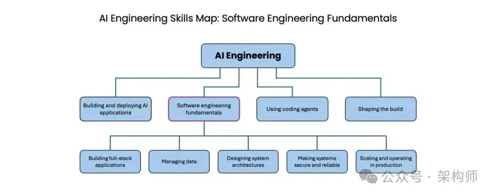
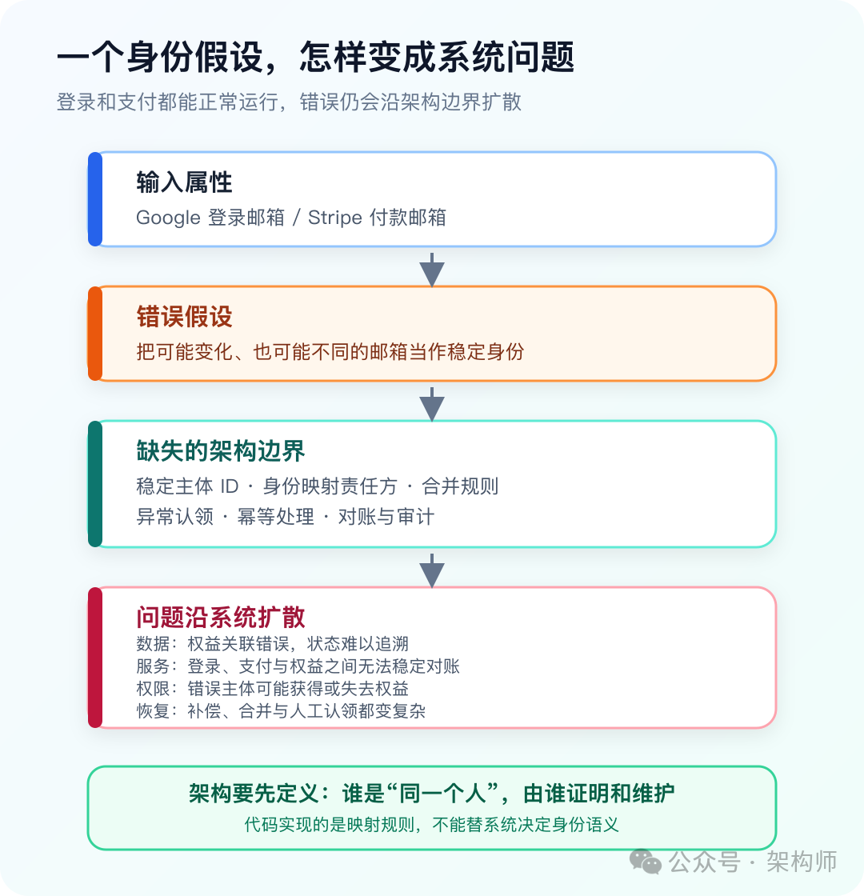
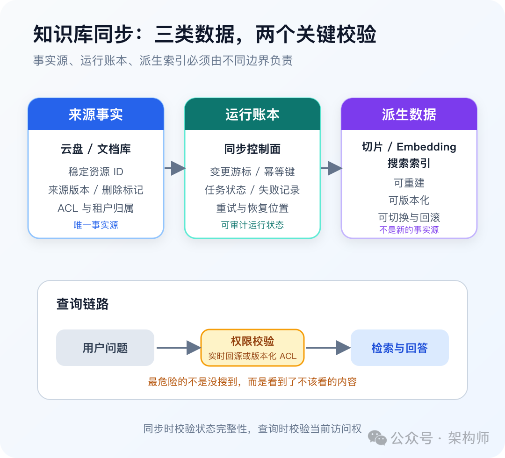
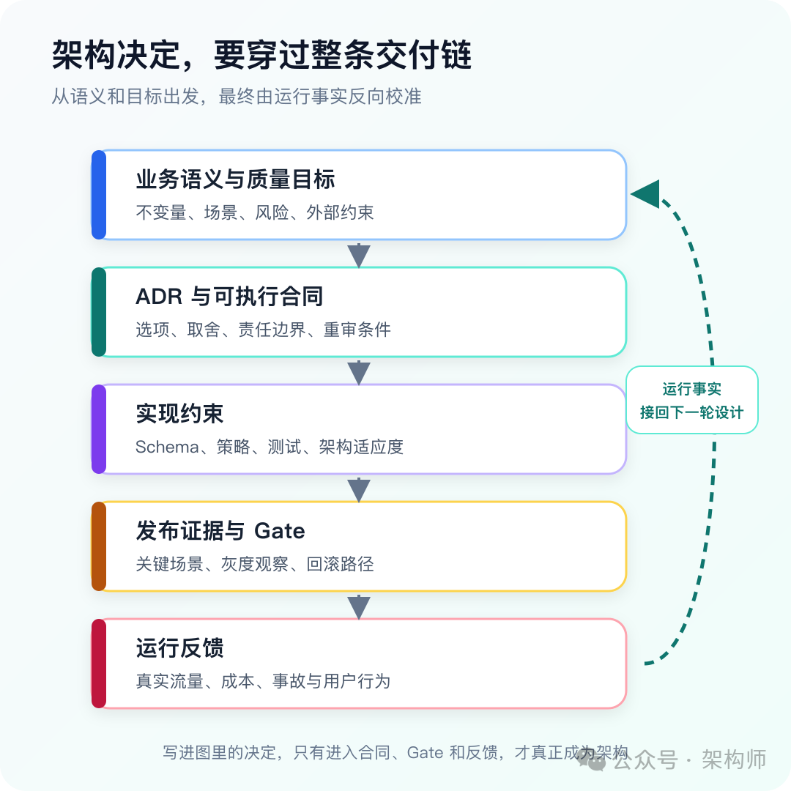

# 代码越来越快，架构工作变在哪里？从吴恩达 AI 工程技能图谱说起

架构师（JiaGouX）我们都是架构师！架构未来，你来不来？前段时间，Andrej Karpathy 分享过一个很典型的 AI 编程失误。他在做 MenuGen 时，让 Agent 接入 Stripe 购买记录和 Google 登录。Agent 很快把功能写了出来，并用邮箱去关联购买者和登录用户。多数时候，这套逻辑看起来都能工作；一旦用户付款邮箱和 Google 账号邮箱不同，权益就对不上了。表面看，这是一个字段选错的问题。再往下看，它其实是身份模型没有设计清楚：邮箱只是可能变化、也可能不一致的属性，不能天然承担稳定身份的职责。更早要确定的是，系统用什么稳定标识连接登录主体、支付主体和业务权益，映射关系由谁维护，异常状态怎么处理。Agent 可以很快写出一套能跑的关联逻辑，却不会自动替我们定义业务世界里的“同一个人”究竟是什么意思。这也是我最近重读吴恩达 AI Engineering Skills Map 时，感受最深的一点。代码生成越来越快，架构工作没有变轻。实现吞吐上去以后，身份、状态、边界、失败语义这些决定，反而更密集地涌进系统。4 月聊 AI-First 时，我们还在关心需求、测试、发布、灰度和回滚，能不能变成 Agent 也能读、能跑、能验证的系统。现在再看吴恩达这张图，背后的理由更清楚了：Agent 最先大幅压缩的是实现时间，软件工程仍要处理实现前后的整套取舍。吴恩达为什么又讲回了软件工程今年 8 月，吴恩达连续更新了这张 AI 工程技能图谱。8 月 14 日，他先给出四项一级能力：构建和部署 AI 应用、软件工程基础、使用 Coding Agent，以及决定该构建什么。8 月 21 日，他展开了 AI 应用的构建与部署；8 月 28 日，又专门解释软件工程基础。图 1：吴恩达 AI 工程技能图谱中的“软件工程基础”。图源：Andrew Ng软件工程这部分分为五个方向：全栈开发、数据、系统架构、安全与可靠性，以及规模化和生产运行。只看名词，会觉得这是传统软件工程知识的重新整理。但原文想强调的是另一层意思：即便 Agent 能写出全部代码，人仍然要理解这些基础，才能引导技术取舍，也才能发现取舍做坏了以后留下的延迟、可用性、一致性、可靠性、维护性、复杂度和成本问题。把这五个方向放进同一套系统里看，会更接近日常的架构工作。它们不是五门互不相干的课，而是同一个系统问题经过的不同边界：全栈开发决定能力以什么运行形态交付，前端、后端、API 和部署环境如何衔接；数据决定系统承认哪些事实，状态放在哪里，如何保持一致、可追溯和可治理；系统架构决定边界怎么切，依赖往哪里流，变化和故障如何被隔离；安全与可靠性决定哪些事情绝不能发生，发生异常时系统如何降级和恢复；规模化与生产运行用真实流量、成本和故障，持续检验前面的假设。如果只停在分类上，这张技能图谱对架构工作的帮助仍然有限。回到开头的身份案例，五类能力就连起来了：一个不稳定字段被当成身份之后，问题会沿数据模型、服务边界、权限校验和恢复流程一路扩散。图 2：邮箱被误作稳定身份后，问题如何沿数据、边界、权限和恢复链路放大这张图和架构的关系，不在于画了多少方框，而在于它把错误怎样跨过系统边界表现出来：Google 登录和 Stripe 支付各自都可能正常，数据库也未必损坏；真正缺少的是一份能够稳定连接登录主体、支付主体和业务权益的身份映射。映射由谁维护、失败后谁对账、账号合并时如何处理，都是实现之前就要说清的架构决定。“决策链”是我从架构视角做的一层归纳，吴恩达原图没有使用这个名字。一个过早拆分的服务，也会产生类似效果：原本单库里的状态一致性，可能转化成跨服务的幂等、补偿和对账问题。架构基本功，先看取舍再看技术很多团队谈架构，容易从“单体还是微服务”“关系库还是向量库”“同步还是异步”开始。这些当然重要，但它们已经是答案的一部分。更靠前的工作，是把业务语义和质量目标说清楚。仍以身份为例。如果系统要求“付款完成后，已登录用户在 30 秒内获得权益”，架构上至少要知道：付款主体如何绑定业务账号，绑定失败是否允许人工认领，重复回调如何去重，权益发放失败能否重放，账号合并时历史权益归谁。这里同时牵涉身份、事务、幂等、一致性和审计，远不止写一个回调接口。质量目标也需要进入具体场景。高可用不是一句口号，它要落到谁在什么条件下发起什么请求，系统允许怎样的响应，多久恢复，能丢多少数据。低延迟同样要说明是平均值、P95 还是 P99，是搜索链路、写入链路还是权限撤销链路。约束一旦具体，很多技术争论会自然收敛。反过来，如果语义和质量目标含糊，再完整的技术栈也只是把不确定性藏到了代码里。Agent 写得越快，这些被藏起来的决定就越多。这也解释了为什么 梳理《Agent 时代，架构师应该学什么》时，我们没有把重点放在框架清单上，而是放在状态、权限、Eval 和 Harness 上。它们看起来离“画架构图”有点远，实际上都在做同一件事：把人的判断变成系统可以执行、检查和追溯的边界。把它放进一条知识库同步链路先假设一条常见的企业知识库同步链路。这不是某次真实事故，只是把几类架构取舍放进同一个场景里。系统需要从云盘和内部文档库同步内容，完成解析、切分、向量化和索引，再提供带权限控制的问答。业务不变量要先进入数据模型这类系统最危险的错误，通常不是“没有搜到”，而是“看到了不该看的内容”。在这类系统里，租户隔离、资源身份、权限撤销和源文档删除，都属于业务不变量。文档键里需要有租户和稳定资源标识，唯一性最好由数据库约束兜底；同步合同里要带来源版本、删除标记和变更游标；重试要依赖幂等键，而不是寄希望于每次执行都刚好成功。如果只让 Agent 根据一段需求生成同步代码，它很容易先做出“新增和更新”，却漏掉删除、移动、重命名、权限撤销和重复事件。代码并不一定写错了，缺的是完整的状态语义。事实、运行状态和派生数据要分开原始文档仍由上游系统负责，不能因为进了向量库，向量库就变成新的事实源。同步游标、任务状态和失败记录属于运行账本；切片、Embedding 和搜索索引则是可以重建的派生数据。这几个层次混在一起，恢复会很困难。索引坏了，不知道能否重建；同步失败了，不知道从哪里续跑；上游已经撤权，本地仍可能保留旧权限。下面这张图回答两个数据架构问题：每类数据由谁负责，查询时又由谁做最终的权限校验。图 3：知识库同步中的事实源、运行账本、派生数据与权限校验梳理 Ontology 时，我们把类似问题拆成证据层、事实层、语义控制面和动作层。这样分的目的很实际：把“模型提取出的候选”“系统已经接受的事实”和“当前允许执行的动作”分开。知识库同步也一样，搜到了什么、什么现在有效、谁有权看到，必须由不同的责任边界回答。权限校验也有真实取舍。查询时回源校验更接近最新状态，但会增加延迟并依赖上游可用性；把 ACL 写进索引查询更快，却要承担权限传播延迟。风险较高的内容，可以采用实时校验；低风险、高频场景可以使用短时缓存和版本化 ACL。最终选择取决于泄露风险、延迟目标和上游稳定性，没有脱离场景的标准答案。边界应当跟着变化压力演进内部试点阶段，一个边界清楚的单体，加任务表和后台 Worker，往往已经足够。采集、解析、索引不必一开始就拆成多套独立服务。当解析任务会耗尽资源、不同数据源需要独立扩缩容，或失败隔离成为真实需求时，再引入队列和独立 Worker。真正推动拆分的，是变化频率、资源模型、故障边界和团队所有权，不是某种预设的“AI 系统标准形态”。索引升级也适合用架构手段降低风险：新版本离线构建，完成质量和权限校验后切换别名；发现问题时保留旧索引，能够快速回退。向量数据库可以后选，先确认变更能否观察、比较和回滚。Eval 之外，还要有确定性约束AI 应用当然需要 Eval。检索相关性、引用准确性、答案有用性，都适合通过数据集和评分持续观察。但租户隔离、资源唯一性、权限拒绝、幂等处理这些规则，不能只交给概率评分。它们更适合写成数据库约束、策略规则、属性测试和发布门禁。生产环境还要能看到同步延迟、失败重试、陈旧索引、权限撤销传播时间，以及跨租户访问异常。文档本身是外部输入，也不能默认可信；把抓取权限、外部网络访问、索引写入和生产发布分开，可以缩小一次错误能影响的范围。把这些内容放在一起，Eval 就不再是上线前跑一次的分数。它和确定性测试、运行指标、告警、回滚证据一起，回答这次变更到底能不能交付。架构决定要穿过整条交付链架构的价值很少体现在一张画得漂亮的图上。更实际的产物，是让关键决定在需求、实现、发布和运行中持续生效。实现开始前，需要把业务不变量、质量属性场景、数据语义和外部约束说明白。ADR 也不只是记录“选了什么”，还应写清背景、备选方案、取舍理由，以及什么条件出现时需要重新审视。进入实现后，这些决定要继续下沉到接口契约、Schema、类型、权限策略、测试和架构适应度检查里。写在提示词里的约束可以帮助 Agent 理解上下文，真正阻止错误进入系统的，仍是能自动执行的边界和 Gate。这和此前谈 AI-First 软件工程时的判断是一条线：AI 出错以后，不能只让人修掉那一行代码。上下文漏了什么，接口为什么允许错误输入通过，测试为什么没有覆盖，反馈为什么没有回到规则里，这些才是系统下一轮该补的地方。发布前，关注点从“代码是否完成”转向“证据是否足够”：关键场景有没有验证，影响范围能否控制，灰度如何观察，失败后怎样回滚。Simon Willison 最近谈到，和 Coding Agent 协作的关键能力，是能够有把握地给出指令，也能够有把握地验证它做出的改动；逐行审查只是验证手段之一。拆 Anthropic 的 AI-Native SDLC 时，我们沿着 Intent、Spec、Plan、Review 一直看到生产反馈。它给我留下最深印象的，是每一步都要有权威记录：当前决定是什么，谁批准了，什么证据允许继续，出了问题又退回哪里。架构决定只有落到这些记录和 Gate 里，才不会在 Agent 的高速执行中逐渐失真。下面这张图不是一般的开发流程图。它画的是同一条架构决定怎样进入不同的交付载体：先写进 ADR 和合同，再落到 Schema、策略和测试，最后由发布证据与运行事实继续校准。图 4：架构决定从业务语义出发，进入合同、实现约束、发布 Gate 与运行反馈上线后，架构工作也没有结束。真实流量会暴露容量假设，故障会暴露边界问题，成本会重新改变取舍。事故模式需要回到测试、规则、运行手册和下一轮设计中，让系统以及 Agent 的工作环境一起变得更可靠。读吴恩达的三层 Loop 时，我很认同“慢反馈”这件事。Agent 可以把写代码、跑测试、修 Bug 压到分钟级，用户行为、事故模式和业务方向却不会因此自动加速。内层越快，架构师越要把这些慢信号接回规格和验收，否则系统只是更快地实现了一个未经验证的判断。Addy Osmani 把这层责任称为“外层循环”：Agent 可以在内层完成调查、实现和自检，工程师仍要对约束、证据、结论和最终结果负责。这个说法很贴近架构师的日常。我们未必亲手写下每一行代码，但要让系统在快速变化中仍然知道什么是事实、什么不能被破坏、出了问题如何回来。代码快了以后，架构更像一套控制系统吴恩达这张图提醒了一个很容易被忽略的事实：AI 能力周围，始终是一套完整的软件系统。模型选得再新，提示词写得再好，最后仍要面对身份、数据、事务、并发、安全、部署、监控和技术债。Karpathy 区分 Vibe Coding 和 Agentic Engineering，也是在划这条边界。前者适合探索和一次性作品；进入专业工程后，使用 Agent 的目标是获得杠杆，同时不牺牲正确性、安全性、可维护性和工程品位。对架构师来说，眼下更值得投入的，是把业务语义、事实来源、系统边界、质量目标和运行证据，组织成一套能执行、能反馈、能演进的约束。架构图和术语可以帮我们沟通，系统最终仍要靠这些约束运行。以后，越来越多代码可以由 Agent 写出来。架构工作更关心的是：系统快速变化时，哪些约束仍然必须成立，又怎样证明它们确实成立。参考资料Andrew Ng, The AI Engineering Skills Map, 2026-08-14Andrew Ng, Building and Deploying AI Applications, 2026-08-21Andrew Ng, Software Engineering Fundamentals, 2026-08-28Andrew Ng, WritingAndrej Karpathy, Agentic Engineering, 2026-02-04Andrej Karpathy, Sequoia Ascent 2026 summary, 2026-04-30。Simon Willison, More than just code review, 2026-08-22Addy Osmani, Own the Outer Loop, 2026-07-09如喜欢本文，请点击右上角，把文章分享到朋友圈如有想了解学习的技术点，请留言给若飞安排分享因公众号更改推送规则，请点“在看”并加“星标”第一时间获取精彩技术分享·END·相关阅读：Loop Engineering，应该赞成还是反对？Claude 做方案，Codex 写代码：多模型协作怎么交接才稳架构排熵：Loop Engineering 的持续清理系统Claude Code 27 条实用技巧，快速升级我终于搞明白了：Claude Code 为什么会忽略指令了Loop 工程实战：从任务循环到可维护闭环CLAUDE.md 拆解：Agent 进仓库前的上下文入口Claude、Codex、Mira 都在讲 Loop，架构师更该看什么如何用 Claude Code 搭建自己的 AI 学习系统Anthropic CEO 核心访谈：AI时代，企业、职场与治理Loop详解：从ReAct到Loop Engineering，Agent到底在循环什么Harness工程还没唱罢，Environment工程已然登场设计Self-Harness架构：会自我改进的HarnessFable 5 的信号：Agent 开始拼 RuntimeAnthropic工程师：我们日常如何使用Claude Code版权申明：内容来源网络，仅供学习研究，版权归原创者所有。如有侵权烦请告知，我们会立即删除并表示歉意。谢谢!架构师我们都是架构师！关注架构师(JiaGouX)，添加“星标”获取每天技术干货，一起成为牛逼架构师技术群请加若飞：1321113940进架构师群投稿、合作、版权等邮箱：admin@137x.com

架构师（JiaGouX）

我们都是架构师！架构未来，你来不来？

前段时间，Andrej Karpathy 分享过一个很典型的 AI 编程失误。

他在做 MenuGen 时，让 Agent 接入 Stripe 购买记录和 Google 登录。Agent 很快把功能写了出来，并用邮箱去关联购买者和登录用户。多数时候，这套逻辑看起来都能工作；一旦用户付款邮箱和 Google 账号邮箱不同，权益就对不上了。

表面看，这是一个字段选错的问题。再往下看，它其实是身份模型没有设计清楚：邮箱只是可能变化、也可能不一致的属性，不能天然承担稳定身份的职责。更早要确定的是，系统用什么稳定标识连接登录主体、支付主体和业务权益，映射关系由谁维护，异常状态怎么处理。

Agent 可以很快写出一套能跑的关联逻辑，却不会自动替我们定义业务世界里的“同一个人”究竟是什么意思。

这也是我最近重读吴恩达 AI Engineering Skills Map 时，感受最深的一点。

代码生成越来越快，架构工作没有变轻。

实现吞吐上去以后，身份、状态、边界、失败语义这些决定，反而更密集地涌进系统。

4 月聊 AI-First 时，我们还在关心需求、测试、发布、灰度和回滚，能不能变成 Agent 也能读、能跑、能验证的系统。现在再看吴恩达这张图，背后的理由更清楚了：Agent 最先大幅压缩的是实现时间，软件工程仍要处理实现前后的整套取舍。

## 吴恩达为什么又讲回了软件工程

今年 8 月，吴恩达连续更新了这张 AI 工程技能图谱。

8 月 14 日，他先给出四项一级能力：构建和部署 AI 应用、软件工程基础、使用 Coding Agent，以及决定该构建什么。8 月 21 日，他展开了 AI 应用的构建与部署；8 月 28 日，又专门解释软件工程基础。

软件工程这部分分为五个方向：全栈开发、数据、系统架构、安全与可靠性，以及规模化和生产运行。

只看名词，会觉得这是传统软件工程知识的重新整理。但原文想强调的是另一层意思：即便 Agent 能写出全部代码，人仍然要理解这些基础，才能引导技术取舍，也才能发现取舍做坏了以后留下的延迟、可用性、一致性、可靠性、维护性、复杂度和成本问题。

把这五个方向放进同一套系统里看，会更接近日常的架构工作。它们不是五门互不相干的课，而是同一个系统问题经过的不同边界：

决定能力以什么运行形态交付，前端、后端、API 和部署环境如何衔接；

决定系统承认哪些事实，状态放在哪里，如何保持一致、可追溯和可治理；

决定边界怎么切，依赖往哪里流，变化和故障如何被隔离；

决定哪些事情绝不能发生，发生异常时系统如何降级和恢复；

用真实流量、成本和故障，持续检验前面的假设。

如果只停在分类上，这张技能图谱对架构工作的帮助仍然有限。回到开头的身份案例，五类能力就连起来了：一个不稳定字段被当成身份之后，问题会沿数据模型、服务边界、权限校验和恢复流程一路扩散。

这张图和架构的关系，不在于画了多少方框，而在于它把错误怎样跨过系统边界表现出来：Google 登录和 Stripe 支付各自都可能正常，数据库也未必损坏；真正缺少的是一份能够稳定连接登录主体、支付主体和业务权益的身份映射。映射由谁维护、失败后谁对账、账号合并时如何处理，都是实现之前就要说清的架构决定。

“决策链”是我从架构视角做的一层归纳，吴恩达原图没有使用这个名字。一个过早拆分的服务，也会产生类似效果：原本单库里的状态一致性，可能转化成跨服务的幂等、补偿和对账问题。

## 架构基本功，先看取舍再看技术

很多团队谈架构，容易从“单体还是微服务”“关系库还是向量库”“同步还是异步”开始。

这些当然重要，但它们已经是答案的一部分。更靠前的工作，是把业务语义和质量目标说清楚。

仍以身份为例。如果系统要求“付款完成后，已登录用户在 30 秒内获得权益”，架构上至少要知道：付款主体如何绑定业务账号，绑定失败是否允许人工认领，重复回调如何去重，权益发放失败能否重放，账号合并时历史权益归谁。这里同时牵涉身份、事务、幂等、一致性和审计，远不止写一个回调接口。

质量目标也需要进入具体场景。高可用不是一句口号，它要落到谁在什么条件下发起什么请求，系统允许怎样的响应，多久恢复，能丢多少数据。低延迟同样要说明是平均值、P95 还是 P99，是搜索链路、写入链路还是权限撤销链路。

约束一旦具体，很多技术争论会自然收敛。反过来，如果语义和质量目标含糊，再完整的技术栈也只是把不确定性藏到了代码里。Agent 写得越快，这些被藏起来的决定就越多。

这也解释了为什么 梳理《Agent 时代，架构师应该学什么》时，我们没有把重点放在框架清单上，而是放在状态、权限、Eval 和 Harness 上。它们看起来离“画架构图”有点远，实际上都在做同一件事：把人的判断变成系统可以执行、检查和追溯的边界。

## 把它放进一条知识库同步链路

先假设一条常见的企业知识库同步链路。这不是某次真实事故，只是把几类架构取舍放进同一个场景里。

系统需要从云盘和内部文档库同步内容，完成解析、切分、向量化和索引，再提供带权限控制的问答。

### 业务不变量要先进入数据模型

这类系统最危险的错误，通常不是“没有搜到”，而是“看到了不该看的内容”。

在这类系统里，租户隔离、资源身份、权限撤销和源文档删除，都属于业务不变量。

文档键里需要有租户和稳定资源标识，唯一性最好由数据库约束兜底；同步合同里要带来源版本、删除标记和变更游标；重试要依赖幂等键，而不是寄希望于每次执行都刚好成功。

如果只让 Agent 根据一段需求生成同步代码，它很容易先做出“新增和更新”，却漏掉删除、移动、重命名、权限撤销和重复事件。代码并不一定写错了，缺的是完整的状态语义。

### 事实、运行状态和派生数据要分开

原始文档仍由上游系统负责，不能因为进了向量库，向量库就变成新的事实源。同步游标、任务状态和失败记录属于运行账本；切片、Embedding 和搜索索引则是可以重建的派生数据。

这几个层次混在一起，恢复会很困难。索引坏了，不知道能否重建；同步失败了，不知道从哪里续跑；上游已经撤权，本地仍可能保留旧权限。

下面这张图回答两个数据架构问题：每类数据由谁负责，查询时又由谁做最终的权限校验。

梳理 Ontology 时，我们把类似问题拆成证据层、事实层、语义控制面和动作层。这样分的目的很实际：把“模型提取出的候选”“系统已经接受的事实”和“当前允许执行的动作”分开。知识库同步也一样，搜到了什么、什么现在有效、谁有权看到，必须由不同的责任边界回答。

权限校验也有真实取舍。查询时回源校验更接近最新状态，但会增加延迟并依赖上游可用性；把 ACL 写进索引查询更快，却要承担权限传播延迟。风险较高的内容，可以采用实时校验；低风险、高频场景可以使用短时缓存和版本化 ACL。最终选择取决于泄露风险、延迟目标和上游稳定性，没有脱离场景的标准答案。

### 边界应当跟着变化压力演进

内部试点阶段，一个边界清楚的单体，加任务表和后台 Worker，往往已经足够。采集、解析、索引不必一开始就拆成多套独立服务。

当解析任务会耗尽资源、不同数据源需要独立扩缩容，或失败隔离成为真实需求时，再引入队列和独立 Worker。真正推动拆分的，是变化频率、资源模型、故障边界和团队所有权，不是某种预设的“AI 系统标准形态”。

索引升级也适合用架构手段降低风险：新版本离线构建，完成质量和权限校验后切换别名；发现问题时保留旧索引，能够快速回退。向量数据库可以后选，先确认变更能否观察、比较和回滚。

### Eval 之外，还要有确定性约束

AI 应用当然需要 Eval。检索相关性、引用准确性、答案有用性，都适合通过数据集和评分持续观察。

但租户隔离、资源唯一性、权限拒绝、幂等处理这些规则，不能只交给概率评分。它们更适合写成数据库约束、策略规则、属性测试和发布门禁。

生产环境还要能看到同步延迟、失败重试、陈旧索引、权限撤销传播时间，以及跨租户访问异常。文档本身是外部输入，也不能默认可信；把抓取权限、外部网络访问、索引写入和生产发布分开，可以缩小一次错误能影响的范围。

把这些内容放在一起，Eval 就不再是上线前跑一次的分数。它和确定性测试、运行指标、告警、回滚证据一起，回答这次变更到底能不能交付。

## 架构决定要穿过整条交付链

架构的价值很少体现在一张画得漂亮的图上。更实际的产物，是让关键决定在需求、实现、发布和运行中持续生效。

实现开始前，需要把业务不变量、质量属性场景、数据语义和外部约束说明白。ADR 也不只是记录“选了什么”，还应写清背景、备选方案、取舍理由，以及什么条件出现时需要重新审视。

进入实现后，这些决定要继续下沉到接口契约、Schema、类型、权限策略、测试和架构适应度检查里。写在提示词里的约束可以帮助 Agent 理解上下文，真正阻止错误进入系统的，仍是能自动执行的边界和 Gate。

这和此前谈 AI-First 软件工程时的判断是一条线：AI 出错以后，不能只让人修掉那一行代码。上下文漏了什么，接口为什么允许错误输入通过，测试为什么没有覆盖，反馈为什么没有回到规则里，这些才是系统下一轮该补的地方。

发布前，关注点从“代码是否完成”转向“证据是否足够”：关键场景有没有验证，影响范围能否控制，灰度如何观察，失败后怎样回滚。Simon Willison 最近谈到，和 Coding Agent 协作的关键能力，是能够有把握地给出指令，也能够有把握地验证它做出的改动；逐行审查只是验证手段之一。

拆 Anthropic 的 AI-Native SDLC 时，我们沿着 Intent、Spec、Plan、Review 一直看到生产反馈。它给我留下最深印象的，是每一步都要有权威记录：当前决定是什么，谁批准了，什么证据允许继续，出了问题又退回哪里。架构决定只有落到这些记录和 Gate 里，才不会在 Agent 的高速执行中逐渐失真。

下面这张图不是一般的开发流程图。它画的是同一条架构决定怎样进入不同的交付载体：先写进 ADR 和合同，再落到 Schema、策略和测试，最后由发布证据与运行事实继续校准。

上线后，架构工作也没有结束。真实流量会暴露容量假设，故障会暴露边界问题，成本会重新改变取舍。事故模式需要回到测试、规则、运行手册和下一轮设计中，让系统以及 Agent 的工作环境一起变得更可靠。

读吴恩达的三层 Loop 时，我很认同“慢反馈”这件事。Agent 可以把写代码、跑测试、修 Bug 压到分钟级，用户行为、事故模式和业务方向却不会因此自动加速。内层越快，架构师越要把这些慢信号接回规格和验收，否则系统只是更快地实现了一个未经验证的判断。

Addy Osmani 把这层责任称为“外层循环”：Agent 可以在内层完成调查、实现和自检，工程师仍要对约束、证据、结论和最终结果负责。这个说法很贴近架构师的日常。我们未必亲手写下每一行代码，但要让系统在快速变化中仍然知道什么是事实、什么不能被破坏、出了问题如何回来。

## 代码快了以后，架构更像一套控制系统

吴恩达这张图提醒了一个很容易被忽略的事实：AI 能力周围，始终是一套完整的软件系统。模型选得再新，提示词写得再好，最后仍要面对身份、数据、事务、并发、安全、部署、监控和技术债。

Karpathy 区分 Vibe Coding 和 Agentic Engineering，也是在划这条边界。前者适合探索和一次性作品；进入专业工程后，使用 Agent 的目标是获得杠杆，同时不牺牲正确性、安全性、可维护性和工程品位。

对架构师来说，眼下更值得投入的，是把业务语义、事实来源、系统边界、质量目标和运行证据，组织成一套能执行、能反馈、能演进的约束。架构图和术语可以帮我们沟通，系统最终仍要靠这些约束运行。

以后，越来越多代码可以由 Agent 写出来。

架构工作更关心的是：系统快速变化时，哪些约束仍然必须成立，又怎样证明它们确实成立。

## 参考资料

Andrew Ng, The AI Engineering Skills Map, 2026-08-14

Andrew Ng, Building and Deploying AI Applications, 2026-08-21

Andrew Ng, Software Engineering Fundamentals, 2026-08-28

Andrew Ng, Writing

Andrej Karpathy, Agentic Engineering, 2026-02-04

Andrej Karpathy, Sequoia Ascent 2026 summary, 2026-04-30。

Simon Willison, More than just code review, 2026-08-22

Addy Osmani, Own the Outer Loop, 2026-07-09

如喜欢本文，请点击右上角，把文章分享到朋友圈如有想了解学习的技术点，请留言给若飞安排分享因公众号更改推送规则，请点“在看”并加“星标”第一时间获取精彩技术分享·END·相关阅读：Loop Engineering，应该赞成还是反对？Claude 做方案，Codex 写代码：多模型协作怎么交接才稳架构排熵：Loop Engineering 的持续清理系统Claude Code 27 条实用技巧，快速升级我终于搞明白了：Claude Code 为什么会忽略指令了Loop 工程实战：从任务循环到可维护闭环CLAUDE.md 拆解：Agent 进仓库前的上下文入口Claude、Codex、Mira 都在讲 Loop，架构师更该看什么如何用 Claude Code 搭建自己的 AI 学习系统Anthropic CEO 核心访谈：AI时代，企业、职场与治理Loop详解：从ReAct到Loop Engineering，Agent到底在循环什么Harness工程还没唱罢，Environment工程已然登场设计Self-Harness架构：会自我改进的HarnessFable 5 的信号：Agent 开始拼 RuntimeAnthropic工程师：我们日常如何使用Claude Code版权申明：内容来源网络，仅供学习研究，版权归原创者所有。如有侵权烦请告知，我们会立即删除并表示歉意。谢谢!架构师我们都是架构师！关注架构师(JiaGouX)，添加“星标”获取每天技术干货，一起成为牛逼架构师技术群请加若飞：1321113940进架构师群投稿、合作、版权等邮箱：admin@137x.com

如喜欢本文，请点击右上角，把文章分享到朋友圈如有想了解学习的技术点，请留言给若飞安排分享

因公众号更改推送规则，请点“在看”并加“星标”第一时间获取精彩技术分享

·END·

相关阅读：

Loop Engineering，应该赞成还是反对？

Claude 做方案，Codex 写代码：多模型协作怎么交接才稳

架构排熵：Loop Engineering 的持续清理系统

Claude Code 27 条实用技巧，快速升级

我终于搞明白了：Claude Code 为什么会忽略指令了

Loop 工程实战：从任务循环到可维护闭环

CLAUDE.md 拆解：Agent 进仓库前的上下文入口

Claude、Codex、Mira 都在讲 Loop，架构师更该看什么

如何用 Claude Code 搭建自己的 AI 学习系统

Anthropic CEO 核心访谈：AI时代，企业、职场与治理

Loop详解：从ReAct到Loop Engineering，Agent到底在循环什么

Harness工程还没唱罢，Environment工程已然登场

设计Self-Harness架构：会自我改进的Harness

Fable 5 的信号：Agent 开始拼 Runtime

Anthropic工程师：我们日常如何使用Claude Code

版权申明：内容来源网络，仅供学习研究，版权归原创者所有。如有侵权烦请告知，我们会立即删除并表示歉意。谢谢!架构师我们都是架构师！关注架构师(JiaGouX)，添加“星标”获取每天技术干货，一起成为牛逼架构师技术群请加若飞：1321113940进架构师群投稿、合作、版权等邮箱：admin@137x.com

版权申明：内容来源网络，仅供学习研究，版权归原创者所有。如有侵权烦请告知，我们会立即删除并表示歉意。谢谢!架构师我们都是架构师！关注架构师(JiaGouX)，添加“星标”获取每天技术干货，一起成为牛逼架构师技术群请加若飞：1321113940进架构师群投稿、合作、版权等邮箱：admin@137x.com

版权申明：内容来源网络，仅供学习研究，版权归原创者所有。如有侵权烦请告知，我们会立即删除并表示歉意。谢谢!架构师我们都是架构师！关注架构师(JiaGouX)，添加“星标”获取每天技术干货，一起成为牛逼架构师技术群请加若飞：1321113940进架构师群投稿、合作、版权等邮箱：admin@137x.com

版权申明：内容来源网络，仅供学习研究，版权归原创者所有。如有侵权烦请告知，我们会立即删除并表示歉意。谢谢!架构师我们都是架构师！关注架构师(JiaGouX)，添加“星标”获取每天技术干货，一起成为牛逼架构师技术群请加若飞：1321113940进架构师群投稿、合作、版权等邮箱：admin@137x.com

版权申明：内容来源网络，仅供学习研究，版权归原创者所有。如有侵权烦请告知，我们会立即删除并表示歉意。谢谢!

版权申明：内容来源网络，仅供学习研究，版权归原创者所有。如有侵权烦请告知，我们会立即删除并表示歉意。谢谢!

版权申明：内容来源网络，仅供学习研究，版权归原创者所有。如有侵权烦请告知，我们会立即删除并表示歉意。谢谢!

> 版权申明：内容来源网络，仅供学习研究，版权归原创者所有。如有侵权烦请告知，我们会立即删除并表示歉意。谢谢!

版权申明：内容来源网络，仅供学习研究，版权归原创者所有。如有侵权烦请告知，我们会立即删除并表示歉意。谢谢!

架构师我们都是架构师！关注架构师(JiaGouX)，添加“星标”获取每天技术干货，一起成为牛逼架构师技术群请加若飞：1321113940进架构师群投稿、合作、版权等邮箱：admin@137x.com

架构师我们都是架构师！关注架构师(JiaGouX)，添加“星标”获取每天技术干货，一起成为牛逼架构师技术群请加若飞：1321113940进架构师群投稿、合作、版权等邮箱：admin@137x.com

架构师我们都是架构师！关注架构师(JiaGouX)，添加“星标”获取每天技术干货，一起成为牛逼架构师技术群请加若飞：1321113940进架构师群投稿、合作、版权等邮箱：admin@137x.com

架构师我们都是架构师！

架构师我们都是架构师！

架构师

我们都是架构师！

我们都是架构师！

关注架构师(JiaGouX)，添加“星标”

获取每天技术干货，一起成为牛逼架构师

技术群请加若飞：1321113940进架构师群

投稿、合作、版权等邮箱：admin@137x.com
