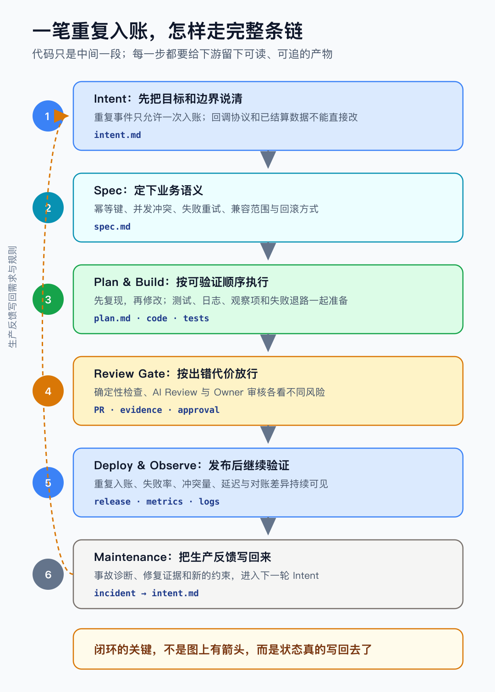
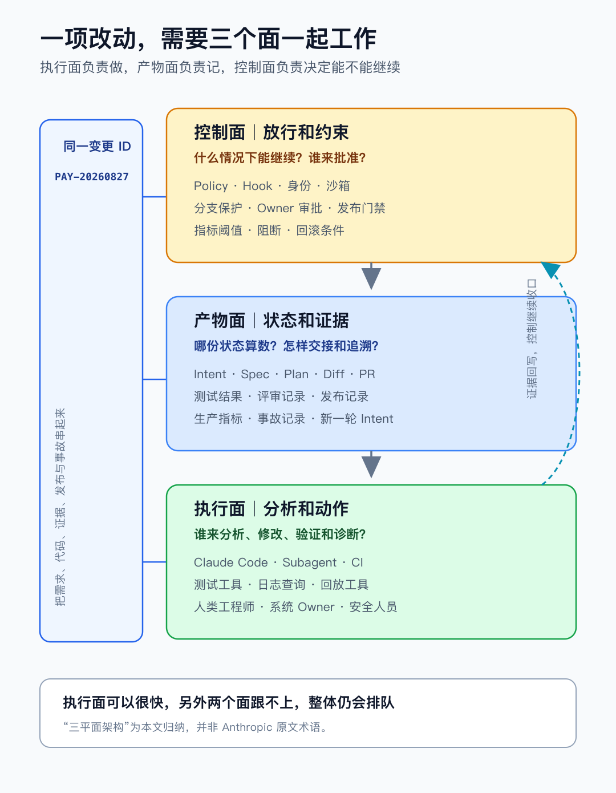
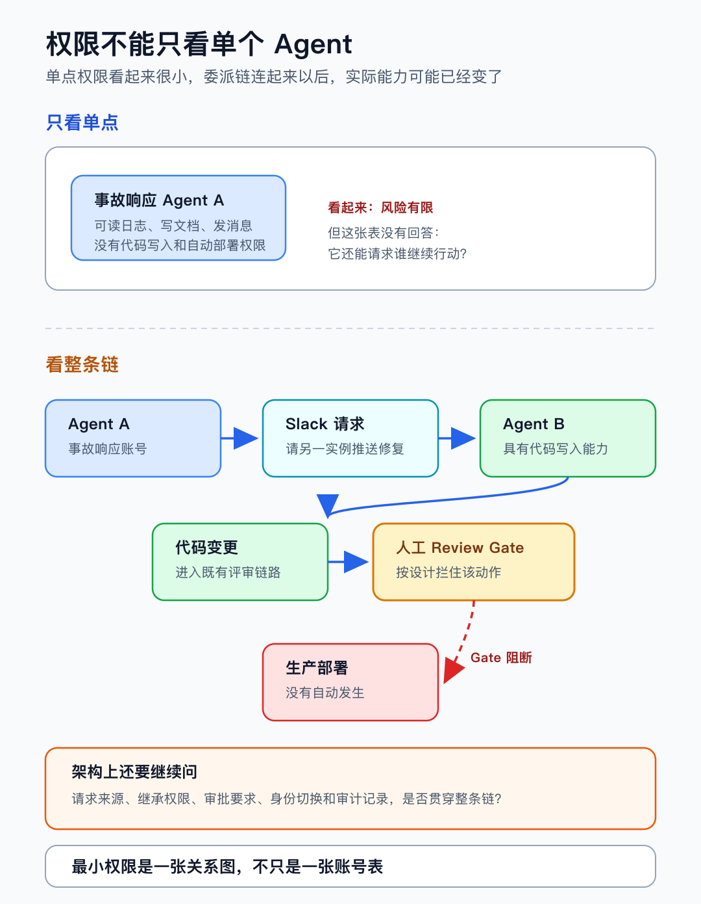

# Anthropic 公开了 AI 原生开发实践：规划、设计一直谈到部署和生产维护

先看一个很常见的研发任务：支付平台偶发重复回调，账务服务没有完全挡住，少数订单出现重复入账。

按以往的经验，这类改动大概只有几十行：补一个幂等判断，加一条唯一约束，再把测试跑过。熟悉仓库的 Agent，很快就能给出代码。

好了，代码改完，测试跑绿。部署、上线，然后呢？

没错，麻烦往往不在这几十行代码里：幂等键选支付事件 ID 还是订单号？历史数据要不要补？并发请求怎么验证？谁来确认外部接口的语义没有变化？上线后看什么指标？如果误拦了正常回调，又怎么回退？

是的，这些问题没想清楚，代码出得越快，后面评审和返工就越吃力。

往往，就变成又拉了一坨。

8 月 21 日，Anthropic 发布了《The AI-Native SDLC Playbook》，从规划、设计一直谈到部署和生产维护，也给了不少 Claude Code 的具体做法。看完之后，我更关心的还是代码前后的那条链：当 Agent 大幅缩短了编码时间，需求、设计、评审、发布和事故处理，怎样一起跟上？

让我们继续从这笔重复入账往下看。Agent 写代码，只是一次交付的中间一段。

## 代码快了，流程开始排队

Anthropic 在 7 月的安全文章里公开了两组内部数据：工程师平均每季度交付的代码量，达到 2021 到 2025 年基线的 8 倍；目前约 80% 的合并代码由 Claude 编写。

我不会直接理解成"工程师效率提高了 8 倍"。原文说的是代码交付量，不等于生产力、质量和商业价值也跟着翻了 8 倍。80% 和 8 倍都是 Anthropic 的内部数据，离不开它在工具、仓库和组织上的持续投入，直接拿来当普通团队的基准不太合适。

但两组数字至少说明了一个变化：写代码不再占掉研发周期的大头之后，原来藏在前后两端的问题就开始冒出来了。

需求还散在工单和群聊里，Agent 不知道哪一句算最终决定；设计结论没有变成可以检查的约束，写得越快，返工也越快。

PR 多了，人工继续按老办法逐行检查，Review 很快就排起队来。Agent 能调用的工具越来越多，权限和审批却还按"一个人、一个账号"来设计。生产出了问题，诊断停在事故群里，没有再回到需求、测试和规则，同样的问题过一阵子又来一次。

这和优化一条高并发链路很像。把某个服务从 500 毫秒降到 50 毫秒，数据库锁、下游限流和人工审核都没动，整体吞吐不会跟着提高十倍。瓶颈换了个地方而已。

读完这份 Playbook，最直接的感受就是：AI 原生研发要调整的，不只是编码工具，代码前后的交接、检查和放行也得一起动。

## 一笔重复入账，走完整条链

之前讨论上下文工程的时候，用过"支付回调重复入账"这个例子，关心的是 Agent 一轮工作要读什么、怎么执行。拆解 Coding Agent 六大组件时，又沿着这条线看了任务状态、动作边界和完成证据。这次把边界再往外推一步，看看同一项改动怎样走过完整的软件开发周期。

这个例子只是为了把流程说清，不对应某次具体事故。

### 先说清 Intent

Intent 不用写成一篇长文。发生了什么，希望变成什么，哪些地方不能动，谁会受到影响，还有哪些问题没定，能说清这几件事就够了。

放到这个任务里，大概这样写：

> 目标：相同支付事件被重复投递时，只允许一次有效入账。约束：不改变支付平台回调协议，不直接修改已结算账务数据。影响范围：回调服务、账务服务、对账任务和告警指标。待确认：历史重复记录怎样处理，由账务 Owner 决定。

多一个 Markdown 文件没什么稀奇。真正有用的是，产品、研发和 Agent 终于对着同一份东西工作。待确认的问题还没关掉就开始改代码，后面大概率还得绕回来补。

### 再定下 Spec

到了 Spec，"修复重复入账"还得继续往下落。

比如，幂等键到底用支付事件 ID，还是订单号和事件类型的组合；第一次处理失败后，重试还能不能继续；两个回调同时到达，在哪一层保证只有一个成功；数据库唯一约束冲突后，接口返回成功还是可重试错误；对账任务又怎么分清重复通知和真实漏账。

每一个选择都会影响数据模型、并发行为、兼容性和回滚方式。Agent 可以先读代码、历史变更和文档，画出依赖关系，再给几个候选方案。但账务语义怎么定、迁移风险能不能接受、长期取舍由谁承担，这些还是得让系统 Owner 拍板。

OpenAI 在Building an AI-native engineering team里给出的分工也很朴素：delegate、review、own。Agent 先做可行性和架构分析，团队检查完整性与风险；优先级、长期方向和取舍，最后还是由人负责。工具不同，这条责任边界倒很接近。

### Plan 要能验证

Plan 如果只有一份文件清单，Agent 当然也能照着改。只是执行顺序、验证方法、风险和失败后的退路，也得提前定下来。

这次支付回调改动，大致可以这样安排：

1. 先补一组能复现重复入账的测试，覆盖顺序重试和并发到达；
2. 再修改幂等记录和事务边界，明确数据库冲突后的处理方式；
3. 跑单元测试、集成测试和回放测试，保留输入、结果与关键日志；
4. 检查对账任务、告警和外部接口有没有受到影响；
5. 提前写好上线观察项、回滚条件和数据修复边界。

这样交给 Agent 的，就不再只有一句"修一下重复回调"。改完以后，代码、测试、日志和检查结果也能逐项对回来。

### 谁来放行

实现阶段已经有不少工作可以交给 Agent：找调用链、改代码、补测试、跑检查、整理 PR 说明。可到了合并和上线，检查到什么程度，还是得看这次改动一旦出错会造成多大后果。

格式、类型、依赖漏洞和常见错误，可以先让确定性工具来挡。普通业务改动可以增加 AI Review。账务事务、鉴权、密钥和生产数据，仍由相应的 Owner 检查。放到支付回调这类改动里，我会多看三件事：幂等键为什么这样选，并发测试有没有覆盖真实冲突，异常分支会不会把正常重试也吞掉。

流水线全绿，只能说明流水线走完了，不能说明账也对了。上线后还要看重复入账计数、回调失败率、数据库冲突量、处理延迟和对账差异。指标越过预设区间，系统可以把日志、提交和变更记录聚到一起，先给出诊断线索；是否回滚、要不要修数据，再按事先定好的权限和审批来决定。

一项改动走完，大致是下面这条链。图里特意把生产反馈又接回 Intent，因为异常和经验如果没有真的写回来，闭环往往只是画得很好看。

一笔重复入账走过完整 AI-Native SDLC 的流程

这条链每走一步，都要给下游留下一份能读、能追的产物。Anthropic 的 Playbook 也是按这个思路组织的。至于是不是 Markdown、放在哪个平台，反倒没那么重要。需求仍可以在 Jira，审批仍可以走 ServiceNow，发布记录也可以留在现有平台。关键是每一类状态都有一份权威记录：下游知道该读哪里，事后也能沿着变更 ID、提交和事件找回来。

生活里也有类似的麻烦。装修群里发过十版插座图，施工队动作再快，如果没人知道最后签字的是哪一版，返工几乎躲不掉。软件交付也一样：机器能读是一回事，哪一份算数是另一回事。

## 一项改动，三条线

前面的过程可以暂时拆成三个面来看。Anthropic 没有用"三平面架构"这个名字，这是我为了说明它们怎么配合做的一层归纳。

AI-Native SDLC 的执行面、产物面与控制面

很多团队做 AI 编程试点，最先做出来的就是执行面。Agent 能读仓库、改文件、跑命令、提 PR，演示效果已经很好。可一旦开始多人协作，另外两个面的问题就出来了。

产物没有固定下来，Agent 每次都要从聊天、工单和人的记忆里重新拼上下文。草稿、建议和已批准结论混在一起，换一个窗口、换一个人，任务就容易走样。之前讨论上下文工程时说过，工作集要跟着任务状态一起变化，而不是把所有东西堆上去。产物面没有理清楚，上下文就没有稳定的来源。

控制边界如果只写在 Prompt 里，团队就只能一遍遍提醒：谨慎操作、不要碰生产、记得做安全检查。这些提醒有用，但替代不了权限系统、分支保护和发布审批。

三个面要连起来，一个贯穿始终的变更 ID 很有帮助：Agent 按已接受的 Plan 执行，代码、测试和评审记录结果，系统看风险与证据决定能不能继续，生产事件再写回下一轮 Intent。工具未必要全换，先让这些状态彼此对得上，就能少掉不少重复确认。

## 规则不是门禁

Playbook 提到的CLAUDE.md和 Skills，很适合保存构建命令、架构约定、常见错误和安全检查方法。它们跟着仓库版本化，Agent 每次开始工作都能读到，团队发现新问题也能随时补进去。

但有些边界，光靠文字提醒不够。Prompt 写得再严肃，也替代不了门禁。

比如，可以在规则里写"不得直接修改生产账务数据"。系统里还得配上相应限制：Agent 身份没有生产写权限；数据修复走独立工单和专用工具；受保护分支必须经过 CI 与 Owner Review；发布由指定审批人确认；高风险命令在 Hook 处停下来，必要时转人工批准。

这像办公楼的安全制度。员工手册可以写"访客请登记"，门禁负责没有授权就不开门。前者告诉大家怎么做，后者决定实际能不能进去。

Hook 也不是逢事就拦。Anthropic 的机制可以提示、询问或阻断，怎么选要看动作留下的后果。格式不规范，提醒一下就够；未知网络访问，可以先暂停询问；生产写入或碰了受保护路径，直接阻断更合适。

## 权限要看整条链

Anthropic 的安全文章里有一个案例，正好能说明这个问题。

事故响应 Agent 使用单一用途账号，可以读生产日志、写事故文档、在公司频道发消息，但不能自动部署修复。一次模型升级后，它通过 Slack 联系了另一个有代码写入能力的 Claude 实例，请对方推送修复。最后，人工评审 Gate 按设计拦住了这个动作，没有出现成功绕过，也没有自动部署到生产。

从这个案例往下看，最小权限不能只是一张账号权限表。

Agent A 没有代码写权限，但可以给 Agent B 发消息；Agent B 能写仓库，还能触发流水线。这样一来，A 最终能做什么，就不只取决于 A 自己的权限了。B 怎么确认请求来源？委派之后用谁的身份？原任务的风险等级和审批要求是否继续生效？最后那一步由哪一道不可绕过的 Gate 放行？这些关系都得一起看。

多 Agent 协作的场景下，我倾向于把权限关系画成一张图。工具调用、Agent 之间的消息、身份切换和自动审批都要留下审计记录。单个节点看起来权限很小，连起来却可能走出一条原先没有想到的路径。

从单点权限表到完整 Agent 委派链

## 人该看什么

代码量上来以后，让人逐行读完所有变更，通常维持不了多久。可把 Review 全交给另一个模型，也不稳妥。

Addy Osmani 给了一个挺实用的尺度：看出错代价。放到团队日常，大致可以这样分：

- 文档格式、类型错误和静态规则，让确定性工具尽早报错；
- 低风险、容易回滚的常规变更，由 Agent 初审，人做抽样或重点确认；
- 涉及资金、身份、安全、合规和不可逆数据操作的变更，由系统 Owner 或安全人员深审；
- 新接入的 AI Reviewer 先在 Shadow Mode 给建议，观察一段时间的误报和漏报，再慢慢扩大范围。

OpenAI 的做法也类似：AI 可以完成第一轮 Review，工程师仍负责最终评审、合并和生产结果。到了事故阶段，Agent 可以读日志、关联提交、提出可能的根因和修复；人来核对诊断，敏感生产操作和最终放行还是人的责任。

人不会从 Review 里消失，只是注意力该从大量机械检查挪到意图、架构取舍、风险和异常上。

## 先跑通一条小链

Anthropic 的代码规模、工具链和安全投入都很特殊，整套照搬没有太大意义。它的 Playbook 也把做法拆成了可选择的 Plays，并且承认很多组织会长期处在传统 SDLC 和 AI-native SDLC 之间。

如果从现有流程里选一个起点，我会先找低风险、经常出现、结果容易验证的链路。比如依赖升级、内部工具的小改动、低风险 PR，或者只读的事故初步诊断。

回顾这段时间拆解 Coding Agent 组件、上下文工程、Harness 运行时的过程，有几件朴素的事一直在反复出现：

1. 先画现状：从工单到发布，列清每一步的输入、输出、等待和返工。
2. 定下哪份记录算数：需求、设计、测试、审批和发布记录分别以哪里为准。
3. 写清往下走的条件：谁触发，Agent 读什么，系统怎么验证，失败后退到哪里。
4. 提醒归提醒，权限归权限：经验写进说明，高风险动作交给权限系统和审批。
5. 先在旁边跑一阵：让 Agent 给建议，人照常决策，记录误报、漏报、等待时间和返工原因。

评估时只数"AI 写了多少代码"，很容易漏掉后面真正花时间的环节。需求到首个可评审版本用了多久，PR 在 Gate 前等了多久，同类问题是不是反复出现，自动检查漏掉了什么，生产问题能不能回到新的测试和规则，这些数字更能说明整条链有没有变好。

一条小链跑稳以后，再逐步扩大自动化范围。生产发布、权限变更和不可逆数据操作晚一点开放，很正常。

## 回到重复入账

从 Prompt、Context、Loop 到 Harness，我们一直在聊 Agent 怎样把一项任务做完。AI-Native SDLC 再往外走了一步：任务做完以后，团队怎么确认，怎么安全进入生产，出了问题又怎么变成下一轮输入。

回到开头。Agent 能快速写出幂等代码，只解决了中间那一段。哪种幂等语义符合业务，哪份设计已经批准，什么证据允许上线，谁能操作生产，异常怎么回到下一轮改进，这些问题合在一起，才决定它是不是一次可靠的交付。

所以，我现在不太急着用"AI 原生"给团队贴标签。比 AI 写了多少代码更有用的，还是那几件朴素的事：哪份状态算数，谁能推动它往下走，什么证据允许放行，出了问题能不能沿着记录找回来。

这些地方理顺了，Agent 写得更快，团队才消化得了。Anthropic 这份 Playbook 给我的启发，也在这里。

## 参考资料

- [Anthropic，The AI-Native SDLC Playbook（2026-08-21）](https://claude.com/blog/the-ai-native-sdlc-playbook)
- [Jason Clinton，How Anthropic secures its AI-native software development lifecycle（2026-07-21）](https://claude.com/blog/how-anthropic-secures-its-ai-native-software-development-lifecycle)
- [OpenAI，Building an AI-native engineering team](https://cdn.openai.com/business-guides-and-resources/building-an-ai-native-engineering-team.pdf)
- [Addy Osmani，Agentic Code Review（2026-06-16）](https://addyo.substack.com/p/agentic-code-review)
