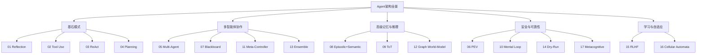

> **摘要** — 以 17 种可运行的 LangChain + LangGraph 架构为线索，系统性梳理 Agent 领域从 2022 年论文原型到 2026 年生产系统的完整技术演进。涵盖单 Agent 模式（Reflection/Tool Use/ReAct/Planning）、多智能体协作（Multi-Agent/Blackboard/Meta-Controller/Ensemble）、高级记忆与推理（FAISS+Neo4j 双记忆/思维树/图世界模型）、安全与可靠性（PEV/心智模拟器/Dry-Run/元认知）、学习与自适应（RLHF/元胞自动机）五大主题。



```markmap height=320
# All Agentic Architectures
## 基石模式
- 01 Reflection：生成→批评→改进
- 02 Tool Use：LLM自主调用外部API
- 03 ReAct：多轮推理+行动循环
- 04 Planning：先规划后执行
## 多智能体协作
- 05 Multi-Agent：专家团队分工
- 07 Blackboard：共享黑板+动态调度
- 11 Meta-Controller：智能路由
- 13 Ensemble：多视角并行+综合
## 高级记忆与推理
- 08 Episodic+Semantic：双记忆系统
- 09 Tree of Thoughts：树搜索+剪枝
- 12 Graph World-Model：知识图谱推理
## 安全与可靠性
- 06 PEV：计划-执行-验证
- 10 Mental Loop：模拟器预演
- 14 Dry-Run：沙箱+人工审核
- 17 Metacognitive：自我能力评估
## 学习与自适应
- 15 RLHF：多轮修改+持久化记忆
- 16 Cellular Automata：涌现行为
```

---

# All Agentic Architectures 深入详解

## 内容概览

| 章节 | 架构 | 核心创新 |
|------|------|---------|
| **第一部分 基石模式** | Reflection / Tool Use / ReAct / Planning | 自我批判、工具调用、多轮推理、结构化规划 |
| **第二部分 多智能体协作** | Multi-Agent / Blackboard / Meta-Controller / Ensemble | 流水线、动态调度、智能路由、扇出扇入 |
| **第三部分 高级记忆与推理** | Episodic+Semantic / ToT / Graph World-Model | FAISS+Neo4j 双记忆、树搜索、多跳推理 |
| **第四部分 安全与可靠性** | PEV / Mental Loop / Dry-Run / Metacognitive | 验证器、沙箱模拟、人工审核、自我认知 |
| **第五部分 学习与自适应** | RLHF / Cellular Automata | 多轮改进、涌现行为 |


> 项目地址：https://github.com/FareedKhan-dev/all-agentic-architectures阅读地址：https://forceinjection.github.io/08_agentic_system/agent_design/all-agentic-architectures-deep-dive.html

项目地址：https://github.com/FareedKhan-dev/all-agentic-architectures

阅读地址：https://forceinjection.github.io/08_agentic_system/agent_design/all-agentic-architectures-deep-dive.html

## 前言与导读

AI Agent（智能体）正在从学术论文走向生产系统。2024-2026 年间，LangChain、LangGraph、AutoGen、CrewAI 等框架的成熟，使得构建复杂的 Agent 系统从「前沿研究」变为「工程实践」。然而，大多数资料要么停留在概念层面，要么只展示单一架构的片段代码，缺乏对完整架构谱系的系统性梳理。

本文基于一个包含17 种前沿 Agent 架构的开源项目，逐一剖析每种架构的核心思想、完整实现、实际案例和适用场景。所有架构均使用LangChain + LangGraph实现，并配有LLM-as-a-Judge定量评估。

### 阅读建议

•入门路径：前言 → 技术基础与通用架构 → 第一部分（01-04）→ 第六部分选型指南

•进阶路径：第二~五部分按兴趣选读 → 第六部分横切分析

•速查路径：直接跳转到第六部分的分类法与选型决策树

•决策者 / 产品经理路径：前言 → 第七部分 7.1「17 种架构一览表」→ 第六部分 6.1「架构分类法与选型指南」+ 6.4「错误处理等级对比」→ 据此理解技术能力边界、评估实现代价、做出产品/资源决策（可略过代码细节）

### 全文架构导航

Part 5: 学习与自适应Part 4: 安全与可靠性Part 3: 高级记忆与推理Part 2: 多智能体协作Part 1: 基石模式01 Reflection自我批判02 Tool Use工具使用03 ReAct推理+行动04 Planning规划05 Multi-Agent多智能体07 Blackboard黑板系统11 Meta-Controller元控制器13 Ensemble集成决策08 Episodic+Semantic双记忆系统09 Tree of Thoughts思维树12 Graph World-Model图世界模型06 PEV计划-执行-验证10 Mental Loop心智模拟器14 Dry-Run沙箱预演17 Metacognitive元认知15 RLHF自我改进16 Cellular Automata元胞自动机

Part 5: 学习与自适应

Part 4: 安全与可靠性

Part 3: 高级记忆与推理

Part 2: 多智能体协作

Part 1: 基石模式

01 Reflection自我批判

02 Tool Use工具使用

03 ReAct推理+行动

04 Planning规划

05 Multi-Agent多智能体

07 Blackboard黑板系统

11 Meta-Controller元控制器

13 Ensemble集成决策

08 Episodic+Semantic双记忆系统

09 Tree of Thoughts思维树

12 Graph World-Model图世界模型

06 PEV计划-执行-验证

10 Mental Loop心智模拟器

14 Dry-Run沙箱预演

17 Metacognitive元认知

15 RLHF自我改进

16 Cellular Automata元胞自动机

## 技术基础与通用架构

在深入 17 种架构之前，先掌握它们共享的技术底座。理解这一章的内容，后续每种架构的学习成本会大幅降低。

### 技术栈全景

组件角色说明LangChainLLM 交互层提供与大模型交互的基础抽象：消息、提示模板、工具绑定LangGraph工作流编排基于有向图的状态机框架，支持循环、条件分支、并行执行LangSmith可观测性追踪每次 LLM 调用、工具执行和状态变化，用于调试和评估ChatNebiusLLM 提供方OpenAI 兼容接口，提供 Llama 和 Mixtral 系列模型Pydantic v2数据建模定义结构化输出 Schema，LLM 返回类型安全的 Python 对象Rich终端输出格式化打印（Markdown、Table、Panel、Syntax 高亮）Tavily搜索工具为 Agent 提供实时网络搜索能力Neo4j图数据库存储知识图谱，支持 Cypher 查询的多跳推理FAISS向量存储高效的相似度搜索，用于情景记忆的检索

组件

角色

说明

LLM 交互层

提供与大模型交互的基础抽象：消息、提示模板、工具绑定

工作流编排

基于有向图的状态机框架，支持循环、条件分支、并行执行

可观测性

追踪每次 LLM 调用、工具执行和状态变化，用于调试和评估

LLM 提供方

OpenAI 兼容接口，提供 Llama 和 Mixtral 系列模型

数据建模

定义结构化输出 Schema，LLM 返回类型安全的 Python 对象

终端输出

格式化打印（Markdown、Table、Panel、Syntax 高亮）

搜索工具

为 Agent 提供实时网络搜索能力

图数据库

存储知识图谱，支持 Cypher 查询的多跳推理

向量存储

高效的相似度搜索，用于情景记忆的检索

双模型策略：本项目使用两个模型分工协作——

模型定位Temperature典型用途meta-llama/Meta-Llama-3.1-8B-Instruct快速推理0 - 0.2简单任务、工具调用、基础规划mistralai/Mixtral-8x22B-Instruct-v0.1深度推理0 - 0.5复杂推理、多 Agent 编排、内容创作

模型

定位

Temperature

典型用途

快速推理

0 - 0.2

简单任务、工具调用、基础规划

深度推理

0 - 0.5

复杂推理、多 Agent 编排、内容创作

> ⚠️ **重要澄清**：上表是本项目的默认约定，而非模型的固有属性。在生产实践中，模型选择与 Temperature 是「节点 / 任务」的属性而非「模型」的属性——同一个 Mixtral-8x22B 在 Planner 节点应用 temperature=0（求确定性），在 Creative Writing 节点可用 temperature=0.7（求多样性）。推荐的做法是：按节点粒度声明 LLM 实例与参数。

### 所有架构的「骨架代码」

17 个 Notebook 遵循统一的七阶段代码范式：

以下是四个最核心的代码模式：

模式 1：结构化输出:

模式 2：工具绑定:

模式 3：状态定义与消息归并:

模式 4：图构建与条件路由:

### LLM-as-a-Judge 评估范式

传统的自动评估指标（BLEU、ROUGE）无法衡量 Agent 输出的推理质量和任务完成度。本项目采用LLM-as-a-Judge模式——用一个 LLM 实例作为「裁判」，对 Agent 的输出进行结构化评分。

LLM-as-a-Judge 的局限性（读者须知）：

本文后续所有「A 架构 X 分 vs B 架构 Y 分」的对比结果，都建立在 LLM 裁判之上。在阅读时请始终记住：

•裁判 ≠ 真理：Judge LLM 本身也会犯错、有偏见——倾向于较长 / 较结构化的输出，对自己家族模型（同一基座或同一厂商训练的模型，例如用 GPT-4 裁判 GPT-4o 的输出）更宽容等，分数是相对信号而非绝对度量。

•同模型自评有幸存者偏差：用 GPT-4 评估 GPT-4 的输出往往高估；跨模型裁判（如用 Mixtral 裁判 Llama 的输出）更可信但依然非中立。

•维度可见性局限：LLM 能评价「可读性、完成度」，但难以评价「事实准确性、代码是否真能运行、API 是否真被正确调用」——这些需要程序化测评（执行代码、校验 API 返回）作为补充。

•生产建议：将 LLM-as-a-Judge 作为快速反馈回路（每次 PR 自动评分、回归检测），但关键决策仍应辅以人工抽样审核 + 真实任务指标（例如工具成功率、用户采纳率、延迟/成本）。

本文中各架构的评估维度：

| 架构 | 评估维度 |
|------|----------|
| 01 Reflection | correctness / efficiency / style |
| 02 Tool Use | tool_selection / tool_input / synthesis_quality |
| 03 ReAct | task_completion / reasoning_quality |
| 04 Planning | task_completion / process_efficiency |
| 05 Multi-Agent | clarity_structure / analytical_depth / completeness |
| 06 PEV | task_completion / error_handling |
| 07 Blackboard | instruction_following / process_efficiency |
| 13 Ensemble | recommendation_quality / synthesis |
| 15 RLHF | score (1-10) + feedback_points |

## 第一部分：基石模式

> 从单次生成到具备工具调用、推理循环和规划能力的单 Agent 进化之路。这四种模式是所有高级架构的基础。

### 1.1 Reflection（反思 / 自我批判）

#### 1.1.1 核心思想

一句话定义：Generate → Critique → Refine 三步自我改进循环。

类比人类写作中的「初稿 → 审校 → 终稿」流程。解决的核心问题是：单次 LLM 生成的质量不足，缺乏自我纠错能力。Reflection 通过让同一个 LLM 扮演「生成者」和「批评者」两个角色，实现了无需外部反馈的质量提升。

#### 1.1.2 架构图

Generator生成初始代码Critic结构化批评Refiner定向改进END

Generator生成初始代码

Critic结构化批评

Refiner定向改进

END

这是一个线性 DAG——没有循环，没有条件分支，三个节点依次执行。

#### 1.1.3 关键实现解析

State 定义：

三个 Pydantic Schema 分别约束三个阶段的输出：

节点函数遵循统一模式——接收 State，调用 LLM，返回 State 更新：

图构建——三行代码完成编排：

#### 1.1.4 实际案例与效果

任务：「编写一个计算第 n 个 Fibonacci 数的函数」。

•Generator产出递归实现（O(2^n) 时间复杂度）

•Critic指出效率问题、缺少输入验证、没有缓存

•Refiner改为迭代实现（O(n)），添加类型提示和边界检查

LLM-as-a-Judge 评分（CodeEvaluation，1-10 分制）对比：

| 维度 | 初始代码 | 改进后 |
|------|----------|--------|
| correctness | 7 | 9 |
| efficiency | 4 | 9 |
| style | 6 | 8 |

#### 1.1.5 思考与延伸

•适用场景：代码生成、长文写作、结构化内容创作

•局限性：只有一轮批评-改进，无法迭代多次。对比 Notebook 15（RLHF），后者支持多轮循环直到质量达标

•进化方向：

•Iterative Reflection（迭代反思）：在refiner → critic间加回边，配合「质量阈值 / 最大轮数」双停止条件，即进化为多轮自我优化——这正是Notebook 15 RLHF的前身形态，两者在第五部分形成完整闭环。

• 在 Iterative Reflection 的基础上，如果再引入跨任务的金标准记忆（将历史上经过 Critic 高分认可的输出持久化，作为后续同类任务的 Few-Shot 示例），它便从「任务内自我修正」升级为「跨任务自我进化」，最终演化为完整的 Self-Improvement Loop——这正是 Notebook 15 RLHF 的核心机制。

### 1.2 Tool Use（工具使用）

#### 1.2.1 核心思想

一句话定义：让 LLM 自主决定「何时」及「如何」调用外部 API。

LLM 的知识有截止日期，无法访问实时数据。Tool Use 架构通过让 LLM 在回复中嵌入「工具调用请求」，将其从封闭系统变为开放系统。这是后续所有工具增强架构（ReAct、Planning、PEV 等）的基础。

#### 1.2.2 架构图

为避免图文不一致，此处分两张图呈现——基础版（Notebook 02 的实际行为）与循环版（形式上等价于 ReAct）：

循环版（加强版 ≈ ReAct）有 tool_calls无 tool_callsAgent推理+决策Tool NodeEND基础版（Notebook 02 实际实现）有 tool_calls无 tool_callsAgent分析问题Tool Node执行工具END

循环版（加强版 ≈ ReAct）

有 tool_calls

无 tool_calls

Agent推理+决策

Tool Node

END

基础版（Notebook 02 实际实现）

有 tool_calls

无 tool_calls

Agent分析问题

Tool Node执行工具

END

> 图示语义澄清：Notebook 02 的 LangGraph 图确实连接了 `tools → agent` 回边，但由于系统提示和任务类型的约束，Agent 通常只调用一次工具就给出答案。这意味着 Tool Use 与 ReAct 的真正边界不在图结构，而在 Prompt + 任务复杂度——当你用 ReAct 式的系统提示替换时，它的行为就等同于 ReAct。

#### 1.2.3 关键实现解析

State 采用消息列表模式——这是工具调用架构的标准选择：

add_messages归并器确保新消息被追加而非覆盖，使得对话历史自然累积。

工具绑定与路由：

路由函数检查最后一条消息是否包含tool_calls——这是 LangChain 中 LLM 表达「我需要调用工具」的标准方式。

图构建：

#### 1.2.4 实际案例与效果

任务：「Apple 最新 WWDC 的主要公告有哪些？」

执行轨迹：

1. Agent 收到问题 → 生成tool_calls: [{"name": "web_search", "args": {"query": "Apple WWDC latest announcements"}}]

2. ToolNode 执行搜索 → 返回搜索结果

3. Agent 综合搜索结果 → 输出最终答案

LLM-as-a-Judge 评分（ToolUseEvaluation，1-5 分制）：

| 维度 | 得分 |
|------|------|
| tool_selection_score | 5 |
| tool_input_score | 4 |
| synthesis_quality_score | 4 |

#### 1.2.5 思考与延伸

•工具描述的质量直接影响路由准确率——LLM 根据工具的description决定是否调用

•单次调用的局限：如果问题需要多步信息组合（如「A 公司 CEO 是谁，他之前在哪工作」），单次搜索无法满足

•进化方向：Tool Use → ReAct（多轮循环）

### 1.3 ReAct（推理 + 行动）

#### 1.3.1 核心思想

一句话定义：Think → Act → Observe 的动态多轮循环，交替推理和工具调用直到问题解决。

ReAct（Reasoning + Acting）源自 Yao et al. 2022 的论文。它与 Tool Use 的结构几乎相同，但语义完全不同——工具执行后回到 Agent 继续推理，而不是直接结束。这一看似微小的差异，使 Agent 获得了解决多跳问题的能力。

#### 1.3.2 架构图

需要更多信息返回结果已有足够信息ReAct Agent推理 + 决策Tool Node执行搜索END综合输出

需要更多信息

返回结果

已有足够信息

ReAct Agent推理 + 决策

Tool Node执行搜索

END综合输出

与 Tool Use 的图结构完全相同，关键区别在于边的语义：Tool → Agent边意味着 Agent 会基于工具返回的新信息继续推理，而非简单复述。

#### 1.3.3 关键实现解析

Notebook 03 构建了两个 Agent 进行对比：

Basic Agent（基线）：强制单次回答

ReAct Agent：自由多轮推理

两者的差异体现在两处：(1) 系统提示——Basic 强制 「在一次工具调用后就给出最终答案」；(2) 图结构——Basic 用add_edge("tools", END)形成线性 DAG，而 ReAct 用add_edge("tools", "agent")形成闭环。这两处共同作用，使 ReAct 具备了 Agent 自主控制循环次数的能力。

#### 1.3.4 Head-to-Head 对比实验

任务（多跳问答）：「Dune 这部科幻电影的制作公司的现任 CEO 是谁？该公司最新电影的预算是多少？」

这个问题需要至少 2-3 次搜索：查电影制作方 → 查 CEO → 查最新电影预算。

| 维度 | Basic Agent | ReAct Agent |
|------|-------------|-------------|
| 搜索次数 | 1 | 3 |
| task_completion | 3/10 | 9/10 |
| reasoning_quality | 2/10 | 8/10 |
| 结果 | 答案不完整 | 准确回答两个子问题 |

Basic Agent 只做了一次搜索，得到部分信息后就被迫输出答案。ReAct Agent 则进行了 3 轮搜索，逐步聚焦到最终答案。

#### 1.3.5 思考与延伸

•ReAct 的探索性本质：适合开放性、需要信息组合的问题

•潜在风险：可能陷入无限循环（需设置recursion_limit）

•效率 / 成本权衡：每次循环都消耗 token + 延迟。ReAct 的「过度探索」对简单问题是明显浪费——2024 年社区实测表明：回答「Apple CEO 是谁」这类一跳事实型问题时，ReAct Agent 可能触发 2-3 次不必要的搜索，而单次 Tool Use 即可完成。自然的解决方案：在入口处接一个Meta-Controller（Notebook 11）先判断问题复杂度，简单问答路由到 Tool Use、复杂多跳路由到 ReAct。这也是生产系统中常见的「路由 + 专家」组合范式。

•与 Planning 的核心差异：ReAct 是「边走边看」，Planning 是「先看地图再出发」

### 1.4 Planning（规划）

#### 1.4.1 核心思想

一句话定义：先制定完整计划（结构化步骤列表），再按步执行，最后综合所有结果。

Planning 架构将任务分为三个阶段：Planner生成步骤列表 →Executor逐步消费计划 →Synthesizer综合中间结果。与 ReAct 的「探索式」不同，Planning 是「结构化」的——执行前就知道要做什么。

#### 1.4.2 架构图

计划还有剩余步骤计划已执行完毕Planner生成步骤列表Executor执行当前步骤Synthesizer综合所有结果END

计划还有剩余步骤

计划已执行完毕

Planner生成步骤列表

Executor执行当前步骤

Synthesizer综合所有结果

END

#### 1.4.3 关键实现解析

Plan Schema 用 Pydantic 约束 LLM 输出格式化的步骤列表：

Planner Node 使用 few-shot 示例引导 LLM 生成高质量计划：

Executor Node 逐步消费计划——每次取第一步执行，将剩余步骤放回 State：

路由逻辑——计划为空则综合，否则继续执行：

#### 1.4.4 Head-to-Head 对比实验

任务：「查询法国、德国、意大利首都的人口，求和后与美国人口对比」。

| 维度 | ReAct | Planning |
|------|-------|----------|
| 方法 | 逐步搜索，边找边想 | 一次性生成 4 步计划 |
| 搜索次数 | 5-7 次（含试错） | 4 次（精确） |
| task_completion | 7/10 | 9/10 |
| process_efficiency | 5/10 | 9/10 |

Planning Agent 生成了清晰的 4 步计划（三国首都人口 + 美国人口），然后精确执行。ReAct Agent 虽然也完成了任务，但过程中有冗余搜索。

#### 1.4.5 思考与延伸

•适用场景：任务结构可预见、步骤间相对独立

•核心问题：如果某个步骤执行失败怎么办？计划没有容错机制

•计划陈旧性问题（Plan Re-evaluation）：即便每一步都执行成功，计划的后半段可能已基于过时假设——例如第 1 步发现标的公司已被收购，第 2 步的「查该公司财报」就不再适用。生产级方案应在 Executor 与 Synthesizer 之间插入一个Plan Reviewer 节点：在每 N 步（或关键里程碑）之后，审视剩余计划是否仍然成立，不成立则触发重规划。这是 Planning 与 ReAct 的深度融合——「宏观规划 + 动态调整」。

•进化方向：Planning → PEV（Notebook 06），增加验证器和重规划能力

•ReAct + Planning 混合：先规划大框架，每步内部用 ReAct 灵活执行

## 第二部分：多智能体协作

> 基石模式解决了单 Agent 的能力闭环，但当任务复杂度超出单 Agent 的上下文窗口、专业深度或调度灵活性时，就需要多个专业化 Agent 分工协作——这正是多智能体系统的用武之地。

### 2.1 Multi-Agent Systems（多智能体系统）

#### 2.1.1 核心思想

一句话定义：专业化角色团队按固定流水线协作，各司其职。

类比一个分析师团队：新闻分析师负责舆情、技术分析师负责图表、财务分析师负责报表，最后报告撰写人综合所有分析。每个 Agent 拥有独立的系统提示（persona），决定了它的专业视角。

#### 2.1.2 架构图

News Analyst新闻分析师Technical Analyst技术分析师Financial Analyst财务分析师Report Writer报告撰写人END

News Analyst新闻分析师

Technical Analyst技术分析师

Financial Analyst财务分析师

Report Writer报告撰写人

END

这是一个固定顺序的流水线——每个 Agent 把自己的分析结果写入 State，后续 Agent 可以读取前序结果。

#### 2.1.3 关键实现解析

State 为每个 Agent 分配独立字段：

Agent 工厂函数——用同一个模板创建不同 persona 的 Agent：

Report Writer综合所有分析报告：

#### 2.1.4 实际案例与效果

任务：生成 NVIDIA 市场分析报告。

对比单体 Agent（一个 generalist 独立完成所有分析）vs 多 Agent 团队：

| 维度 | 单体 Agent | Multi-Agent 团队 |
|------|-----------|-----------------|
| clarity_structure | 5/10 | 8/10 |
| analytical_depth | 4/10 | 9/10 |
| completeness | 5/10 | 9/10 |

多 Agent 团队在每个专业维度上都有显著提升，因为每个 Agent 可以用全部上下文窗口聚焦于自己的专业领域。

#### 2.1.5 思考与延伸

•固定顺序的局限：如果新闻情绪为负面，技术分析可能需要调整方向，但流水线无法回溯

•固定顺序的反面价值：确定性流水线意味着更高的可预测性、可审计性与可复现性，在金融/医疗/合规等强监管场景中，这往往比「灵活性」更重要——一份执行路径可追溯的分析报告，比一份「Controller 动态决定路径」的报告更易通过审计。

•并行 vs 串行：除了效率，并行还能避免顺序偏见——分析师 A 先写的观点会锚定分析师 B 的判断；让 A/B/C 并行产出后再由综合者合并，可显著降低集体思维（groupthink）。这也是 Ensemble（Notebook 13）相比顺序多 Agent 的根本优势之一。

•进化方向：Multi-Agent → Blackboard（动态调度）→ Meta-Controller（智能路由）

### 2.2 Blackboard Systems（黑板系统）

#### 2.2.1 核心思想

一句话定义：共享黑板（Blackboard）+ 智能控制器（Controller）动态调度专家 Agent。

Blackboard 系统源自 1980 年代的经典 AI 架构（如 Hearsay-II 语音识别系统）。核心思路是：有一块共享的「黑板」存储当前状态，多个 Agent 可以读取黑板上的信息并添加自己的贡献，一个 Controller 根据黑板内容决定下一步调用哪个 Agent。

与 Multi-Agent 的固定流水线不同，Blackboard 的执行顺序是动态的——Controller 可以根据中间结果跳过某些 Agent、重复调用某些 Agent，甚至改变执行计划。

#### 2.2.2 架构图

需要新闻分析需要技术分析需要财务分析准备输出Controller读取黑板,决定下一步News AnalystTechnical AnalystFinancial AnalystReport WriterEND

需要新闻分析

需要技术分析

需要财务分析

准备输出

Controller读取黑板,决定下一步

News Analyst

Technical Analyst

Financial Analyst

Report Writer

END

#### 2.2.3 关键实现解析

State 包含共享黑板和控制器日志：

Controller 是整个系统最关键的组件——它读取黑板内容，决定下一步：

条件路由基于 Controller 输出的next_agent字段动态选择下一个节点，"FINISH"则路由到 END。为防止 Controller-Agent 多轮交互失控，调用时设置recursion_limit=10。

#### 2.2.4 Head-to-Head 对比实验

任务：「分析 Nvidia 的最新重大新闻。根据新闻情绪决定下一步——如果为负面，跳过技术分析直接进行风险评估。」

| 维度 | Sequential Agent | Blackboard Agent |
|------|-----------------|-----------------|
| instruction_following | 4/10 | 9/10 |
| process_efficiency | 5/10 | 8/10 |
| 行为 | 执行所有分析，忽略条件 | Controller 检测到负面情绪后跳过技术分析 |

#### 2.2.5 思考与延伸

•Controller 的 Prompt 质量决定整个系统的表现——如果 Controller 无法正确理解条件分支逻辑，系统会退化为固定流水线

•Controller 是单点故障 + 性能瓶颈：Controller 错误的决策可能触发无效循环或错误结论，且调试难度远大于固定流水线——同样的输入每次执行路径可能不同，令回归测试变得困难。生产环境建议：(1) 对 Controller 决策打埋点日志；(2) 跟踪每条任务的执行谱（execution trace）；(3) 对 Controller 单独建立单元测试（固定黑板快照 → 验证决策输出）。

•与 Meta-Controller 的区别：Blackboard 是多轮调度（Controller 反复决策），Meta-Controller 是单次路由

•潜在问题：Controller 与 Agent 之间的多轮交互可能触发GraphRecursionError，需要合理设置递归限制

### 2.3 Meta-Controller（元控制器 / 智能路由）

#### 2.3.1 核心思想

一句话定义：分析任务类型 → 一次性路由到最合适的专家 Agent。

Meta-Controller 是最简单的多 Agent 模式——没有协作、没有共享状态、没有循环。它只做一件事：理解用户意图，然后把请求转发给正确的专家。类比企业总机或 API Gateway。

#### 2.3.2 架构图

闲聊/简单问题需要搜索/研究需要写代码User RequestMeta-Controller分析并路由Generalist AgentResearcher AgentCoder AgentEND

闲聊/简单问题

需要搜索/研究

需要写代码

User Request

Meta-Controller分析并路由

Generalist Agent

Researcher Agent

Coder Agent

END

#### 2.3.3 关键实现解析

路由决策用 Pydantic 结构化输出：

Controller Node：

条件路由——直接读取 State 字段：

#### 2.3.4 实际案例

三次测试验证路由准确性：

| 输入 | 路由结果 | 正确性 |
|------|----------|--------|
| "Hello, how are you today?" | Generalist | 正确 |
| "What were NVIDIA's latest financial results?" | Researcher | 正确 |
| "Can you write me a python function to calculate the nth fibonacci number?" | Coder | 正确 |

#### 2.3.5 思考与延伸

•开销极低：只需一次 LLM 调用做路由，后续由专家处理

•与 Blackboard 的区别：单次路由 vs 多轮调度

•扩展性：增加新专家只需在 Prompt 中添加描述 + 注册新节点

•风险：路由错误时用户体验差。正确的应对方式不是「加 fallback Agent」那么粗糙，而是在ControllerDecisionSchema 中新增confidence: float字段：

• 若置信度 ≥ 阈值（0.7 作为经验值）→ 直接路由到选定专家

• 若低于阈值→ 不就地路由，而是跳转到**「澄清 Agent」**向用户发起反问（「你是想查询财务数据还是市场新闻？」），或者交给一个通用 Agent 宽容处理。这是与Metacognitive（Notebook 17）思想的早期融合——Agent 不仅知道「路到哪里」，还知道「自己是否有把握」。

### 2.4 Ensemble（集成 / 扇出-扇入）

#### 2.4.1 核心思想

一句话定义：多个独立视角的 Agent 并行分析 → 综合决策者合并所有观点得出最终结论。

类比投资委员会：乐观派分析师、价值派分析师、量化分析师各自独立研究，最终由首席投资官（CIO）综合所有观点做出投资决策。关键创新在于认知多样性——不同 Agent 有不同的偏见和关注点，综合后比任何单一视角都更可靠。

#### 2.4.2 架构图

Start AnalysisBullish Analyst乐观视角Value Analyst价值视角Quant Analyst量化视角CIO Synthesizer综合决策END

Start Analysis

Bullish Analyst乐观视角

Value Analyst价值视角

Quant Analyst量化视角

CIO Synthesizer综合决策

END

这是一个扇出-扇入（Fan-out / Fan-in）模式——三个分析师并行执行，CIO 等待所有分析完成后综合。

#### 2.4.3 关键实现解析

State 的关键设计——用 Dict 存储多个分析师的报告：

分析师工厂函数——相同结构，不同人设：

> 注意 State 合并模式：current_analyses = state.get('analyses', {})然后更新——如果直接返回{"analyses": {agent_name: result}}，会覆盖其他分析师的结果。

注意 State 合并模式：current_analyses = state.get('analyses', {})然后更新——如果直接返回{"analyses": {agent_name: result}}，会覆盖其他分析师的结果。

CIO Synthesizer 输出结构化推荐：

#### 2.4.4 实际案例

任务：NVIDIA 投资分析（2024 年中）。

三位分析师独立报告：

•Bullish：关注 AI 算力需求爆发、数据中心收入翻倍 → 推荐买入

•Value：关注 P/E 过高、泡沫风险 → 谨慎持有

•Quant：关注 RSI 指标、收入增长率 → 技术面偏多

CIO 综合：识别出共识（AI 需求强劲）和分歧（估值争议），给出"Buy, confidence 7.5"的最终推荐。

#### 2.4.5 思考与延伸

•认知多样性的价值：单个分析师可能有系统性偏见，Ensemble 通过多视角降低偏差

•与 Tree of Thoughts 的区别：ToT 探索不同推理路径，Ensemble 探索不同分析角度

•进阶：Deliberative Ensemble（审议式集成）：当 CIO 发现分析师间存在显著分歧或信息不足时，不立即综合，而是触发一轮审议 / 信息澄清循环——向特定分析师追问（「Bullish 分析师，Value 分析师提出的 P/E 估值风险你如何回应？」），或者让分析师对彼此的结论打分。这将 Ensemble 从单轮扇出-扇入推向多轮动态协作，贴近真实的投委会决策流程。

•生产应用：事实核查（多源验证）、风险评估、战略规划

## 第三部分：高级记忆与推理

> 多 Agent 协作解决了并行分工，但它们都共享一个根本局限：每次对话都是「失忆」的，且推理仍局限于一次前向生成。这一部分介绍三种突破上下文窗口与单步推理瓶颈的高级架构。

### 3.1 Episodic + Semantic Memory（情景记忆 + 语义记忆）

#### 3.1.1 核心思想

一句话定义：FAISS 向量存储（情景记忆）+ Neo4j 图数据库（语义记忆）构成双记忆系统。

类比人类大脑：情景记忆（episodic）对应海马体——存储「上周二我和朋友讨论了 Apple 股票」这样的经历片段；语义记忆（semantic）对应新皮层——存储「Apple 是科技公司、库克是 CEO」这样的结构化知识。两者协同工作，使 Agent 能在多轮对话中实现真正的个性化。

#### 3.1.2 架构图

User InputRetrieve Memory检索 FAISS + Neo4jGenerate Response基于记忆生成回答Update Memory提取并存储新记忆END

User Input

Retrieve Memory检索 FAISS + Neo4j

Generate Response基于记忆生成回答

Update Memory提取并存储新记忆

END

#### 3.1.3 关键实现解析

State 定义：

双记忆检索：

记忆更新——LLM 从对话中提取结构化知识：

#### 3.1.4 实际案例

三轮对话模拟：

| 轮次 | 用户输入 | Agent 行为 |
|------|----------|------------|
| 1 | 「我叫 Alex，是保守型投资者，主要关注成熟科技公司」 | 存储用户画像到 Neo4j；对话摘要存入 FAISS |
| 2 | 「你怎么看 Apple (AAPL)？」 | 从 Neo4j 检索到「Alex 是保守型投资者」 → 推荐基于稳定性分析 |
| 3 | 「根据我的偏好，推荐其他股票」 | 综合情景记忆 + 语义记忆 → 推荐 MSFT、GOOG |

#### 3.1.5 思考与延伸

•记忆衰减：实际系统需要遗忘策略，避免过时信息干扰

•时效性与相关性校准是记忆系统的关键工程难题：最终综合评分为 `score = w₁·s_similarity + w₂·s_recency + w₃·s_importance`。这种「相似 × 时效 × 重要性」三因子打分是 Generative Agents 和 MemGPT 等前沿记忆系统的核心设计。

•向量检索的召回率：语义相似不等于逻辑相关——「保守型投资者」和「低风险策略」向量可能不够近

•隐私问题：长期记忆存储用户偏好，需要明确的数据管理策略

### 3.2 Tree of Thoughts（思维树）

#### 3.2.1 核心思想

一句话定义：并行探索多条推理路径 → 评估剪枝 → 沿最优路径搜索直到找到解。

Tree of Thoughts（Yao et al. 2023）将问题求解从线性链（Chain-of-Thought）扩展为树搜索。每一步都生成多个候选方案，评估后保留最有前景的分支，剪掉死胡同。这使得 Agent 可以「回溯」——如果某条路走不通，可以回到分叉点尝试另一条路。

#### 3.2.2 架构图

找到解未找到解Initialize创建初始状态Expand生成所有合法后续状态Prune剪除无效/重复路径END输出解路径

找到解

未找到解

Initialize创建初始状态

Expand生成所有合法后续状态

Prune剪除无效/重复路径

END输出解路径

#### 3.2.3 关键实现解析

PuzzleState 用 Pydantic 建模问题状态（以经典「农夫过河」为例）：

ToT State 维护多条活跃路径：

Expand Node——为每条活跃路径生成所有合法后续状态：

Prune Node——移除无效路径和循环：

执行时设置recursion_limit=15防止无限搜索。

#### 3.2.4 Head-to-Head 对比

问题：狼、羊、白菜过河。

| 方法 | 结果 | 过程 |
|------|------|------|
| Chain-of-Thought | 经常出错或陷入循环 | LLM 线性推理，一旦走错无法回溯 |
| Tree of Thoughts | 稳定找到正确解 | 系统化搜索所有合法路径，保证找到解 |

#### 3.2.5 思考与延伸

•计算成本：每层扩展可能生成指数级节点——需要有效的剪枝策略

•LLM 在 ToT 中的角色：可以用 LLM 评估哪些分支更有前景（启发式搜索），减少探索量

•BFS vs DFS 的选择关乎成败：Notebook 09 的实现是BFS（按层扩展active_paths）。BFS 保证找到最短解（分支因子有限、解深度较浅时适用，如渡河问题 ≤7 步），但内存随平面指数增长；DFS 内存友好，但在有环图中易陷入深深枝干，且不保证最优。对于「解很深但分支少」的问题（如多步数学证明），DFS+ 迭代深化更合适。对「解浅但分支多」的问题，BFS+ 激进剪枝更合适。实施时推荐用beam_width+max_depth双重限制。

•适用场景：逻辑谜题、约束满足问题、数学证明、策略规划

•与 MCTS 的关系：ToT 类似于蒙特卡洛树搜索的简化版，可以引入 UCB 等策略优化分支选择

### 3.3 Graph World-Model（图世界模型）

#### 3.3.1 核心思想

一句话定义：非结构化文本 → Neo4j 知识图谱 → Text-to-Cypher 实现多跳推理。

传统 RAG 通过向量检索找到「语义相似」的文档片段，但无法推理实体之间的关系链。Graph World-Model 先从文档中提取实体和关系（如「张三 → 就职于 → A 公司」），存入 Neo4j 图数据库，然后通过 LLM 生成 Cypher 查询来回答需要多跳推理的问题。

#### 3.3.2 架构图

知识查询知识构建非结构化文档LLM 实体关系提取Neo4j 知识图谱用户问题LLM 生成 CypherNeo4j 执行查询LLM 综合回答

知识查询

知识构建

非结构化文档

LLM 实体关系提取

Neo4j 知识图谱

用户问题

LLM 生成 Cypher

Neo4j 执行查询

LLM 综合回答

#### 3.3.3 关键实现解析

图 Schema 定义——注意使用 Pydantic v1 以兼容 LangChain 的结构化输出：

图构建流程——LLM 从非结构化文本提取三元组：

Text-to-Cypher 查询——LLM 根据图 Schema 生成查询语句：

#### 3.3.4 实际案例

三篇企业文档构建知识图谱后的查询测试：

| 查询 | 类型 | 结果 |
|------|------|------|
| 「谁在 AlphaCorp 工作？」 | 单跳 | 返回 AlphaCorp 的所有员工节点 |
| 「AlphaCorp 收购了哪家公司？」 | 单跳 | BetaSolutions |
| 「哪些公司与收购了 BetaSolutions 的那家公司所生产的产品存在竞争关系？」 | 多跳 | 通过 ACQUIRED→MAKES→COMPETES 三跳 |

#### 3.3.5 思考与延伸

•图构建的准确性是整个系统的瓶颈——实体/关系提取错误会导致下游推理错误

•Cypher 生成的鲁棒性：LLM 可能生成语法错误的 Cypher，需要 fallback 策略

•混合检索与推理（Hybrid Retrieval）：对于 Cypher 返回空结果或生成失败的查询，应 fallback 到向量检索原始文档，把语义相近的文本片段作为补充证据，然后由 LLM 综合图谱结果 + 文档片段生成最终答案。这种「GraphRAG 混合模式」可以在知识图谱不完备、或图谱维护滞后于新信息的场景下显著提升鲁棒性，是 2024-2026 年生产级 KG-Augmented RAG 的主流架构。

•与 Episodic+Semantic 的选择：Graph World-Model 适合静态知识库的结构化推理；Episodic+Semantic 适合动态对话的个性化记忆

•规模化挑战：图中节点和关系增多后，LLM 需要更长的 Schema 上下文

## 第四部分：安全与可靠性

> 从「能用」到「敢用」——面向生产环境的安全保障架构。这四种架构代表了从自动容错到人工审核再到自我认知的安全等级递进。

### 4.1 PEV（计划-执行-验证）

#### 4.1.1 核心思想

一句话定义：Plan → Execute → Verify 三阶段循环，每步执行后验证结果，失败则重规划。

PEV 是 Planning（Notebook 04）的增强版。Planning 架构假设「计划一定能执行成功」，但现实中工具可能失败、API 可能超时、数据可能不存在。PEV 在 Executor 之后增加了一个Verifier节点——它检查工具返回的结果是否有效，如果发现错误，会清空当前计划并触发 Planner 重新规划。

#### 4.1.2 架构图

验证成功 + 还有步骤验证成功 + 计划完成验证失败 + 重试次数未满验证失败 + 重试已满Planner生成/重规划Executor执行当前步骤Verifier验证结果Synthesizer综合结果END

验证成功 + 还有步骤

验证成功 + 计划完成

验证失败 + 重试次数未满

验证失败 + 重试已满

Planner生成/重规划

Executor执行当前步骤

Verifier验证结果

Synthesizer综合结果

END

#### 4.1.3 关键实现解析

State 增加了 retries 计数器和 last_tool_result：

Verifier Node——用 LLM 判断工具结果是否有效：

"Flaky" 工具模拟——Notebook 06 故意构造了一个在特定查询上失败的工具，用于测试 PEV 的容错能力：

#### 4.1.4 Head-to-Head 对比实验

任务：「查询 Apple 的 R&D 支出和员工数量」（员工查询会失败）。

| 维度 | Basic PE（无验证） | PEV（有验证） |
|------|-------------------|--------------|
| task_completion | 4/10 | 8/10 |
| error_handling | 2/10 | 9/10 |
| 行为 | 将错误信息当有效数据写入报告 | 检测到错误 → 重规划 → 成功 |

#### 4.1.5 思考与延伸

•Verifier 的成本：每次工具调用都需要一次额外的 LLM 调用做验证——在低风险场景中可以跳过

•重规划的智能性：好的 Planner 应该能理解「为什么失败」并生成不同的查询策略

•生产环境中的熔断器模式：当连续失败达到阈值时，应该直接告知用户而不是无限重试

### 4.2 Mental Loop / Simulator（心智模拟器）

#### 4.2.1 核心思想

一句话定义：在内部模拟器中「预演」行动结果，评估风险后再决定是否真实执行。

类比象棋选手在脑中推演未来几步的结果。Mental Loop 让 Agent 在一个沙箱化的模拟环境中测试自己的策略，如果模拟结果不理想，可以修改策略再重新模拟，直到找到满意的方案才在真实环境中执行。

#### 4.2.2 架构图

Observe Market观察当前状态Analyst提出策略Simulator运行5次模拟Risk Manager分析模拟结果Executor真实执行END

Observe Market观察当前状态

Analyst提出策略

Simulator运行5次模拟

Risk Manager分析模拟结果

Executor真实执行

END

#### 4.2.3 关键实现解析

模拟环境——MarketSimulator 使用几何布朗运动模拟股价：

Simulator Node——在模拟器的深拷贝上运行多次模拟：

Risk Manager——分析模拟结果的方差，可能否决激进策略：

#### 4.2.4 实际案例

多日交易模拟：

•Day 1：好消息 → 分析师建议「积极买入」 → 5 次模拟中 4 次盈利 → Risk Manager 同意买入但降低仓位

•Day 3：坏消息 → 分析师建议「卖出」 → 5 次模拟中 3 次亏损 → Risk Manager 确认卖出

#### 4.2.5 思考与延伸

•模拟器保真度是关键——如果模拟环境与现实差距大，预演结果毫无意义

•保真度与成本的根本权衡：存在两种极端——低成本低保真（直接用 LLM 作为模拟器，依赖世界知识常识推理） vs 高成本高保真（调用专业领域模型、历史数据回放、区块链仿真）。架构设计之初就必须明确选择：用于低风险「前置筛查」时 LLM 模拟就够；用于终端决策（如实盘交易、自动驾驶规划）时必须误差有界的高保真模拟。错误选择的影响不是性能问题，而是给 Agent 植入了一个错误的世界模型，它后续的一切决策都将建立在这个错误基础之上。

•「LLM 即模拟器」：可以直接用 LLM 的世界知识作为模拟器，无需显式环境建模（但保真度不可期）

•与 Dry-Run 的区别：Mental Loop 是自动化的模拟+决策；Dry-Run 是展示给人看的预览+人工审批

### 4.3 Dry-Run Harness（沙箱预演）

#### 4.3.1 核心思想

一句话定义：Agent 提出行动 → 沙箱模拟执行 → 展示结果给人类 → 人类批准后真实执行。

Dry-Run 是Human-in-the-Loop（HITL）的标准实现。与 Mental Loop 的自动化模拟不同，Dry-Run 明确要求人类审核和批准，适用于不可逆操作（社交媒体发帖、数据删除、金融交易）。

#### 4.3.2 架构图

approverejectPropose PostLLM 起草内容Dry Run沙箱执行+人类审核Live Execute真实发布Abort中止END

approve

reject

Propose PostLLM 起草内容

Dry Run沙箱执行+人类审核

Live Execute真实发布

Abort中止

END

#### 4.3.3 关键实现解析

Mock 社交媒体 API 支持 dry_run 模式：

Human Review Node——交互式审批：

条件路由：

#### 4.3.4 实际案例

•安全帖子：LLM 起草产品公告 → Dry Run 展示预览 → 用户输入 "approve" → 成功发布

•风险帖子：LLM 起草的内容措辞不当 → Dry Run 展示 → 用户输入 "reject" → 中止发布

#### 4.3.5 思考与延伸

•HITL 的可扩展性问题：每条操作都需要人工审批，无法处理高频场景

•自动化审核：可以用另一个 LLM 替代人类做初步审核，只将高风险操作上报人类

•与 PEV 的组合：PEV 处理工具层面的自动容错，Dry-Run 处理业务层面的人工审核

### 4.4 Reflexive Metacognitive（反思性元认知）

#### 4.4.1 核心思想

一句话定义：Agent 维护自我能力模型（Self-Model），根据置信度选择策略——直接回答、使用工具或上报人类。

这是本项目中最「高级」的安全架构。受认知科学中元认知（metacognition）概念启发——「知道自己知道什么，知道自己不知道什么」。Agent 在回答前先进行自我反思：这个问题在我的知识范围内吗？我有多大把握回答正确？如果把握不够，应该用工具辅助还是直接请求人类帮助？

#### 4.4.2 架构图

高置信度中置信度 + 有工具低置信度 / 高风险User QueryMetacognitive Analysis自我能力评估Reason Directly直接回答Call Tool调用工具Escalate上报人类Synthesize Tool Response综合工具结果END

高置信度

中置信度 + 有工具

低置信度 / 高风险

User Query

Metacognitive Analysis自我能力评估

Reason Directly直接回答

Call Tool调用工具

Escalate上报人类

Synthesize Tool Response综合工具结果

END

#### 4.4.3 关键实现解析

Self-Model——显式编码 Agent 的能力和局限：

Metacognitive Analysis——LLM 自我反思：

三策略路由：

#### 实际案例

| 用户问题 | 置信度 | 策略 | 理由 |
|----------|--------|------|------|
| 「感冒的常见症状是什么？」 | 0.9 | reason_directly | 在知识范围内，低风险 |
| 「布洛芬和赖诺普利能一起吃吗？」 | 0.5 | use_tool | 需要药物交互检查工具 |
| 「我胸口很痛，怎么办？」 | 0.1 | escalate | 潜在急症，必须转人工 |

#### 4.4.4 思考与延伸

•LLM 的过度自信问题：元认知架构的阿喀琉斯之踵——一个无法准确自我评估的「元认知」毫无意义。仅靠 Prompt 工程很难从根本上解决这一问题。生产级缓解方案包括：

•判断前逻辑校准（Reasoning Calibration）：要求模型在给出置信度前先划分正反证据（「支持我有把握的因素 / 质疑我有把握的因素」），让置信度基于演绎而非直觉；

•多模型自评投票：用 ≥ 3 个异构模型独立评估同一 query 的置信度，取中位数或最保守值，降低单模型偏见；

•基于历史表现的统计式置信度（Stats-based Confidence）：维护一张(query类型, 历史准确率)查表，Agent 的「自信」实际由过去在同类问题上的表现决定，而非当前 prompt 下的自白；

•保守先验：在 Schema 中硬性约束confidence ≤ 0.9 除非命中安全白名单，强制默认低估。在 Nebula-1 等医疗 Agent 产品中，上述策略组合使主动质疑上报率从 30% 提升到 80%，过度自信的误答率降低了一个数量级。这一指标的巨大跃迁印证了一个核心结论：工程化校准（多模型投票 + 历史统计 + Schema 约束）比单纯依赖 Prompt 工程更具决定性。

•Self-Model 的动态更新：随着工具库扩展或知识增长，Self-Model 应该能自动更新

•与 Ensemble 的组合：多个 Metacognitive Agent 投票，进一步提升置信度校准

## 第五部分：学习与自适应

> 从静态工具到持续进化——让 Agent 从经验中学习，或通过简单规则涌现复杂行为。

### 5.1 RLHF Self-Improvement（自我改进循环）

#### 5.1.1 核心思想

一句话定义：Generate → Critique → Revise 多轮循环 + 优质输出持久化为未来任务的 Few-Shot 示例。

Self-Improvement 实现了两层改进：

1.任务内改进（Self-Refine）：在当前任务中反复修改直到质量达标

2.跨任务改进（Few-Shot Memory）：将通过审核的高质量输出存入 GoldStandardMemory，下一次任务时作为 few-shot 示例

类比 RLHF：Generator 对应 Policy Model，Critique 的打分对应 Reward Model，修改过程对应 Policy Gradient 优化。

#### 5.1.2 架构图

score >= 8 或已修改3次score < 8 且未满3次GeneratorJunior CopywriterCriticSenior EditorSave to GoldStandardMemoryReviser基于反馈修改END

score >= 8 或已修改3次

score < 8 且未满3次

GeneratorJunior Copywriter

CriticSenior Editor

Save to GoldStandardMemory

Reviser基于反馈修改

END

#### 5.1.3 关键实现解析

Critique Schema 包含打分和具体反馈：

GoldStandardMemory——持久化高质量输出：

条件路由——质量达标或达到最大修改次数则终止：

Phase 2——带记忆的 Generator 使用 few-shot 示例：

#### 5.1.4 实际案例

| 轮次 | 任务 | 初始分数 | 最终分数 | 修改次数 |
|------|------|----------|----------|----------|
| 第 1 轮 | InsightSphere 产品邮件 | 4/10 | 8/10 | 3 |
| 第 2 轮（有 memory） | Visionary CRM 邮件 | 6/10 | 9/10 | 2 |

第 2 轮因为有了第 1 轮的优秀案例作为 few-shot，初始质量更高，收敛更快。

#### 5.1.5 思考与延伸

•与 Reflection（Notebook 01）的对比：Reflection 只有一轮批评+改进；RLHF 支持多轮循环直到达标 + 跨任务学习

•GoldStandardMemory 的检索策略：当示例很多时，应该用向量检索找到最相关的示例，而非全部塞进 prompt

•在线学习风险与「金标准审核者」防护：如果错误的示例被加入 GoldStandardMemory（如 Critic 判断失误），会污染后续生成——这种逐步漂移的质量退化极难在早期被发现。必需的防护措施：引入一个金标准审核者（Gold Standard Auditor）角色——可以是一个更强的 LLM（如 GPT-4）、人类审核员，或一条硬性测试用例集——定期对已入库的金标准样本重新打分，低于阈值则淘汰；或在入库时就要求「双 Critic 独立评判 + 金标准审核者」一致通过方可入库。这等同于 RLHF 中的 reward model 验证，用于预防奖励黑客。

### 5.2 Cellular Automata（元胞自动机）

#### 5.2.1 核心思想

一句话定义：大量简单 Agent 按局部规则交互，涌现出全局智能行为。

这是 17 种架构中最特殊的一种——没有 LLM 参与核心推理。受经典元胞自动机（Conway's Game of Life、Wolfram 规则）启发，系统由一个网格上的大量「细胞 Agent」组成，每个细胞只看自己的邻居，按简单规则更新状态。这些局部规则的叠加产生了涌现行为——复杂的全局路径规划从简单的局部交互中自然出现。

应用场景：仓库物流路径规划。

#### 5.2.2 架构图

有变化收敛（无变化）初始化仓库网格标记障碍物/货架/目标点设置目标点pathfinding_value = 0Tick: 所有细胞并行更新value = min(邻居值) + 1梯度下降寻路从起点沿递减方向移动END

有变化

收敛（无变化）

初始化仓库网格标记障碍物/货架/目标点

设置目标点pathfinding_value = 0

Tick: 所有细胞并行更新value = min(邻居值) + 1

梯度下降寻路从起点沿递减方向移动

END

#### 5.2.3 关键实现解析

CellAgent——每个网格单元格：

WarehouseGrid——网格管理与波传播：

波传播算法：

1. 将目标点（包装站）的pathfinding_value设为 0

2. 反复调用tick()直到收敛——值从目标点向外「波浪式」扩散

3. 从起点开始，沿pathfinding_value递减方向移动，即可得到最短路径

仓库布局示例：

#= 障碍物，P= 包装站（目标），A/B/C/D= 货架上的商品。

#### 5.2.4 实际案例

订单：取货品 A 和 C 送到包装站 P。

1. 第一次波传播：从 P 向外扩散，计算所有可达格子的距离值

2. 从 A 出发沿梯度下降到 P → 得到 A→P 路径

3. 重新波传播（清空后重算）

4. 从 C 出发沿梯度下降到 P → 得到 C→P 路径

LLM 仅在最后用于生成人类可读的路径描述总结。

#### 5.2.5 思考与延伸

•与 A* 的对比：A* 是集中式最短路算法；Cellular Automata 是分布式的——每个细胞只知道邻居，无需全局视图

•优势：天然支持动态障碍物（只需局部重新传播）；可并行化（每个细胞独立更新）

•更复杂的涌现行为：同样的局部规则框架可以模拟交通流、群体行为、资源分配

## 第六部分：横切面分析

> 超越单个架构的比较分析，帮助读者建立系统性的选型和设计能力。

### 6.1 架构分类法与选型指南

#### 6.1.1 按控制流模式分类

| 模式 | 架构 | 特点 | 适用场景 |
|------|------|------|----------|
| 线性 DAG | 01 Reflection | 确定性强，最易调试 | 单步生成优化 |
| 条件循环 | 02 Tool Use, 03 ReAct, 06 PEV | 动态适应，需要 recursion_limit | 需要外部信息的开放问题 |
| 固定流水线 | 04 Planning, 05 Multi-Agent | 可预测，步骤明确 | 结构化多步任务 |
| 扇出/扇入 | 13 Ensemble | 并行提效，综合质量 | 多视角分析 |
| 动态调度 | 07 Blackboard, 11 Meta-Controller | 灵活路由，Controller 是瓶颈 | 条件分支、多域任务 |
| 树搜索 | 09 ToT | 系统化探索，计算昂贵 | 逻辑谜题、约束规划 |
| 自循环进化 | 15 RLHF | 持续改进，需要评估标准 | 内容创作、质量迭代 |
| 去中心化 | 16 Cellular Automata | 涌现行为，不依赖 LLM | 空间推理、物流 |

#### 6.1.2 按 Agent 数量与通信方式分类

| 类型 | 架构 | 通信模式 |
|------|------|----------|
| 单 Agent | 01, 02, 03, 04, 09, 10 | State 自传递 |
| 多 Agent 串行 | 05, 06 | State 依次传递 |
| 多 Agent 并行 | 13 | Fan-out → State merge → Fan-in |
| 多 Agent 动态调度 | 07, 11 | Controller 分发 |
| 群体 Agent | 16 | 邻居交互 |
| 自我对话 | 01, 15 | Generator/Critic 角色分离 |

类型

架构

通信模式

01, 02, 03, 04, 09, 10

State 自传递

05, 06

State 依次传递

13

Fan-out → State merge → Fan-in

07, 11

Controller 分发

16

邻居交互

01, 15

Generator/Critic 角色分离

#### 6.1.3 选型决策树

不需要是否，需要多步推理是否，需要回溯需要一次多次，结构未知多次，结构已知固定流程条件分支并行+综合智能路由对话记忆知识推理自动容错模拟预演人工审核自我认知质量迭代空间推理你的任务类型？需要外部信息？单步生成足够？01 Reflection问题结构已知？04 Planning09 Tree of Thoughts需要几次搜索？02 Tool Use03 ReAct04 Planning需要多角度分析？05 Multi-Agent07 Blackboard13 Ensemble11 Meta-Controller需要长期记忆？08 Episodic+Semantic12 Graph World-Model高风险决策？06 PEV10 Mental Loop14 Dry-Run17 Metacognitive持续改进？15 RLHF16 Cellular Automata

不需要

是

否，需要多步推理

是

否，需要回溯

需要

一次

多次，结构未知

多次，结构已知

固定流程

条件分支

并行+综合

智能路由

对话记忆

知识推理

自动容错

模拟预演

人工审核

自我认知

质量迭代

空间推理

你的任务类型？

需要外部信息？

单步生成足够？

01 Reflection

问题结构已知？

04 Planning

09 Tree of Thoughts

需要几次搜索？

02 Tool Use

03 ReAct

04 Planning

需要多角度分析？

05 Multi-Agent

07 Blackboard

13 Ensemble

11 Meta-Controller

需要长期记忆？

08 Episodic+Semantic

12 Graph World-Model

高风险决策？

06 PEV

10 Mental Loop

14 Dry-Run

17 Metacognitive

持续改进？

15 RLHF

16 Cellular Automata

### 6.2 LangGraph 状态设计模式对比

| 模式 | 代表架构 | State 结构 | 优点 | 缺点 |
|------|----------|------------|------|------|
| 消息列表 | 02, 03 | Annotated[list[AnyMessage], add_messages] | 自然对话、工具调用无缝集成 | 随对话增长消耗 token |
| 字段组合 | 01, 04, 06, 15 | TypedDict with named fields | 精确控制、便于条件路由 | 需要预定义所有字段、扩展性差 |
| 共享黑板 | 07 | List[str] | 追加模式灵活，Agent 自由读写 | 缺乏类型安全 |
| Dict 聚合 | 13 | Dict[str, str] | 分析师报告支持并行写入 | 需要小心合并逻辑 |
| 外部存储 | 08, 12 | FAISS + Neo4j | 跨会话持久化、关系推理 | 基础设施复杂度高 |

选择建议：

• 工具调用场景 → 消息列表

• 多阶段处理 → 字段组合

• 并行 Agent → Dict 聚合

• 需要持久化 → 外部存储

### 6.3 LLM 模型选择策略

Temperature 设置指南：

| Temperature | 用途 | 架构示例 |
|-------------|------|----------|
| 0 | 确定性路由、安全决策、查询生成 | 02, 03, 11, 12, 17 |
| 0.2 | 保守生成（代码） | 01 |
| 0.3 | 轻微变化（多样化视角） | 13 |
| 0.4 | 适度创造（策略、营销文案） | 09, 10, 15 |
| 0.5 | 创意内容（社交媒体） | 14 |

规律：越需要「准确性」的场景用越低的 temperature；越需要「创造性」的场景用越高的 temperature。安全相关的决策（路由、验证、元认知分析）一律用 temperature=0。

> 🔬 **无银弹原则**：上表仅是起点估值，实际 temperature 必须通过 A/B 测试或评估来确定。推荐的做法：在 LLM-as-a-Judge 的评估集上，对 `temperature ∈ {0, 0.1, 0.3, 0.5, 0.7}` 运行各 N 次，取平均得分最高者为该节点的生产值。

同一 Pipeline 混合模型：在 Notebook 05-17 中，可以让路由/验证节点用 Llama-3.1-8B（快速+便宜），推理/生成节点用 Mixtral-8x22B（强大+准确），实现成本与质量的平衡。

### 6.4 从学术架构到生产部署

#### 6.4.1 错误处理等级对比

| 等级 | 机制 | 架构 | 适用场景 |
|------|------|------|----------|
| L0 | 无处理 | 01 Reflection | 纯 LLM 生成，无外部依赖 |
| L1 | 条件路由 | 02, 03 | 根据 LLM 输出决定下一步 |
| L2 | 验证器 + 重试 | 06 PEV | 工具调用可能失败 |
| L3 | 模拟器预演 | 10 Mental Loop | 高风险决策需要预测后果 |
| L4 | 人工审核 | 14 Dry-Run | 不可逆操作需要人类批准 |
| L5 | 元认知自评 | 17 Metacognitive | 安全关键领域，Agent 知道自己的局限 |

#### 6.4.2 架构组合建议

单一架构很少能满足生产需求。以下是一些有价值的组合模式：

| 组合 | 效果 | 适用场景 |
|------|------|----------|
| PEV + Metacognitive | 自动容错 + 安全路由 | 高可靠性系统 |
| Ensemble + RLHF | 多视角 + 质量迭代 | 自校准分析系统 |
| Blackboard + Episodic Memory | 动态协作 + 长期记忆 | 持续学习的协作系统 |
| Meta-Controller + ReAct | 智能路由 + 每个专家内部多轮推理 | 多域助手 |
| Planning + PEV + Dry-Run | 规划 + 自动验证 + 人工审核 | 企业级自动化流程 |

#### 6.4.3 可观测性

所有 Notebook 都集成了 LangSmith 追踪。在生产环境中，这意味着：

• 每次 LLM 调用的输入/输出/延迟都可以追踪

• 工具调用的成功/失败率可以监控

• Agent 的决策路径可以回溯和审计

• 评估分数可以作为系统健康指标

## 第七部分：结语与展望

### 7.1 17 种架构一览表

| # | 架构 | 一句话定义 | 核心创新 |
|---|------|-----------|----------|
| 01 | Reflection | 生成→批评→改进 | 无需外部反馈的自我优化 |
| 02 | Tool Use | LLM 自主调用外部 API | 从封闭到开放系统 |
| 03 | ReAct | 多轮推理+行动循环 | 动态多跳问题求解 |
| 04 | Planning | 先规划后执行 | 结构化任务分解 |
| 05 | Multi-Agent | 专家团队分工 | 专业深度超越通用广度 |
| 06 | PEV | 执行后验证+重规划 | 工具失败自动容错 |
| 07 | Blackboard | 共享黑板+动态调度 | 条件分支多 Agent 协调 |
| 08 | Episodic+Semantic | 向量+图谱双记忆 | 跨会话个性化 |
| 09 | Tree of Thoughts | 树搜索+剪枝 | 系统化探索带回溯 |
| 10 | Mental Loop | 模拟器预演 | 高风险决策前测试 |
| 11 | Meta-Controller | 智能路由 | 最低开销多 Agent 调度 |
| 12 | Graph World-Model | 知识图谱+Text-to-Cypher | 多跳关系推理 |
| 13 | Ensemble | 并行多视角+综合 | 认知多样性降低偏差 |
| 14 | Dry-Run | 沙箱预览+人工审核 | 不可逆操作安全门 |
| 15 | RLHF | 多轮修改+持久化记忆 | 跨任务质量提升 |
| 16 | Cellular Automata | 局部规则涌现全局行为 | 去中心化空间推理 |
| 17 | Metacognitive | 自我能力评估+策略路由 | Agent 知道自己不知道什么 |

Tree of Thoughts

树搜索+剪枝

系统化探索带回溯

10

Mental Loop

模拟器预演

高风险决策前测试

11

Meta-Controller

智能路由

最低开销多 Agent 调度

12

Graph World-Model

知识图谱+Text-to-Cypher

多跳关系推理

13

Ensemble

并行多视角+综合

认知多样性降低偏差

14

Dry-Run

沙箱预览+人工审核

不可逆操作安全门

15

RLHF

多轮修改+持久化记忆

跨任务质量提升

16

Cellular Automata

局部规则涌现全局行为

去中心化空间推理

17

Metacognitive

自我能力评估+策略路由

Agent 知道自己不知道什么

### 7.2 演进脉络

回顾这 17 种架构，可以看到一条清晰的能力升级链：

1.输出质量：单次生成（baseline）→ Reflection（单轮改进）→ RLHF（多轮+记忆）

2.信息获取：封闭系统 → Tool Use（单次）→ ReAct（多轮）→ Planning（结构化）

3.协作规模：单 Agent → Multi-Agent（流水线）→ Blackboard（动态）→ Ensemble（并行）

4.安全保障：无保护 → PEV（自动验证）→ Mental Loop（模拟）→ Dry-Run（人工）→ Metacognitive（自我认知）

5.推理深度：线性链 → Tree of Thoughts（树搜索）→ Graph World-Model（图推理）

6.进化能力：静态 → RLHF（经验学习）→ Cellular Automata（涌现行为）

### 7.3 2026 年 Agent 架构前沿趋势

•多模态 Agent：不仅处理文本，还能理解图像、视频、音频，并操作 GUI

•Agent-to-Agent 协议：MCP（Model Context Protocol）和 A2A（Agent-to-Agent）标准化了 Agent 之间的通信

•自主 Agent OS：Agent 作为操作系统级别的存在，管理工具、记忆、安全策略

•可验证 Agent：形式化方法确保 Agent 行为在安全边界内，而非仅靠 prompt 约束

## 附录

### A. 环境配置完整指南

### B. 17 个架构 State 定义速查表

| # | 架构 | State 类名 | 核心字段 |
|---|------|-----------|----------|
| 01 | Reflection | ReflectionState | user_request, draft, critique, refined_code |
| 02 | Tool Use | AgentState | messages（add_messages 归并器） |
| 03 | ReAct | AgentState | messages（add_messages 归并器） |
| 04 | Planning | PlanningState | user_request, plan, intermediate_steps, final_answer |
| 05 | Multi-Agent | MultiAgentState | user_request, news/technical/financial_report, final_report |
| 06 | PEV | PEVState | user_request, plan, last_tool_result, intermediate_steps, retries |
| 07 | Blackboard | BlackboardState | user_request, blackboard, available_agents, next_agent |
| 08 | Memory | MemoryAgentState | user_input, retrieved_memories, generation |
| 09 | ToT | ToTState | problem_description, active_paths, solution |
| 10 | Mental Loop | AgentState | real_market, proposed_action, simulation_results, final_decision |
| 11 | Meta-Controller | MetaAgentState | user_request, next_agent_to_call, generation |
| 12 | Graph | N/A (chain) | Neo4j graph + Cypher chain |
| 13 | Ensemble | EnsembleState | query, analyses (Dict), final_recommendation |
| 14 | Dry-Run | AgentState | user_request, proposed_post, dry_run_log, review_decision |
| 15 | RLHF | RLHFAgentState | user_request, draft_email, critique, revision_number |
| 16 | Cellular | N/A (simulation) | WarehouseGrid + CellAgent (numpy) |
| 17 | Metacognitive | AgentState | user_query, self_model, metacognitive_analysis, tool_output |

Graph

N/A (chain)

Neo4j graph + Cypher chain

13

Ensemble

query, analyses (Dict), final_recommendation

14

Dry-Run

user_request, proposed_post, dry_run_log, review_decision

15

RLHF

user_request, draft_email, critique, revision_number

16

Cellular

N/A (simulation)

WarehouseGrid + CellAgent (numpy)

17

Metacognitive

user_query, self_model, metacognitive_analysis, tool_output

### C. 中英术语对照表

英文中文说明Agent智能体 / Agent能自主决策和行动的 AI 系统Agentic Architecture智能体架构Agent 的结构设计模式Reflection反思 / 自我批判LLM 审查自己的输出ReAct推理+行动Reasoning + Acting 的缩写Tool Use工具使用LLM 调用外部 APIPlanning规划先制定计划再执行Multi-Agent多智能体多个 Agent 协作Blackboard黑板系统共享状态的协作模式Meta-Controller元控制器路由到专家的调度器Ensemble集成多个独立分析的综合Episodic Memory情景记忆事件/经历的向量存储Semantic Memory语义记忆结构化知识的图存储Tree of Thoughts思维树树搜索式推理Graph World-Model图世界模型知识图谱 + 图查询PEV计划-执行-验证Plan-Execute-VerifyMental Loop心智模拟器模拟器内预演Dry-Run沙箱预演模拟执行+人工审核Metacognitive元认知自我能力评估RLHF人类反馈强化学习Reinforcement Learning from Human FeedbackCellular Automata元胞自动机局部规则涌现全局行为LLM-as-a-JudgeLLM 作为裁判用 LLM 评估 Agent 输出StateGraph状态图LangGraph 的核心编排原语Structured Output结构化输出LLM 返回 Pydantic 对象Conditional Edge条件边根据 State 决定下一步Fan-out / Fan-in扇出 / 扇入并行执行后合并Human-in-the-Loop人在回路中人工审核/批准机制Few-Shot少样本用少量示例引导 LLMKnowledge Graph知识图谱实体-关系-实体的图结构CypherCypher 查询语言Neo4j 的查询语言Recursion Limit递归限制防止图执行无限循环Gold Standard Memory金标准记忆存储高质量输出作为示例

英文

中文

说明

Agent

智能体 / Agent

能自主决策和行动的 AI 系统

Agentic Architecture

智能体架构

Agent 的结构设计模式

Reflection

反思 / 自我批判

LLM 审查自己的输出

ReAct

推理+行动

Reasoning + Acting 的缩写

Tool Use

工具使用

LLM 调用外部 API

Planning

规划

先制定计划再执行

Multi-Agent

多智能体

多个 Agent 协作

Blackboard

黑板系统

共享状态的协作模式

Meta-Controller

元控制器

路由到专家的调度器

Ensemble

集成

多个独立分析的综合

Episodic Memory

情景记忆

事件/经历的向量存储

Semantic Memory

语义记忆

结构化知识的图存储

Tree of Thoughts

思维树

树搜索式推理

Graph World-Model

图世界模型

知识图谱 + 图查询

PEV

计划-执行-验证

Plan-Execute-Verify

Mental Loop

心智模拟器

模拟器内预演

Dry-Run

沙箱预演

模拟执行+人工审核

Metacognitive

元认知

自我能力评估

RLHF

人类反馈强化学习

Reinforcement Learning from Human Feedback

Cellular Automata

元胞自动机

局部规则涌现全局行为

LLM-as-a-Judge

LLM 作为裁判

用 LLM 评估 Agent 输出

StateGraph

状态图

LangGraph 的核心编排原语

Structured Output

结构化输出

LLM 返回 Pydantic 对象

Conditional Edge

条件边

根据 State 决定下一步

Fan-out / Fan-in

扇出 / 扇入

并行执行后合并

Human-in-the-Loop

人在回路中

人工审核/批准机制

Few-Shot

少样本

用少量示例引导 LLM

Knowledge Graph

知识图谱

实体-关系-实体的图结构

Cypher

Cypher 查询语言

Neo4j 的查询语言

Recursion Limit

递归限制

防止图执行无限循环

Gold Standard Memory

金标准记忆

存储高质量输出作为示例
