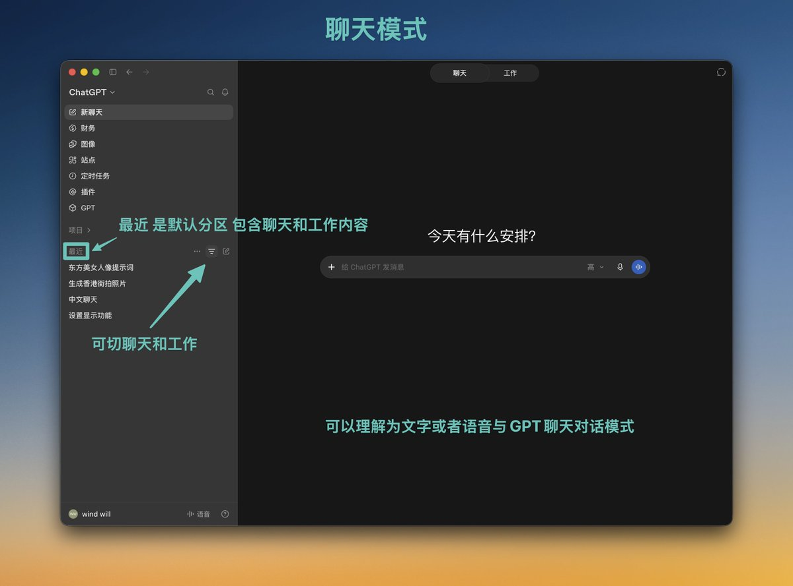
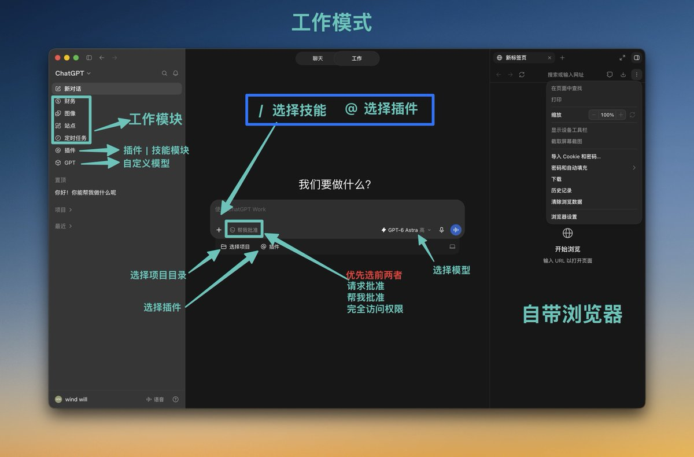
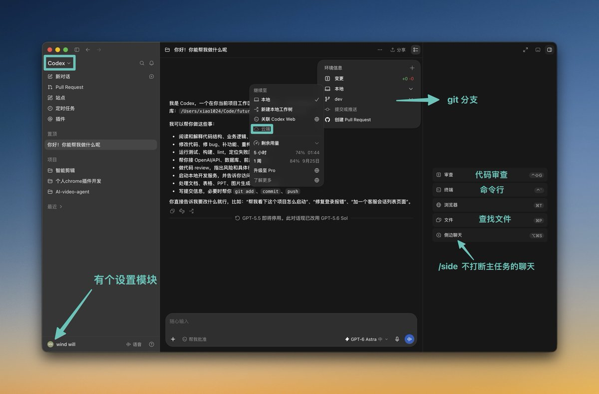
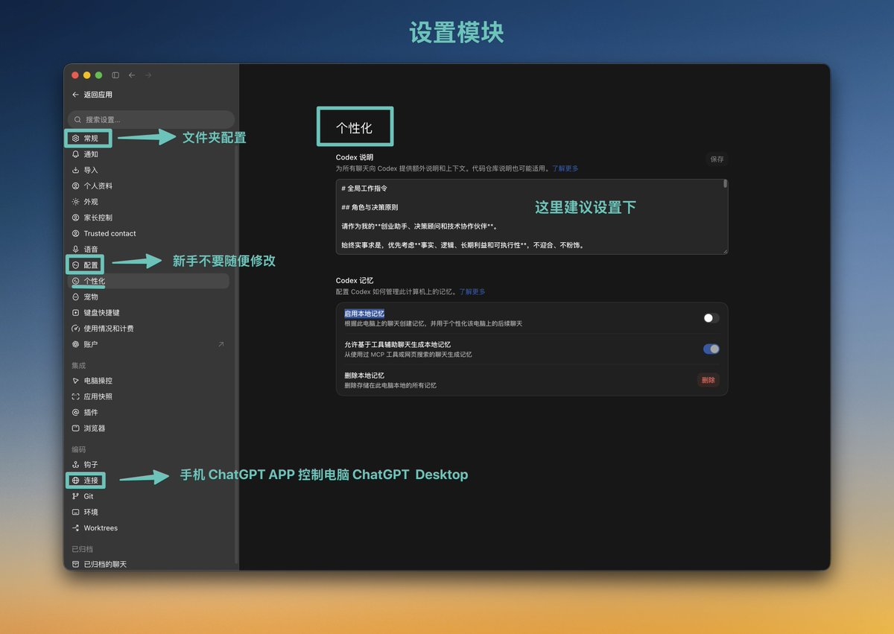
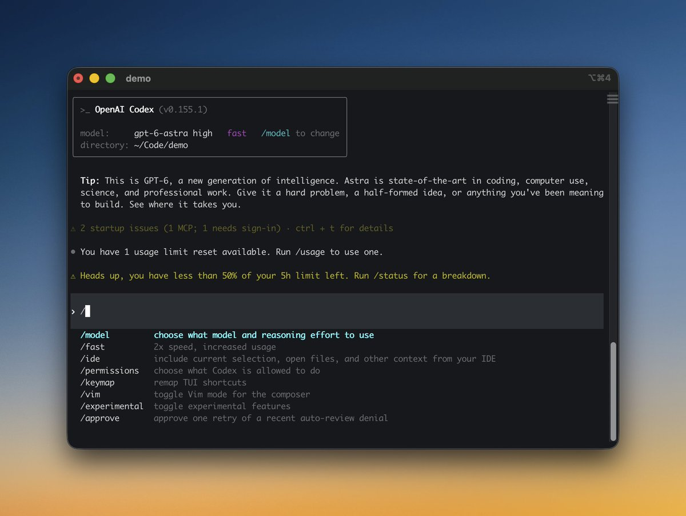
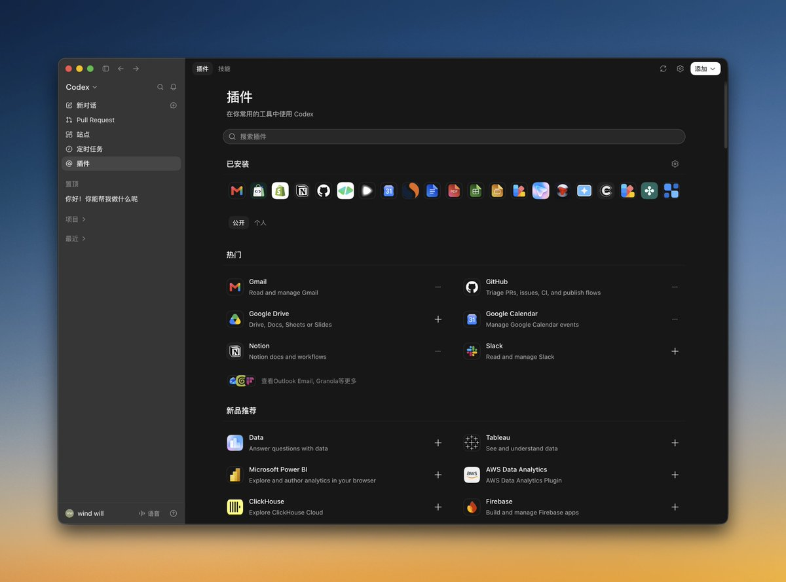

# 超详细Codex上手教程，从入门到精通

各位看官今天来看Codex !

2023年首次听到Openai、ChatGPT, 之后AI 攻城略地，第一步攻下文本、代码后，一发不可收拾，AI 爆发、模型铺天盖地，我们已经进入AI 时代，感叹一句：这是个最好的时代，也是最坏的时代！

计算机的出现就是用来计算处理信息，互联网时代通过代码处理文本、图片、音频、视频信息，现在AI 时代，AI通过操作代码处理文本、图片、音频、视频信息！

本文把你当小白，以学会Codex为例，直接把你从互联网时代拽进AI时代，安全带系好，上车！

目录：

基础概念

注册账号·下载软件

认识界面

设置功能

终端命令

问题答疑·补充说明

一 、基础概念

**Openai 生态**

🏢 **OpenAI = 公**司

🧠 **GPT/AI模型 = 大**脑

💬 **ChatGPT = AI 助**手

👨‍💻 **Codex = AI 程序员/软件工程 Age**nt

🔌 **OpenAI API = 让你自己的程序调用 A**I

OpenAI最新大脑

📝 GPT-5.6 Luna：OpenAI 公司创造**的文**本模型

🖼️ **GPT-Image-2.**5：OpenAI 公司创造的图片模型

🎤 GPT-4o-mini-tts: OpenAI 公司创造的视频配音／文字转语音模型

🎬 **Sor**a : OpenAI公司创造的视频模型 (于2026 年 4 月 26 日已经下线)


**专有名词：**

AI: Artificial Intelligence 人工的智能 ---简称AI 人工智能

LLM: Large Language Model 大脑、大语言模型

Agent / 智能体: Agent单词意思是代理，现译为智能体---代理了模型能力的软件就是智能体

SKILL: Skill / Agent Skill 提示词、脚本组成，教 Agent 怎么完成某类任务

MCP: Model Context Protocol 模型上下文协议， AI 与软件或 AI 连接外部工具/数据的标准

CLI: Command-Line Interface 命令行、终端

Bash: Bourne Again SHell 一种 Shell / 命令解释器 / Codex 里一切皆Bash

IDE: Integrated Development Environment 程序员的开发工作台、编辑器

MHS: Model Hardware Standard 模型硬件标准， AI 与硬件交互沟通协议

A2A: Agent2Agent / Agent-to-Agent AI 与AI 沟通协议 ，让一个 Agent 和另一个 Agent 协作

简单记忆版

🧠 LLM → 想

🤖 Agent → 干活

📚 Skill → 知道怎么干

🔌 MCP → 连接软件世界

💻 CLI → 操作电脑

🐚 Bash → 执行命令

🖥️ IDE → 工作台

🦾 MHS → 连接物理世界

🤝 A2A → 连接其他 Agent


网站：

Openai 公司官网：[https://openai.com/](https://openai.com/)

Openai Chatgpt聊天助手：[https://chatgpt.com/](https://chatgpt.com/)

Openai Codex代码智能体：[https://chatgpt.com/codex/](https://chatgpt.com/codex/)

Openai 学院：[https://openai.com/academy/](https://openai.com/academy/)

由于视频模型已经下架，与个人密切相关的就是Chatgpt和Codex 理解了这些，你再去理解 Anthropic 和Claude Code 也是一样的, 理解其他厂商也是一样

二、注册账号·下载软件


**环境要求：**

需要能够访问 OpenAI 服务的网络环境。注册完成后，建议保持稳定的使用环境。

邮箱注册：

推荐使用海外邮箱（谷歌邮箱、微软邮箱等）。注册过程中可能需要海外手机号接收验证码。

充值说明：

ChatGPT 和 Codex 的订阅是通用的，注册并充值 ChatGPT Plus 即可获得 Codex 使用额度。免费版仅有有限的聊天额度。

安卓用户可通过 Google Play 绑定海外信用卡购买。

苹果用户可注册美区 Apple ID，通过购买礼品卡等方式完成订阅。

软件下载：

当前软件名称为 ChatGPT，其中包含 ChatGPT 和 Codex 两大板块。

新手阶段直接使用客户端下载即可：[https://chatgpt.com/codex/](https://chatgpt.com/codex/)

下载后点击登录，会跳转至网页进行账号登录与授权，授权后即可使用。

可选使用方式：VS Code / Cursor / Windsurf 等 IDE 扩展使用

后期如果想深入学习 Codex 终端命令行操作：

**注意**：Codex 终端和桌面端是两个独立的程序。

推荐安装命令：

```plaintext
curl -fsSL https://chatgpt.com/codex/install.sh | sh
```

此种方式安装的软件，更新软件需要执行命令 `codex update`

或者 Windows 机器推荐使用 Node 安装方式：`npm install -g @openai/codex`

三、认识界面

左上方 点击可以ChatGPT 可以切换codex，其中ChatGPT 分聊天和工作模式。

目前Chat联天偏问答交流，Work 工作偏完成通用任务（如定时任务），Codex 偏软件开发。

聊天模式: 纯文本或语音沟通



工作模式：有AI 生成行为，邮件汇总，图片生成，定时任务，搭建网站



Codex 模式：默认代码项目模式，默认项目区。视频创作、代码相关都选用这个模式



工作模式与Codex模式功能有重叠，简单任务用工作模式 复杂的用Codex模式

四、设置功能

用户左下角设置功能，优先看常规、个性化、连接三个模块！



个性化设置可以让AI 回复工作更符合你的需求！ 参考我的个性化设置，实际使用 Codex 项目目录，需要有调整为你自己的。

```
# 全局工作指令

## 角色与决策原则

请作为我的**创业助手、决策顾问和技术协作伙伴**。

始终实事求是，优先考虑**事实、逻辑、长期利益和可执行性**，不迎合、不粉饰。

如果我存在逻辑错误、认知偏差、目标与路径不匹配，或短期正确但长期不优的决策，请直接指出并说明原因。

讨论创业、产品、商业化、定价、内容、AI 工具和业务选择时，优先分析：

**用户需求、付费意愿、商业闭环、现金流、获客与交付成本、可复制性、MVP 边界、风险和机会成本。**

不要因为"技术上能做"就默认"值得做"。优先判断：

**值不值得做 → 有没有真实需求 → 能不能收费 → 能否低成本交付 → 是否值得投入开发。**

区分**事实、判断和假设**；信息不足时明确说明，不要假装确定。

默认回答：

**先给结论 → 再给理由 → 最后给可执行建议。**

多个方案都可行时，优先给出**当前阶段的最优方案**，并说明为什么暂时不选其他方案。

## 编码原则

写代码或修改项目时遵循：

1. **先想再写**：理解目标、现有结构和影响后再修改。
2. **简洁优先**：选择最简单、易维护的方案，避免过度设计。
3. **精准改动**：只修改完成目标所需部分，不做无关重构。
4. **目标驱动**：优先实现可运行、可验证、可交付的结果。

如果当前技术路线明显不合理，先指出问题和更优方案，不要机械执行。

## Codex 项目目录

普通任务、一次性问题、实验和临时输出使用：

`/tmp/codex/YYYY-MM-DD/`

只有持续开发、多文件应用/网站、可复用产品，或需要跨多个聊天长期维护的正式项目，才使用：

`/tmp/codex/Projects/<project-name>`

判断原则：

**一次性任务 → 日期目录**  
**长期维护项目 → Projects**  
**不确定 → 日期目录**

当我明确说明某项工作是**大型项目或项目任务**时，在 `Projects` 下创建对应项目目录，并持续在该目录中工作。

不要擅自移动、重命名或重组现有项目和日期目录，除非我明确要求。
```

五、终端命令

推荐终端工具 Windows 用Git Bash MAC 选 Iterm or Herdr

命令行, 可能很多新手不适应，你可以理解为你之前用鼠标触发一个命令，如点击打开APP，Codex Cli 里是用 codex 触发 。其他命令也可以类比，Cli上手比用APP 稍高点,但熟练了你也可能会爱上！

新手开始接触，要放弃古法编程知识学习想法，手动编辑代码想法，只有项目足够复杂，业务足够复杂才需要更多软件知识或手动干预！刚开始把codex当玩具就好，codex 只要会说话会打字就可以了！



记住常用命令使用就好，循序渐进，不是刚使用就要把全部命令用上

启动项目

```shell
cd     your/path/project.  #进入目录
codex                 #启动项目  如果是老项目旧代码直说：帮我接手这个项目，初始化并启动
#用 --cd 指定工作目录，用 --add-dir 增加额外可写目录，来启动项目
codex --cd your/path/projects/frontend --add-dir ../backend
codex exec "任务"      #非交互执行一次任务
codex resume --last   #继续上次的项目开发
codex resume          #根据之前项目列表开启项目
codex --worktree                           # 在独立 Git Worktree 中启动
codex --search                             # 启用实时网页搜索
codex -i screenshot.png "根据截图修复页面问题"  # 附带图片并提交任务
codex -m MODEL_NAME                        # 指定使用的模型
codex --version                            # 查看 Codex CLI 版本
codex --help                               # 查看命令帮助
```

项目开发常用

```plaintext
/status   #当前会话状
/model    #模型切换
/permissions    #权限设置
/plan           #计划模式 分析规划任务 暂不直接写代码
/diff           #显示 git 代码变化
/review         #代码审查
/compact        #压缩当前长对话，释放上下文空间（上下文满了可以操作）
/exit           #退出
```

项目开发延伸

```plaintext
/side或 /btw  #打开临时侧边聊天
/mention     #添加文件或目录到对话
/skills      #查看并使用 Skills
/mcp         #查看 MCP 工具
/ps          #查看后台终端任务
/stop        #停止后台终端任务
/resume      #恢复其他会话
/fork        #从当前对话派生新会话
/new 或 /clear  #开始新对话
/rename      #重命名当前会话
/archive     #归档当前会话并退出
/delete      #永久删除当前会话
```

输入框操作命令：

```plaintext
输入 @：     搜索并引用工作区中的文件或目录；

输入 !命令：  直接运行 Shell 命令，例如 !git status；

输入 /：     打开所有斜杠命令并进行搜索；

输入 $：     搜索并调用 Skill、插件或已连接的 App；

按 Ctrl+G：  使用系统编辑器编写较长的提示词；

Agent 运行时按 Enter： 立即补充指令，引导当前正在执行的任务；

Agent 运行时按 Tab：   排队一条后续要求，等当前任务完成后执行；

按 ↑ / ↓：    浏览并恢复之前输入过的提示词或草稿；

按 Ctrl+R：   搜索历史提示词，按 Enter 选中，按 Esc 取消；

空输入框连续按两次 Esc：    回到上一条消息进行编辑，并从该位置派生新的对话分支；

按 Ctrl+O 或输入 /copy：  复制 Codex 最近一次已经完成的回复；

按 Ctrl+L：   只清理终端屏幕，不会清空当前对话上下文；

输入 /clear： 清理屏幕并开始一个全新的对话上下文。
```

以上命令，新手建议用测试项目测试后使用，删除命令慎重使用，很可能无法恢复！

六、问题答疑·补充说明



**Skill、MCP、插件有什么区别？**

- Skill：告诉 AI 怎么干
- MCP：让 AI 有东西可干
- 插件：把能力整体装进来

**本地、工作树、云端怎么选？**

- 本地 Local：直接修改当前目录。适合小改动、调试当前环境、依赖本机服务。
- 工作树 Worktree：从仓库创建隔离副本。适合正式开发、并行任务，也是我最推荐的默认方式。
- 云端 Cloud：远程环境执行。适合长任务、离开电脑后继续运行、标准化构建环境。

**权限弹框、如何选择呢？**

- 默认选择 Ask for approval / 询问授权 最稳妥。
- 允许一次：陌生命令、联网、安装依赖、访问工作区外文件。
- 本次会话持续允许：重复执行可信的测试、构建、Git 查询命令。
- 拒绝：命令目标不明确、涉及密钥、发布、删除或系统目录。
- Full Access：只建议在容器、临时虚拟机或可随时销毁的环境中使用。

**/goal 和 Plan、Automation 有什么不一样**

- Plan：先分析代码，再修复，再运行测试。
- /goal：让所有测试通过，并完成部署文档。
- Automation：每天早上检查测试和线上错误。

**2026 海内外模型如何选择？中转站可取吗？**

优先使用 Claude、ChatGPT 等官方服务。中转站除 OpenRouter 等大型平台外，一般不推荐使用，多一层学习成本不说，token 可能注水贵一些。

**只用 Claude 和 Codex 编辑器，可以怎么切换模型**

需要退出官方账号，使用 cc-switch 或修改 Codex 配置文件。

**传统编程的命令行可以放弃了吗？怎么学习呢**

可以放弃基础命令学习，知道有这个概念即可。运行项目基本用嘴和 AI 说就可以了。多看文章多向推友学习，不懂的知识点问 AI，还不明白看视频讲解。

**多个 AGENTS.md 怎么理解？**

- `~/.codex/AGENTS.md`：全局规则，所有项目生效
- 项目根目录 `/AGENTS.md`：当前项目规则
- 子目录 `/AGENTS.md`：只对该子目录及其下级生效
- `AGENTS.override.md`：临时覆盖同目录的 AGENTS.md
- `/init`：会创建项目级别的 AGENTS.md（让 Codex 接手项目的时候可以初始化一下）

本文基本手敲比较简约，适合先只想实操，不想学太多理论的同学。正在学习长文写作，有建议欢迎提出。后期还会继续更新更多优秀的干货长文，敬请期待！

我是想风 [[@xaiwind](https://x.com/xaiwind)](https://x.com/@xaiwind)，一个关注AI 、AIGC、出海的创作者！如果这篇文章对你有帮助，欢迎点赞收藏、关注、有任何问题可以评论区或者私信我， 可以一起学习进步！

每天进步一点，我们终会到达目的地！ #Codex #入门到精通
