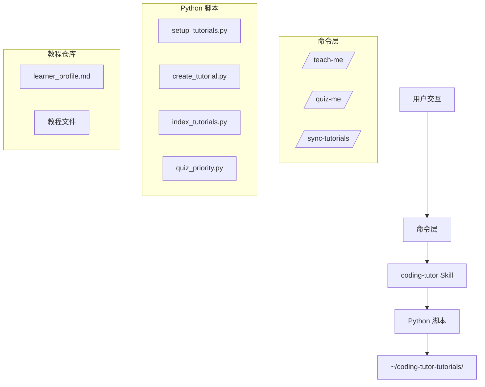
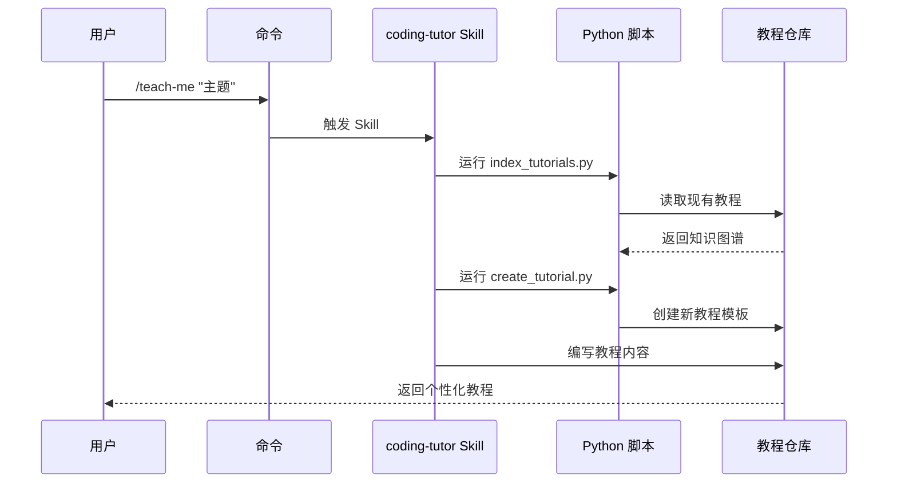
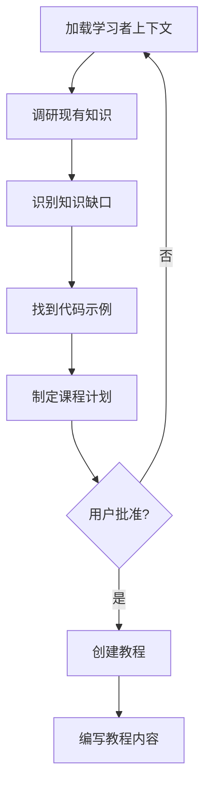

# Coding Tutor Plugin 架构详解

> 通过 AI 作为个人导师，基于 learner_profile 定制教程，从用户代码库提取实例，用斐波那契间隔重复巩固知识——从新手到高级工程师的 Agent 驱动学习系统。

---

## 核心设计理念

Coding Tutor Plugin 的核心目标是通过 AI 作为个人导师，帮助用户从新手快速成长为高级工程师。其设计哲学强调个性化学习、上下文相关性和间隔重复。

### 三大核心原则

1. **个性化学习** — 基于 `learner_profile.md` 捕捉用户背景和学习目标，定制专属教程
2. **上下文学习** — 直接从用户当前代码库中提取示例，学习内容立即可用
3. **间隔重复** — 通过测验系统强化记忆，实现长期知识保留

---

## 系统架构



### 数据流



---

## 核心机制

### 1. 教程生成流程

教程生成遵循严格的规划流程：



具体步骤：
1. **加载上下文** — 读取 `~/coding-tutor-tutorials/learner_profile.md`，了解学习者背景、目标和个性
2. **调研知识** — 运行 `index_tutorials.py` 了解已覆盖的概念、深度和理解评分
3. **识别缺口** — 找出最有价值的下一个概念，规划接下来 3 个教程
4. **找到锚点** — 在代码库中定位真实示例（抽象例子易忘，自己的代码记得牢）
5. **制定计划** — 向用户展示 3 个教程的课程计划，等待批准

### 2. 教程结构

每个教程采用标准化 YAML frontmatter：

```yaml
---
concepts: [概念列表]
source_repo: 仓库名
description: 教程摘要
understanding_score: null
last_quizzed: null
prerequisites: [前置教程]
created: DD-MM-YYYY
last_updated: DD-MM-YYYY
---
```

教程正文包含标准结构：问题引入 → 关键概念 → 代码库实例 → 动手练习 → 总结 → Q&A → 测验历史。

### 3. 间隔重复算法

使用斐波那契式间隔安排复习：

| 理解分数 | 复习间隔 | 策略 |
|---------|---------|------|
| 1-3 | 2天 | 需要重新教学 |
| 4-5 | 13天 | 部分理解，需强化 |
| 6-7 | 55天 | 理解扎实，定期复习 |
| 8-9 | 144天 | 掌握良好，长期复习 |
| 10 | 长期 | 可教他人 |

弱概念频繁演练，已掌握的概念淡出到长期复习。

---

## 关键设计亮点

### 活跃教程（Living Tutorial）

教程不是静态文档，而是持续演进：

- **Q&A 是强制的** — 学习者的任何澄清性问题都会被追加到教程的 `## Q&A` 部分，这些交流是其个性化学习记录的一部分
- 根据反馈更新教程内容
- 动态调整前置依赖关系
- 更新时间戳追踪演进
- `understanding_score` 仅通过 Quiz Mode 更新，不在教学中修改

### 学习者画像

`learner_profile.md` 维护：
- 技术背景和经验水平
- 学习目标和职业规划
- 个性特征和学习偏好

每次创建教程前都重新读取，确保教学内容始终与当前水平对齐。

### 跨平台支持

通过平台特定的 manifest 实现跨 AI 编程工具兼容：
- `.claude-plugin/plugin.json` — Claude Code
- `.cursor-plugin/plugin.json` — Cursor
- `.codex-plugin/plugin.json` — Codex

---

## 与 Agentic Engineer 的关联

Coding Tutor Plugin 是 Agentic Engineer 理念在教学领域的实践：

| Agentic 概念 | Coding Tutor 实现 |
|-------------|------------------|
| Skill 系统 | SKILL.md 定义教学哲学和工作流 |
| 项目记忆 | learner_profile.md + 教程仓库持久化学习状态 |
| 工具调用 | Python 脚本（create/index/quiz）作为 Agent 工具 |
| 自主循环 | Plan → Approve → Create → Quiz → Review 闭环 |
| Context 分区 | 教程生成时只加载相关 learner context 和代码示例 |

---

## 信息来源

- [EveryInc/compound-engineering-plugin](https://github.com/EveryInc/compound-engineering-plugin)
- `plugins/coding-tutor/skills/coding-tutor/SKILL.md`
- `plugins/coding-tutor/skills/coding-tutor/scripts/create_tutorial.py`
