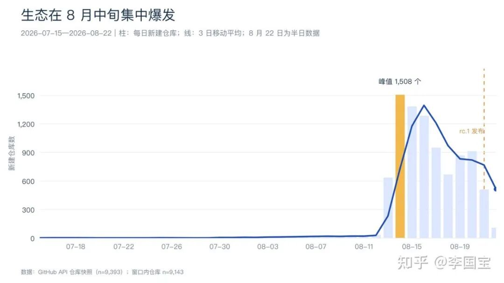
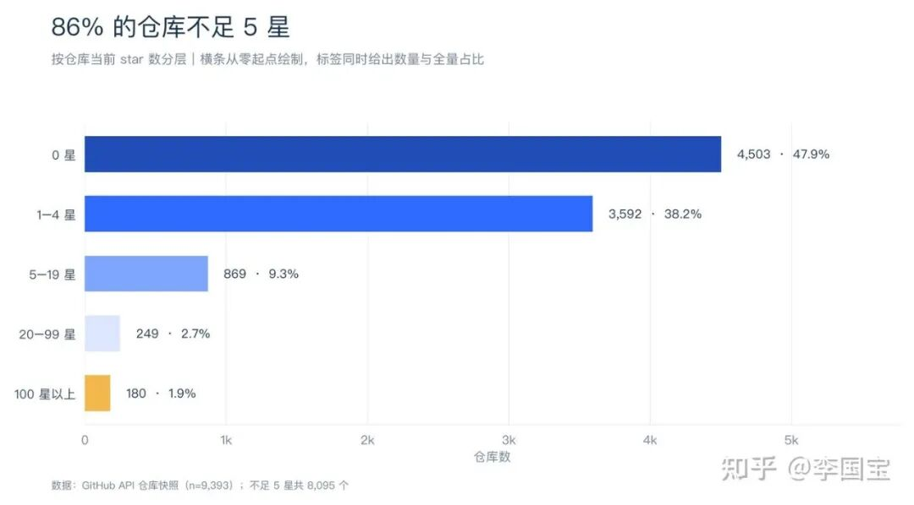
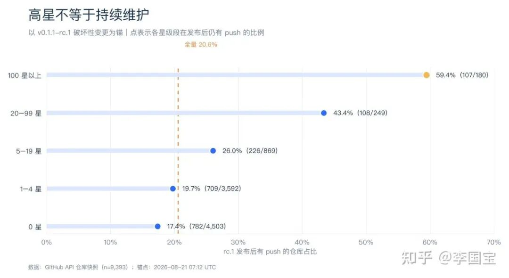
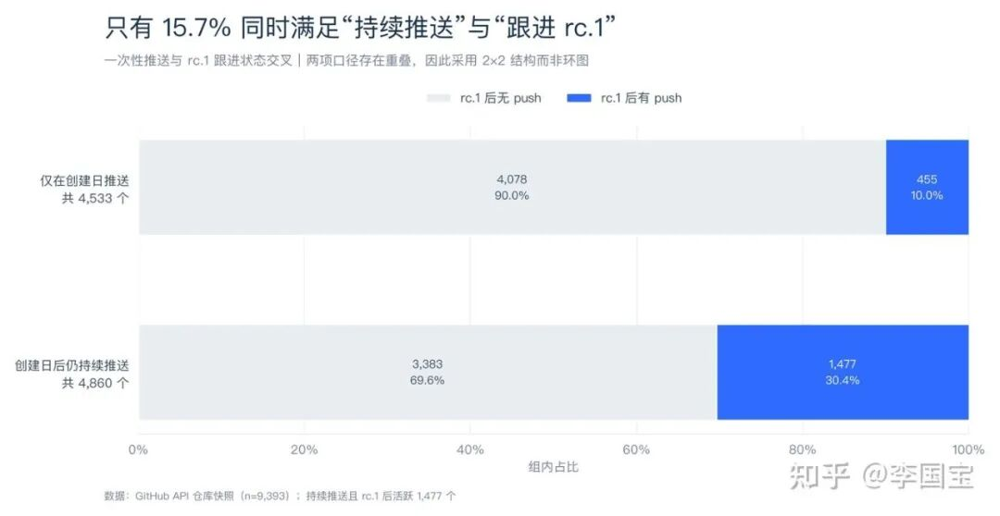
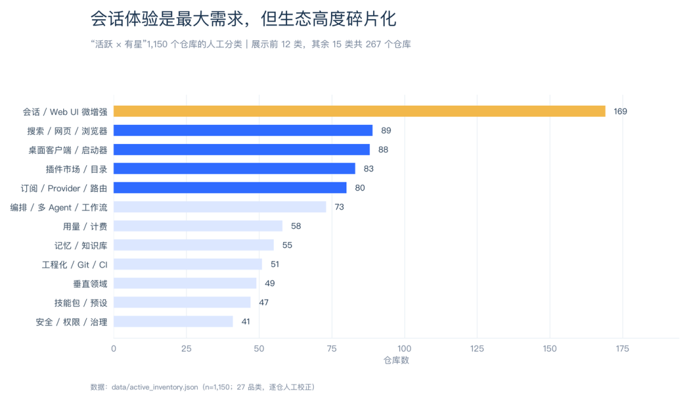

# 我扒了 1W 个仓库，重新看了一遍 DSH 插件生态

> 全文 AI 辅助写作，个人对内容负责。（怕撒？DSH 又不会来咬我。）

这次事情的起点，其实很简单。

DSH 插件突然多了起来。GitHub 上挂着 `dsh-plugin` topic 的仓库，官方计数已经到了 10,529 个。榜单也很多，推荐也很多，随便点开一个都能看见几千、几万 star 的“明星插件”。

但看久了会发现一个很现实的问题：

- 这里面到底有多少是为 DSH 而生的插件？
- 多少来自已有产品的适配？
- 又有多少还在持续维护？
- 更直接一点：如果现在真的要装，我该信谁？

所以我把这批仓库重新扒了一遍。不是看目录站转述，也不是只扫 star 榜。这次通过 GitHub API 实际去重枚举了 **9,393 个仓库**，读完 star ≥ 10 的 **701 个 README**，又把“活跃 × 有星”的 **1,150 个仓库**逐个过了一遍。

最后留下来的结论，比单纯看榜单要残酷一点：

> **DSH 插件很多，但真正值得持续追踪的，大概只有 305 个；其中原生且仍活跃的，大约 236 个。**

利益相关也先放在前面：`liguobao/deepseek-harness-remote` 是我自己的项目，后文 Remote 品类会单独讲到。

---

## 先说结论

如果只记几件事，五条就够了：

1. **topic 官方显示 10,529 个仓库**，我实际枚举到 9,393 个；rc.1 发布后仍有 push 的只有 1,932 个，原生且活跃的约 236 个。
2. **即使是 100★ 以上的头部**，rc.1 跟进率也只有 59.4%。
3. **视觉、桌面端、TUI、市场、远程和记忆治理**，都长出了明确的产品。
4. **工具谱系已经出现**，但影响力还没跟上插件规模。
5. **40 个桌宠、皮肤和小游戏**在 rc.1 之后全部还有 push；玩具不等于没价值，它们同样承担留存和情绪连接。

---

## 我是怎么筛的

这次审计分为全量枚举、README 深读和人工分类三层。具体做法和边界如下：

| 步骤 | 做法 | 这套口径的限制 |
|---|---|---|
| **全量枚举** | Search API 按 star 分桶，再按创建日期递归二分，绕过单查询 1,000 条上限；枚举逻辑有离线单测 | 评估当日约 1,100 个新建仓库未覆盖 |
| **README 深读** | star ≥ 10 的 701 个，加上活跃且有星的 1,150 个；每个读取前 8KB | star < 10 且不活跃的长尾只做元数据统计；其中 48% 是一次性仓库，逐个读的边际价值很低 |
| **活跃判定** | 以 rc.1 的发布时间 `2026-08-21T07:12:39Z` 为界，看之后是否有 push | 皮肤类未必受 API 破坏影响；锚点后只有约 36 小时，“未跟进”是风险指标，不是死亡证明 |
| **原生判定** | 结合 2026-02 后创建时间线、是否 DSH-first，以及 40 项 PRODUCT_FIRST 人工覆盖名单 | 边界项目可能存在分类争议 |
| **品类分类** | 先按关键词预分类，再逐行人工校正，最终得到 27 个品类和显式覆盖表 | 1,150 个仓库里有 16 个实在无法判断，只能归入“其他” |

这套方法不完美，但至少每个结论都能落回仓库、README 和时间戳，而不是“我感觉这个项目挺火”。

---

## 这波生态到底有多大

DSH 插件生态真正开始起量，是 2026 年 7 月底之后。

按创建日期看，8 月 13 日新增 639 个，8 月 14 日冲到 **1,508 个峰值**，之后依次是：

$$08\text{-}15\ (1,385) \to 08\text{-}16\ (1,289) \to 08\text{-}17\ (953) \to 08\text{-}18\ (671) \to 08\text{-}19\ (872) \to 08\text{-}20\ (917) \to 08\text{-}21\ (513) \to 08\text{-}22\text{ 半天 } (113)$$

看起来轰轰烈烈，不过把 star 金字塔摆出来，气氛就会冷静很多：

- **100★+**：180 个，占 1.9%
- **20–99★**：249 个
- **5–19★**：869 个
- **1–4★**：3,592 个
- **0★**：4,503 个

也就是说，**86% 的仓库不足 5★**。其中 0★ 和 1–4★ 两档合计 8,095 个。数量确实很大，但绝大部分增长都落在低认可长尾里。

*上图用 3 日移动平均压低了单日噪声，并标出了 rc.1 发布位置。8 月 13—20 日的集中涌入很明显，它并不是一条平滑的增长曲线。*

*星标分层坚持从零起点画横条，免得对数轴把本来就很少的头部仓库视觉放大。数据已经够热闹了，不需要图表再帮它加戏。*

更有意思的是生命周期：**48.3% 的仓库只在创建当天 push 过一次**，但真正点下 Archive 的只有 25 个。大家并没有正式宣布退出，只是再也没有回来。另有 10.4% 连描述都没有。

这就是一个典型的发射期生态：**数量先爆炸，维护能力还来不及形成。**

---

## rc.1 才是真正的试金石

官方 `v0.1.1-rc.1` 带来了破坏性变更，所以它刚好成为一次天然压力测试。

| 星级段 | rc.1 后仍有 push | 真活跃率 |
|---|---|---|
| **100★+** | 107 / 180 | **59.4%** |
| **20–99★** | 108 / 249 | **43.4%** |
| **5–19★** | 226 / 869 | **26.0%** |
| **1–4★** | 709 / 3,592 | **19.7%** |
| **0★** | 782 / 4,503 | **17.4%** |
| **全量** | 1,932 / 9,393 | **20.6%** |

如果再看“活跃 × 有星”的交集：

- **≥ 1★**：1,150 / 4,890，约 24%
- **≥ 5★**：441 / 1,298，约 34%
- **≥ 10★**：305 / 701，约 44%
- **≥ 20★**：215 / 429，约 50%
- **≥ 100★**：107 / 180，约 59%

我的估算是，整个生态里真正能跟上版本节奏的，大约有 **700–900 个**。其中 DSH 原生插件的 rc.1 跟进率是 44%，也就是 236/538，明显比全量更健康。

这里还有个容易误读的地方：48.3% 的“只在创建日推送”和 20.6% 的“rc.1 后有 push”并不互斥。因为有 455 个仓库是在 rc.1 发布后新建，然后只推送了一天。真正同时满足“创建日之后还持续推送”和“跟进 rc.1”的，是 **1,477 个**，占全量 15.7%。

所以，1,932 个“rc.1 后活跃”更适合拿来观察版本响应；如果要判断持续维护，**1,477** 这个数字更有意义。

---

## 1,150 个活跃插件，大家都在做什么

逐行校正完 1,150 个活跃且有星的仓库后，我把它们分成了 27 类。表中简称对应的完整仓库地址统一放在附录。

| 品类 | 数量 | 头部代表 | 我的判断 |
|---|---|---|---|
| **会话/Web UI 微增强** | 169 | `DSH-better-sidebar`（2.6k）、`dsh-genui` | 第一大类，主要补充导航、折叠、输入历史、撤回等交互细节 |
| **搜索/网页/浏览器** | 89 | `BrowserSkill`（1.3k）、`dsh-free-search`、`modsearch` | 刚需，基本属于装了就回不去 |
| **桌面客户端/启动器** | 88 | `anywhere-labs`（18k）、`hairyf`（907，Tauri 5MB） | 需求明确，可选方案数量较多 |
| **插件市场/目录** | 83 | `awesome-dsh-plugin`（11.3k）、`AdamPlatin123`（1.3k） | 五种形态并行，验证方式各不相同 |
| **订阅/Provider/路由** | 80 | `dsh-plugin-subscriptions`、`codex-oauth` 系 | 原生项目数量较多，品类 rc.1 跟进率为 32% |
| **编排/多 Agent/工作流** | 73 | `dsh-agent-teams`（784）、`taskboard` 系、`dsh-cron` | 第二条增长曲线，正在从单会话走向团队看板、后台代理和定时任务 |
| **用量/计费** | 58 | `TokenLedger`（130）、`dsh-cost-meter`（153） | 峰谷计费形成了一个迷你亚品类，至少有 7 个错峰省钱插件 |
| **记忆/知识库** | 55 | 官方 `dsh-mnemon`、`dsh-memory-evolve`（218）、`dsh-noema`（121） | 原生层开始争治理和整理，rc.1 率 70% 全场最高；竞争在 rc.1 前一周才爆发，项目均创建于 08-05 后 |
| **工程化/Git/CI** | 51 | `dsh-auto-review`（73）、`checkpoint-rewind`、`harness-action` | 主要在补 Claude Code 已经有的能力 |
| **垂直领域** | 49 | A 股研究、数学建模、EDA、J-Link 调试、ROS2 | “一切皆插件”兑现得最充分的一类 |
| **技能包/预设** | 47 | superpowers 移植系、`anchored-standard`（3.7k） | 预设形态丰富，也有明确的用户需求 |
| **安全/权限/治理** | 41 | `dshscan`、`auto-approve` 系、`dsh-defend`、`time-travel` | 防御谱系已经完整，但没有一个 200★+ 且适配 rc.1 的原生项目 |
| **视觉/多模态** | 40 | `modlens`（3.5k）、`dsh-vision-router`（936）、`dsh-vision-toolkit`（805） | 由 V4 纯文本限制直接派生的纯原生赛道 |
| **娱乐/桌宠/皮肤** | 40 | `dsh-pet`（311）、`petdex`、鲸鱼娘系 | 活跃的娱乐层，也是留存粘合剂 |
| **IM/通知** | 30 | `dsh-im`（470，9 渠道）、飞书家族 | 中文生态特征很明显，飞书系最密 |
| **远程/移动** | 29 | `dsh-remote-web-gateway`（116）、`dsh-mobile-apk`（112）、`liguobao/deepseek-harness-remote`（48） | Web 网关、APK、中继加多客户端三条路线都活了下来 |
| **TUI/终端** | 23 | `dsh-TUI`（2.3k）、`tianshu-tui` | Claude Code 风终端壳有稳定需求；后者使用自研 ANSI 核心 |
| **IDE 集成 / 文件工作区 / MCP / 上下文 / 语音** | 66 | `for-vscode`、`paste-input`、`mcp-panel`、`context-doctor`、`billion-context` | 基础体验补齐层 |
| **独立产品 / 教程 / 其他** | 38 | `open-design`、`learn-harness-engineering`（13.6k）、`PicGo` | 元生态与教程类内容 |

如果只看 star ≥ 10 且活跃的 305 个仓库，结构还会再变一次：市场/目录有 29 个，桌面客户端有 28 个，占比明显上升。这说明最早吃到 star 的是基础设施。反过来，1–9★ 长尾里最密集的 Web UI 微增强，在这里仅排第四。

**做的人很多，不等于被认可得更多。插件生态也遵守这个朴素规律。**

从图上也能看见，这里没有一个真正垄断的赛道。更接近的形状是：**一个很大的需求，带着一串中型赛道，以及大量补细节的小插件。**

---

## Remote 赛道：最后活下来的是三条路线

这是我自己有利益相关的一节，所以把数据直接摆出来。表中项目的完整仓库地址统一放在附录。

| 项目 | Star | rc.1 | 技术路线 |
|---|---|---|---|
| `dsh-pocket` | 393 | ✗ | 手机扫码同屏 |
| `dsh-remote-web-gateway` | 116 | ✓ | Web 网关 |
| `dsh-mobile-apk` | 112 | ✓ | APK 打包 |
| `dsh-mobile`（saya-ch） | 101 | ✗ | 原生 App，Alpha |
| `liguobao/deepseek-harness-remote` | 48 | ✓ | 中继 + 端到端加密，多客户端：浏览器 / VS Code / Android |
| `xgone/dsh-remote` | 42 | ✓ | LAN 认证层 |
| `DeepSeekHarnessRemoteGateway` | 19 | ✗ | sidecar 网关 |
| 其余：`dsh-tether`、`dsh-phone`、`dsh-lan-gate` 等 | ≤18 | 部分 | P2P / FRP / Tailscale 教程流 |

按 rc.1 标准筛完，真正留下来的主要是三条路线：**Web 网关**、**APK**，以及**中继加多客户端**。

我的 `liguobao/deepseek-harness-remote` 属于第三条，也是其中唯一同时实现端到端加密、中继不可见明文、只读文件预览和设备级撤销的方案。

---

## 我认为最出色的十个原生插件

这里的筛选条件是：**原生、已经适配 rc.1，并且有相对不可替代的价值**。

1. **`modlens`**（3.5k★）：2026 年 2 月出现，生态最早且仍在维护的原生插件，也是视觉桥的定义者。
2. **`anywhere-labs/deepseek-harness-desktop`**（18k★）：原生 star 第一，桌面端事实标准。
3. **`awesome-dsh-plugin`**（11.3k★）：策展头牌，也是事实目录标准。
4. **`dsh-web-ui`**（5.5k★）：Web 端皮肤和插件集合。
5. **`DSH-better-sidebar`**（2.6k★，官方）：侧边栏底座，支持三方扩展注册。
6. **`dsh-TUI`**（2.3k★）：被官方公众号收录的终端补位。
7. **`dsh-market`**（1.7k★）：DSH 内置插件市场。
8. **`AdamPlatin123/awesome-dsh-plugins`**（1.3k★）：唯一做容器实测的目录，选型可信度最高。
9. **`dsh-agent-teams`**（784★）：多 Agent 编排。
10. **`deepseek-harness-remote`**（48★）：多端端到端加密安全远程接入。

---

## 逐行理完 1,150 个 README 后，几个有趣的发现

1. **PerryLink 像一个人的插件工坊**：他在活跃集中有 24 个仓库，从 `PerryLink/dsh-auto-review`、`PerryLink/dsh-permission-rules` 到 `PerryLink/dsh-checkpoint-rewind`，而且全部适配 rc.1。大概就是一个人的 JetBrains。
2. **官方维护纪律明显好于社区平均**：`omdsh-dev` 有 30+ 个活跃仓库，全部适配 rc.1。
3. **峰谷计费复刻了电费焦虑**：`TUcookie/dsh-offpeak-saver`、`KhalilYamber/dsh-tidewatch`、`c-ling/dsh-plugin-peak-pricing` 等至少 7 个项目都在帮用户错峰省钱。只要价格曲线开始变化，人类就一定会想办法薅平它。

---

## 如果现在要装，我会怎么选

起步阶段，先按自己的需求确定品类，再从已经适配 rc.1、仍在持续维护的项目中选择。下面这些方向可以作为参考：

- **记忆**：`omdsh-dev/dsh-mnemon` 或 `csyangwen/dsh-memory-evolve`
- **视觉**：`liustack/modlens`
- **上下文**：`bowenliang123/dsh-context`
- **用量**：`zh667/TokenLedger`
- **安全**：`lire1131/dsh-undo-savepoint` + `omdsh-dev/dsh-security-audit`
- **远程访问**：`liguobao/deepseek-harness-remote`（允许我自己打个广告吧？！！！）

> **安装前再看三个指标**：适配最新 rc / 持续 push / 被实测型目录收录。

---

## 结语

DSH 插件生态现在很像一座刚刚拔地而起的集市。

摊位很多，招牌也很大，真正沿着仓库、时间戳和 README 走一遍，会发现它的内核才刚刚形成。

接下来决定它能不能留下来的，不是下一轮又多出几千个仓库，而是**下一次破坏性变更之后，还有多少作者会回来**。

---

## 附录：数据快照与复现

开源仓库：`liguobao/dsh-plugin-bench`

### 文中仓库地址

以下为正文中能够唯一定位到具体仓库的项目。共 59 个，已于 2026-08-23 通过 GitHub 核验，均为公开且未归档仓库：

- **核心榜单与荣誉提及**：`liustack/modlens`、`anywhere-labs/deepseek-harness-desktop`、`awesome-dsh-plugin/awesome-dsh-plugin`、`zhu1090093659/dsh-web-ui`、`omdsh-dev/DSH-better-sidebar`、`ccch1mneyyy/dsh-TUI`、`dsh-market/dsh-market`、`AdamPlatin123/awesome-dsh-plugins`、`NanmiCoder/dsh-agent-teams`、`liguobao/deepseek-harness-remote`、`liustack/modsearch`、`hairyf/deepseek-harness-desktop`、`omdsh-dev/dsh-mnemon`、`bowenliang123/dsh-context`
- **品类代表**：`omdsh-dev/dsh-genui`、`Tencent/BrowserSkill`、`DDDMUC/dsh-free-search`、`V1ki/dsh-plugin-subscriptions`、`omdsh-dev/dsh-cron`、`zh667/TokenLedger`、`Han-1413141/dsh-cost-meter`、`csyangwen/dsh-memory-evolve`、`ZSeven-W/dsh-noema`、`PerryLink/dsh-auto-review`、`PerryLink/dsh-checkpoint-rewind`、`Lixiaoyiao/deepseek-harness-action`、`xiaobright/dsh-anchored-standard`、`shaoshi20/dshscan`、`PerryLink/dsh-defend`、`helibeiqi/dsh-time-travel`、`ysr666/dsh-vision-router`、`Anionex/dsh-vision-toolkit`、`PC2005-cloud/dsh-pet`、`crafter-station/petdex`、`xmanrui/dsh-im`、`huiliyi37/dsh-tianshu-tui`、`skymecode/deepseek-harness-for-vscode`、`lhh010/dsh-paste-input`、`PerryLink/dsh-mcp-panel`、`Zhenyu98/dsh-context-doctor`、`Tyan66666/billion-context-dsh`、`nexu-io/open-design`、`walkinglabs/learn-harness-engineering`、`Molunerfinn/PicGo`
- **远程与移动**：`summer1238/dsh-remote-web-gateway`、`kelai141/dsh-mobile-apk`、`shaobeichen/dsh-pocket`、`saya-ch/dsh-mobile`、`xgone/dsh-remote`、`lbwnb666-ai/DeepSeekHarnessRemoteGateway`、`zexadev/dsh-tether`、`railgun0325/dsh-phone`、`hchao3335-maker/dsh-lan-gate`
- **发现与安装建议**：`PerryLink/dsh-permission-rules`、`TUcookie/dsh-offpeak-saver`、`KhalilYamber/dsh-tidewatch`、`c-ling/dsh-plugin-peak-pricing`、`lire1131/dsh-undo-savepoint`、`omdsh-dev/dsh-security-audit`

### 元数据口径

- **评估与抓取日期**：2026-08-22（UTC+8）
- **GitHub topic 官方计数**：10,529
- **实际去重枚举**：9,393，覆盖率约 89%
- **rc.1 分界时间**：`2026-08-21T07:12:39Z`
- **工具**：GitHub Search/Repos API（`gh` CLI）与分类脚本；枚举逻辑有离线单测
- **复现三桶分类**：`python3 scripts/classify_native.py`
- **复现图表**：`python3 scripts/make_charts.py`
