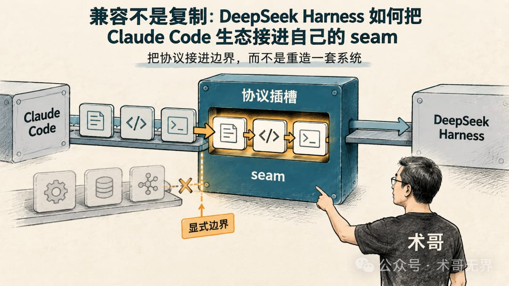
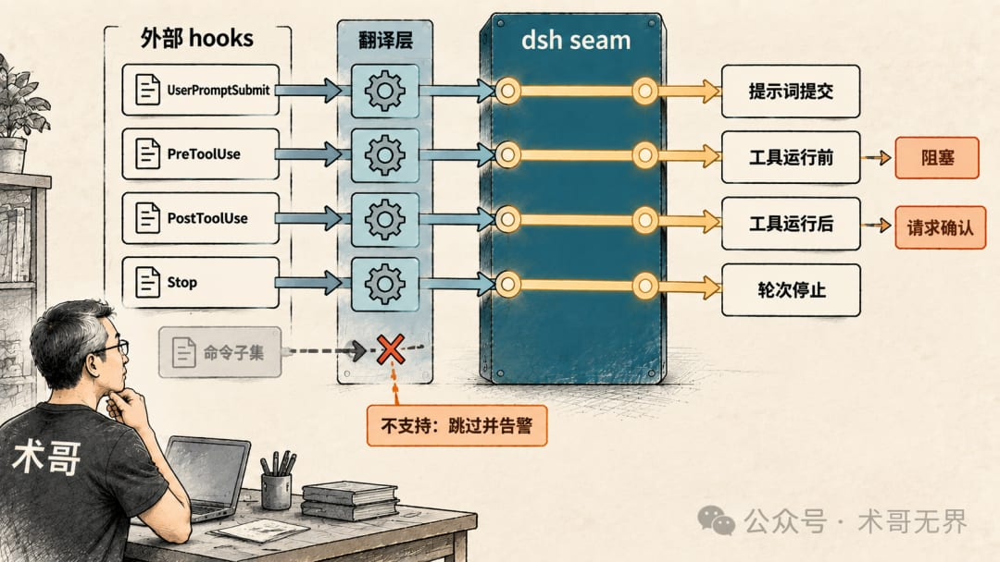
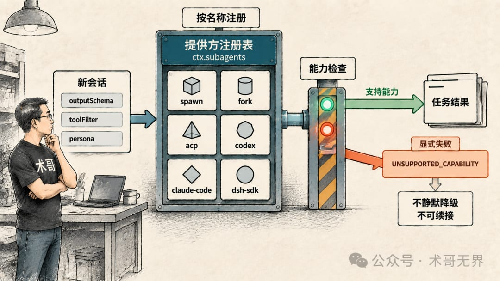
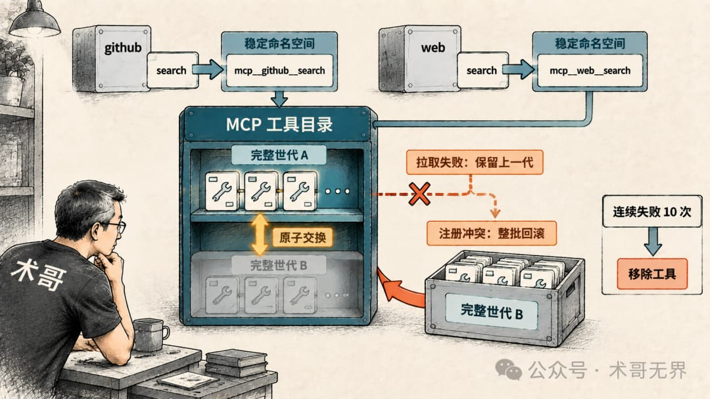
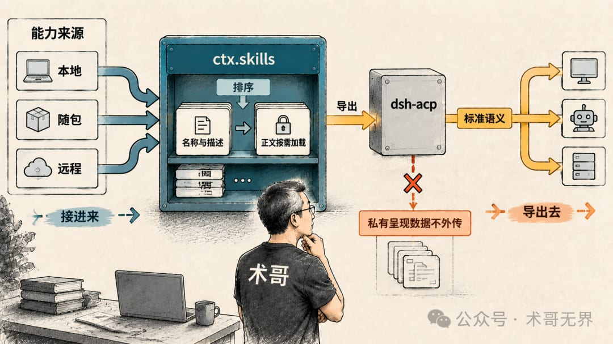
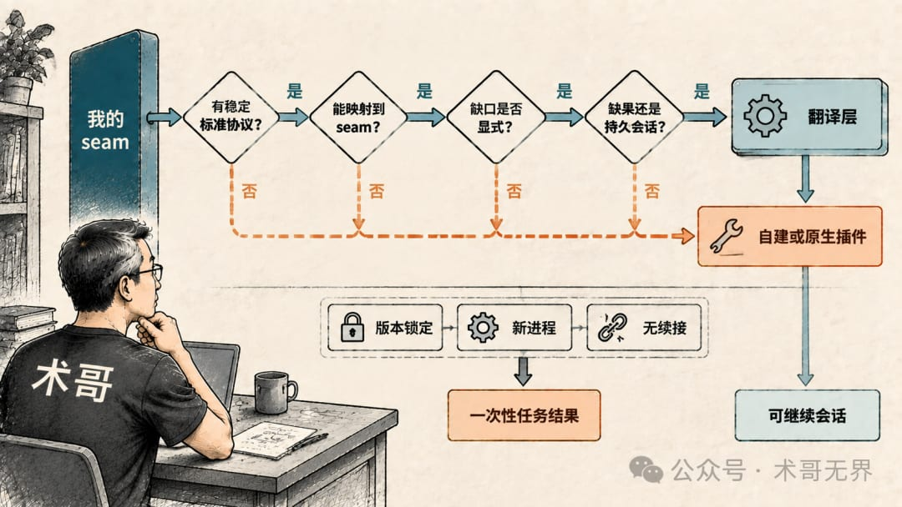

# 兼容不是复制：DeepSeek Harness 如何把 Claude Code 生态接进自己的 seam

🚩 2026 年「术哥无界」系列实战文档 X 篇原创计划 第 203 篇，DeepSeek Harness最佳实战「2026」系列第 06 篇大家好，欢迎来到术哥无界 | ShugeX ｜ 运维有术。我是术哥，一名专注于 AI 编程、AI 智能体、Agent Skills、MCP、云原生、AIOps、Milvus 向量数据库的技术实践者与开源布道者！Talk is cheap, let's explore。无界探索，有术而行。封面：现成协议变成自己的插槽——外部生态接进内部 seam打开hooks-claude-code的源码之前，我以为它是在 dsh 里再实现一套 Claude Code 的钩子系统。结果src/index.ts没有定义自己的 agent 循环，全文都在ctx.on(...)：订阅 dsh 已经存在的事件。这个反差，正好说明 dsh 接 Claude Code 生态的办法：不另起炉灶，把现成协议变成自己的插槽（seam）。先交代边界：我核对的是dsh-v0.1.3-alpha.1这一版源码（commitd347e70390），没有运行 dsh，所有运行行为都按源码和文档表述，不写“跑通了”。01 原生钩子不是一个包01 原生钩子不是一个包 配图dsh 设计记录里有一句原话，是整套 hooks 兼容的地基：「原生钩子」不是一个包——原生钩子只是一个普通的 Cordis 插件，订阅规范的生命周期事件。CC/Codex 桥接只是将外部 shell 钩子协议映射到同一接口的翻译层。换句话说，dsh 自己在关键时刻拦截 agent 的能力，不是一个叫 hooks 的组件，而是几个类型化的生命周期扩展点：提示词进来之前、工具运行前后、轮次要结束时。任何插件都能订阅它们，外部产品的 hooks 协议则由翻译层接进来。hooks-claude-code/src/index.ts把这层翻译写得很直白：UserPromptSubmit接到agent/pre-step，返回reject就阻塞提示词；PreToolUse接到tools/pre-execute，决策映射为deny（拒绝）或ask（请求确认）；PostToolUse接到tools/post-execute，deny变成带反馈的block；Stop接到agent/turn-stopping，阻塞钩子会调用agent.steer()，让模型再走一步。每个事件的 payload 也由翻译层拼出 Claude 形状的session_id、hook_event_name、tool_name，并替换环境变量${CLAUDE_PROJECT_DIR}。命令在 agent 的会话工作区里跑，不是服务器启动目录。这里要停一下：翻译层存在的理由，是你手里已经有写好的hooks.json。原生插件能直接摸到完整的ctx，没有序列化边界，返回值也是类型化的。所以 dsh 明确把兼容范围压成 command hook 子集：Claude Code 当前 30 项事件只支持 7 项，Codex 10 项只支持 5 项；http、mcp_tool、prompt、agent这些 handler 直接跳过并告警。不支持的配置在解析时被忽略，既不会让整个配置失效，也不会注册一个假装能用的钩子。说白了，兼容不是全量对齐，而是协议对齐子集加显式边界。不支持的，直接不承诺，总比假装支持强。02 subagent：按名字注册的插槽02 subagent：按名字注册的插槽 配图hooks 是翻译层，subagent 更接近插槽本体。dsh 的ctx.subagents是一个按名称注册的提供方注册表：spawn、fork、acp、codex、claude-code、dsh-sdk六个后端共存，按名字取用。子系统文档特意对比：bash 只允许一个执行器，而 subagent 在同一上下文可以共存多个提供方实现。每个提供方声明一组能力旗标（SubagentCapabilities）：agentOptions、outputSchema、depthLimit、toolFilter、persona。服务在真正启动子 agent 之前检查这些旗标；请求带了提供方没有的能力，直接抛类型化错误UNSUPPORTED_CAPABILITY。源码注释把这叫“fail loud, no silent degradation”（显式失败，不静默降级）：不会接受请求后悄悄忽略参数。产品后端就是这条规则的活例子。subagent-claude-code用官方 Agent SDK0.3.241（携带 Claude Code 2.1.241 的平台载荷），subagent-codex用官方@openai/codex@0.149.1的app-server --stdio起一个临时线程。两个后端都不声明那些共享能力，所以调用方传output schema、工具过滤、persona 都会被拒绝。它们只做一件事：收一个自包含文本任务，跑一个全新、不可续接的产品会话，把最终答案拿回来。每次委派都是全新进程：Claude 侧一个新 SDK query，Codex 侧initialize握手后thread/start一个ephemeral: true线程，等item/completed里phase: "final_answer"的 agentMessage，turn/completed则是这一轮的终止边界。没有续接、没有池化、没有恢复；中间消息、推理、工具活动、工作区差异一概不进父上下文。权限模式也是翻译过的：Claude 默认dontAsk，不弹窗、直接拒绝未授权操作；Codex 默认never，永不请求审批。原生配置和登录状态始终是权威，包只负责把任务送进去。这也回答了一个常被问的问题：为什么不自建协议，直接调模型？直接模型 HTTP、codex exec、手写 Claude CLI 协议，都绕过产品的官方可扩展集成接口，无法证明原生配置、工具、审批、结果语义和资源清理；而任务、cwd、取消、进程树这些共享职责，现有 seam 已经管了，再写一个辅助包只是责任重复。把产品进程包进官方接口，就把兼容的证明责任交给官方协议，避免自己再造一个看起来像的版本。代价也明摆着：每次委派一个新进程，加一份独立模型上下文；后端静态绑定在 Profile 配置上，产品会话不持久。需要可继续、可恢复的子 agent 时，得用 dsh 自己的进程内后端（spawn/fork），产品后端不参与。外部产品贡献的是一次性任务结果，持续对话是 dsh 自己长出来的能力。03 能力缺口：显式拒绝，而不是静默降级03 能力缺口：显式拒绝，而不是静默降级 配图几个兼容包放在一起看，它们对失败的态度高度一致，这也是这套策略最值得抄的地方。hooks 这边：配置读不出来、解析失败，桥接记录警告，agent 照常启动，但一个钩子都不注册；钩子命令崩溃或返回非 2 退出码，记录下来，agent 继续跑；退出码 2 以 stderr 作为阻塞原因，干净退出码 0 携带结构化permissionDecision=deny时同样阻塞。payload 也很诚实：Claude 钩子本该拿到的transcript_path永远为空字符串，因为 dsh 的持久化 seam 不暴露产物路径；Codex 那边的model、permission_mode是静态配置值而不是运行时真值；systemMessage这类字段记录加告警，但不假装生效。MCP 客户端是同一种风格。外部服务器工具进来，身份由本地命名空间稳定生成：mcp__`<serverName>`__`<rawName>`，比如mcp__github__create_issue。两个服务器都有叫search的工具，就分别叫mcp__github__search和mcp__web__search，互不打架。工具目录更新是完整世代原子交换：拉取失败就保留上一世代，注册冲突就回滚整批；服务器把同一工具列了两遍，整份工具列表被拒绝，绝不给你半套工具。重连也有预算，连续失败十次就把该服务器的工具移除，而不是让模型对着一个永远调不通的工具列表推理。静默降级是最坏的失败模式。模型以为工具在、钩子生效、能力可用，拿到的却是假象，推理方向会错得离谱。一个兼容层值不值得信，先看它的失败模式是不是显式，再看它敢不敢把不支持什么写清楚。这两个 hooks 包的 README 都有“已知限制与延期工作”章节，把不支持的事件、不生效的字段一条条列出来，姿态值得借鉴。04 skills 与 ACP：能力来源和导出都是协议04 skills 与 ACP：能力来源和导出都是协议 配图前三节讲的是外部生态进来。插槽策略还包括两件事：把能力来源协议化，把自身能力协议化地导出去。skills 是能力来源协议化的例子。dsh 的ctx.skills是一个分层注册表，本地、随包、远程任何来源，只要实现list/get两个方法就能贡献技能。本地发现有一张 rank 优先级表：项目根的.dsh/skills是 100，项目根的.agents/skills是 200，然后是自定义目录、用户目录、随包目录。也就是说，.agents/skills只是能贡献技能的地方之一。模型在会话里只看到排序后的技能名称和一句描述，正文按需加载、不缓存。把目录做成协议接口，好处是任何提供方都能接入；快照完整性负责兜底：哪次发现没跑完整，这版目录就不缓存，宁可下次重查也不给半截列表。ACP 是导出侧的例子。dsh-acp是一个按标准 Agent Client Protocol v1 跑的自动化服务器，进程外 subagent、测试运行器、脚本化控制器都能用它创建、恢复、驱动、关闭持久会话。它刻意只发送标准语义更新，原始提供方增量、重试细节、DSH 私有呈现数据一概不进协议；session/load、fork、elicitation 这些界面明确不支持。一句话：它把 dsh 的能力压缩成标准协议暴露给程序，不把自家 UI 拆出去。到这里，插槽策略的三个方向就齐了：hooks、subagent、MCP 把现成生态接进来；ACP 把 dsh 自己用标准协议导出去；skills 是自己长出来的能力面。兼容是双向的：接进来和导出去，用的是同一套协议在边界对齐的思路。05 边界：什么情况下才该自建05 边界：什么情况下才该自建 配图插槽策略不是免费的，代价集中在几个地方。第一，协议对齐的复杂度全部压在桥接包和后端包上，而且被版本锁死。Claude 侧锁 Agent SDK0.3.241，Codex 侧锁@openai/codex@0.149.1，升级要重新生成上游 schema 证据、重跑无密钥产品测试和带密钥 e2e。第二，产品能力随上游演化，dsh 明确不镜像产品规则：不创建账户、不解析模型别名、不发现 fallback、不复制或过滤原生设置。第三，一次性的产品会话意味着没有进度流、没有续接、没有副作用回滚，这些都要调用方自己承担。还有一个值得知道的缝。Codex 0.149.1 走 Responses 协议，而 DeepSeek 的公开 OpenAI 兼容端点走 Chat Completions，仓库的带密钥 e2e 为此用了一个仅限回环、仅供测试的桥接层。这不是生产代理，但它说明产品协议和模型厂协议之间那道缝是真实存在的，正式接入要填的东西，测试先替你填了一遍。自建协议绕不开这道缝，只会把填缝变成你永久的运维负担。那什么时候该自建？我的判断是四个问题，问完就有答案：外部能力有没有公开稳定的标准协议？没有，就别硬兼容，自建或写原生插件。协议语义能不能映射到我的内部 seam？能，写翻译层；不能，显式拒绝，别硬拗。能力缺口怎么暴露？显式错误和诊断优于静默降级，这是底线。我要的是“任务结果”还是“产品会话”？只要结果，一次性后端够用；会话持久化、续接、结构化输出是核心诉求时，才值得自己建。还有一个前提容易被忽略：插槽策略之所以成立，是因为 dsh 自己先把 seam 画清楚了。翻译层能这么薄，是因为底下有类型化的生命周期扩展点、有具名的 provider 注册表、有原子替换的工具目录。没有这些内部接口，兼容就会退化成适配器堆砌，每个协议各写一套，越写越乱。06 收束回头看，这套策略真正可用的地方，在于三件事：外部协议进的是 dsh 已有的内部 seam，能力缺口全部显式暴露，生命周期和资源清理只有一个责任方。兼容的最高形态，是把边界安排好。如果你也在给自己的 agent 接现成生态，先把内部 seam 画出来，再决定哪些协议能进、哪些必须拒绝，比逐条对功能清单更值得先做。这篇是 dsh 兼容面的一角，后面可以继续挖 subagent 的可继续会话和 MCP 重连这些机制，也可以聊聊你在迁移时撞上的边界。欢迎拿你的实际迁移经验来对答案。好啦，谢谢你观看我的文章，如果喜欢可以点赞转发给需要的朋友，我们下一期再见！敬请期待！

> 🚩 2026 年「术哥无界」系列实战文档 X 篇原创计划 第 203 篇，DeepSeek Harness最佳实战「2026」系列第 06 篇大家好，欢迎来到术哥无界 | ShugeX ｜ 运维有术。我是术哥，一名专注于 AI 编程、AI 智能体、Agent Skills、MCP、云原生、AIOps、Milvus 向量数据库的技术实践者与开源布道者！Talk is cheap, let's explore。无界探索，有术而行。

🚩 2026 年「术哥无界」系列实战文档 X 篇原创计划 第 203 篇，DeepSeek Harness最佳实战「2026」系列第 06 篇

大家好，欢迎来到术哥无界 | ShugeX ｜ 运维有术。

我是术哥，一名专注于 AI 编程、AI 智能体、Agent Skills、MCP、云原生、AIOps、Milvus 向量数据库的技术实践者与开源布道者！

Talk is cheap, let's explore。无界探索，有术而行。

打开hooks-claude-code的源码之前，我以为它是在 dsh 里再实现一套 Claude Code 的钩子系统。结果src/index.ts没有定义自己的 agent 循环，全文都在ctx.on(...)：订阅 dsh 已经存在的事件。这个反差，正好说明 dsh 接 Claude Code 生态的办法：不另起炉灶，把现成协议变成自己的插槽（seam）。

先交代边界：我核对的是dsh-v0.1.3-alpha.1这一版源码（commitd347e70390），没有运行 dsh，所有运行行为都按源码和文档表述，不写“跑通了”。

## 01 原生钩子不是一个包

dsh 设计记录里有一句原话，是整套 hooks 兼容的地基：

> 「原生钩子」不是一个包——原生钩子只是一个普通的 Cordis 插件，订阅规范的生命周期事件。CC/Codex 桥接只是将外部 shell 钩子协议映射到同一接口的翻译层。

「原生钩子」不是一个包——原生钩子只是一个普通的 Cordis 插件，订阅规范的生命周期事件。CC/Codex 桥接只是将外部 shell 钩子协议映射到同一接口的翻译层。

换句话说，dsh 自己在关键时刻拦截 agent 的能力，不是一个叫 hooks 的组件，而是几个类型化的生命周期扩展点：提示词进来之前、工具运行前后、轮次要结束时。任何插件都能订阅它们，外部产品的 hooks 协议则由翻译层接进来。

hooks-claude-code/src/index.ts把这层翻译写得很直白：

UserPromptSubmit接到agent/pre-step，返回reject就阻塞提示词；

PreToolUse接到tools/pre-execute，决策映射为deny（拒绝）或ask（请求确认）；

PostToolUse接到tools/post-execute，deny变成带反馈的block；

Stop接到agent/turn-stopping，阻塞钩子会调用agent.steer()，让模型再走一步。

每个事件的 payload 也由翻译层拼出 Claude 形状的session_id、hook_event_name、tool_name，并替换环境变量${CLAUDE_PROJECT_DIR}。命令在 agent 的会话工作区里跑，不是服务器启动目录。

这里要停一下：翻译层存在的理由，是你手里已经有写好的hooks.json。原生插件能直接摸到完整的ctx，没有序列化边界，返回值也是类型化的。所以 dsh 明确把兼容范围压成 command hook 子集：Claude Code 当前 30 项事件只支持 7 项，Codex 10 项只支持 5 项；http、mcp_tool、prompt、agent这些 handler 直接跳过并告警。不支持的配置在解析时被忽略，既不会让整个配置失效，也不会注册一个假装能用的钩子。

说白了，兼容不是全量对齐，而是协议对齐子集加显式边界。不支持的，直接不承诺，总比假装支持强。

## 02 subagent：按名字注册的插槽

hooks 是翻译层，subagent 更接近插槽本体。dsh 的ctx.subagents是一个按名称注册的提供方注册表：spawn、fork、acp、codex、claude-code、dsh-sdk六个后端共存，按名字取用。子系统文档特意对比：bash 只允许一个执行器，而 subagent 在同一上下文可以共存多个提供方实现。

每个提供方声明一组能力旗标（SubagentCapabilities）：agentOptions、outputSchema、depthLimit、toolFilter、persona。服务在真正启动子 agent 之前检查这些旗标；请求带了提供方没有的能力，直接抛类型化错误UNSUPPORTED_CAPABILITY。源码注释把这叫“fail loud, no silent degradation”（显式失败，不静默降级）：不会接受请求后悄悄忽略参数。

产品后端就是这条规则的活例子。subagent-claude-code用官方 Agent SDK0.3.241（携带 Claude Code 2.1.241 的平台载荷），subagent-codex用官方@openai/codex@0.149.1的app-server --stdio起一个临时线程。两个后端都不声明那些共享能力，所以调用方传output schema、工具过滤、persona 都会被拒绝。它们只做一件事：收一个自包含文本任务，跑一个全新、不可续接的产品会话，把最终答案拿回来。

每次委派都是全新进程：Claude 侧一个新 SDK query，Codex 侧initialize握手后thread/start一个ephemeral: true线程，等item/completed里phase: "final_answer"的 agentMessage，turn/completed则是这一轮的终止边界。没有续接、没有池化、没有恢复；中间消息、推理、工具活动、工作区差异一概不进父上下文。权限模式也是翻译过的：Claude 默认dontAsk，不弹窗、直接拒绝未授权操作；Codex 默认never，永不请求审批。原生配置和登录状态始终是权威，包只负责把任务送进去。

这也回答了一个常被问的问题：为什么不自建协议，直接调模型？直接模型 HTTP、codex exec、手写 Claude CLI 协议，都绕过产品的官方可扩展集成接口，无法证明原生配置、工具、审批、结果语义和资源清理；而任务、cwd、取消、进程树这些共享职责，现有 seam 已经管了，再写一个辅助包只是责任重复。把产品进程包进官方接口，就把兼容的证明责任交给官方协议，避免自己再造一个看起来像的版本。

代价也明摆着：每次委派一个新进程，加一份独立模型上下文；后端静态绑定在 Profile 配置上，产品会话不持久。需要可继续、可恢复的子 agent 时，得用 dsh 自己的进程内后端（spawn/fork），产品后端不参与。外部产品贡献的是一次性任务结果，持续对话是 dsh 自己长出来的能力。

## 03 能力缺口：显式拒绝，而不是静默降级

几个兼容包放在一起看，它们对失败的态度高度一致，这也是这套策略最值得抄的地方。

hooks 这边：配置读不出来、解析失败，桥接记录警告，agent 照常启动，但一个钩子都不注册；钩子命令崩溃或返回非 2 退出码，记录下来，agent 继续跑；退出码 2 以 stderr 作为阻塞原因，干净退出码 0 携带结构化permissionDecision=deny时同样阻塞。payload 也很诚实：Claude 钩子本该拿到的transcript_path永远为空字符串，因为 dsh 的持久化 seam 不暴露产物路径；Codex 那边的model、permission_mode是静态配置值而不是运行时真值；systemMessage这类字段记录加告警，但不假装生效。

MCP 客户端是同一种风格。外部服务器工具进来，身份由本地命名空间稳定生成：mcp__`<serverName>`__`<rawName>`，比如mcp__github__create_issue。两个服务器都有叫search的工具，就分别叫mcp__github__search和mcp__web__search，互不打架。工具目录更新是完整世代原子交换：拉取失败就保留上一世代，注册冲突就回滚整批；服务器把同一工具列了两遍，整份工具列表被拒绝，绝不给你半套工具。重连也有预算，连续失败十次就把该服务器的工具移除，而不是让模型对着一个永远调不通的工具列表推理。

静默降级是最坏的失败模式。模型以为工具在、钩子生效、能力可用，拿到的却是假象，推理方向会错得离谱。一个兼容层值不值得信，先看它的失败模式是不是显式，再看它敢不敢把不支持什么写清楚。这两个 hooks 包的 README 都有“已知限制与延期工作”章节，把不支持的事件、不生效的字段一条条列出来，姿态值得借鉴。

## 04 skills 与 ACP：能力来源和导出都是协议

前三节讲的是外部生态进来。插槽策略还包括两件事：把能力来源协议化，把自身能力协议化地导出去。

skills 是能力来源协议化的例子。dsh 的ctx.skills是一个分层注册表，本地、随包、远程任何来源，只要实现list/get两个方法就能贡献技能。本地发现有一张 rank 优先级表：项目根的.dsh/skills是 100，项目根的.agents/skills是 200，然后是自定义目录、用户目录、随包目录。也就是说，.agents/skills只是能贡献技能的地方之一。模型在会话里只看到排序后的技能名称和一句描述，正文按需加载、不缓存。把目录做成协议接口，好处是任何提供方都能接入；快照完整性负责兜底：哪次发现没跑完整，这版目录就不缓存，宁可下次重查也不给半截列表。

ACP 是导出侧的例子。dsh-acp是一个按标准 Agent Client Protocol v1 跑的自动化服务器，进程外 subagent、测试运行器、脚本化控制器都能用它创建、恢复、驱动、关闭持久会话。它刻意只发送标准语义更新，原始提供方增量、重试细节、DSH 私有呈现数据一概不进协议；session/load、fork、elicitation 这些界面明确不支持。一句话：它把 dsh 的能力压缩成标准协议暴露给程序，不把自家 UI 拆出去。

到这里，插槽策略的三个方向就齐了：hooks、subagent、MCP 把现成生态接进来；ACP 把 dsh 自己用标准协议导出去；skills 是自己长出来的能力面。兼容是双向的：接进来和导出去，用的是同一套协议在边界对齐的思路。

## 05 边界：什么情况下才该自建

插槽策略不是免费的，代价集中在几个地方。

第一，协议对齐的复杂度全部压在桥接包和后端包上，而且被版本锁死。Claude 侧锁 Agent SDK0.3.241，Codex 侧锁@openai/codex@0.149.1，升级要重新生成上游 schema 证据、重跑无密钥产品测试和带密钥 e2e。第二，产品能力随上游演化，dsh 明确不镜像产品规则：不创建账户、不解析模型别名、不发现 fallback、不复制或过滤原生设置。第三，一次性的产品会话意味着没有进度流、没有续接、没有副作用回滚，这些都要调用方自己承担。

还有一个值得知道的缝。Codex 0.149.1 走 Responses 协议，而 DeepSeek 的公开 OpenAI 兼容端点走 Chat Completions，仓库的带密钥 e2e 为此用了一个仅限回环、仅供测试的桥接层。这不是生产代理，但它说明产品协议和模型厂协议之间那道缝是真实存在的，正式接入要填的东西，测试先替你填了一遍。自建协议绕不开这道缝，只会把填缝变成你永久的运维负担。

那什么时候该自建？我的判断是四个问题，问完就有答案：

外部能力有没有公开稳定的标准协议？没有，就别硬兼容，自建或写原生插件。

协议语义能不能映射到我的内部 seam？能，写翻译层；不能，显式拒绝，别硬拗。

能力缺口怎么暴露？显式错误和诊断优于静默降级，这是底线。

我要的是“任务结果”还是“产品会话”？只要结果，一次性后端够用；会话持久化、续接、结构化输出是核心诉求时，才值得自己建。

还有一个前提容易被忽略：插槽策略之所以成立，是因为 dsh 自己先把 seam 画清楚了。翻译层能这么薄，是因为底下有类型化的生命周期扩展点、有具名的 provider 注册表、有原子替换的工具目录。没有这些内部接口，兼容就会退化成适配器堆砌，每个协议各写一套，越写越乱。

## 06 收束

回头看，这套策略真正可用的地方，在于三件事：外部协议进的是 dsh 已有的内部 seam，能力缺口全部显式暴露，生命周期和资源清理只有一个责任方。兼容的最高形态，是把边界安排好。

如果你也在给自己的 agent 接现成生态，先把内部 seam 画出来，再决定哪些协议能进、哪些必须拒绝，比逐条对功能清单更值得先做。这篇是 dsh 兼容面的一角，后面可以继续挖 subagent 的可继续会话和 MCP 重连这些机制，也可以聊聊你在迁移时撞上的边界。欢迎拿你的实际迁移经验来对答案。

好啦，谢谢你观看我的文章，如果喜欢可以点赞转发给需要的朋友，我们下一期再见！敬请期待！
