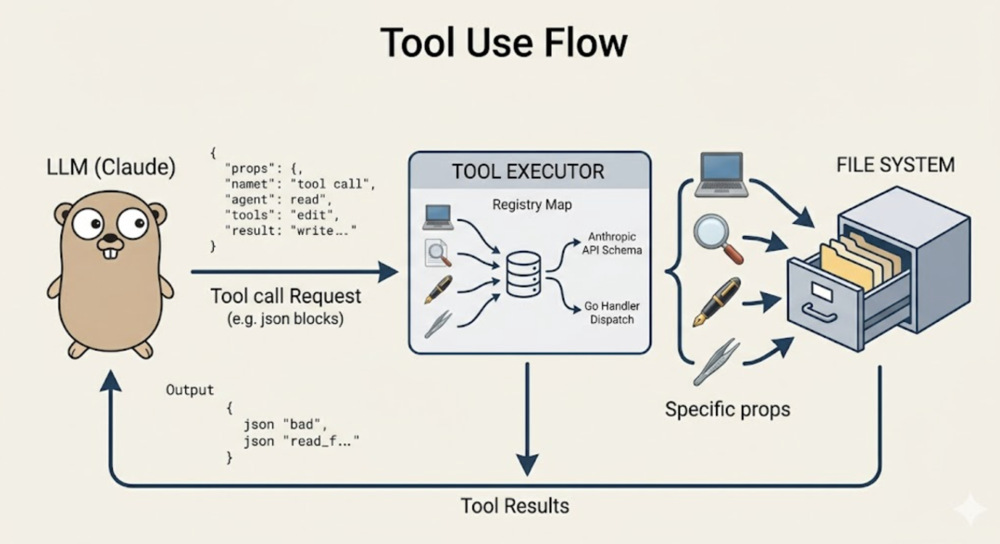
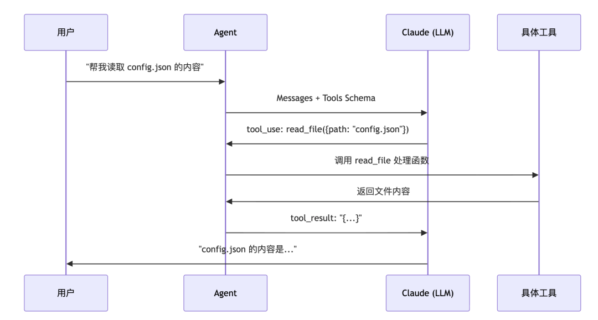
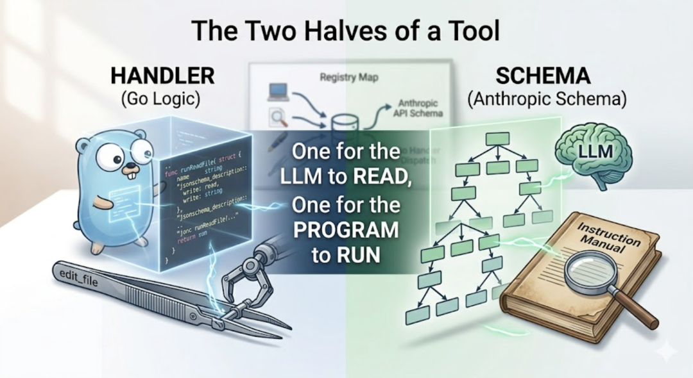
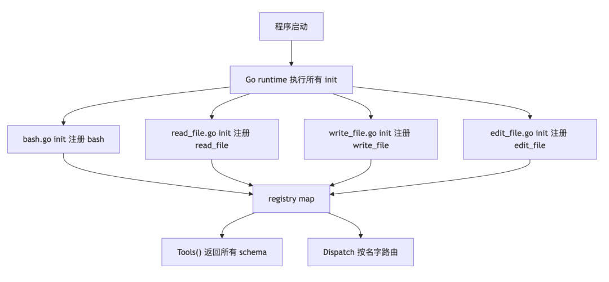
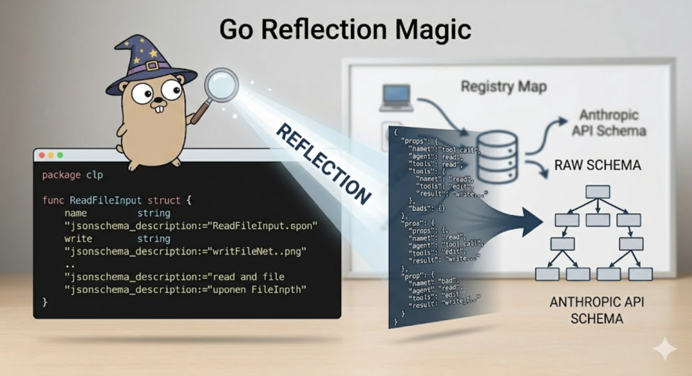
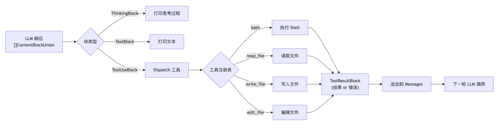
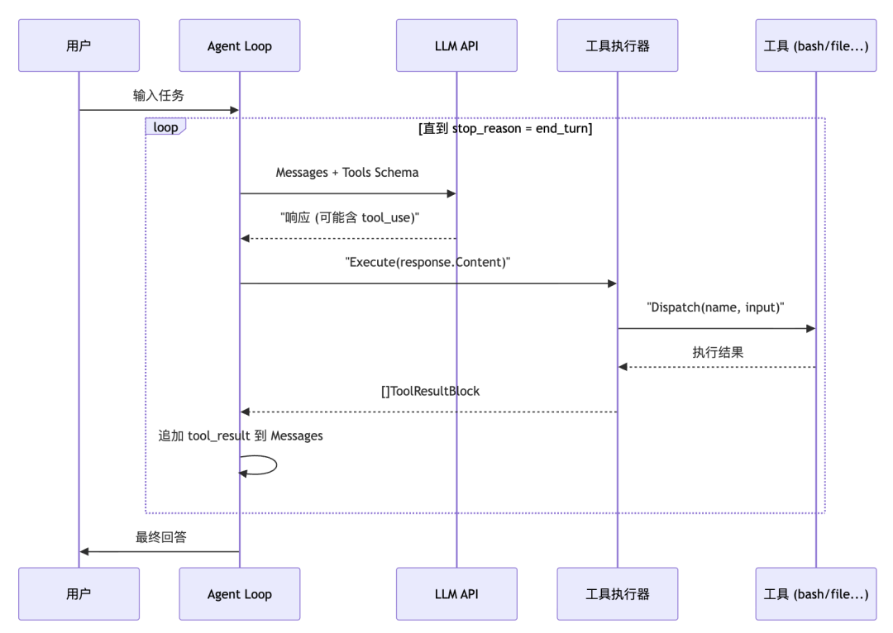
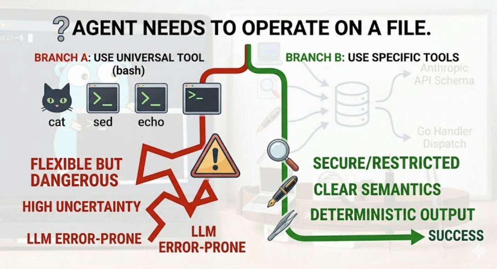
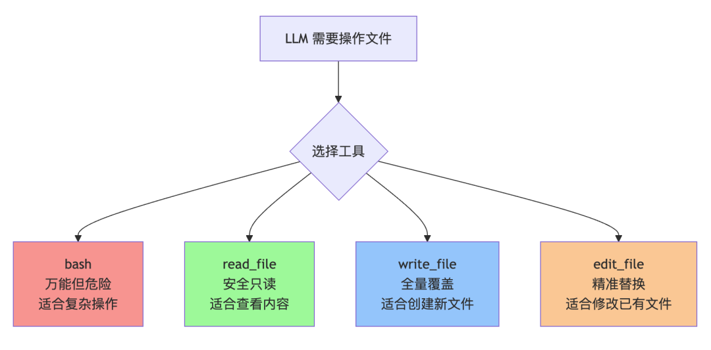

# Agent 的手脚：工具 Tools

> 文章序号：第02篇 | 作者：袁小康

Agent 能做什么，取决于它有哪些工具。本文介绍如何从零设计一个可扩展的工具系统，并实现文件读写、编辑等核心工具。上一篇Agent 的本质：一个 Loop 循环讲了 Loop。这篇讲 Tools。如果 Loop 是 Agent 的神经反射弧，那工具就是它的手脚。没有工具，LLM 再聪明，也只是个嘴上功夫的大脑。什么都说得出来，什么都做不了。
## 一、项目进度回顾
evo-agent 是一个从零开始构建 Agent 的学习项目。code: https://github.com/tiankonguse/evo-agent之前，我们实现了 Agent 最核心的骨架：- 接入 Anthropic API- 实现 ReAct Loop（思考 → 行动 → 观察 → 循环）- 提供第一个工具：bash（执行 Shell 命令）这篇文章，我们扩展了工具系统：- 新增 read_file：读取文件内容- 新增 write_file：写入文件（自动创建目录）- 新增 edit_file：精准替换文件片段- 重构工具注册机制，支持工具自注册，方便后续扩展当前项目目录结构如下：
```
src/├── main.go                    # 入口：交互式 REPL├── internal/│   ├── agent/│   │   ├── loop.go            # Agent 主循环│   │   └── state.go           # 对话状态│   ├── tools/│   │   ├── tool.go            # 工具注册表 & Dispatch│   │   ├── executor.go        # 工具执行器（解析 LLM 响应）│   │   ├── bash.go            # bash 工具│   │   ├── read_file.go       # read_file 工具│   │   ├── write_file.go      # write_file 工具│   │   └── edit_file.go       # edit_file 工具│   ├── config/│   │   └── config.go          # 配置加载（.env）│   └── ui/│       └── terminal.go        # 终端彩色输出
```
## 二、工具是什么？
在 Agent 的语境里，工具（Tool）就是一个 LLM 可以”主动调用”的函数。注意这里的关键词是”主动”。不是我们程序员硬编码去调，而是 LLM 自己判断”我现在需要用这个工具”，然后发起调用。LLM 本身只能生成文本。但如果我们事先告诉它：”你有这些工具，每个工具叫什么名字、接收什么参数、有什么用”。那 LLM 在需要的时候，就会输出一段结构化的”工具调用请求”。Agent 系统拦截这个请求，真正去执行工具，再把结果还给 LLM。这个过程叫 Tool Use（工具调用）。

举个例子。用户说：”帮我读取 config.json 的内容”。LLM 不会傻乎乎地编一段文件内容出来，而是会说：”我要调用 read_file 工具，参数是 config.json”。系统执行完，把真实的文件内容返回给 LLM，LLM 再基于真实内容回答用户。整个过程长这样：

而且工具调用不是一次性的。LLM 可以连续调用多个工具，直到它认为信息足够了，才输出最终答案。这就是上一篇讲的 Loop 的作用。
## 三、工具的数据结构
每一个工具，本质上就是两件东西的组合：Schema（接口描述）：告诉 LLM 这个工具叫什么、接收什么参数。这是给 LLM 看的”说明书”。Handler（执行逻辑）：真正的函数实现，这是给 Go 程序执行的。

一个给 LLM 看，一个给程序跑。在代码里，我们用 ToolDef 把这两件事绑在一起：
```
// tool.go// Handler 是每个工具必须实现的函数签名type Handler func(input json.RawMessage) (string, error)// ToolDef 把工具的 API schema 和 handler 绑定在一起type ToolDef struct {    Schema  anthropic.ToolParam    Handler Handler}
```
Schema：里包含工具名称、描述、参数的 JSON Schema，发给 Anthropic APIHandler： 接收 LLM 传来的 JSON 参数，返回字符串结果（或错误）
## 四、自注册模式：让工具”自己报到”

一个常见的工程问题：工具越来越多，怎么管？最朴素的方式是维护一个全局列表，每次新增工具都去改那个列表。但这很容易出错，耦合度也高。改着改着就乱了。evo-agent 采用了 Go 的 init() 自注册模式。核心思路：每个工具文件自己负责把自己注册到全局注册表。main 包只需要 import 这些文件，注册就自动完成了。谁也不用管谁。
```
// tool.go —— 全局注册表var registry = map[string]ToolDef{}// Register 向注册表添加一个工具func Register(def ToolDef) {    registry[def.Schema.Name] = def}// Tools 返回所有注册的工具 schema，用于发给 Anthropic APIfunc Tools() []anthropic.ToolUnionParam { ... }// Dispatch 根据工具名找到 handler 并执行func Dispatch(name string, input json.RawMessage) (string, error) { ... }
```
每个工具文件里，在 init() 里调用 Register：
```
// bash.gofunc init() {    Register(ToolDef{        Schema: anthropic.ToolParam{            Name:        "bash",            Description: anthropic.String("Run a shell command in the current workspace."),            InputSchema: GenerateSchema[BashInput](),        },        Handler: func(input json.RawMessage) (string, error) {            var in BashInput            json.Unmarshal(input, &in)            return runBash(in.Command), nil        },    })}
```
这样，添加一个新工具，只需要新建一个 .go 文件。不需要修改任何已有代码。完美的开闭原则。

## 五、Schema 自动生成
上面说了，每个工具都需要一份 JSON Schema，告诉 LLM 这个工具接收什么参数。但这个 Schema 怎么来？如果手写，read_file 的 Schema 大概长这样：
```
anthropic.ToolInputSchemaParam{    Properties: map[string]interface{}{        "path": map[string]interface{}{            "type":        "string",            "description": "The relative path of a file in the working directory.",        },        "limit": map[string]interface{}{            "type":        "integer",            "description": "Maximum number of lines to return (0 = no limit).",        },    },}
```
这还只是两个字段。如果工具有五六个参数，而且项目里有十几个工具，每个都这样手写……不仅代码量爆炸，参数描述和实际的 Go 结构体还是两套东西。改一个忘了改另一个，迟早出问题。所以 evo-agent 用反射来自动生成 Schema：
```
// GenerateSchema 用反射从 Go 结构体生成工具的 InputSchemafunc GenerateSchema[T any]() anthropic.ToolInputSchemaParam {    reflector := jsonschema.Reflector{        AllowAdditionalProperties: false,        DoNotReference:            true,    }    var v T    schema := reflector.Reflect(v)    return anthropic.ToolInputSchemaParam{        Properties: schema.Properties,    }}
```
只需要定义一个 Go 结构体，用 tag 写上字段描述，Schema 就自动生成了：
```
type BashInput struct {    Command string `json:"command" jsonschema_description:"The shell command to run."`}type ReadFileInput struct {    Path  string `json:"path"            jsonschema_description:"The relative path of a file."`    Limit int    `json:"limit,omitempty" jsonschema_description:"Maximum lines to return (0 = no limit)."`}
```

LLM 会读这份 Schema，知道该传什么参数。Go 程序收到 LLM 的 JSON 后，json.Unmarshal 进对应的结构体，完成类型安全的参数解析。定义一次，两边都用。
## 六、四个工具详解
## 6.1 bash：万能瑞士军刀
bash 是最灵活的工具。只要是 Shell 能做的事，它都能做。
```
bash(command="ls -lh")bash(command="git log --oneline -5")bash(command="grep -r 'TODO' ./src")
```
但灵活也意味着需要更多防护。实现上有几个关键设计：- 用 exec.CommandContext 设置 120 秒超时，防止命令卡死- 合并 stdout 和 stderr（CombinedOutput），让 LLM 能看到完整输出（包括错误）- 输出截断到 50000 字符，避免 token 爆炸- 空输出返回 "(no output)"，而不是空字符串，LLM 更容易理解
```
func runBash(command string) string {    ctx, cancel := context.WithTimeout(context.Background(), 120*time.Second)    defer cancel()    cmd := exec.CommandContext(ctx, "bash", "-c", command)    out, err := cmd.CombinedOutput()    if ctx.Err() == context.DeadlineExceeded {        return "Error: Timeout (120s)"    }    // ...}
```
6.2 read_file：精准读取bash 当然也能 cat 文件。但专门的 read_file 工具更语义化，也更可控。
```
read_file(path="src/main.go")read_file(path="large_log.txt", limit=50)   // 只读前 50 行
```
实现要点：-  支持 limit 参数，读大文件时只取前 N 行，后面追加 "... (N more lines)"-  同样做 50000 字符截断-  不支持读目录（目录用 bash + ls 处理）
```
func runReadFile(path string, limit int) (string, error) {    data, _ := os.ReadFile(path)    text := string(data)    if limit > 0 {        lines := strings.Split(text, "\n")        if limit 6.3 write_file：全量写入write_file 用于创建新文件，或者完全覆盖一个文件。
```
write_file(path="output/result.txt", content="Hello, World!")write_file(path="src/new_feature.go", content="package main\n...")
```
实现要点：- 自动创建父目录（os.MkdirAll），不用先 mkdir -p- 返回写入字节数，方便 LLM 确认写入成功
```
func runWriteFile(path, content string) (string, error) {    os.MkdirAll(filepath.Dir(path), 0o755)    os.WriteFile(path, []byte(content), 0o644)    return fmt.Sprintf("Wrote %d bytes to %s", len(content), path), nil}
```
6.4 edit_file：精准替换这是最精妙的一个工具。为什么需要它？write_file 每次都要写整个文件。如果只需要改一行代码，让 LLM 重写整个文件，效率很低，而且它容易”改着改着把其他内容搞丢了”。edit_file 只替换文件中的一个片段。传入旧内容 old_str 和新内容 new_str，只动这一处，其他地方纹丝不动。
```
edit_file(  path="src/main.go",  old_str="fmt.Println(\"hello\")",  new_str="fmt.Println(\"hello, agent!\")")
```
实现要点：- old_str：必须在文件中唯一存在，避免误改- old_str：为空且文件不存在时，等价于创建新文件（复用 write_file 逻辑）- 用 strings.Replace(..., 1) 只替换第一处匹配，作为额外的安全兜底
```
func runEditFile(path, oldStr, newStr string) (string, error) {    data, err := os.ReadFile(path)    if os.IsNotExist(err) && oldStr == "" {        return runWriteFile(path, newStr)  // 文件不存在 + 空 old_str = 创建    }    content := string(data)    if !strings.Contains(content, oldStr) {        return "", fmt.Errorf("edit_file: old_str not found in %s", path)    }    newContent := strings.Replace(content, oldStr, newStr, 1)    os.WriteFile(path, []byte(newContent), 0o644)    return fmt.Sprintf("Edited %s", path), nil}
```
## 七、工具执行器：连接 LLM 和工具
LLM 返回的响应是一个内容块列表（[]ContentBlockUnion），里面可能包含三种东西：ThinkingBlock：模型的思考过程（扩展思维功能）TextBlock：普通文本输出ToolUseBlock：工具调用请求executor.go 负责遍历这个列表，碰到 ToolUseBlock 就去执行：
```
func Execute(content []anthropic.ContentBlockUnion) []anthropic.ContentBlockParamUnion {    var results []anthropic.ContentBlockParamUnion    for _, block := range content {        switch v := block.AsAny().(type) {        case anthropic.ThinkingBlock:            ui.PrintThinking(v.Thinking)        case anthropic.TextBlock:            ui.PrintText(v.Text)        case anthropic.ToolUseBlock:            ui.PrintToolCall(v.Name)                                         // 打印工具名            ui.PrintCommand(fmt.Sprintf("%s(%s)", v.Name, v.Input.Raw()))   // 打印参数            inputBytes, _ := json.Marshal(v.Input)            output, err := Dispatch(v.Name, inputBytes)                      // 执行工具            isError := err != nil            results = append(results, anthropic.NewToolResultBlock(v.ID, output, isError))        }    }    return results}
```
执行结果会被打包成 ToolResultBlock，下一轮发给 LLM，让它继续思考。整个数据流如下：

## 八、Agent 主循环的完整视角
前面分别讲了 Loop 和 Tools。现在把它们合在一起看，整个 Agent 的运作过程就一目了然了。

核心代码（loop.go）非常简洁：
```
func (a *Agent) RunOneTurn(state *LoopState) bool {    // 1. 调用 LLM    resp, _ := a.LLM(ctx, anthropic.MessageNewParams{        Messages: state.Messages,        Tools:    tools.Tools(),  // 所有注册的工具        // ...    })    // 2. 追加助手响应    state.Messages = append(state.Messages, resp.ToParam())    // 3. 执行工具    toolResults := tools.Execute(resp.Content)    // 4. 没有工具调用 → 结束    if len(toolResults) == 0 {        return false    }    // 5. 追加工具结果 → 继续下一轮    state.Messages = append(state.Messages, anthropic.NewUserMessage(toolResults...))    return true}func (a *Agent) Loop(state *LoopState) {    for a.RunOneTurn(state) {}}
```
你看，整个 Loop 的逻辑其实就一行：for a.RunOneTurn(state) {}。简洁到有点过分。但就是这一行，驱动了 Agent 的全部行为。
## 九、为什么要有多种文件工具？
有人可能会问：有了 bash，cat、echo、sed 什么都能干。那为什么还要单独实现 read_file、write_file、edit_file？

原因有三。第一，语义更清晰，LLM 选择更准确。LLM 在选工具时，是根据工具描述来判断的。read_file 的描述明确说”读文件内容”，比让 LLM 自己去猜该用什么 shell 命令更可靠，出错率更低。第二，安全性和可控性更好。bash 是万能的，但万能也意味着危险。rm -rf / 也是合法的 bash 命令。专用文件工具只做文件操作，边界清晰，日后加权限控制也方便。第三，输出更结构化，便于处理。用 bash 执行 cat 的输出可能有细微差别（比如某些情况下多了换行符）。专用工具的输出就是干净的文件内容，LLM 处理起来更省心。简单说就是：能用专用工具就别用万能工具。能用确定性的方案，就别引入不确定性。

## 十、总结
回顾一下这篇文章的几个要点：1. 工具决定了 Agent 的能力边界。你给它什么工具，它就能干什么活。只有 bash 和有一整套文件操作工具，体验完全不一样。2. init() 自注册，加工具不用改老代码。新建一个文件就搞定，干净利落。3. 能用专用工具就别用 bash。语义更清晰，更安全，LLM 选错的概率也更低。4. 工具描述写给 LLM 看，不是写给自己看。名字要直白，描述要具体，参数要明确。LLM 读不懂你的工具描述，它就不会用。到这里，我们的 Agent 已经有了大脑（LLM）、神经反射弧（Loop）、和手脚（Tools）。下一篇，我们继续完善这个 Agent，看看还能给它装上什么新能力。《完》-EOF-
