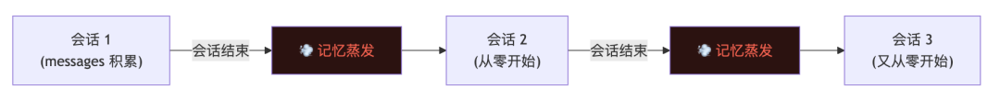
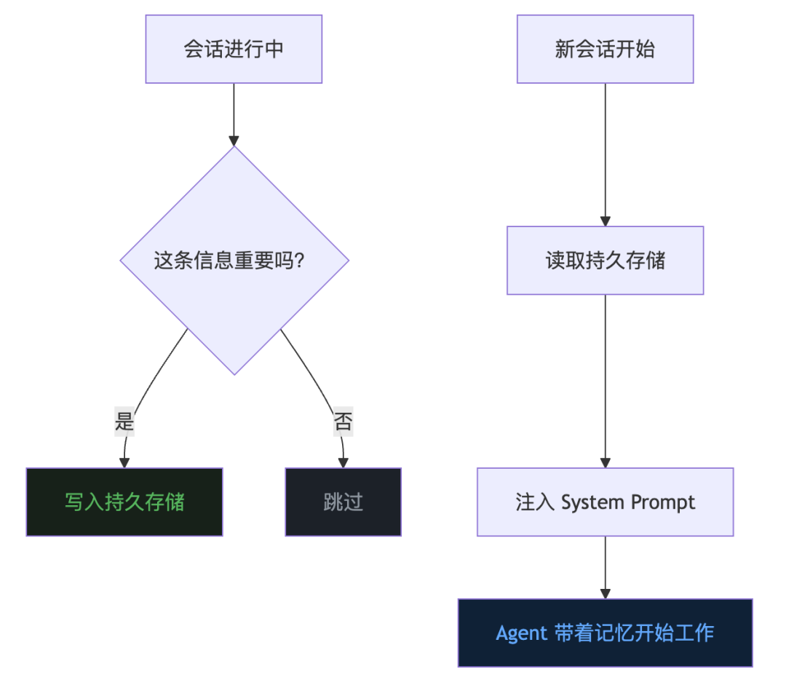
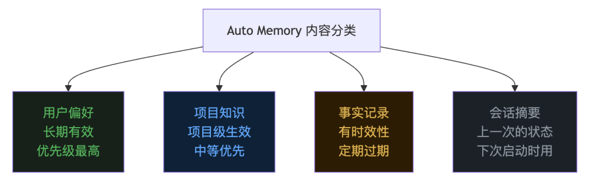
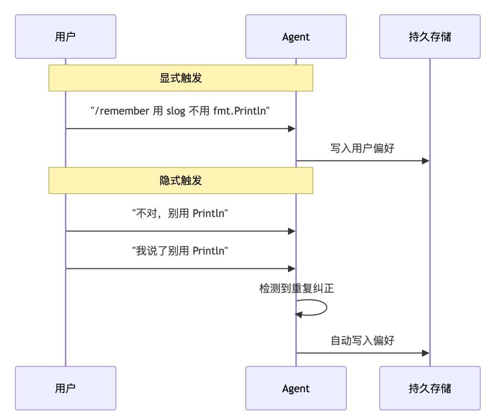
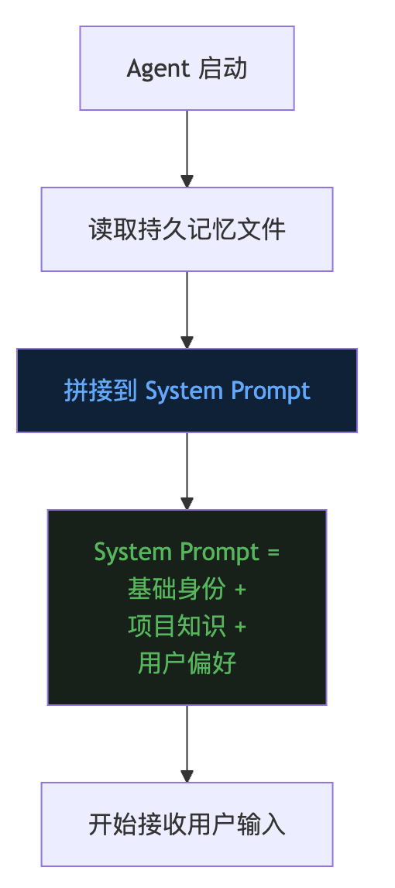
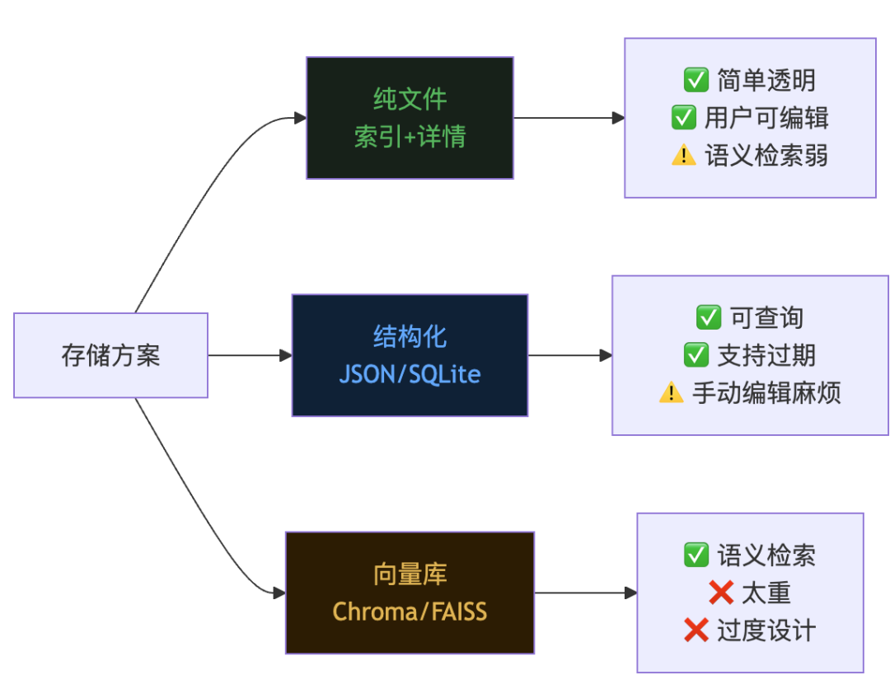
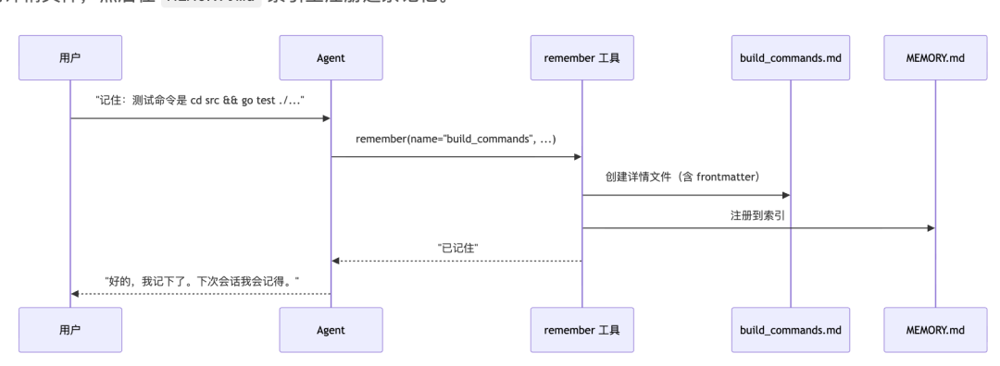
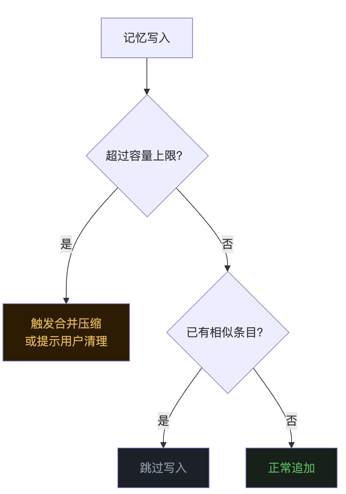

# Agent 的跨会话记忆：Auto Memory

> 文章序号：第11篇 | 作者：袁小康

LLM 会话内的会话记忆是短期记忆，会话一结束就清零。这篇聊聊 Auto Memory——让 Agent 自动跨会话记住重要信息的机制。前十篇文章分别讲了 Agent 的 Loop、Tools、上下文记忆、Context Compact、MCP、Skill、TUI、TODO、Subagent 和 Command。这篇聊一个很多人用 Agent 时都会抱怨的问题——跨会话失忆。

## 一、Agent 的失忆症
第三篇文章说过，LLM 的”记忆”本质上就是你每次塞给它的 messages 数组。会话内，messages 一直在滚动积累，Agent 记得你前面说过什么。但问题是，会话一结束，messages 就清零了。下一次你打开 Agent，它就像一个崭新的实习生，对你项目里的一切一无所知。你上次跟它说”我的项目用 Go 写的，构建命令是 make build”，它忘了。你前天反复纠正它”别用 fmt.Println 打日志，用 slog”，它还是忘了。你上周让它”commit message 用英文”，它照样忘了。每次新会话都要重复同样的话，像是在反复训练一个金鱼。这种体验的根源在于：第三篇讲的 messages 历史，本质上是短期记忆——活在单次会话里，会话结束就蒸发。

而一个真正好用的 Agent，需要的是长期记忆——能跨越会话边界，持久保存，下次自动想起来。这就是 Auto Memory 要解决的问题。
## 二、什么是 Auto Memory
Auto Memory，直译是”自动记忆”。核心思想用一句话概括：让 Agent 自动识别、持久保存、按需回忆重要信息，跨越会话边界。拆开来看，有三个关键动作。识别。 不是所有对话内容都值得记住。你问 Agent”今天几号”，这不需要记住。但你说”我们项目的 API 前缀统一用 /api/v2”，这需要记住。Agent 要能区分”临时信息”和”持久知识”。保存。 识别出来的重要信息，要落盘。不管存成文件还是数据库，关键是断电不丢。回忆。 下次新会话开始时，Agent 要能把之前存下的信息取出来，注入到当前上下文里。这样它就”记得”了。打个比方。你有一个助理，每天下班前会把今天工作中学到的重要信息写到笔记本上。第二天上班，先翻一遍笔记本，然后再开始工作。笔记本里记的不是每句话的流水账，而是浓缩后的关键知识。Auto Memory 就是这个笔记本。

## 三、记什么：信息的分类
并不是所有信息都适合塞进长期记忆。记太多，System Prompt 膨胀，浪费 token，还会干扰 LLM 的判断。记太少，Agent 又频繁失忆。业界的普遍做法是把信息分成几个层次。用户偏好。 比如”回答用中文”、”代码风格偏好 4 空格缩进”、”commit message 用英文”。这类信息一旦确定，几乎不会变，优先级最高。项目知识。 比如”构建命令是 make build”、”测试用 go test ./…“、”主入口在 src/main.go”。和具体项目绑定，换了项目就不适用。事实记录。 比如”上次我们把 API 从 v1 迁移到了 v2”、”昨天修了一个并发 bug，根因是缺少互斥锁”。这类信息有时效性，可能过一段时间就过期了。会话摘要。 上一次会话的浓缩总结，帮 Agent 快速找回上次的工作状态。这几类信息的特征不同，存储和过期策略也应该不同。

## 四、怎么记：两种触发方式
记忆的写入有两种触发模式。显式触发。 用户明确告诉 Agent”记住这个”。比如输入 /remember 构建命令是 make build，Agent 就把这条信息存下来。这是最确定的方式，用户完全掌控。隐式触发。 Agent 在对话过程中自动判断”这条信息似乎值得记住”，不需要用户主动说。比如用户反复纠正同一个错误，Agent 就自动把正确做法记下来。显式触发实现简单，用户体验也直观。隐式触发更智能，但难度也更大——判断”什么值得记”是一个开放性问题，可能记了一堆垃圾，也可能遗漏了关键信息。

## 五、怎么想起来：记忆的注入时机
光存下来还不够。存了一堆信息，如果 Agent 启动时不去读，等于没存。记忆的回忆（注入）有两个关键决策点。什么时候注入？最常见的做法是在会话启动时，把所有持久记忆一次性注入到 System Prompt 里。Agent 每次启动，先”回忆”一遍，然后再开始工作。这是 Claude Code 的做法——每次启动，自动把 memory.md 的内容拼进系统提示词。另一种做法是按需注入。只有当对话内容和某条记忆相关时，才把它取出来。这更省 token，但实现复杂度也更高，通常需要向量检索。注入到哪里？最直接的做法是追加到 System Prompt 尾部。System Prompt 本身就是”Agent 每次都能看到”的内容，把长期记忆放在这里，天然不会被对话增长冲掉，也不会被上下文压缩误删。

回顾第三篇的内容，System Prompt 是独立于 messages 的，不会被 Context Compact 压缩掉。这意味着注入到 System Prompt 的长期记忆，在整个会话生命周期内始终可见。这正是我们想要的——长期记忆不会因为对话变长而”被遗忘”。
## 六、存在哪里：存储方案的选择
持久记忆最终要落盘。存储方案的选择，取决于你对”记忆”的定位。纯文件方案。 在项目目录下建一个 memory/ 目录，里面有一个 MEMORY.md 作为索引文件，其他文件是具体的记忆内容。Agent 启动时只读取索引文件 MEMORY.md，索引里记录了每条记忆的摘要和它对应的详情文件路径。需要深入了解某条记忆时，再去读具体文件。这种”索引 + 详情”的结构，既控制了启动时注入的 token 量（只注入索引），又保留了完整信息的可追溯性（详情文件随时可读）。优点是实现简洁，用户可以直接用编辑器查看和修改，也方便随项目一起版本控制。缺点是语义检索能力弱，需要靠文件命名和索引摘要来定位信息。结构化存储方案。 用 JSON 或 SQLite 存储，每条记忆带上元数据：类别、时间戳、优先级、过期时间。启动时按条件筛选，只注入相关的那些。优点是灵活、可查询、支持过期清理。缺点是实现成本更高，用户手动编辑不方便。向量数据库方案。 把每条记忆做 embedding，存进向量库。对话时根据当前话题检索最相关的记忆注入。优点是可以做到语义级别的”按需回忆”。缺点是太重了，对一个本地 Agent 来说是过度设计。

对大多数本地 Agent 来说，纯文件方案是起步的最优选。简单、透明、用户可控。等真正遇到瓶颈了，再往结构化方向演进也不迟。
## 七、业界设计思路
业界的 Auto Memory 采用文件存储 + 索引注入的方案。存储结构。 在项目目录下的 .evo-agent/ 里，新建一个 memory/ 子目录。核心是一个 MEMORY.md 索引文件，加上若干具体的记忆详情文件：
```text
.evo-agent/├── memory/│   ├── MEMORY.md              # 索引文件（启动时注入）│   ├── user.md                # 详情：用户信息│   └── current_year.md        # 详情：当前年份├── mcp.json├── skill/└── command/
```
MEMORY.md 是索引，记录每个详情文件的名称和一句话描述。启动时只注入这个文件的内容，控制 token 用量。其他 .md 文件是具体的记忆详情，带有 YAML frontmatter 元数据和正文内容。当 Agent 在工作中需要深入了解某条记忆时，可以通过 read_file 工具去读取对应的详情文件。索引文件大致长这样：
```text
- [User](user.md) — Information about the user's name, interests, and birth year.- [Current Year](current_year.md) — The current year is 2026.
```
每个条目是一个 Markdown 链接加上一句话描述。Agent 看到索引就知道有哪些知识可用，需要具体内容时再去读对应文件。详情文件的结构是 YAML frontmatter 加正文：
```text
---name: userdescription: Information about the user, including name, interests, and birth year.type: user---### User NameThe user's name is 天空柚子.### User InterestsThe user enjoys rock climbing.### User Birth YearThe user was born in 1990.
```
frontmatter 里的 type 字段区分记忆类别：project 是项目知识，user 是用户偏好。所有文件都是纯 Markdown，用户可以随时打开编辑器查看和修改。写入方式。 通过一个 remember 工具触发，也支持 /remember 命令。用户对 Agent 说”记住：构建命令是 make build”，Agent 调用 remember 工具。工具会做两件事：创建一个带 frontmatter 的详情文件，然后在 MEMORY.md 索引里注册这条记忆。

读取时机。 在 config.Load() 阶段，自动检查 .evo-agent/memory/MEMORY.md 是否存在。如果存在，就把索引文件的内容拼接到 System Prompt 尾部。注意只注入索引文件，不注入所有详情文件。Agent 工作时如果需要详情，可以自己用 read_file 去读。这样做的好处： 项目知识可能很庞大——构建流程、部署步骤、API 设计文档，加起来可能有几千行。如果全量注入 System Prompt，直接占满 token 预算。而索引文件只有每个分类的一句话描述，通常不超过十几行，极其轻量。
## 八、防膨胀：记忆不是越多越好
一个容易踩的坑是：记忆无限增长，最后 System Prompt 塞了几千行，反而拖累了 Agent 的表现。这里需要一些约束机制。总量限制。 设定一个上限，比如 MEMORY.md 索引最多 2000 字符。快要超的时候，提示用户清理或者 Agent 自动做一次合并压缩。去重。 写入前检查是否已经存在语义相近的条目。用户说了两次”用 slog 不用 fmt.Println”，只需要记一条。过期清理。 事实类记忆带上时间戳，超过一定天数自动标记为过期，不再注入。分级注入。 不是每次都把所有记忆全塞进去。用户偏好每次都注入（量小、重要），会话摘要只在首次启动时注入（用完就丢），项目知识按需注入。

## 九、最后
Auto Memory 要解决的问题其实很朴素：让 Agent 像人一样，记得住跨天的事。实现也不需要多复杂。一个索引文件做摘要，若干详情文件存完整知识，一个工具负责写入，启动时读取索引注入 System Prompt。加上基本的去重和容量管理，就已经能覆盖 80% 的场景。没有向量库，没有复杂的检索管线，没有 embedding 模型。纯文件、纯文本、纯 System Prompt 注入。这不是说那些高级方案没用。而是说对一个本地 Agent 来说，先把最简单的事做对，比堆砌架构更重要。用户需要的不是一个拥有完美记忆力的 AI，而是一个能记住”构建命令是 make build”这种基本事实的助手。先做到这一步，就已经比”每次从零开始”的体验好太多了。《完》-EOF-Agent 的斜杠命令：CommandAgent 的子代理：隔离上下文Agent 的任务规划：TODO 列表Agent 的 TUI：终端交互界面Agent Skill：可复用的工作流Agent 的万能插座：MCP 协议Agent 的上下文压缩：3个策略LLM 没有记忆，但 Agent 有Agent 的手脚：工具 ToolsAgent 的本质：一个 Loop 循环
