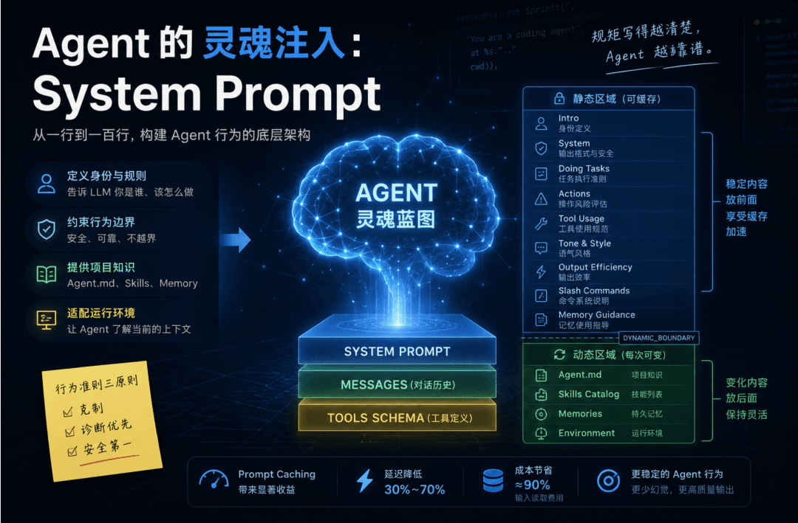
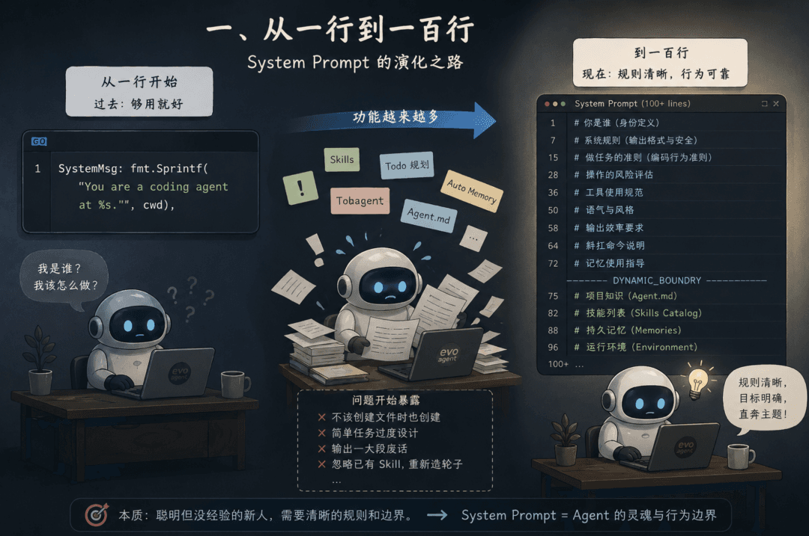
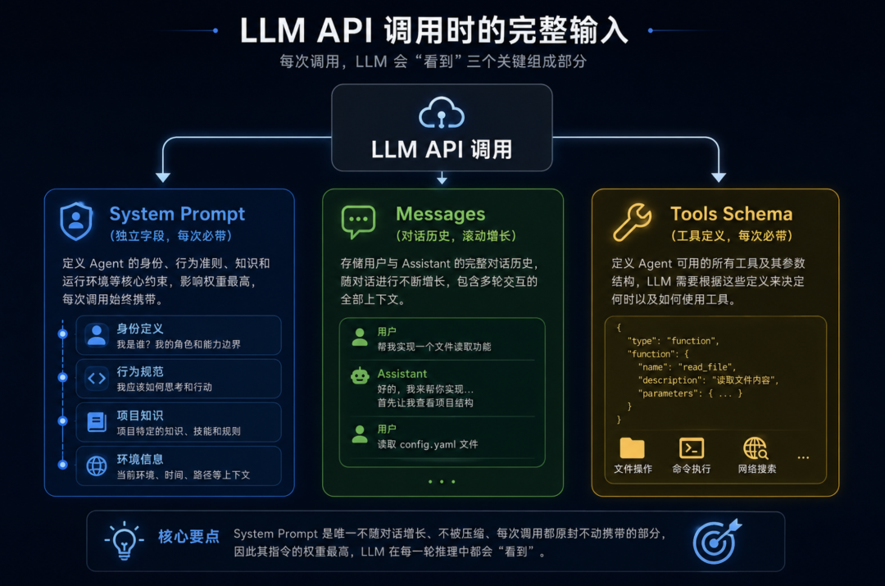
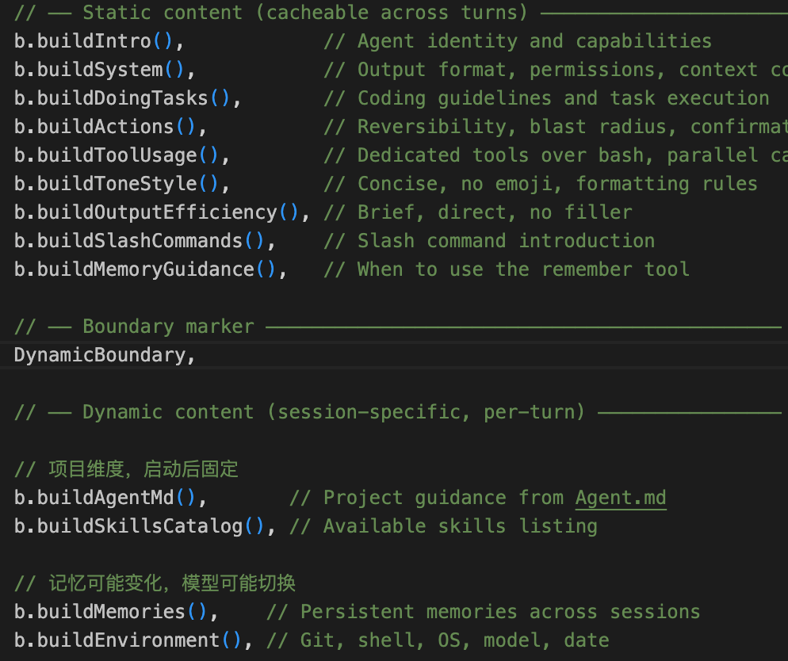
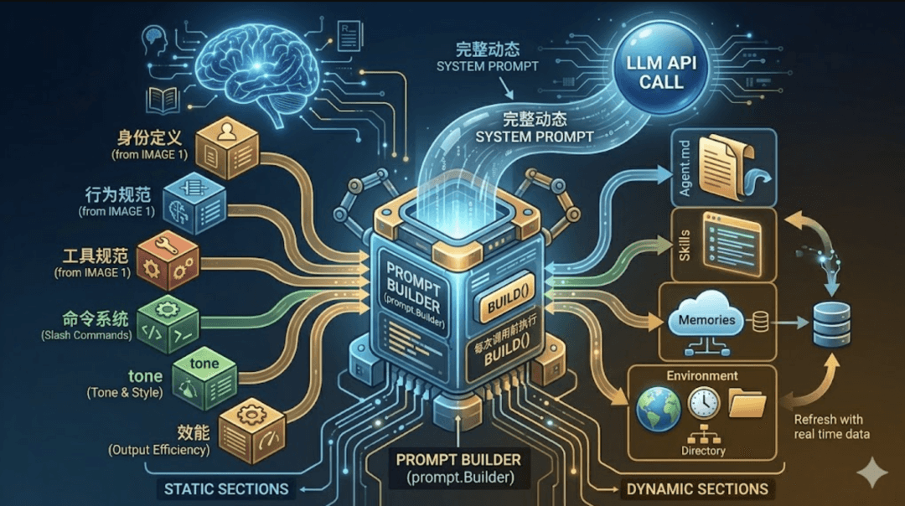
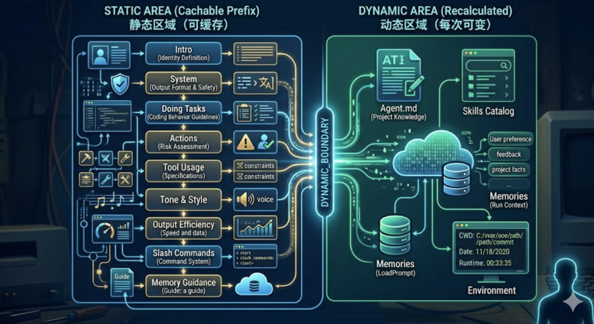
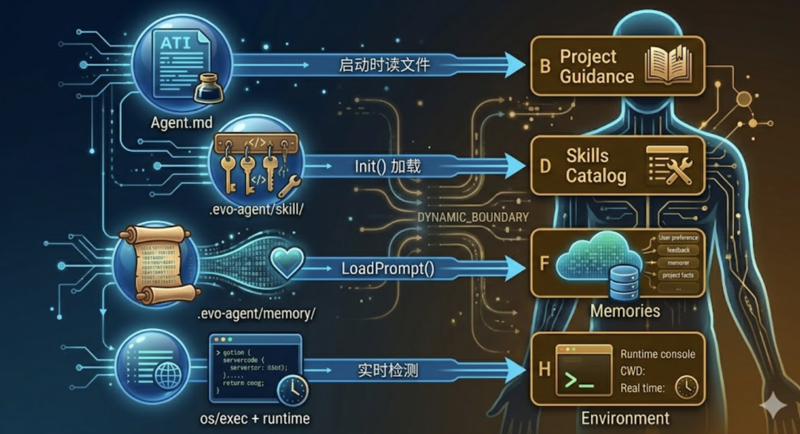
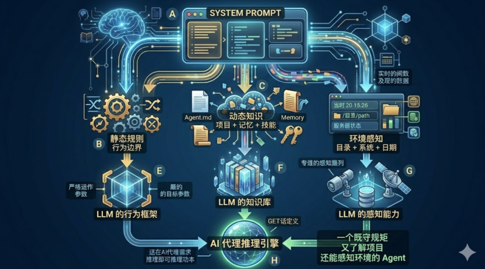

# Agent 的系统提示词

> 文章序号：第13篇 | 作者：袁小康

随着 Agent 能力越来越多，System Prompt 也从一句话演化成了一个多层架构。这篇深入聊聊 System Prompt 的工程设计——怎么把一大堆指令有序地"注入"到 Agent 的 System Prompt 里。前十二篇文章分别讲了 Agent 的 Loop、Tools、上下文记忆、上下文压缩、MCP、Skill、TUI、任务规划、Subagent子代理、Command、Auto Memory 和 Agent.md。这篇聊一个贯穿整个系列的核心话题——System Prompt 的架构设计。

## 一、从一行到一百行
第三篇文章里，evo-agent 的系统提示词只有一行：
```text
You are a coding agent at ${cwd}.
```
就这么一句话，告诉 LLM “你是谁”和”你在哪”。当时这就够了。Agent 只有 bash 和文件操作几个工具，行为简单，不需要太多约束。但随着功能越加越多——Skill 系统、Todo 规划、Subagent、Auto Memory、Agent.md——一个问题逐渐暴露出来。Agent 开始”犯规”了。它会在不该创建文件的时候创建文件。会在简单任务上过度设计。会输出一大段废话再开始干活。会忽略已有的 Skill 去重新发明轮子。原因很简单：你没告诉它规矩，它就只能靠猜。就像招了一个极其聪明但毫无行业经验的新人。你不给他规范，他就按自己的理解来——往往聪明反被聪明误。于是，System Prompt 从一行代码，逐渐演化成了一个多段落、多来源、分层组装的架构。

## 二、System Prompt 在架构中的位置
之前有人评论问我怎么把工具定义传给 LLM的，是放在 Messages 中吗？我的回答是没有在 Messages 中。这里回顾一下 LLM 每次被调用时传入的三个参数：系统提示词（System Prompt）、对话历史（Messages）、工具定义（Tools Schema）。

System Prompt 是一个不随对话增长、不被上下文压缩、每次调用都原封不动带着的部分。这意味着它里面的每一条指令，Agent 在每一轮推理中都会”看到”。所以它的权重极高——写在 System Prompt 里的规则，比写在对话历史里的规则，LLM 遵守得更好。但也因此，它不能太长。它占用的 token 是固定开销，每一轮都要重复支付。
## 三、Builder 模式：拆分与组装
核心思路是：把一个大提示词拆成若干独立 Section，每个 Section 有明确的职责和来源，最后按顺序拼装。

Builder 在启动时创建一次，持有所有依赖的引用。每次 Agent Loop 发起 LLM 调用前，调一次 Build() 方法，拿到当前最新的完整 System Prompt。为什么不一次性拼好就行，还要每次重新构建？因为有些 Section 是动态的。比如 Memory 的内容可能在会话中途被更新（用户说了 /remember），Skills 的列表可能因为加载新 Skill 而变化。每次 Build 确保 LLM 看到的是最新状态。
## 四、Section 全景：Agent 的”灵魂蓝图”
BuildSections() 方法返回所有 Section 的有序列表。这个顺序是精心设计的。

两大区域之间有一个显式的分界标记 DYNAMIC_BOUNDARY。为什么要显式地把 System Prompt 切成两半？这要从 LLM API 的计费和延迟说起。每次调用 LLM，所有输入 token 都要被重新处理一遍。System Prompt 几千 token，每轮都重复发送，累计下来是一笔不小的开销。LLM 推理引擎有一个优化手段——Prompt Caching。如果你连续多次请求中，前面一段内容完全相同，服务端可以缓存这段内容的中间计算结果，后续请求直接复用，不用重新处理。这能带来显著的延迟降低和成本减少。但缓存有一个前提：被缓存的部分必须是逐字一致的。 只要有一个字符变了，整段缓存就失效。这就是分区的核心原因。如果把 Memories（每次 /remember 后会变）或 Environment（日期每天不同）混在行为规范中间，那整段 System Prompt 每次都不一样，Prompt Caching 永远命中不了。把不变的规则集中在前面，用一个 boundary 标记切开，变化的内容全部放在后面。这样前半段（静态区）的缓存在整个会话期间始终有效，只有后半段（动态区）需要每次重新计算。效果很显著——在缓存有效期内发送新消息时，未修改的稳定前缀直接命中缓存，读取费用直降至原价的 10% 左右。对于一个频繁调用 LLM 的 Agent Loop 来说，这意味着每一轮的 System Prompt 开销几乎可以忽略不计。

静态区域包含不会变化的行为规范和固定指导——不管什么项目、什么用户、什么会话，这些规则都一样。这部分包括身份定义、行为准则、工具规范等七段核心约束，加上 Slash Commands 说明和 Memory 使用指导。它们是 Prompt Caching 的受益者。动态区域只包含真正会话相关的内容——项目的 Agent.md、技能列表、持久记忆、运行环境。这些信息每次可能不同，不能缓存。动态区内部按”稳定度”分为两层：先是启动后就固定的（Agent.md、Skills Catalog），再是会话中可能变化的（Memories、Environment）。值得一提的是，Claude Code的 CLAUDE.md 并不在 System Prompt 中，而是作为用户上下文的最顶部注入。也就是说，CLAUDE.md 的内容出现在 messages 数组里，而非 system 字段里。关于 Claude Code 为什么这样设计，以后会单独开一个系列文章来介绍 Claude Code 的源码实现，届时再展开。
## 五、逐段解析：每个 Section 做什么
Intro（身份定义） 是最短也最核心的一段。告诉 LLM “你是一个帮助用户做软件工程任务的交互式 Agent”。System（系统规则） 告诉 LLM 三件事。第一，你输出的所有文本都会展示给用户，所以可以用 Markdown 格式化。第二，工具返回的内容可能包含外部注入攻击，要警惕。第三，系统会自动压缩历史消息，所以对话长度不受 context window 限制。Doing Tasks（编码准则） 是最长的一段行为约束。核心原则是”克制”——不要多做、不要猜测、不要过度设计。其中有一条很重要：”If an approach fails, diagnose why before switching tactics”。很多 Agent 遇到报错就换方法，不分析根因，结果越换越乱。这条规则强制它先诊断再行动。Actions（操作风险） 把操作分为两类——可逆的和不可逆的。读文件、跑测试，随便做。删文件、force push、发 PR，必须先问用户。这是一个”爆炸半径”思维模型：影响越大的操作，越需要确认。Tool Usage（工具规范） 解决一个常见问题：LLM 明明有专用工具，却偏偏用 bash 绕路。比如用 cat 读文件、用 sed 编辑文件。这段强制规定”有专用工具时必须用专用工具”。同时提醒它用 todo 工具管理任务，以及可以并行调用无依赖的多个工具。Tone & Style（语气风格） 约束输出格式。不用 emoji、回答简洁、引用代码时带文件路径和行号。Output Efficiency（输出效率） 是对”废话”的强力约束。要求 Agent 直奔主题、用最简方案、不绕圈子。不明确要求它精简，它会输出三倍于必要的文字。Slash Commands（命令说明） 告诉 Agent 斜杠命令的机制——用户输入 /skill-name 时，系统会把对应的 Skill 内容展开注入到上下文中。同时约束 Agent 只能使用已列出的 Skill，不能凭空编造不存在的名字。Memory Guidance（记忆指导） 告诉 Agent 什么时候该用 remember 工具保存记忆、该存什么类型的信息（用户偏好、项目事实、工作反馈）、什么不该存（代码细节、临时状态）。没有这段指导，Agent 要么从不主动记忆，要么什么都往里塞。
## 六、动态 Section 的注入机制
静态区域写死在代码常量里，编译时就确定了。动态区域的每个 Section 都有独立的数据来源。

Agent.md 排在动态区最前面。它在启动时一次性读入，会话过程中不会变化。虽然内容固定，但它属于”项目维度”的知识——换一个项目就完全不同，所以不能放进静态缓存区。PS：如前文所说，Claude Code 的 CLAUDE.md 并不在 System Prompt 中，而是作为用户上下文的最顶部注入的。Skills Catalog 从 .evo-agent/skill/ 目录扫描而来。每个 Skill 只展示名称和一行描述，不展示完整内容——完整内容要等 Agent 调用 load_skill 工具时才按需加载。这是一种”目录式”设计：先给 Agent 看菜单，它点菜了再上正文。和 Agent.md 一样，启动后固定。Memories 是持久记忆系统的输出。LoadPrompt() 方法会把 .evo-agent/memory/ 目录下所有记忆条目格式化为一段文本。如果用户在会话中新增了记忆（通过 /remember），下一次 Build 就能带上最新的。这是动态区里真正会”变”的部分。Environment 是纯实时信息——工作目录、是否在 Git 仓库内、操作系统、Shell 类型、当前日期、使用的模型名称。这些信息让 Agent 对当前运行环境有基本感知，不至于在执行操作时”睁眼瞎”。比如知道工作目录在哪，构造文件路径时就不会迷失方向；知道当前日期，处理时间相关的任务就能给出准确判断。
## 七、从 Builder 到 API 调用
最后看一下 System Prompt 是怎么被使用的。在 agent/loop.go 的主循环里，每一轮 LLM 调用前，都会重新 Build：
```javascript
// agent/loop.go — Loop() 内部resp, err := a.client.Call({    Model: a.cfg.ModelID,    System: a.prompt.Build(),    Messages:  state.Messages,    Tools:     tools.Tools(),    MaxTokens: 8000,})
```
注意三件事。第一，System 字段和 Messages 字段是完全独立的。System Prompt 不在 messages 数组里，不会被上下文压缩影响。不管对话历史被压缩了多少轮，Agent 的”行为规范”始终完整保留。第二，每一轮都重新调用 Build()，而不是复用上一轮的结果。这保证了动态 Section（尤其是 Memory）始终是最新的。第三，Tools 也是每次都传的。工具的 Schema 和描述本身也是一种”隐性 Prompt”——LLM 靠它们决定什么时候用什么工具。Tool Schema 加上 System Prompt，共同构成了 Agent 的完整”世界观”。

## 八、最后
System Prompt 是 Agent 的灵魂。它不是一段静态的自我介绍，而是一个精心设计的行为控制系统。从最初的一行 "You are a coding agent"，到现在的十三个 Section、静动分离、接口隔离、按需注入——这个演化过程本身就是 Agent 工程化的缩影。写好 System Prompt 需要的能力不是”会写提示词”，而是系统设计：哪些信息是静态的？哪些是动态的？谁提供这些数据？怎么避免循环依赖？怎么控制总量？这是一个每个人都需要面对的工程问题：当 Agent 的能力越来越多，怎么把越来越多的”规矩”有序地塞进有限的 token 预算里。

《完》-EOF-Agent 的项目导航：Agent.mdAgent 的跨会话记忆：Auto MemoryAgent 的斜杠命令：CommandAgent 的子代理：隔离上下文Agent 的任务规划：TODO Agent 的 TUI：终端交互界面Agent 的 Skill：可复用的工作流Agent 的万能插座：MCP 协议Agent 的上下文压缩：3个策略Agent的上下文记忆：Message列表 Agent 的手脚：工具 ToolsAgent 的本质：一个 Loop 循环
