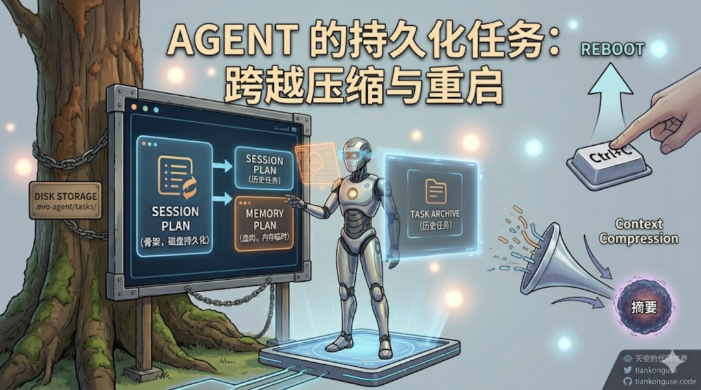
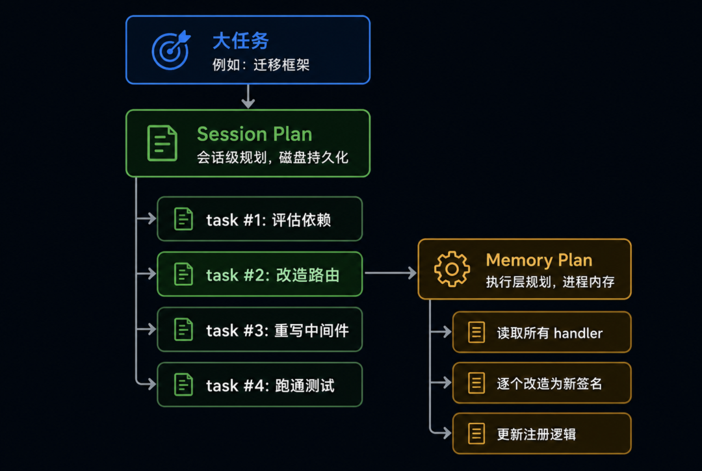
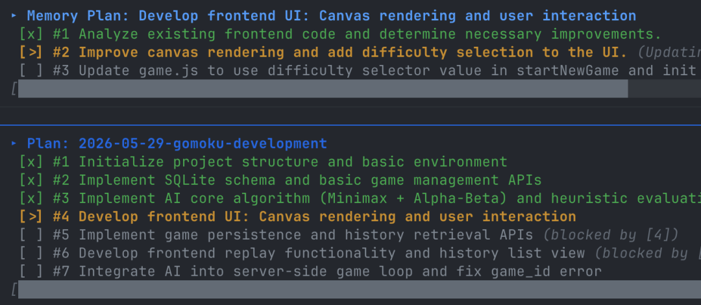
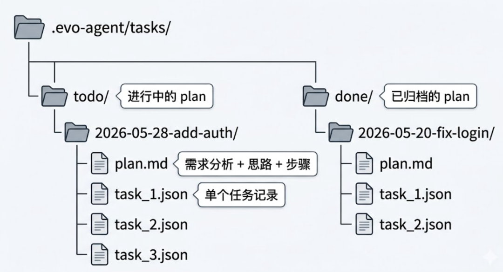
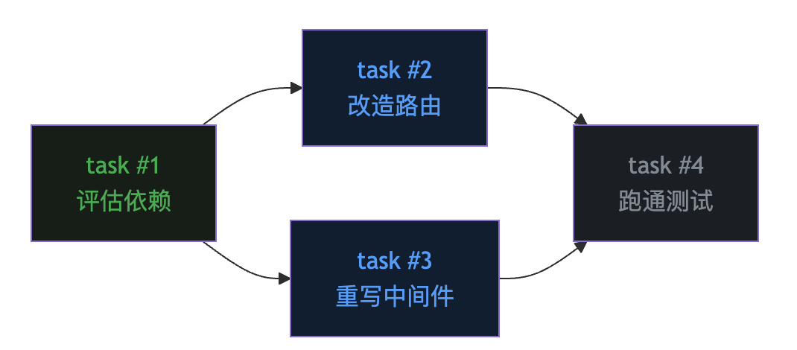
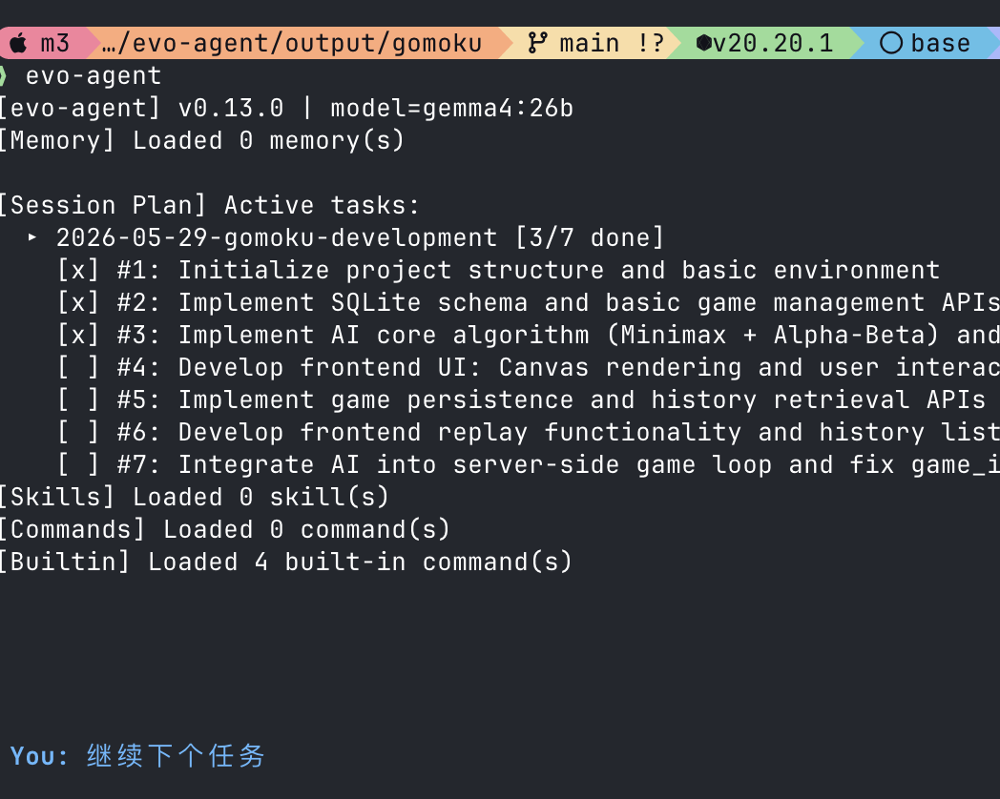
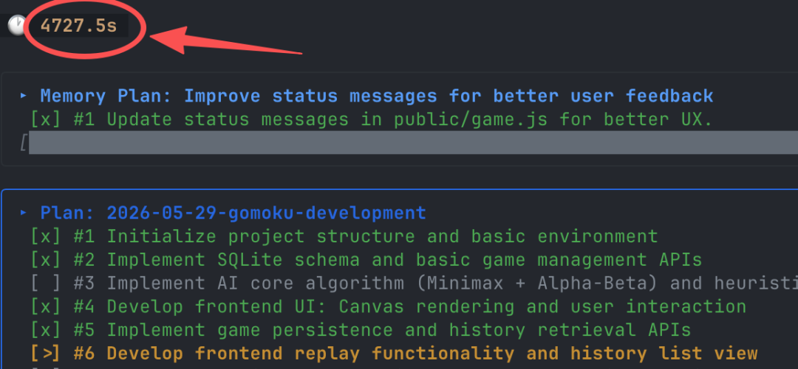

# Agent 的持久化任务

> 文章序号：第14篇 | 作者：袁小康

第八篇讲过 todo 工具，它给 Agent 配了一支笔来管理任务进度。但那张清单只活在内存里——上下文一压缩，会话一退出，整张计划就消失了。这篇聊聊持久化任务系统：把任务图搬到磁盘上，让一个跨越数小时、数十轮压缩、甚至跨越多次重启的大型任务，依然能稳稳地推进。
## 零、背景
前十三篇文章分别讲了 Agent 的 Loop、Tools、上下文记忆、上下文压缩、MCP、Skill、TUI、TODO 任务规划、Subagent 子代理、Command、Auto Memory、Agent.md 和 System Prompt 架构。这篇聊一个第八篇 todo 工具留下的尾巴——任务的持久化。

## 一、todo 工具的天花板
第八篇文章里，evo-agent 给 LLM 加了一个 todo 工具：每条任务有 pending、in_progress、completed 三种状态，最多 12 条，同一时刻只允许一条进行中。这套机制解决了”短任务里的迷路问题”——Agent 调几次工具不会忘了自己原本要做什么。但它有一个根本性的限制：整张清单都活在进程内存里。这意味着两件事会让计划”凭空消失”。第一种情况是上下文压缩。第四篇讲过，evo-agent 在历史接近 5 万字符时会触发 full compact——LLM 被请去把整段对话总结成一段摘要，然后用这段摘要重建消息列表。新的对话从一段总结开始，前面的工具调用记录都被收进了那段摘要里。todo 列表本身在内存里还在，但 LLM 已经看不到它”是怎么变成现在这样”的过程了。摘要里如果忘了带上”这一步还没做”这条信息，Agent 就真的不知道下一步该干啥了。第二种情况更直接——进程退出。你按了 Ctrl+C，或者重启电脑，或者会话被关掉。下次再打开 evo-agent，GlobalTodo 是一个全新的空结构体，刚才那张精心制定的计划灰飞烟灭。对于”写一个登录接口”这种十几分钟能搞完的任务，这没什么。对于”把这个项目从 Echo 框架迁移到 Gin”这种需要好几个小时、中间可能被打断好几次的大任务，这就是灾难。
## 二、记忆要外置，进度也要外置
第八篇结尾留了一句话：“LLM 负责推理，状态交给系统来管。”第十一篇 Auto Memory 把”用户偏好”这种长期知识从内存搬到了磁盘。那么”任务进度”——尤其是大型任务的进度——是不是也应该搬到磁盘？答案是肯定的。这就是 evo-agent 引入第二套规划系统的动机。它不取代原来的 todo，而是和 todo 配成一对——两层规划。

Session Plan 是大任务的骨架。 一个大任务被拆成若干个独立可交付的子任务，写到磁盘上，每个子任务有依赖关系。Memory Plan 是某一个子任务内部的执行步骤。 也就是原来的 todo 工具——还活在内存里，但生命周期短：开始一个 Session Plan 任务时初始化它，做完这个任务就重置。骨架在磁盘，肉在内存。骨架活得久，肉活得短。骨架决定方向，肉决定下一步动作。

## 三、磁盘上的任务图
Session Plan 的存储结构非常直白——每个 plan 就是一个目录，每个 task 就是一个 JSON 文件。

几个设计细节值得展开。todo/ 和 done/ 两个篮子。 进行中的计划放在 todo/，做完的整体迁移到 done/。这是一个非常老派但极其有效的”看板”模型，一眼就能看出哪些事情在做、哪些事情做完了。计划名字带日期前缀。 命名规范是 YYYY-MM-DD-描述，比如 2026-05-28-add-auth。这样按文件名排序就是按时间顺序，很方便用 ls 命令直接看历史。plan.md 是计划的”封面”。 它包含三块内容：需求分析、技术思路、整体步骤。这部分是给 LLM 自己看的——下一次 Agent 启动时，它打开这个目录，先读 plan.md 就能”想起来”这个项目的来龙去脉。task_N.json 是单个任务的状态机。 每个文件就是一条任务记录：
```
{  "id": 1,  "subject": "Design auth schema",  "description": "Create database migration for users table...",  "status": "pending",  "blockedBy": [],  "blocks": [2, 3],  "owner": ""}
```
所有读写操作都直接打到磁盘。一条任务从 pending 变成 completed，本质上就是一次 os.WriteFile。进程崩了？没关系，文件还在。下次启动直接 os.ReadDir 就能恢复整个任务图。
## 四、依赖图：让顺序变成数据
Session Plan 比内存版的 todo 多了一个核心能力——任务之间可以有依赖关系。

依赖关系用两个字段来表达。blockedBy 是”我等谁做完”，blocks 是”谁等我做完”。这两个字段是双向同步的。双向同步看起来多此一举，但实际上，这两个视图都很常用。你打开一个任务，想知道”我现在能不能开工”——查 blockedBy 是否为空。你做完一个任务，想知道”哪些人在等我”——查 blocks 列表。如果只存一个字段，另一个就要每次扫描整个目录算出来。同步存两份，两边都是 O(1) 查询。这就是 SQL 数据库里”反范式”那一套的微缩版——为了查询性能，主动接受一点冗余。
## 五、提醒机制升级版
第八篇里 todo 工具有一个 3 轮提醒机制——连续三轮没有更新计划，就在工具结果里塞一条 `<reminder>`。Session Plan 用了同样的思路，只是间隔更长——5 轮。为什么是 5 而不是 3？因为 Session Plan 的任务粒度更粗。一个 Memory Plan 的步骤可能就是”读这个文件”——一两轮就能干完。一个 Session Plan 的任务可能是”重写中间件”——里面包含好几次 todo 更新、十几次工具调用。如果用 3 轮间隔，提醒会来得太频繁，反而干扰 Agent 的连续思考。5 轮是一个”留出充分工作空间，又不至于忘到太久”的折中。另一个细节是触发条件——hasActiveTasks()。只有当前确实有 in_progress 任务时，提醒才会触发。如果你只是随便聊天，没启动任何大任务，系统不会无缘无故来提醒你”该更新计划了”。
## 六、启动时的恢复
磁盘持久化最大的好处是重启之后还能继续干活。evo-agent 启动时，InitPlan 会把 .evo-agent/tasks/todo/ 和 done/ 目录建好（如果不存在），然后通过 StartupSummary 在终端打印当前的活跃计划。

这段输出比单纯”还活着”更有意义——它把状态直接呈现给用户。你打开 evo-agent，第一眼就看到上次的进度，知道继续做什么。更重要的是这部分信息会进 System Prompt 的动态区。LLM 在每一轮思考前都会看到这一行——”哦，我有个 plan 在做，当前正在做登录接口”。这条信息让 LLM 哪怕在一段全新的、刚被压缩过的对话里，也能立刻找回上下文焦点。磁盘是 Agent 的”长期记忆器官”。从这个意义上讲，Session Plan 让 Agent 第一次拥有了跨越会话的目标连续性。
## 七、最后
从第八篇的内存 todo，到这一篇的磁盘 Session Plan，evo-agent 用两个层次解决了 Agent 任务管理的两个不同尺度问题。短任务用 todo——快、轻、不留痕迹。长任务用 Session Plan——慢、重、能跨越压缩与重启。两者配合的威力在于：Agent 既能在五分钟的小任务里保持专注，又能在跨越几天的大项目里保持方向。如图，两个结合起来，evo-agent 可以持续运行一个小时都没问题。

写到这里有一个感慨。Agent 工程的很多设计，本质上都在做同一件事——把 LLM 不擅长的事情，从它头脑里搬到外部系统里。这个就是大家所说的 Harness。LLM 负责推理，状态交给系统来管。《完》-EOF-Agent 的系统提示词：System PromptAgent 的项目导航：Agent.mdAgent 的跨会话记忆：Auto MemoryAgent 的斜杠命令：CommandAgent 的子代理：隔离上下文Agent 的任务规划：TODO Agent 的 TUI：终端交互界面Agent 的 Skill：可复用的工作流Agent 的万能插座：MCP 协议Agent 的上下文压缩：3个策略Agent的上下文记忆：Message列表 Agent 的手脚：工具 ToolsAgent 的本质：一个 Loop 循环
