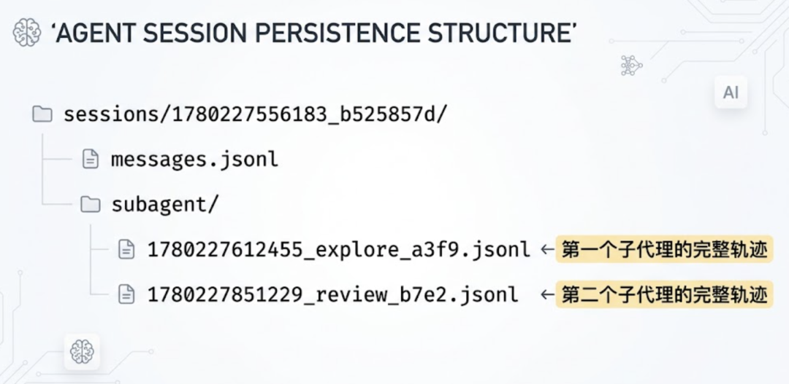
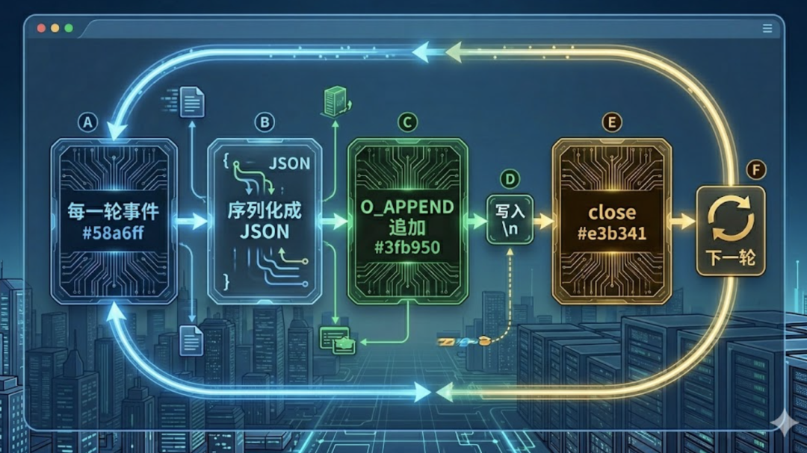
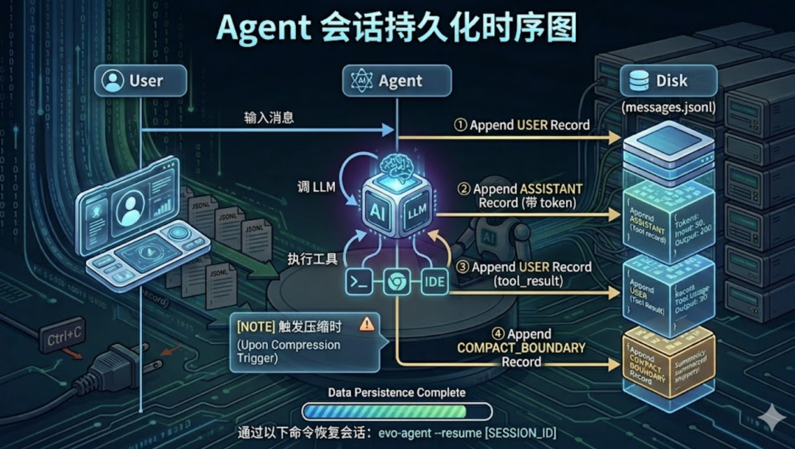
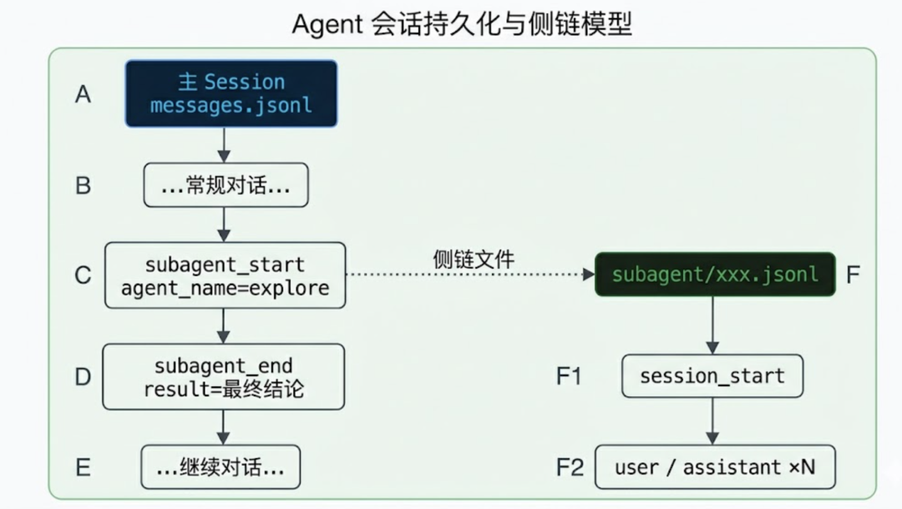
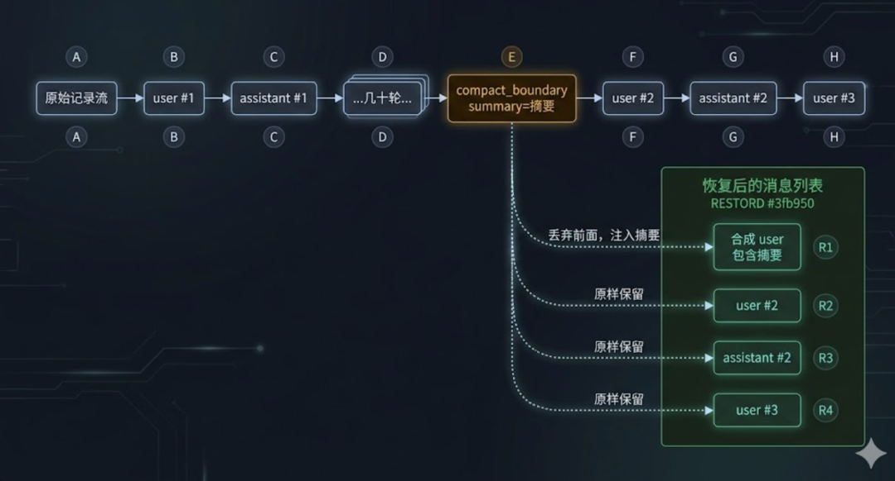
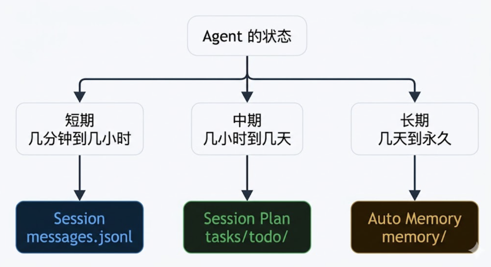

# Agent 的跨会话：Session 持久化

> 文章序号：第15篇 | 作者：袁小康

Ctrl+C 一下，整段对话连同思考过程一起灰飞烟灭。这篇聊聊 Session 持久化，把 Agent 的对话记录也外置到磁盘，让任何一次会话都能从昨天断掉的地方继续接上。
## 零、背景
前十四篇文章分别讲了 Agent 的 Loop、Tools、上下文记忆、上下文压缩、MCP、Skill、TUI、TODO 任务规划、Subagent 子代理、Command、Auto Memory、Agent.md、System Prompt 架构 和 任务持久化 Session Plan。这篇接着第十四篇的尾巴聊——会话本身的持久化。第十四篇把”任务进度”搬到了磁盘，但对话历史依然只活在内存里。你和 Agent 聊了一个多小时，它读了一堆代码、调了几十次工具、吐了几千 token 的思考——按一下 Ctrl+C，全部归零。下次启动时，Agent 又是一个崭新的、毫无记忆的新人。

## 一、丢失的不只是消息
最朴素的理解里，”持久化对话”听起来就是把消息列表写到文件里。下次启动时再读回来。但真正用过 Agent 的人会发现，事情没这么简单。一段几小时长的会话里，真正有价值的东西远不止 user/assistant 两类消息。工具调用的入参和返回——Agent 读过哪些文件、跑过哪些命令、得到了什么输出。压缩边界——历史在哪一轮被摘要重建过，那段摘要的内容是什么。子代理的输出——某个 task 派出去的子 Agent 跑了 20 轮、最后回了一段结论。token 用量——这次会话累计花了多少钱。这些都是排查”为什么当时它会那样做”时绕不开的环境信息。所以 Session 持久化要解决的真正问题是：把一次会话所有可观察事件，按发生顺序，原样落到磁盘上。
## 二、为什么是 JSONL
agent 选择的存储格式非常简单——JSON Lines，一行一条 JSON 记录。

为什么不用一个大 JSON 数组？因为 Agent Loop 是流式产生事件的——每一轮都会追加几条新记录如果用一个完整的 JSON 数组，每次写入都需要”读出来 → 解析 → 追加 → 重新序列化 → 整体覆盖”，IO 量随时间线性增长。更糟的是，写到一半进程崩了，整个文件可能直接变成一段无效 JSON，读都读不出来。JSONL 把这些问题全部消解。每条记录独立一行，写入逻辑就是 O_APPEND | O_CREATE | O_WRONLY——文件指针自动跳到末尾，写一行字节加一个 \n，关闭。任何时刻拉电源都最多丢失最后一行，前面写好的内容永远是有效的。

## 三、Session ID 的小心思
会话目录名长这样：1780227556183_b525857d。前面是毫秒级 unix 时间戳，后面是 8 位十六进制随机串。中间用 _ 分隔。为什么不用 UUID v4？为什么不用 ISO 时间戳？毫秒前缀的妙处在于”字典序 == 时间序”。把毫秒时间戳放在最前面，就意味着扫描整个 sessions 目录拿到的列表天然按时间排序。8 位 hex 是”够用就好”的随机后缀。 同一毫秒内启动两次 Agent 的概率本来就低，加上 32 位随机数，碰撞概率小到可以忽略。比 UUID 短得多，列表展示也更友好。
## 四、写入的四个时机
写入 Session 的位置散落在 Agent Loop 里，但其实只有四个明确的钩子点。

用户消息进入时——这是会话里”人开口”的第一手记录。LLM 回复后——此时也记录消耗的 Token。工具结果回流时——工具执行完，结果作为 user 角色消息塞回 messages 切片，这一步同样要追加一条 user 记录。Compact 触发时——这一条是恢复时最关键的”分水岭”。
## 五、子代理的侧链
第九篇讲过 Subagent——主 Agent 派一个新 Agent 干一件独立的事，子 Agent 跑完只把最后一段文本传回来。这种”派单 → 执行 → 汇报”的模型在持久化上有个有趣的问题：子代理产生的几十轮内部对话，要不要写到主 Session 里？都写进去会污染主轨迹——主 Session 里突然冒出一堆子任务的 tool call，恢复时 Agent 看到的”对话流”和它当时实际看到的不一样。完全不写又会丢失子代理的全部细节，将来想复盘”子代理为啥下了这个结论”就没线索了。真正的子 Agent 内部对话独立写到 subagent/ 目录下的侧链文件里。

## 六、Compact Boundary：恢复的水位线
JSONL 完整地记录了所有事件。但恢复时不能把所有事件原样回放。问题出在 compact。第四篇讲过，Agent 历史接近 5 万字符时会触发 full compact——LLM 把整段对话总结成一段摘要，然后用这段摘要重建消息列表。压缩之后，前面那一堆 user/assistant 记录在”语义上”已经被替换成了一段总结。如果恢复时把所有原始记录都加载回内存，等于是把”已经被压缩过的旧内容”和”压缩后的新内容”一起塞给 LLM——一来 token 浪费严重，二来 LLM 看到的对话流和当时实际看到的不一致，行为会变得诡异。正确的恢复规则是这样：找到最后一条 compact_boundary 记录，不加载这条之前的所有 user/assistant 记录，用 boundary 里的摘要代替它们。

## 七、三个入口
有了底层的写和读，上层接入就有多种方式。evo-agent 提供了三个入口。命令行 --resume 是最直接的方式：evo-agent --resume 1780227556183_b525857d。启动时立即加载指定 Session 的消息列表作为初始历史，然后开一个全新的 Session 文件接着写。TUI 下拉选择 /resume 是给”忘记 ID”准备的。在 TUI 里输入 /resume（不带参数），会弹出一个下拉框列出当前项目下所有历史 Session，按更新时间倒序排列。会话内 /resume <id> 是兜底设计。Agent 已经在跑了，但你想切到另一段历史继续——直接在输入框里打 /resume <id>。
## 八、退出时的提示
很多工具退出后什么都不留下，用户根本不知道刚才那段会话是不是真的存到了哪里。进程退出时用户看到屏幕上多了一句：
```
Resume this session with: evo-agent --resume 1780227556183_b525857d
```
这条信息让”持久化”这件事对用户可见、可操作。不小心退出了，直接复制命令运行即可继续上次的会话。
## 九、最后
从第十一篇 Auto Memory，到第十四篇 Session Plan，再到这一篇 Session 持久化—— agent 在不同尺度上把”应该是临时的”和”应该是永久的”东西分得越来越清。三层存储，三种生命周期，三种恢复方式。共同支撑起一个”能跨越进程、跨越压缩、跨越天数”持续工作的 Agent。

《完》-EOF-Agent 的持久化任务Agent 的系统提示词：System PromptAgent 的项目导航：Agent.mdAgent 的跨会话记忆：Auto MemoryAgent 的斜杠命令：CommandAgent 的子代理：隔离上下文Agent 的任务规划：TODO Agent 的 TUI：终端交互界面Agent 的 Skill：可复用的工作流Agent 的万能插座：MCP 协议Agent 的上下文压缩：3个策略Agent的上下文记忆：Message列表 Agent 的手脚：工具 ToolsAgent 的本质：一个 Loop 循环
