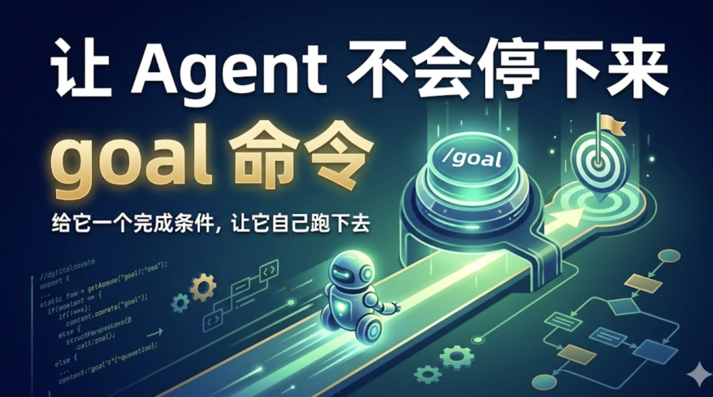
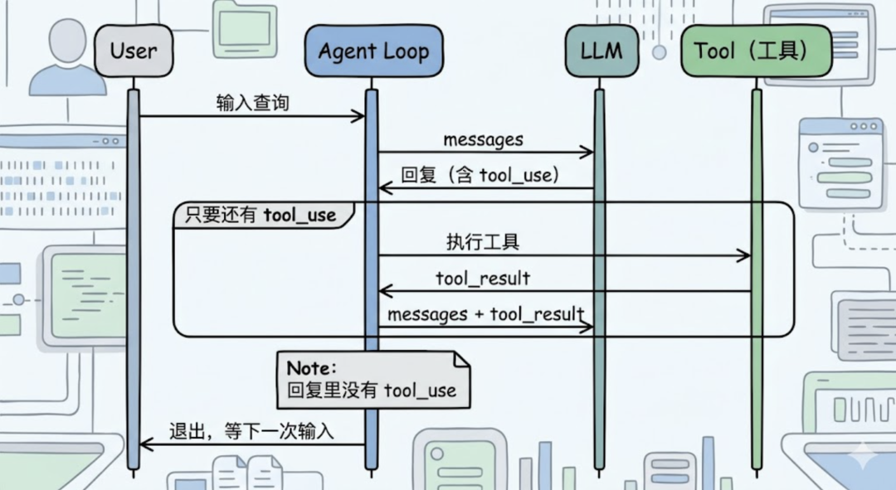
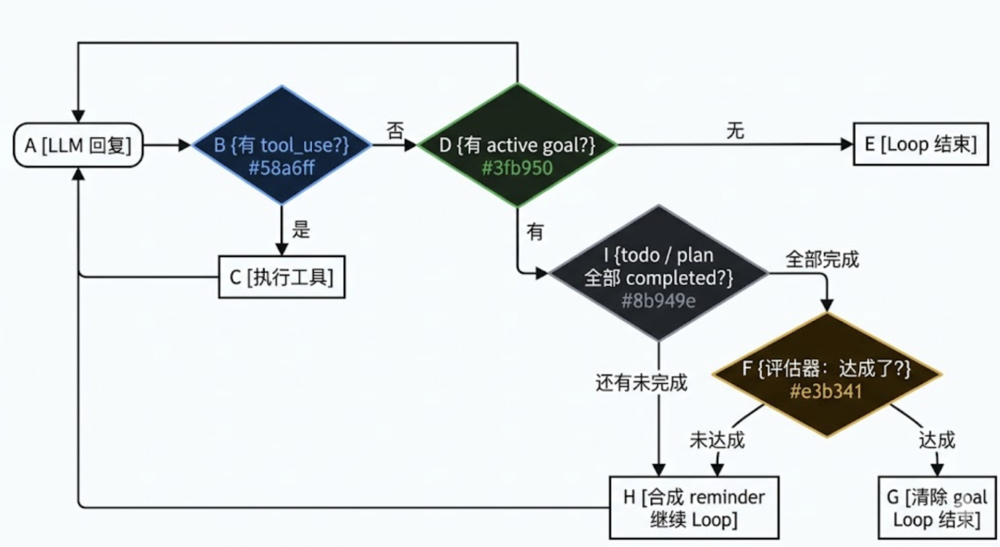
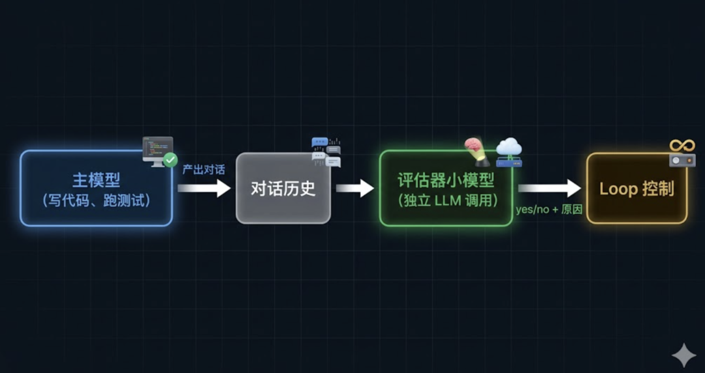
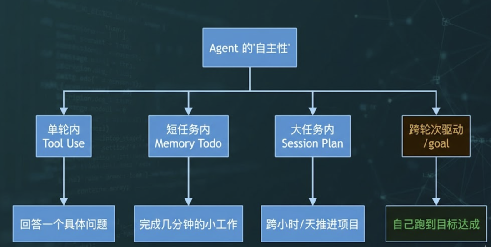

# 让 Agent 不会停下来：goal 命令

> Agent 总是跑两步就停下来等你说"继续"，原因藏在 Loop 的实现机制上。/goal 命令给它一个完成条件，让它自己一轮一轮跑下去，跑到目标达成为止。

Agent 总是跑两步就停下来等你说"继续"，原因藏在 Loop 的实现机制上。

/goal 命令给它一个完成条件，让它自己一轮一轮跑下去，跑到目标达成为止。

## 零、背景

前十五篇文章分别讲了 Agent 的Loop、工具、上下文记忆、上下文压缩、MCP、Skill、TUI、任务规划、子代理、命令、跨会话记忆、Agent.md、系统提示词、任务持久化和会话持久化。

这篇聊聊一个让 Agent 「持续自己干活」的小命令——/goal。

## 一、Agent 为什么”干两步就停”

第一篇文章讲过，Agent 的 Loop 长这样：模型回一段话，看里面有没有tool_use块，有就执行工具，把结果塞回去再问下一轮；没有，循环结束。

这套逻辑对”小问答”很合理——你问一句”列一下当前目录有啥”，Agent 调一次bash、看一眼结果、回你一段总结，任务结束，控制权回到用户手上。

但碰到大任务就体验特别差了。

假设你说：”把src/api/下所有 REST 调用迁移到 GraphQL，跑通所有测试”。

Agent 改了两个文件、跑了一次测试、看到一堆失败、回你一段：”我修改了 user.go 和 auth.go，目前 4 个测试还在失败，需要继续修改吗？”——然后停下来等你回复。

你只能再敲一句”继续”。

然后又是几步、又是问”还要继续吗”。

根因藏在 Loop 最底层的那行判断里：

// 简化伪代码for{resp := llm.Call(messages)if!hasToolUse(resp) {return// ← 这里就停了}runTools(resp)}

只要 LLM 决定不调工具，仅仅返回文本时，Loop 就退出。

这个机制本身没错——它防止 Agent 陷入死循环、占着控制权不还。

但它也让”自主推进长任务”这件事变得不可能。

## 二、/goal 的核心思路

/goal 的解法非常直接——在 Loop 退出之前再加一个判断：用户的目标达成了吗？

判断本身分两段做。

先扫一眼内存 todo 和磁盘 plan 里还有没有未完成项——只要还有，直接判定为没干完；

只有结构化任务都已清零，才舍得调一次小模型读对话历史做语义判断。

结构化校验 + 自然语言评估串联起来，才算真的完工。

把轻的检查放前面是有道理的——查内存切片和扫磁盘目录都是几微秒的事，调 LLM 评估器要花几百毫秒外加 token 钱。用便宜的判断挡掉大多数情况，把昂贵的判断留给最后一公里。

## 三、评估器：让小模型当裁判

真正有意思的是”判断目标是否达成”这一步。

最直接的做法是让正在干活的那个模型自己判断：”我做完了没？”——但这等于运动员自己当裁判。

模型有强烈的”完成欲”，会倾向把”差不多”说成”完成了”，把”测试还差几个”模糊成”主要测试都过了”。

让它自己评判自己的工作，可信度堪忧。

evo-agent 的方案是把评估这件事交给一个独立的小模型。

评估器的输入是两段话——目标本身、最近 N 轮的对话摘要。

它的输出是 Yes/No，以及理由 reason。

如果它说”达成了”，理由必须具体——”测试输出中显示 X passing, 0 failing”。

如果说”没达成”，理由也要具体——”还有 3 个 unit test 失败”。

这条理由会被用作下一轮 LLM 的指导，告诉它”差什么”。

## 四、最后

从第八篇的内存 todo、第十四篇的磁盘 Session Plan，到这一篇的 /goal 完成条件——evo-agent 在三个不同尺度上回答了同一个问题：”Agent 怎么自己往前走？”

todo 解决”短任务里不迷路”——记住自己在做哪一步。

Session Plan 解决”长任务跨会话推进”——记住整个项目的骨架。

/goal 解决”轮次之间不掉链子”——记住自己应该跑到哪里才算完。

三层机制叠在一起，Agent 才真正从”对话助手”长成了”自主代理”。

《完》

-EOF-

