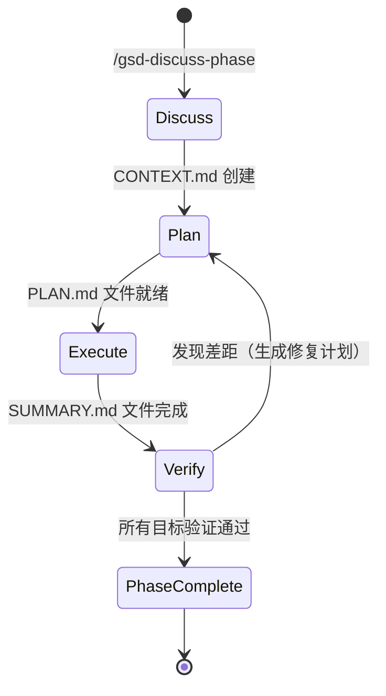
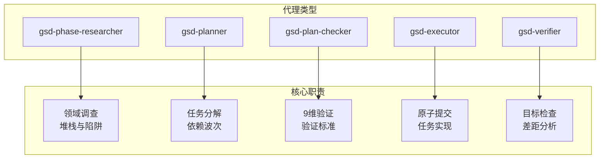

# GSD 原理文档与架构指南

## 系统概述

GSD (Get Shit Done) 是一个元提示、上下文工程和规范驱动的开发系统，专为 Claude Code、OpenCode、Gemini CLI、Kilo、Codex、Copilot、Cursor、Windsurf 等 AI 编码运行时设计。它解决了上下文腐烂问题——即 AI 填充上下文窗口时发生的质量下降。

---

## 系统架构

### 整体架构图

```mermaid
graph TB
    subgraph "用户层"
        User[用户]
        Command[/gsd-command [args]/]
    end
    
    subgraph "命令层"
        Commands[commands/gsd/*.md<br/>基于提示的命令文件]
    end
    
    subgraph "工作流层"
        Workflows[get-shit-done/workflows/*.md<br/>编排逻辑]
    end
    
    subgraph "代理层"
        Researcher[gsd-phase-researcher<br/>领域调查]
        Planner[gsd-planner<br/>任务分解]
        Checker[gsd-plan-checker<br/>9维验证]
        Executor[gsd-executor<br/>原子提交]
        Verifier[gsd-verifier<br/>目标检查]
    end
    
    subgraph "CLI工具层"
        SDK[sdk/src/query/]
        ToolsCLI[bin/gsd-tools.cjs]
        Bridge[sdk/src/query-runtime-bridge.ts]
    end
    
    subgraph "文件系统"
        Planning[.planning/<br/>PROJECT.md<br/>REQUIREMENTS.md<br/>ROADMAP.md<br/>STATE.md<br/>config.json]
    end
    
    User --> Command
    Command --> Commands
    Commands --> Workflows
    Workflows --> Researcher
    Workflows --> Planner
    Workflows --> Checker
    Workflows --> Executor
    Workflows --> Verifier
    Researcher --> SDK
    Planner --> SDK
    Checker --> SDK
    Executor --> SDK
    Verifier --> SDK
    SDK --> Planning
    ToolsCLI --> Planning
    Bridge --> Planning
```

### 设计原则

1. **每个代理使用全新上下文**：编排器生成的每个代理都获得干净的上下文窗口（最多 200K 令牌），消除上下文腐烂

2. **轻量级编排器**：工作流文件从不执行繁重操作，只负责加载上下文、生成专业代理、收集结果和更新状态

3. **基于文件的状态管理**：所有状态以人类可读的 Markdown 和 JSON 形式存储在 `.planning/` 中，无需数据库、服务器或外部依赖

4. **缺失即启用**：工作流功能标志遵循"缺失即启用"模式，如果 `config.json` 中缺少某个键，则默认为 `true`

5. **深度防御**：多层防护防止常见失败模式——计划在执行前验证、执行产生原子提交、执行后验证检查阶段目标、UAT 提供人工验证作为最终关卡

---

## 核心工作流

### 四阶段工作流

GSD 对每个阶段强制执行严格的四阶段工作流：**讨论 → 计划 → 执行 → 验证**



### 阶段职责

| 阶段 | 命令 | 主要输出 |
|------|------|----------|
| **讨论** | `/gsd-discuss-phase [N]` | `{phase}-CONTEXT.md` |
| **计划** | `/gsd-plan-phase [N]` | `{phase}-RESEARCH.md`, `{phase}-{N}-PLAN.md` |
| **执行** | `/gsd-execute-phase <N>` | `{phase}-{N}-SUMMARY.md` |
| **验证** | `/gsd-verify-work [N]` | `VERIFICATION.md` |

---

## 技能（命令）用法详解

### 命令语法

- **Claude Code / Copilot / OpenCode / Kilo**: `/gsd-command-name [args]`（连字符形式）
- **Gemini CLI**: `/gsd:command-name [args]`（冒号形式）
- **Codex**: `$gsd-command-name [args]`

### 命名空间元技能（v1.40）

v1.40 引入了六个命名空间路由器，将急切技能列表的令牌成本从 ~2,150 令牌（86 个技能）降低到 ~120 令牌（6 个路由器）

| 命令 | 路由到 |
|------|--------|
| `/gsd-ns-workflow` | 阶段管道 — discuss / plan / execute / verify / phase / progress |
| `/gsd-ns-project` | 项目生命周期 — milestones, audits, summary |
| `/gsd-ns-review` | 质量门禁 — code review, debug, audit, security, eval, ui |
| `/gsd-ns-context` | 代码库智能 — map, graphify, docs, learnings |
| `/gsd-ns-manage` | 管理 — config, workspace, workstreams, thread, update, ship, inbox |
| `/gsd-ns-ideate` | 探索与捕获 — explore, sketch, spike, spec, capture |

### 核心工作流命令

#### 1. 项目初始化

```bash
/gsd-new-project                    # 交互模式
/gsd-new-project --auto @prd.md     # 从 PRD 自动提取
```

**前提条件**：不存在现有的 `.planning/PROJECT.md`

**产出**：`PROJECT.md`, `REQUIREMENTS.md`, `ROADMAP.md`, `STATE.md`, `config.json`, `research/`, `CLAUDE.md`

#### 2. 阶段讨论

```bash
/gsd-discuss-phase 1
```

**目的**：在研究和规划开始之前捕获用户的实现偏好和决策，消除导致 AI 猜测的灰色区域

#### 3. 阶段计划

```bash
/gsd-plan-phase 1
```

**过程**：研究 → 计划 → 验证，循环直到计划通过。每个计划都足够小，可以在全新的上下文窗口中执行

#### 4. 阶段执行

```bash
/gsd-execute-phase 1
```

**特点**：计划以并行波次运行。每个执行器获得全新的 200K 令牌上下文。每个任务都有自己的原子提交

#### 5. 工作验证

```bash
/gsd-verify-work 1
```

**目的**：遍历构建的内容。任何损坏的内容都会得到诊断的修复计划——准备好立即重新执行。您不需要手动调试；只需再次运行 execute

---

## 最佳实践

### 1. 上下文工程最佳实践

- **全新上下文**：子代理在干净的上下文窗口（最多 200K 令牌）中生成，用于每个计划或阶段
- **基于文件的传递**：编排器通过 `.planning/` 中的工件传递上下文，而不是大型提示注入
- **命名空间路由**：将冷启动系统提示开销从 ~2,150 令牌减少到 ~120 令牌

### 2. 项目结构最佳实践

`.planning/` 目录是所有 GSD 项目工件的中央存储位置

| 类别 | 目的 | 主要文件 |
|------|------|----------|
| **基础** | 项目愿景、需求、路线图、当前状态 | `PROJECT.md`, `REQUIREMENTS.md`, `ROADMAP.md`, `STATE.md` |
| **阶段工件** | 讨论上下文、阶段研究、执行计划 | `{phase}-CONTEXT.md`, `{phase}-RESEARCH.md`, `{phase}-{N}-PLAN.md` |
| **验证** | 执行结果、审查和 UAT 结果 | `{phase}-{N}-SUMMARY.md`, `VERIFICATION.md`, `REVIEW.md` |
| **配置** | 项目特定设置和模型配置文件 | `config.json` |

### 3. 配置最佳实践

设置位于 `.planning/config.json` 中。在 `/gsd-new-project` 期间配置或使用 `/gsd-settings` 更新

| 设置 | 控制内容 |
|------|----------|
| `mode` | `interactive`（确认每个步骤）或 `yolo`（自动批准） |
| 模型配置文件 | `quality` / `balanced` / `budget` — 控制每个代理使用的模型 |
| `workflow.research` / `plan_check` / `verifier` | 切换增加令牌和时间的质量代理 |
| `parallelization.enabled` | 同时运行独立计划 |

### 4. 多运行时适配最佳实践

GSD 实现了"一次编写，随处部署"架构，支持 15+ AI 编码运行时。系统在安装期间应用运行时特定的转换，以将通用格式适配到每个运行时的约定

### 5. 代理专业化最佳实践



---

## 参考资源

- [GSD GitHub](https://github.com/gsd-build/get-shit-done)
- [GSD 架构文档](https://github.com/gsd-build/get-shit-done/blob/main/docs/ARCHITECTURE.md)
- [GSD 命令文档](https://github.com/gsd-build/get-shit-done/blob/main/docs/COMMANDS.md)
- [GSD 用户指南](https://github.com/gsd-build/get-shit-done/blob/main/docs/USER-GUIDE.md)
