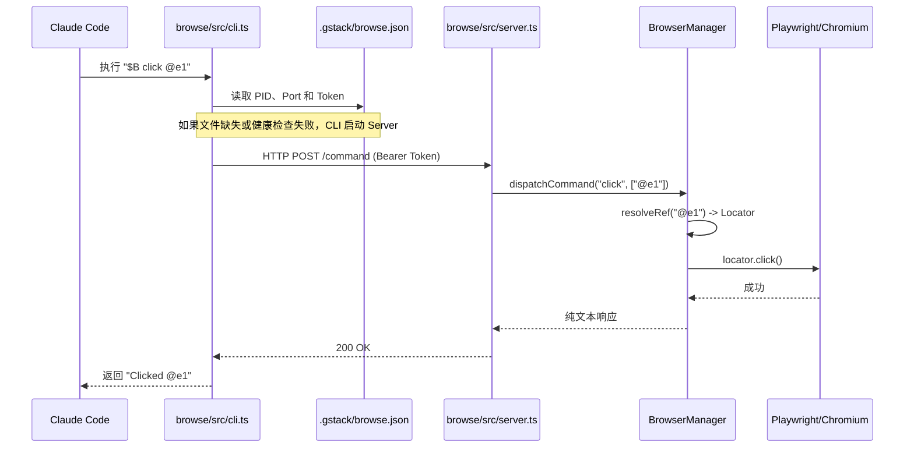
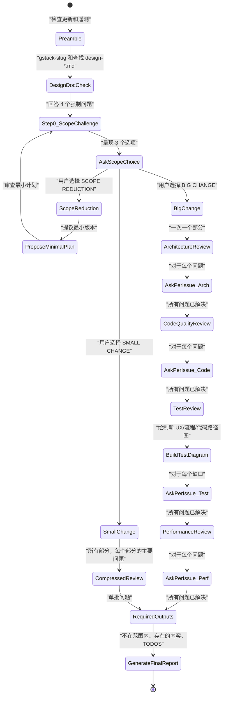

# gstack 原理文档

## 核心原理

gstack 是一个"开源软件工厂"，通过结构化的技能系统将 AI 代理从通用助手转变为协调的专家团队。它专为技术创始人、CEO 和高级工程师设计，旨在利用代理工作流以比传统团队更快的速度交付代码。

### 设计哲学

gstack 基于以下核心原则：

1. **专业化认知模式**：单个提示无法同时处理 CEO、架构师和 QA 工程师的细微差别。通过将这些分离为不同的技能（如 `/plan-ceo-review` vs `/plan-eng-review`），模型被迫进行特定深度的分析。

2. **多主机支持**：gstack 设计用于在各种 AI 主机（Claude、Codex、Gemini 等）上工作。它使用基于模板的生成系统来适应每个模型的特定约束和能力。

3. **验证与端到端测试**：gstack 使用分层测试系统确保技能质量，包括静态验证、E2E 测试和 LLM-as-judge 质量评估。

4. **安全与防护**：包含一套安全技能以防止意外破坏，如 `/careful`、`/freeze` 和 `/guard`。

## 系统架构

### 高层组件图

```mermaid
graph TB
    subgraph "代理接口（自然语言）"
        User["用户命令: /browse 或 /review"]
        ClaudeCode["Claude Code / Gemini / Codex / Cursor"]
    end
    
    subgraph "技能层（Markdown 提示）"
        SkillTemplates["SKILL.md.tmpl<br/>(CLAUDE.md:126)"]
        Resolvers["scripts/resolvers/*.ts<br/>(preamble, design, review)"]
        GeneratedSkills["SKILL.md<br/>(CLAUDE.md:125)"]
        HostConfigs["hosts/*.ts<br/>(claude.ts, codex.ts, etc.)"]
    end
    
    subgraph "浏览基础设施（代码实体）"
        CLI["browse/src/cli.ts<br/>(编译后的二进制文件)"]
        Server["browse/src/server.ts<br/>(Bun.serve)"]
        BM["BrowserManager<br/>(browse/src/browser-manager.ts)"]
        Snapshot["Snapshot System<br/>(browse/src/snapshot.ts)"]
        StateFile[".gstack/browse.json"]
    end

    subgraph "外部系统"
        Chromium["无头 Chromium<br/>(Playwright CDP)"]
        DesignBin["design/src/cli.ts<br/>(GPT Image API)"]
    end
    
    User --> ClaudeCode
    ClaudeCode -->|"加载"| GeneratedSkills
    SkillTemplates -->|"使用"| Resolvers
    Resolvers -->|"生成"| GeneratedSkills
    HostConfigs -->|"配置"| GeneratedSkills
    GeneratedSkills -->|"执行"| CLI
    CLI -->|"读取"| StateFile
    CLI -->|"HTTP POST + Token"| Server
    Server -->|"管理"| BM
    BM -->|"控制"| Chromium
    BM -->|"解析"| Snapshot
    GeneratedSkills -->|"通过 DesignBin 触发 UI 变体"
```

### 持久守护进程架构

gstack 的浏览器不是一次性脚本，而是一个持久守护进程。关键洞察是 AI 代理需要**亚秒级延迟**和**持久状态**才能有效工作。

#### 命令数据流



**关键架构决策**：
- **状态协调**：CLI 检查 `.gstack/browse.json` 查找运行中的服务器。如果不存在，它启动服务器，服务器将随机端口和 bearer token 写入此文件。
- **Ref 系统**：`snapshot` 系统基于 ARIA 可访问性树分配临时句柄（如 `@e1`），而不是使用 CSS。
- **安全模型**：守护进程使用双监听器架构分离本地流量和远程配对隧道，确保敏感路径如 `/health` 永不暴露到互联网。
- **自动生命周期**：服务器在第一个命令时自动启动，并在空闲 30 分钟后自动关闭。

### SKILL.md 模板系统

#### 问题

SKILL.md 文件告诉 Claude 如何使用浏览命令。如果文档列出了不存在的标志，或遗漏了已添加的命令，代理会遇到错误。手动维护的文档总是与代码脱节。

#### 解决方案

```
SKILL.md.tmpl          (人工编写的散文 + 占位符)
       ↓
gen-skill-docs.ts      (读取源代码元数据)
       ↓
SKILL.md               (已提交，自动生成的部分)
```

模板包含需要人工判断的工作流、提示和示例。占位符在构建时从源代码填充。

| 占位符 | 来源 | 生成内容 |
|--------|------|----------|
| `{{COMMAND_REFERENCE}}` | `commands.ts` | 分类命令表 |
| `{{SNAPSHOT_FLAGS}}` | `snapshot.ts` | 带示例的标志参考 |
| `{{PREAMBLE}}` | `gen-skill-docs.ts` | 启动块：更新检查、会话跟踪、贡献者模式、AskUserQuestion 格式 |
| `{{BROWSE_SETUP}}` | `gen-skill-docs.ts` | 二进制发现 + 设置说明 |
| `{{BASE_BRANCH_DETECT}}` | `gen-skill-docs.ts` | PR 定位技能的动态基分支检测 |
| `{{GBRAIN_CONTEXT_LOAD}}` | `resolvers/gbrain.ts` | 大脑优先上下文搜索 |

## 技能用法详解

### 核心认知模式

| 技能 | 专家角色 | 主要功能 |
| :--- | :--- | :--- |
| `/office-hours` | **YC Partner** | 通过 6 个强制问题重构产品想法 |
| `/plan-ceo-review` | **CEO / Founder** | 重新思考问题；找到"10 星产品" |
| `/plan-eng-review` | **Eng Manager** | 锁定架构、数据流和边缘情况 |
| `/review` | **Staff Engineer** | 发现通过 CI 但在生产中失败的 bug |
| `/qa` | **QA Lead** | 测试应用、发现 bug 并通过浏览器验证 |
| `/ship` | **Release Engineer** | 自动化 PR 创建、测试运行和文档同步 |
| `/browse` | **QA Engineer** | 通过持久浏览器为代理提供"眼睛" |
| `/investigate` | **Debugger** | 系统性根本原因调试，遵循"无调查不修复"的铁律 |

### /plan-eng-review 技能工作流

`/plan-eng-review` 技能提供工程经理模式，用于架构和技术规划。它在实施前对计划进行系统性技术审查，专注于架构、数据流、图表、边缘情况、测试覆盖率和性能。

#### 工作流状态机



#### Step 0: 范围挑战

在审查任何内容之前，技能必须回答四个挑战计划是否过度构建的问题：

| 问题 | 目的 |
|------|------|
| 什么现有代码已经部分/完全解决了每个子问题？ | 识别重用机会而不是构建并行解决方案 |
| 实现所述目标的最小更改集是什么？ | 标记范围蔓延和可推迟的工作 |
| 复杂性检查：这是否触及 >8 个文件或添加 >2 个新类？ | 将过度复杂性视为需要证明的异味 |
| 搜索检查 | 通过 `WebSearch` 验证内置函数、最佳实践和已知陷阱 |

回答这些问题后，技能通过 `AskUserQuestion` 呈现三条路径：
1. **SCOPE REDUCTION**：计划过度构建，提议最小版本
2. **BIG CHANGE**：交互式审查，一次一个部分（每部分最多 8 个问题）
3. **SMALL CHANGE**：压缩审查——每个部分的主要问题，单批问题

#### 审查部分

技能按顺序评估计划的四个部分：

1. **架构审查**：专注于高层设计。检查依赖耦合、数据流瓶颈和安全边界。特别要求为每个新代码路径提供一个现实的生产失败场景。
2. **代码质量审查**：检查组织、结构和技术债务。激进地标记 DRY 违规，并检查接触文件中的陈旧 ASCII 图表。
3. **测试审查**：强制生成**测试图表**，显示所有新 UX、数据流和分支结果。将这些结果映射到特定测试（JS、Rails 等），并根据 `CLAUDE.md` 中的现有评估套件评估 LLM/提示更改。
4. **性能审查**：检查 N+1 查询、内存使用、缓存和复杂性。

### /office-hours 技能工作流

`/office-hours` 技能充当 YC 办公时间合作伙伴，确保在提出解决方案之前理解问题。

#### 模式映射

技能根据用户的目标适应不同的模式：

- **Startup、intrapreneurship** → **Startup 模式**（Phase 2A）
- **Hackathon、开源、研究、学习、娱乐** → **Builder 模式**（Phase 2B）

#### 设计文档生成

技能生成结构化的设计文档，包含以下部分：

- 问题陈述
- 酷炫之处
- 约束
- 前提
- 跨模型视角
- 考虑的方法
- 推荐方法
- 开放问题
- 成功标准
- 分发计划
- 下一步
- 我注意到你如何思考

## 最佳实践

### 编辑 SKILL.md 文件

SKILL.md 文件是从 `.tmpl` 模板**生成**的。不要直接编辑 `.md` 文件——你的更改将在下次构建时被覆盖。

```bash
# 1. 编辑模板
vim skills/*/SKILL.md.tmpl

# 2. 重新生成
bun scripts/gen-skill-docs.ts

# 3. 提交模板和生成的文件
git add skills/*/SKILL.md.tmpl skills/*/SKILL.md
```

### 测试技能

```bash
# 静态验证（免费，<1秒）
bun test skill-validation.test.ts

# E2E 测试（~$3.85/运行）
bun test skill-e2e-browse.test.ts

# LLM 评估（~$0.15/运行）
bun test skill-llm-eval.test.ts
```

### 安全技能

- `/careful` - 破坏性命令警告（rm -rf、DROP TABLE、force-push）
- `/freeze` - 限制文件编辑到特定目录
- `/guard` - 完整安全模式（careful + freeze）

---

## 参考资源

- [gstack GitHub](https://github.com/garrytan/gstack)
- [gstack 架构文档](https://github.com/garrytan/gstack/blob/main/ARCHITECTURE.md)
- [gstack 技能文档](https://github.com/garrytan/gstack/blob/main/docs/skills.md)
- [gstack 贡献指南](https://github.com/garrytan/gstack/blob/main/CONTRIBUTING.md)
