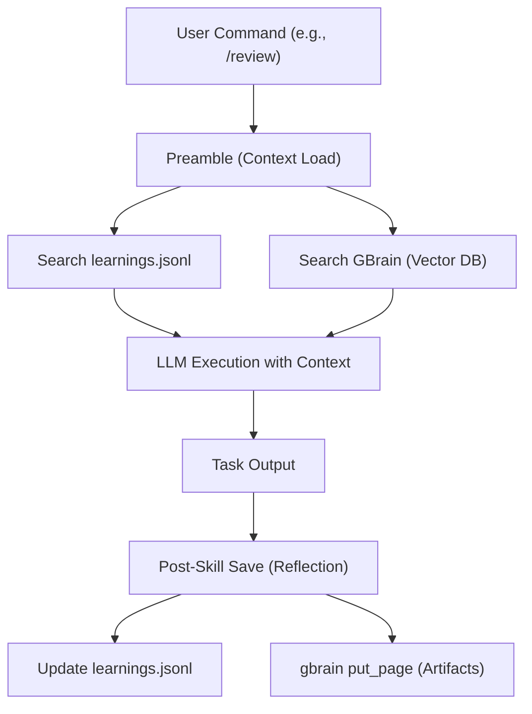

# GStack 知识系统架构 — 三层记忆

> gstack 的知识系统由 **Learnings（学习记录）**、**GBrain（长期记忆）** 和 **Preamble（自动前导块）** 三部分组成。核心原理：在任务执行前后进行自动化知识捕获与上下文检索，实现 AI Agent 的"制度化记忆"。

---

## 整体架构



---

## 一、项目学习系统 (Learnings)

### 工作原理

系统在 `/review`、`/ship`、`/investigate` 等技能执行过程中**自动捕获**发现的模式和坑。

### 存储结构

```
~/.gstack/projects/{slug}/learnings.jsonl
```

每条学习记录 append-only，Supabase 兼容 schema。

### 置信度机制

| 分数 | 行为 |
|------|------|
| 7-10 | 正常显示 |
| 5-6 | 显示但附加警告 |
| <5 | 不显示 |

**置信度衰减**：观察到的和推断的学习每 30 天减 1 分。用户明确设定的偏好不衰减。

**"学习已应用"标注**：当审查发现与历史学习匹配时，显示 `"Prior learning applied: [pattern] (confidence 8/10, from 2026-03-15)"`。

### 跨项目发现

用户可以授权 Agent 搜索其他项目的学习记录。数据不离开本机。

---

## 二、GBrain 长期记忆

### 索引对象

- 代码
- 会话副本（Transcripts）
- 生成的文档（设计文档、CEO Plan、Retro 等）

### 检索流程

1. **关键词提取**：从用户请求中提取 2-4 个关键词
2. **混合检索**：`gbrain search` 调用向量搜索或文件系统匹配（500ms 硬超时）
3. **上下文注入**：结果以 `<USER_TRANSCRIPT_DATA>` 标签包裹注入模型上下文

### 跨机器同步

`gbrain sync` 将精选子集推送到私有 Git 仓库，换设备后知识不丢失。

### MCP 集成

```
claude mcp add gbrain -- gbrain serve
```

`gbrain search`、`gbrain put_page` 等作为一等类型工具出现，不再是 bash shell-out。

---

## 三、Preamble 自动前导块

每个 gstack Skill 执行前都会运行 `{{PREAMBLE}}` 块，完成五件事：

| # | 功能 | 说明 |
|---|------|------|
| 1 | **更新检查** | `gstack-update-check`，有升级时提示 |
| 2 | **会话跟踪** | 统计活跃 session，≥3 个时进入 ELI16 模式 |
| 3 | **运营自改进** | Agent 反思失败、记录运营学习到 `.jsonl` |
| 4 | **AskUserQuestion 格式** | 统一询问格式，含推荐选项 |
| 5 | **搜索先于构建** | 三层知识：已验证模式(L1) → 新兴趋势(L2) → 第一性原理(L3) |

---

## 四、三层知识体系

```
Layer 1 (已验证模式)
  └─ learnings.jsonl, GBrain curated pages
  └─ 高置信度，直接应用

Layer 2 (新兴趋势)
  └─ GBrain transcripts, recent observations
  └─ 参考但不盲从

Layer 3 (第一性原理)
  └─ ETHOS.md 构建哲学
  └─ 当常规智慧与第一性原理冲突时，命名 "eureka moment" 并记录
```

---

## 五、关键设计原则

| 原则 | 说明 |
|------|------|
| **搜索先于构建** | 写代码前先搜是否有已知模式 |
| **自动捕获** | 不需要人类手动记录，Skill 执行后自动反思 |
| **置信度驱动** | 不是所有记忆平等——高置信度优先，低置信度抑制 |
| **本地优先** | 数据默认 `~/.gstack/`，同步到私有仓库可选 |
| **制度化记忆** | 跨会话、跨项目、跨机器的知识复用 |

---

## 六、与 Pensieve 的对比

| 维度 | GStack 知识系统 | Pensieve |
|------|----------------|----------|
| 触发 | 每次 Skill 执行自动 | 手动 `/self-improve` |
| 存储 | JSONL + GBrain Vector DB | Markdown 文件 |
| 检索 | 关键词 + 向量混合检索 | 文件系统 |
| 置信度 | 1-10 + 自动衰减 | 无 |
| 跨项目 | 可配置 | 项目级 |
| 同步 | 私有 Git | 无内置 |
