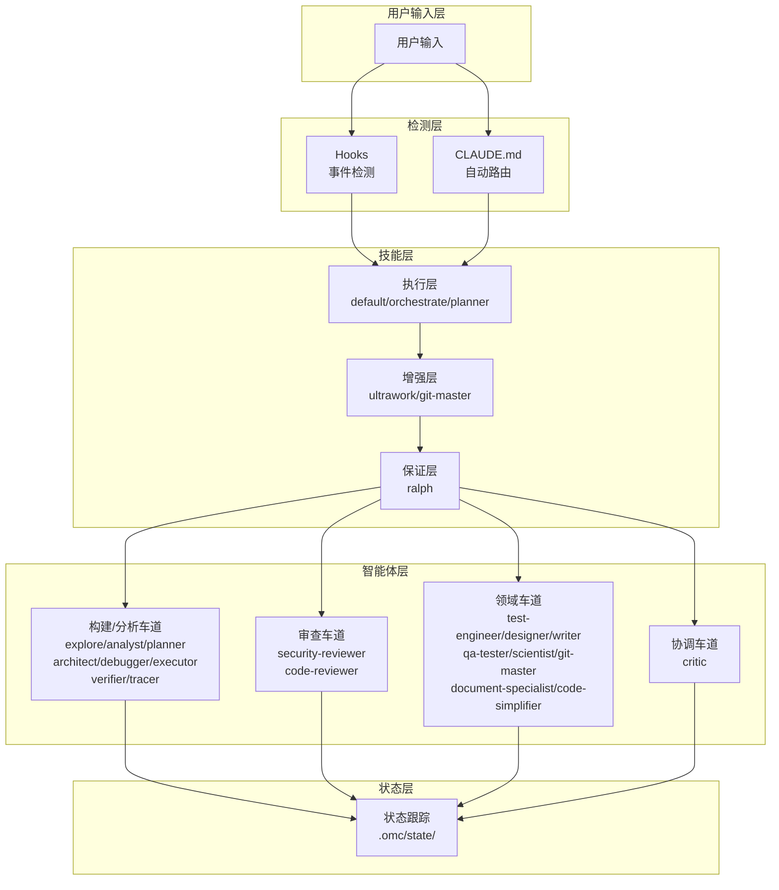

# oh-my-claudecode 架构与技能最佳实践文档

## 架构概览

oh-my-claudecode (OMC) 是一个为 Claude Code 设计的多智能体编排系统，通过基于技能的路由系统协调专业智能体。

### 系统架构图



### 四大核心系统

OMC 由四个相互锁定的系统组成：

1. **Hooks** - 检测生命周期事件
2. **Skills** - 注入行为模式
3. **Agents** - 执行专业工作
4. **State** - 跨上下文重置跟踪进度

---

## 技能系统详解

### 技能分层架构

技能以三层方式组合：

```
┌─────────────────────────────────────────────────────────────┐
│  保证层 (可选)                                                │
│  ralph: "必须验证完成才能停止"                                │
└─────────────────────────────────────────────────────────────┘
                              │
                              ▼
┌─────────────────────────────────────────────────────────────┐
│  增强层 (0-N 个技能)                                          │
│  ultrawork (并行) | git-master (提交) | frontend-ui-ux       │
└─────────────────────────────────────────────────────────────┘
                              │
                              ▼
┌─────────────────────────────────────────────────────────────┐
│  执行层 (主要技能)                                            │
│  default (构建) | orchestrate (协调) | planner (计划)        │
└─────────────────────────────────────────────────────────────┘
```

**公式**: `[执行技能] + [0-N 增强技能] + [可选保证技能]`

### 核心工作流技能

#### 1. autopilot - 自主执行
**用途**: 从想法到工作代码的完整自主 5 阶段流水线

**触发关键词**: `autopilot`, `build me`, `I want a`

**工作流程**:
```
Phase 0: 扩展 - 将模糊想法转化为详细规范
Phase 1: 规划 - 创建带验证的实施计划
Phase 2: 执行 - 使用并行智能体构建 (Ralph + Ultrawork)
Phase 3: QA - 测试直到全部通过 (最多 5 个周期)
Phase 4: 验证 - 多审查者批准 (Architect + Security + Code Review)
```

**示例**:
```bash
autopilot build me a REST API with authentication
```

#### 2. ralph - 持久执行
**用途**: 重复循环，直到工作被验证完成

**触发关键词**: `ralph`, `don't stop`, `must complete`

**工作机制**: `verifier` 智能体在循环退出前确认完成

**示例**:
```bash
ralph: refactor the authentication module
```

#### 3. ultrawork - 最大并行
**用途**: 最大并行度 — 同时启动多个智能体

**触发关键词**: `ultrawork`, `ulw`

**示例**:
```bash
ultrawork implement user authentication with OAuth
```

#### 4. team - 团队协调
**用途**: 协调 N 个 Claude 智能体，使用 5 阶段流水线

**流水线**: `plan → prd → exec → verify → fix`

**示例**:
```bash
/oh-my-claudecode:team 3:executor "implement fullstack todo app"
```

#### 5. ccg - 三模型协调
**用途**: 同时分发到 Codex 和 Gemini，Claude 综合结果

**触发关键词**: `ccg`, `claude-codex-gemini`

**示例**:
```bash
ccg: review this authentication implementation
```

#### 6. ralplan - 共识规划
**用途**: 迭代规划：Planner、Architect 和 Critic 循环直到达成共识

**触发关键词**: `ralplan`

**示例**:
```bash
ralplan this feature
```

### 实用技能

| 技能 | 描述 | 命令 |
|------|------|------|
| `cancel` | 取消活动执行模式 | `/oh-my-claudecode:cancel` |
| `hud` | 状态栏配置 | `/oh-my-claudecode:hud` |
| `omc-setup` | 初始设置向导 | `/oh-my-claudecode:omc-setup` |
| `omc-doctor` | 诊断安装问题 | `/oh-my-claudecode:omc-doctor` |
| `learner` | 从会话中提取可重用技能 | `/oh-my-claudecode:learner` |
| `skill` | 管理本地技能 (list/add/remove) | `/oh-my-claudecode:skill` |
| `trace` | 证据驱动的因果追踪 | `/oh-my-claudecode:trace` |
| `release` | 自动化发布工作流 | `/oh-my-claudecode:release` |
| `deepinit` | 生成分层 AGENTS.md | `/oh-my-claudecode:deepinit` |
| `deep-interview` | 苏格拉底式深度访谈 | `/oh-my-claudecode:deep-interview` |
| `sciomc` | 并行科学家智能体编排 | `/oh-my-claudecode:sciomc` |
| `external-context` | 并行 document-specialist 研究 | `/oh-my-claudecode:external-context` |
| `ai-slop-cleaner` | 清理 AI 表达模式 | `/oh-my-claudecode:ai-slop-cleaner` |
| `writer-memory` | 写作项目的记忆系统 | `/oh-my-claudecode:writer-memory` |

### 魔法关键词参考

| 关键词 | 效果 |
|--------|------|
| `ultrawork`, `ulw`, `uw` | 并行智能体编排 |
| `autopilot`, `build me`, `I want a` | 自主执行流水线 |
| `ralph`, `don't stop`, `must complete` | 循环直到验证完成 |
| `ccg`, `claude-codex-gemini` | 3 模型编排 |
| `ralplan` | 基于共识的规划 |
| `deep interview`, `ouroboros` | 苏格拉底式深度访谈 |

---

## 智能体系统详解

### 智能体分类

OMC 提供 19 个专业智能体，组织成 4 个车道。

#### 构建/分析车道

| 智能体 | 默认模型 | 角色 |
|--------|----------|------|
| `explore` | haiku | 代码库发现、文件/符号映射 |
| `analyst` | opus | 需求分析、隐藏约束发现 |
| `planner` | opus | 任务排序、执行计划创建 |
| `architect` | opus | 系统设计、接口定义、权衡分析 |
| `debugger` | sonnet | 根因分析、构建错误解决 |
| `executor` | sonnet | 代码实现、重构 |
| `verifier` | sonnet | 完成验证、测试充分性确认 |
| `tracer` | sonnet | 证据驱动的因果追踪、竞争假设分析 |

#### 审查车道

| 智能体 | 默认模型 | 角色 |
|--------|----------|------|
| `security-reviewer` | sonnet | 安全漏洞、信任边界、认证/授权审查 |
| `code-reviewer` | opus | 全面代码审查、API 契约、向后兼容性 |

#### 领域车道

| 智能体 | 默认模型 | 角色 |
|--------|----------|------|
| `test-engineer` | sonnet | 测试策略、覆盖率、不稳定测试硬化 |
| `designer` | sonnet | UI/UX 架构、交互设计 |
| `writer` | haiku | 文档、迁移说明 |
| `qa-tester` | sonnet | 通过 tmux 进行交互式 CLI/服务运行时验证 |
| `scientist` | sonnet | 数据分析、统计研究 |
| `git-master` | sonnet | Git 操作、提交、变基、历史管理 |
| `document-specialist` | sonnet | 外部文档、API/SDK 参考查找 |
| `code-simplifier` | opus | 代码清晰度、简化、可维护性改进 |

#### 协调车道

| 智能体 | 默认模型 | 角色 |
|--------|----------|------|
| `critic` | opus | 计划和设计的差距分析、多角度审查 |

### 模型路由

OMC 使用三个模型层级：

| 层级 | 模型 | 特征 | 成本 |
|------|------|------|------|
| LOW | haiku | 快速且便宜 | 低 |
| MEDIUM | sonnet | 平衡的性能和成本 | 中 |
| HIGH | opus | 最高质量的推理 | 高 |

**默认分配**:
- **haiku**: 快速查找和简单任务 (`explore`, `writer`)
- **sonnet**: 代码实现、调试、测试 (`executor`, `debugger`, `test-engineer`)
- **opus**: 架构、战略分析、审查 (`architect`, `planner`, `critic`, `code-reviewer`)

### 智能体选择指南

| 任务类型 | 推荐智能体 | 模型 |
|----------|------------|------|
| 快速代码查找 | `explore` | haiku |
| 功能实现 | `executor` | sonnet |
| 复杂重构 | `executor` (model=opus) | opus |
| 简单错误修复 | `debugger` | sonnet |
| 复杂调试 | `architect` | opus |
| UI 组件 | `designer` | sonnet |
| 文档 | `writer` | haiku |
| 测试策略 | `test-engineer` | sonnet |
| 安全审查 | `security-reviewer` | sonnet |
| 代码审查 | `code-reviewer` | opus |
| 数据分析 | `scientist` | sonnet |

### 典型智能体工作流

```
explore --> analyst --> planner --> critic --> executor --> verifier
(发现)    (分析)     (排序)    (审查)    (实现)     (确认)
```

---

## 最佳实践

### 1. 技能调用方式

**斜杠命令**:
```bash
/oh-my-claudecode:autopilot build me a todo app
/oh-my-claudecode:ralph refactor the auth module
/oh-my-claudecode:ultrawork implement OAuth
```

**魔法关键词**:
```bash
autopilot build me a todo app
ralph: refactor the auth module
ultrawork implement OAuth
```

### 2. 智能体选择原则

1. **快速任务用 haiku**: 代码查找、文档生成
2. **实现任务用 sonnet**: 功能开发、调试、测试
3. **架构任务用 opus**: 系统设计、代码审查、战略分析

### 3. 状态管理

- 状态保存在 `.omc/state/` 目录
- 支持跨上下文重置
- 可通过 `/oh-my-claudecode:hud` 查看状态

### 4. 技能组合示例

**场景**: 重构 API 并提交代码
```
Active skills: ultrawork + default + git-master
```

**场景**: 自主开发完整功能
```
Active skills: autopilot (自动包含 5 阶段)
```

**场景**: 持续验证直到完成
```
Active skills: ralph + verifier
```

---

## 参考资源

- [oh-my-claudecode GitHub](https://github.com/Yeachan-Heo/oh-my-claudecode)
- [OMC 架构文档](https://github.com/Yeachan-Heo/oh-my-claudecode/blob/main/docs/ARCHITECTURE.md)
- [技能迁移指南](https://github.com/Yeachan-Heo/oh-my-claudecode/wiki)
