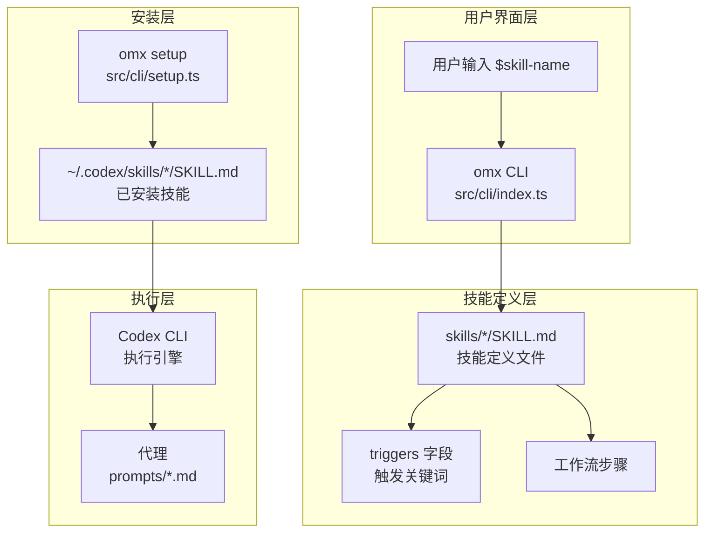
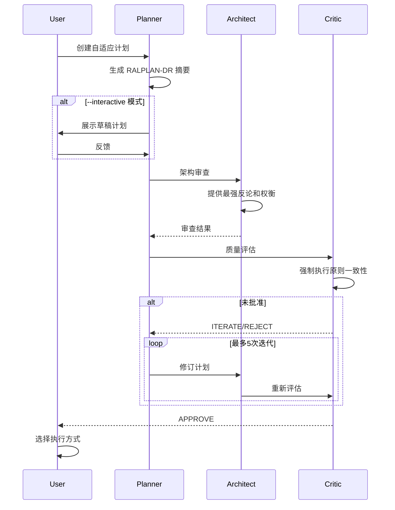
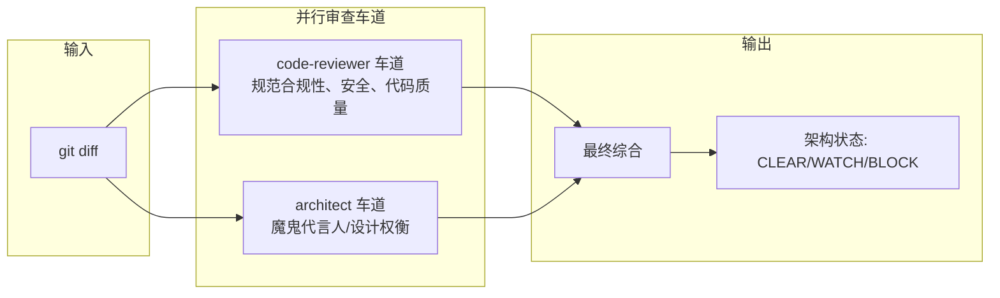
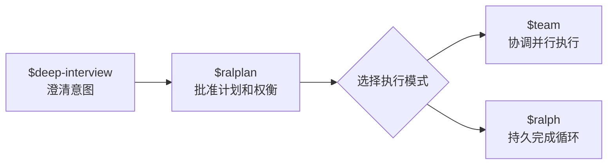

# oh-my-codex 技能系统原理文档

## 概述

oh-my-codex 的技能系统是一个可组合的工作流框架，通过 `$name` 触发器调用预定义的工作流模式。技能存储在 `skills/*/SKILL.md` 文件中，通过 `omx setup` 安装到 `~/.codex/skills/` 目录。

## 技能架构

### 核心组件



### 技能定义结构

每个技能通过 YAML frontmatter 定义元数据：

```yaml
---
id: workflow-[unique-id]
name: [Workflow Name]
description: Process for [specific task in this codebase]
source: conversation
triggers: ["task description", "file pattern", "goal keyword"]
quality: high
---
```

## 技能类型

### 1. 工作流技能

用于定义可重复的执行模式，如 `$ralplan`、`$team`、`$ralph`。

**模板结构**：
- The Insight：工作流的独特之处
- Why This Matters：不遵循此流程的后果
- Recognition Pattern：何时使用此工作流
- The Approach：分步方法
- Gotchas：常见陷阱

### 2. 代理快捷技能

直接调用特定代理的快捷方式，如 `$analyze`、`$deepsearch`、`$code-review`。

### 3. 工具技能

实用工具如 `$doctor`、`$help`、`$note`、`$trace`。

## 核心技能详解

### ralplan 技能

**用途**：规划师/架构师/评论家共识规划工作流。

**执行流程**：



**关键特性**：
- 步骤3和4必须顺序执行，先等待 Architect 结果再调用 Critic
- 支持目标模式后续建议（`$ultragoal`、`$autoresearch-goal`、`$performance-goal`）
- 预上下文摄入机制确保规划前有充分的上下文

### code-review 技能

**用途**：运行全面的代码审查。

**双车道审查模式**：



**严重性评级**：
- CRITICAL：安全漏洞（合并前必须修复）
- HIGH：错误或主要代码异味（合并前应该修复）
- MEDIUM：次要问题（可能时修复）
- LOW：样式/建议（考虑修复）

### wiki 技能

**用途**：持久化 markdown 项目知识库。

**存储结构**：
- 页面：`omx_wiki/*.md`
- 索引：`omx_wiki/index.md`
- 日志：`omx_wiki/log.md`

**核心操作**：
- `wiki_ingest`：合并知识到现有页面或创建新页面
- `wiki_query`：关键词和标签搜索
- `wiki_lint`：运行健康检查
- `wiki_add`：快速添加单个页面
- `wiki_list`/`wiki_read`/`wiki_delete`：列表/读取/删除操作

## 最佳实践

### 1. 规范工作流

**推荐流程**：



### 2. 预执行门控

ralplan 技能实现了预执行门控机制，防止在模糊请求上启动繁重的多代理编排。

**通过门控的示例**（足够具体，可直接执行）：
- `ralph fix the null check in src/hooks/bridge.ts:326`
- `autopilot implement issue #42`
- `team add validation to function processKeywordDetector`

**被门控重定向到 ralplan 的示例**（需要先确定范围）：
- `ralph fix this`
- `autopilot build the app`
- `team improve performance`

### 3. 技能开发

**添加新技能的步骤**：
1. 创建 `skills/my-skill/SKILL.md` 文件
2. 运行 `omx setup --force` 安装到 `~/.codex/skills/`
3. 在 Codex CLI 中使用 `$my-skill`

**技能模板选择**：
- 工作流技能：用于可重复的执行模式
- 代码模式技能：用于特定代码模式
- 集成技能：用于系统集成说明

### 4. 错误处理

所有命令必须处理：
- 文件/目录不存在
- 权限错误
- 无效的 YAML frontmatter
- 重复的技能名称
- 无效的技能名称（空格、特殊字符）

## 执行模式

oh-my-codex 支持多种执行模式：

| 模式 | 用途 | 技能 |
|------|------|------|
| 协调多代理执行 | 已批准计划的并行执行 | `$team` |
| 持久循环 | 直到完成的持久循环 | `$ralph` |
| 自主循环 | 严格的自主循环 | `$autopilot` |
| 最大并行执行 | 最大并行执行 | `$ultrawork` |
| 持久多目标规划 | 持久多目标规划和执行 | `$ultragoal` |
| 结构化视觉 QA | 截图/参考匹配的视觉 QA 循环 | `$visual-verdict` |
| 令牌高效路由 | 令牌高效的模型路由 | `$ecomode` |
| 测试/验证/修复循环 | 测试/验证/修复循环 | `$ultraqa` |

## 技能触发机制

技能通过关键词检测触发。系统使用正则表达式匹配用户意图：

```typescript
const DOCS_INTENT = /\b(?:docs?|documentation|readme|guide|changelog)\b/i;
const DEBUG_INTENT = /\b(?:debug|diagnose|investigate|root cause)\b/i;
const DESIGN_INTENT = /\b(?:design|layout|style)\b/i;
const BUILD_FIX_INTENT = /\b(?:build|compile|tsc|type error)\b/i;
```

## 技能模板

### 工作流技能模板

```markdown
---
id: workflow-[unique-id]
name: [Workflow Name]
description: Process for [specific task in this codebase]
source: conversation
triggers: ["task description", "file pattern", "goal keyword"]
quality: high
---

# [Workflow Name]

## The Insight
What makes this workflow different from the obvious approach?

## Why This Matters
What fails if you don't follow this process?

## Recognition Pattern
When should you use this workflow?
- Task type: [specific task]
- Files involved: [specific patterns]
- Indicators: [how to recognize]

## The Approach
1. [Step with specific commands/files]
2. [Step with specific commands/files]
3. [Verification]

## Gotchas
- [Common mistake and how to avoid it]
- [Edge case and how to handle it]
```

### 代码模式模板

```markdown
---
id: pattern-[unique-id]
name: [Pattern Name]
description: Pattern for [specific use case in this codebase]
source: conversation
triggers: ["code pattern", "file type", "problem domain"]
quality: high
---

# [Pattern Name]

## The Insight
What's the key principle behind this pattern?

## Why This Matters
What problems does this pattern solve in THIS codebase?

## Recognition Pattern
When do you apply this pattern?
- File types: [specific files]
- Problem: [specific problem]
- Context: [codebase-specific context]

## The Approach
Decision-making heuristic, not just code:
1. [Principle-based step]
2. [Principle-based step]

## Example
```typescript
[Illustrative example showing the principle]
```

## Anti-Pattern
What NOT to do and why:
```typescript
[Common mistake to avoid]
```
```

### 集成技能模板

```markdown
---
id: integration-[unique-id]
name: [Integration Name]
description: How [system A] integrates with [system B] in this codebase
source: conversation
triggers: ["system name", "integration point", "config file"]
quality: high
---

# [Integration Name]

## The Insight
What's non-obvious about how these systems connect?

## Why This Matters
What breaks if you don't understand this integration?

## Recognition Pattern
When are you working with this integration?
- Files: [specific integration files]
- Config: [specific config locations]
- Symptoms: [what indicates integration issues]

## The Approach
How to work with this integration correctly:
1. [Configuration step with file paths]
2. [Setup step with specific details]
3. [Verification step]

## Gotchas
- [Integration-specific pitfall #1]
- [Integration-specific pitfall #2]
```

---

## 参考资源

- [oh-my-codex GitHub](https://github.com/Yeachan-Heo/oh-my-codex)
- [oh-my-codex 技能文档](https://github.com/Yeachan-Heo/oh-my-codex/blob/main/docs/skills.html)
- [oh-my-codex 贡献指南](https://github.com/Yeachan-Heo/oh-my-codex/blob/main/CONTRIBUTING.md)
