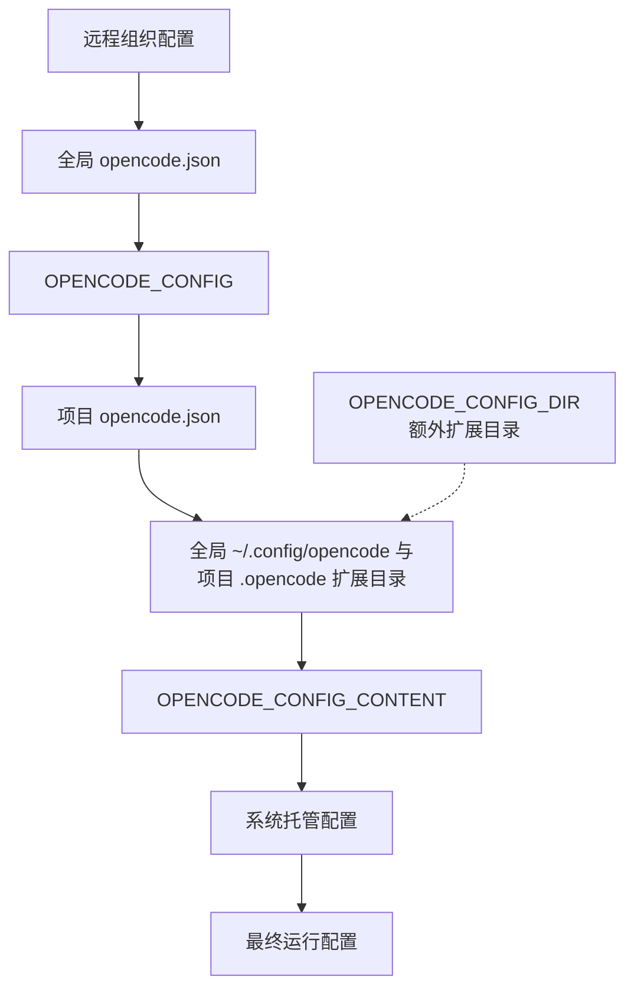
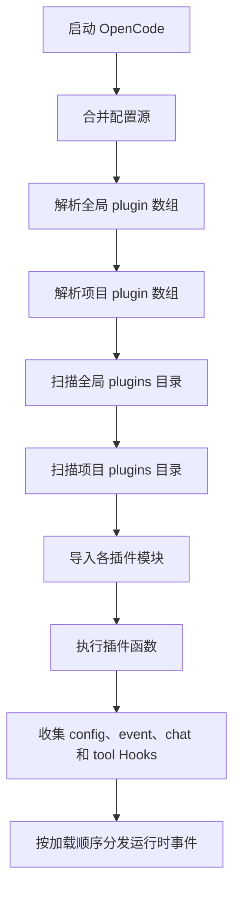
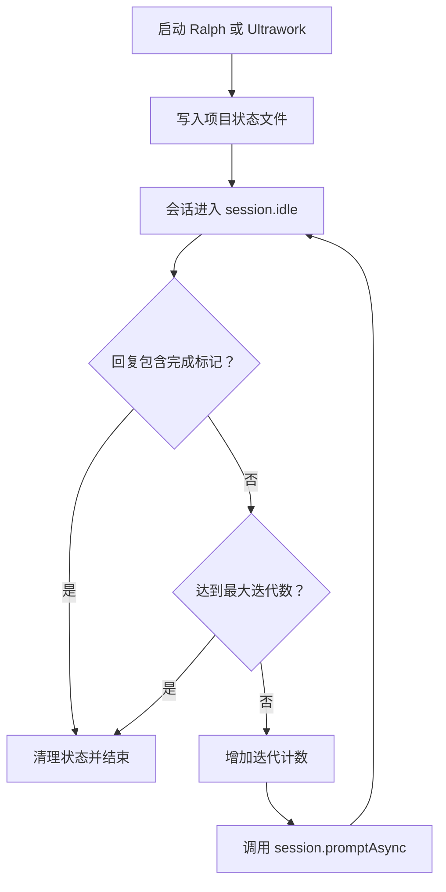

# OpenCode 全局配置目录与插件加载链路

本文先依据 OpenCode 官方文档说明 `~/.config/opencode` 的标准结构，再用 OpenCode 1.18.32 的本机环境做一次实际审计。重点是分清三件事：OpenCode 官方会识别什么、本机工具额外放了什么，以及运行时最终加载了什么。

Rapid Agent Team 的安装产物和角色设计另见 [OpenCode Rapid Agent Team 安装与架构实战指南](./opencode-rapid-agent-team-install-guide.md)。

## 核心结论

`~/.config/opencode` 不是一个“所有文件都会自动生效”的目录。OpenCode 只会按约定读取主配置、规则文件和扩展目录；包管理器、第三方工具与用户也可以在这里保存辅助文件，但这些文件不会因为位于该目录就自动成为 OpenCode 配置。

官方当前约定的全局结构可以概括为：

```text
~/.config/opencode/
├── opencode.json | opencode.jsonc  # 服务端与运行时主配置
├── tui.json | tui.jsonc            # TUI 专用配置
├── AGENTS.md                        # 全局规则
├── agents/                          # Agent 定义
├── commands/                        # Slash Command 定义
├── modes/                           # Mode 定义
├── plugins/                         # 自动加载的本地插件
├── skills/                          # 按需加载的 Agent Skill
├── tools/                           # 自定义工具
├── themes/                          # 自定义主题
└── package.json                     # 本地插件和工具的 npm 依赖，可选
```

官方要求新配置使用复数目录名。`agent/`、`command/` 等单数形式仍受支持，但只是向后兼容，不应作为新配置的首选。

## 官方目录模型

### 主配置与规则

| 路径 | 官方用途 | 加载方式 |
|---|---|---|
| `opencode.json`、`opencode.jsonc` | Provider、模型、权限、MCP、插件等运行时配置 | 启动时读取并参与配置合并 |
| `tui.json`、`tui.jsonc` | 主题、按键、滚动等 TUI 设置 | TUI 启动时读取 |
| `AGENTS.md` | 对所有会话生效的全局指令 | 加入模型上下文 |

主配置应声明 Schema，避免字段写错后直到启动才暴露：

```json
{
  "$schema": "https://opencode.ai/config.json"
}
```

密钥不要直接写入示例或版本库。OpenCode 支持环境变量和文件引用：

```json
{
  "provider": {
    "example": {
      "options": {
        "apiKey": "{env:PROVIDER_API_KEY}"
      }
    }
  }
}
```

### 扩展目录

| 目录 | 文件形态 | 作用 |
|---|---|---|
| `agents/` | `*.md` | 定义提示词、模型、权限和运行模式 |
| `commands/` | `*.md` | 定义 Slash Command 的提示模板 |
| `plugins/` | `*.js`、`*.ts` | 启动时自动导入，注册运行时 Hook 或工具 |
| `skills/` | `<name>/SKILL.md` | 向 Agent 暴露可按需加载的工作流与知识 |
| `tools/` | `*.js`、`*.ts` | 定义模型可调用的自定义工具 |
| `themes/` | `*.json` | 定义 TUI 主题 |

这些目录保存的是不同类型的扩展，不能混为一谈。Agent 和 Command 是声明式 Markdown；Skill 由模型按需加载；Tool 暴露可调用函数；Plugin 则能监听事件并修改 OpenCode 的运行行为。

### 依赖、缓存、日志与状态

OpenCode 把配置、缓存和运行数据放在不同位置：

| 路径 | 官方用途 |
|---|---|
| `~/.config/opencode/` | 用户配置与全局扩展 |
| `~/.cache/opencode/node_modules/` | 通过 `plugin` 数组声明的 npm 插件及其依赖缓存 |
| `~/.local/share/opencode/log/` | 日志，默认保留最近 10 个文件 |
| `~/.local/share/opencode/` | 认证、会话和项目状态等应用数据 |

本地插件和自定义工具如果需要第三方 npm 包，可以在全局配置目录或项目 `.opencode/` 中放置 `package.json`。OpenCode 启动时会执行 Bun 安装，因此同目录下可能出现 `bun.lock` 和 `node_modules/`。它们是本地扩展的依赖环境，不是 npm 插件的官方缓存位置。

## 配置如何合并

OpenCode 不会简单地用项目配置替换全局配置，而是合并所有配置源。官方当前给出的优先顺序如下，越靠后优先级越高：

1. 组织通过 `.well-known/opencode` 提供的远程配置。
2. 全局配置 `~/.config/opencode/opencode.json`。
3. `OPENCODE_CONFIG` 指定的自定义配置。
4. 从当前目录向 Git 根目录查找的项目 `opencode.json`。
5. 全局 `~/.config/opencode/` 与项目 `.opencode/` 扩展目录。
6. `OPENCODE_CONFIG_CONTENT` 提供的内联配置。
7. 系统管理员控制的托管配置。
8. macOS MDM 托管偏好。

只有冲突字段会被后加载的来源覆盖；不冲突的字段都会保留。



如果设置了 `OPENCODE_CONFIG_DIR`，OpenCode 还会把该目录按 `.opencode` 的结构搜索 Agent、Command、Mode 和 Plugin。官方说明该目录在全局配置和 `.opencode` 目录之后加载，因此可覆盖这些来源。它是额外的扩展发现来源，不等于修改 `~/.config/opencode` 的默认位置；这也是上图用虚线支路而没有把它伪装成普通 JSON 配置文件的原因。

## 本机目录逐项分类

当前机器的 `~/.config/opencode` 有 26 个顶层条目。它们可分成四组。

### OpenCode 官方直接识别

| 条目 | 分类 | 说明 |
|---|---|---|
| `opencode.json` | 官方主配置 | 全局运行时配置 |
| `agents/` | 官方扩展目录 | 本机 Agent 定义 |
| `commands/` | 官方扩展目录 | 当前包含 `rapid-dev.md` |
| `plugins/` | 官方扩展目录 | 当前包含两个本地插件入口和插件私有 `.env` |
| `skills/` | 官方扩展目录 | 当前包含 `rapid-dev-team` Skill |
| `command/` | 兼容目录 | 单数旧名称，当前存放 GSD Commands；新配置应迁往 `commands/` |

本机尚未创建 `AGENTS.md`、`tui.json`、`modes/`、`tools/` 或 `themes/`。缺少这些条目不代表配置异常，只代表没有使用相应功能。

### 本地扩展依赖产物

| 条目 | 分类 | 说明 |
|---|---|---|
| `package.json` | 本地依赖元数据 | OpenCode 官方允许用于声明本地 Plugin 和 Tool 的依赖 |
| `bun.lock` | Bun 锁文件 | 本地依赖安装产物 |
| `node_modules/` | 本地依赖目录 | 本机扩展可从这里导入包；不要与 `~/.cache/opencode/node_modules/` 混淆 |
| `package-lock.json` | npm 锁文件 | npm 生成，不是 OpenCode 配置文件 |
| `.gitignore`、`.env` | 通用辅助文件 | 是否生效取决于 Git、Shell 或具体插件，不由 OpenCode 主配置加载器解释 |

### 第三方工具和插件专用文件

| 条目 | 所属方 | 说明 |
|---|---|---|
| `get-shit-done/`、`hooks/` | GSD | 工作流实现和 GSD 自己调用的 Hook 脚本；`hooks/` 不是 OpenCode 官方插件目录 |
| `.gsd-profile`、`gsd-file-manifest.json`、`gsd-install-state.json`、`gsd-migration-journal/` | GSD | 配置、安装清单和迁移状态 |
| `commands.json`、`rapid-dev-team.env` | Rapid Dev Team | 命令映射和环境配置 |
| `opencode-fallback.jsonc`、`opencode-fallback.log` | Runtime Fallback 插件 | 第三方插件自己的配置和日志 |
| `settings.json` | 当前为空 | 不是官方文档列出的 OpenCode 主配置文件，不能当作 `opencode.json` 的替代品 |

这些文件可以被对应工具主动读取，但 OpenCode 不会仅凭文件名自动解释它们。例如，官方本地插件目录叫 `plugins/`，不是 `hooks/`。

### 备份和历史文件

`.backups/`、`opencode.json.bak` 和 `opencode.json.kiro-backup-1780298852342` 是备份或迁移残留，不参与标准配置加载。它们仍可能含有旧密钥，不能因为“不生效”就忽略访问权限和清理策略。

## 两条插件发现链路

OpenCode 官方支持本地文件和 npm 包两种插件来源。

### npm 插件

在主配置的 `plugin` 数组中声明包名：

```json
{
  "plugin": ["opencode-runtime-fallback"]
}
```

OpenCode 启动时使用 Bun 自动安装，并把包及其依赖缓存到：

```text
~/.cache/opencode/node_modules/
```

本机 `~/.config/opencode/node_modules/opencode-runtime-fallback/` 中也存在 0.2.4 版本，但这是本机 npm 依赖状态，不是官方文档所定义的自动安装缓存。运行时是否加载该插件，应以合并后的 `plugin` 数组和调试输出为准，不能只看某个 `node_modules` 是否存在。

### 本地插件

官方自动扫描：

```text
~/.config/opencode/plugins/
.opencode/plugins/
```

目录中的 JavaScript 或 TypeScript 文件会在启动时直接加载，无须再写入 `plugin` 数组。单数 `plugin/` 仅为向后兼容。

当前全局目录中的两个入口为：

```text
~/.config/opencode/plugins/wecom-notify.js
~/.config/opencode/plugins/ralph-loop.js
```

其中 `ralph-loop.js` 是符号链接：

```text
~/.config/opencode/plugins/ralph-loop.js
  -> ~/.opencode/plugins/opencode-ralph-loop/src/index.js
```

普通文件搜索如果不跟随符号链接，可能漏掉真实源码；OpenCode 仍会从扫描到的入口加载它。

### 插件加载顺序

官方定义的顺序是：

1. 全局主配置声明的插件。
2. 项目主配置声明的插件。
3. 全局 `plugins/` 目录中的插件。
4. 项目 `.opencode/plugins/` 目录中的插件。

所有来源都会加载，Hook 按顺序执行。同名同版本的 npm 包只加载一次；名字相似的本地插件和 npm 插件仍会分别加载。



插件文件并非“放进去就必然有效”。模块必须成功导出插件函数，该函数还必须返回有效的 Hooks 对象；导入或初始化失败会阻止插件正常参与运行。

## 本机实际加载的插件

以下内容是 2026-09-24 在 OpenCode 1.18.32 上取得的本机快照，不是对所有版本的官方接口承诺。命令输出和第三方源码共同构成证据；未来版本应重新执行诊断，而不是照搬这里的结果。

`opencode debug info` 显示当前 OpenCode 1.18.32 加载了 3 个外部插件：

| 插件 | 来源 | 发现方式 | 作用 |
|---|---|---|---|
| `opencode-runtime-fallback` 0.2.4 | npm 包 | `opencode.json` 显式声明 | 模型请求失败或超时后切换备用模型 |
| `wecom-notify.js` | 本地 JavaScript | 全局 `plugins/` 自动扫描 | 会话完成、出错或请求权限时发送企业微信通知 |
| `ralph-loop.js` | 本地符号链接 | 全局 `plugins/` 自动扫描 | 未检测到完成标记时自动继续会话 |

```text
opencode version: 1.18.32
plugins:
- opencode-runtime-fallback
- file:///home/fenghaolin/.config/opencode/plugins/wecom-notify.js
- file:///home/fenghaolin/.config/opencode/plugins/ralph-loop.js
```

使用纯净模式后，输出变为：

```text
plugins:
external plugins disabled (--pure)
```

这证明三者都是外部插件，不是 OpenCode 内置功能。

## 三个插件的运行逻辑

本节描述的是本机安装版本的第三方代码，不是 OpenCode 内置行为。对应证据入口为 `~/.config/opencode/node_modules/opencode-runtime-fallback/dist/index.js`、`~/.config/opencode/plugins/wecom-notify.js` 和 `~/.opencode/plugins/opencode-ralph-loop/src/index.js`。

### opencode-runtime-fallback

该插件读取自己的 `opencode-fallback.json` 或 `opencode-fallback.jsonc`，主要注册：

- `config`：读取合并后的 Agent 配置。
- `event`：处理消息更新、会话错误、超时和空响应等事件。
- `chat.message`：记录请求上下文，为失败重放准备数据。
- `tool.execute.after`：处理子任务空结果，并尝试替换为回退结果。

检测到可重试错误或首个 Token 超时后，它会选择下一个未处于冷却期的模型，终止原请求并重放消息。`opencode-fallback.jsonc` 的路径和格式属于该插件自己的协议，不属于 OpenCode 官方 Schema。

### wecom-notify.js

该插件注册 `config`、`chat.message` 和 `event` Hook，注入 `/wecom-notify` 命令，并监听：

| 事件 | 通知内容 |
|---|---|
| `session.idle` | 回复完成及最后一条助手消息摘要 |
| `session.error` | 会话错误信息 |
| `permission.asked` | 待确认权限及匹配模式 |

密钥来自环境变量或插件自己的 `.env`。本文不记录任何实际密钥值。

### ralph-loop.js

该入口指向 `~/.opencode/plugins/opencode-ralph-loop/src/index.js`，注册 `/ralph-loop`、`/ulw-loop`、`/cancel-ralph` 及对应会话 Hook：



## 诊断方法

`debug info`、`debug config` 和 `--pure` 已在本机 OpenCode 1.18.32 验证，但本文引用的官方文档没有把它们承诺为跨版本稳定接口。升级后如果命令不可用，应以当前版本的 `opencode --help`、`opencode debug --help` 和官方 Troubleshooting 文档为准。

查看版本、路径和运行时插件清单：

```bash
opencode debug info
```

查看合并后的最终配置：

```bash
opencode debug config
```

禁用外部插件做对照实验：

```bash
opencode debug info --pure
```

确认本地入口是否为符号链接：

```bash
stat -c '%N' ~/.config/opencode/plugins/*.js
```

排查顺序应固定为：

1. 用 `opencode debug info` 看实际加载结果。
2. 用 `opencode debug config` 看合并后的声明。
3. 检查全局和项目 `plugins/` 的入口及符号链接。
4. 检查 `~/.cache/opencode/node_modules/` 中的自动安装缓存。
5. 检查配置目录中的本地依赖状态。
6. 使用 `--pure` 验证问题是否来自外部插件。
7. 查看 `~/.local/share/opencode/log/` 中的日志。

## 审计发现的风险

### 插件启动时重写主配置

本机启动输出显示两个插件分别同步了 1 个和 3 个命令；`wecom-notify.js:164` 与 `opencode-ralph-loop/src/index.js:93` 均调用 `writeFileSync` 写入主配置，而两者又分别在 `wecom-notify.js:189` 与 `opencode-ralph-loop/src/index.js:236` 注册 `config` Hook。这是重复状态，可能产生无意义的配置变更和写入竞态。更简单的设计是只保留动态注入，或者使用稳定的 `commands/*.md` 文件，不要在插件初始化时修改主配置。

### 依赖元数据漂移

当前 `package.json` 只有 `{"type":"commonjs"}`，但 `package-lock.json` 和 `bun.lock` 记录了不同版本的 `@opencode-ai/plugin`，前者还记录了 `opencode-runtime-fallback`。锁文件、依赖声明和实际 `node_modules` 不一致，会使升级与重建不可预测。

这不是“把依赖补回去”就一定正确。应先决定配置目录只使用 Bun 还是还要保留 npm，再让一个 `package.json` 和一套锁文件成为真源。

### 配置目录混入多个工具的状态

GSD、Rapid Dev、Runtime Fallback、插件日志、备份和 OpenCode 官方配置共处一个目录，短期可用，但会放大备份、迁移和排障成本。至少要维持清晰边界：官方加载入口放在约定目录，第三方私有状态使用稳定前缀或独立子目录，日志与备份不得被误认为配置。

### 明文密钥和历史副本

主配置、`.env`、日志和备份都可能保留凭据。应使用 `{env:NAME}` 或 `{file:path}` 引用，并轮换已经暴露到历史文件或会话上下文的密钥。仅把密钥从主配置移到另一个明文文件，不能消除已发生的泄露。

## 参考资料

- [OpenCode Config](https://opencode.ai/docs/config/)
- [OpenCode JSON Schema](https://opencode.ai/config.json)
- [OpenCode Plugins](https://opencode.ai/docs/plugins/)
- [OpenCode Agents](https://opencode.ai/docs/agents/)
- [OpenCode Commands](https://opencode.ai/docs/commands/)
- [OpenCode Agent Skills](https://opencode.ai/docs/skills/)
- [OpenCode Custom Tools](https://opencode.ai/docs/custom-tools/)
- [OpenCode Themes](https://opencode.ai/docs/themes/)
- [OpenCode Rules](https://opencode.ai/docs/rules/)
- [OpenCode Troubleshooting](https://opencode.ai/docs/troubleshooting/)
- [OpenCode 官方仓库](https://github.com/anomalyco/opencode)

最终判断只有一个可靠方法：把“官方约定”“第三方私有文件”和“运行时证据”分开。目录名只能说明候选来源，`opencode debug info` 展示的成功加载结果才说明插件真正进入了运行时。
