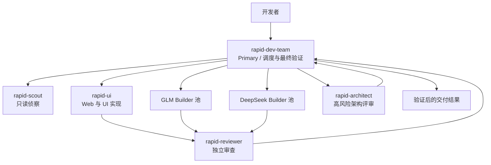
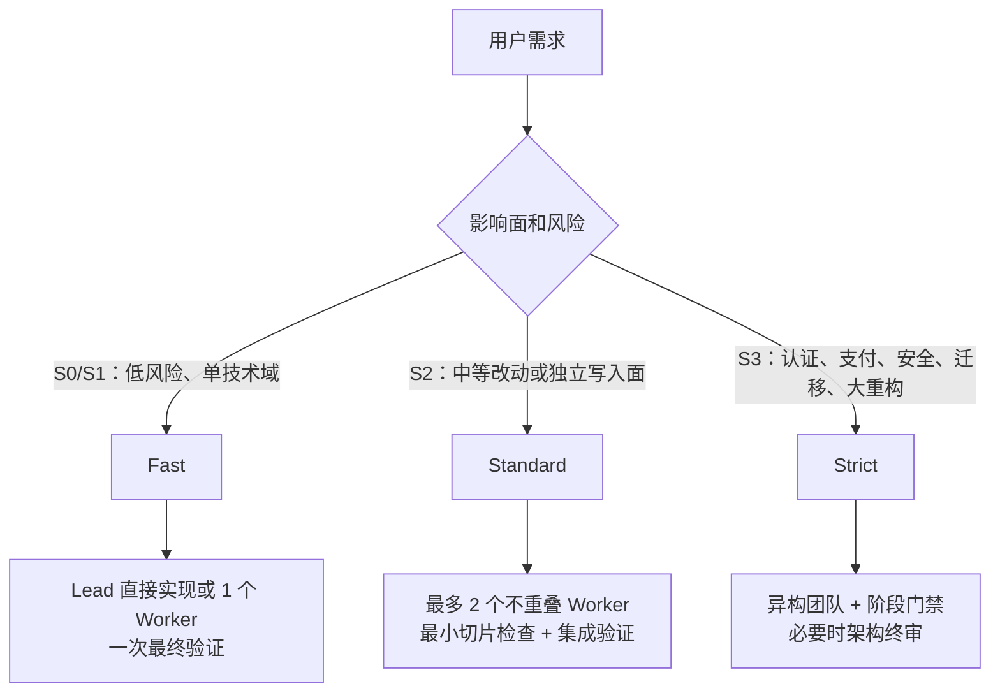

# OpenCode Rapid Agent Team 安装与架构实战指南

`VastNext/opencode-rapid-agent-team` 是一套面向 OpenCode 的异构开发团队配置。它不只是修改 `opencode.json`，还会安装 Primary Agent、多个专职 Subagent、一套调度 Skill 和 `/rapid-dev` 命令。

本文介绍它的架构、全局安装方法和验证方式。OpenCode 官方目录规则、配置优先级和插件机制另见 [OpenCode 全局配置目录与插件加载链路](./opencode-plugin-loading.md)。

> 本文的安装命令来自 Rapid Agent Team 仓库，验证脚本也是该仓库自带脚本，不是 OpenCode 官方测试套件。模型名称取决于安装版本和本机 Provider 配置，升级后应以实际 Agent 文件为准。

## 核心设计

Rapid Agent Team 只有一个面向用户的主要入口：

```text
rapid-dev-team
```

它先按影响面与风险把任务分为 Fast、Standard 或 Strict，再决定由 Lead 直接实现，还是调用专职 Worker。目标不是尽可能多地派 Agent，而是让流程成本与任务风险匹配。



## 角色分工

| Agent | 角色 | 当前本机模型 | 关键边界 |
|---|---|---|---|
| `rapid-dev-team` | Primary Lead | 以 Agent 文件的 `model` 字段为准 | 选择档位、分配任务、执行最终验证与交付 |
| `rapid-scout` | 只读侦察 | `cliproxy/gemini-3.8-flash-high` | 搜索代码、依赖研究、识别并行边界，不修改文件 |
| `rapid-ui` | Web 与 UI Worker | `cliproxy/gemini-3.8-flash-high` | 前端实现、页面解析和视觉验证 |
| `rapid-builder-glm-zhipu` | GLM 主 Worker | 以 Agent 文件为准 | 通用 Web、后端、小程序和测试实现 |
| `rapid-builder-glm-go` | GLM 备用 Worker | 以 Agent 文件为准 | Provider 回退或扩充吞吐 |
| `rapid-builder-deepseek-go` | DeepSeek 主 Worker | 以 Agent 文件为准 | 后端、脚本、测试和复杂逻辑 |
| `rapid-builder-deepseek-sensenova` | DeepSeek 备用 Worker | 以 Agent 文件为准 | 主通道不可用时处理独立任务 |
| `rapid-reviewer` | 独立 Reviewer | `cockpit/gpt-5.6-luna` | 只读检查正确性、回归和测试证据 |
| `rapid-architect` | 高风险架构裁决 | `cliproxy/claude-opus-4-6-thinking` | 只处理认证、支付、安全、迁移和大重构 |

不要把模型名当成架构契约。真正稳定的契约是角色边界、权限和验证责任；模型与 Provider 可以按可用性调整。

## 三档执行机制



| 档位 | 适用场景 | 默认调度 | 验证方式 |
|---|---|---|---|
| Fast | 样式、文案、链接、小 Bug、单技术域修改 | Lead 或 1 个最匹配 Worker | Primary 最终验证一次，Reviewer 审查 Diff 和证据 |
| Standard | 多个相关模块，或至少两个可独立写入面 | 最多 2 个边界不重叠的 Worker | Worker 做最小检查，Primary 做一次集成验证 |
| Strict | 认证、支付、安全、迁移、基础设施和大重构 | 异构 Worker、Reviewer，必要时 Architect | 阶段测试、专项检查、完整集成和回滚门禁 |

文件多不等于风险高。机械、同质且共享同一决策面的批量修改仍可走 Fast；权限边界、生产数据或难回滚部署即使文件少，也应升级档位。

## 安装

### 全局安装

以下命令会把配置安装到 `~/.config/opencode/`：

```bash
git clone --depth 1 https://github.com/VastNext/opencode-rapid-agent-team.git /tmp/opencode-rapid-agent-team
cd /tmp/opencode-rapid-agent-team
python3 scripts/install.py --scope global
python3 scripts/verify.py --scope global
```

验证完成后删除临时克隆：

```bash
rm -rf /tmp/opencode-rapid-agent-team
```

`rm -rf` 是不可逆命令。执行前必须确认路径精确为临时克隆目录，不要使用变量为空时可能扩大的写法。

安装完成后彻底退出并重新启动 OpenCode。Agent、Command、Skill 和 Plugin 等启动期配置不会自动刷新到已经运行的会话中。

### 主要安装产物

```text
~/.config/opencode/
├── agents/
│   ├── rapid-dev-team.md
│   ├── rapid-scout.md
│   ├── rapid-ui.md
│   ├── rapid-builder-glm-zhipu.md
│   ├── rapid-builder-glm-go.md
│   ├── rapid-builder-deepseek-go.md
│   ├── rapid-builder-deepseek-sensenova.md
│   ├── rapid-reviewer.md
│   └── rapid-architect.md
├── skills/
│   └── rapid-dev-team/
│       └── SKILL.md
├── commands/
│   └── rapid-dev.md
├── commands.json
├── rapid-dev-team.env
└── .backups/
```

其中 `agents/`、`skills/` 和 `commands/` 是 OpenCode 识别的标准扩展目录；`commands.json`、`rapid-dev-team.env` 和 `.backups/` 是 Rapid Agent Team 安装器自己的元数据或状态，不是 OpenCode 官方配置文件。

安装器升级时可能增加或删除文件，所以这张树只是主要产物，不应替代仓库内的安装清单。

## 验证

### 仓库验证脚本

在临时克隆目录中执行：

```bash
python3 scripts/verify.py --scope global
```

这个脚本检查 Rapid Agent Team 的 Agent、Skill、Command 和 Primary 角色是否正确安装。它属于第三方仓库，不代表 OpenCode 项目官方背书。

### OpenCode 运行时解析

当前本机 OpenCode 1.18.32 可使用：

```bash
opencode debug agent rapid-dev-team
```

输出中至少应确认：

```json
{
  "name": "rapid-dev-team",
  "mode": "primary"
}
```

该调试命令可能随 OpenCode 版本变化。升级后先查看：

```bash
opencode debug --help
```

还应直接检查安装文件，而不是只相信安装器的成功提示：

```bash
ls ~/.config/opencode/agents/rapid-*.md
ls ~/.config/opencode/skills/rapid-dev-team/SKILL.md
ls ~/.config/opencode/commands/rapid-dev.md
```

## 使用

### 切换 Primary Agent

在 OpenCode 的 Agent 切换菜单中选择 `rapid-dev-team`，然后直接描述开发任务：

```text
实现一个带 JWT 认证与分页查询的用户管理接口，并补充自动化集成测试。
```

### 使用命令

在现有会话中调用：

```text
/rapid-dev 重构视频上传处理链路，提取两步上传抽象，并确保老接口兼容
```

两种入口最终都使用 `rapid-dev-team` Skill 中的档位、任务契约和验证矩阵。

## 工程边界

### 异构审查看模型家族

同一模型通过两个 Provider 调用只能增加吞吐，不构成独立审查。独立 Reviewer 应使用不同模型家族，并检查真实 Diff 与测试证据，而不是重复实现者的结论。

### Worker 不是最终责任人

Worker 只负责明确的文件边界和最小验证。Primary 负责合并后的最终验证；Reviewer 只读审查 Diff 和证据，不应假装执行了权限不允许的测试。

### Git 权限是安全边界

当前团队配置禁止 Worker 执行危险 Git 操作，并限制 `reset`、`clean`、强制推送和宽泛暂存。权限文件才是实际边界，文档描述不能替代对 Agent frontmatter 的检查。

### 不要重复验证

Fast 任务不需要 Worker、Primary、Reviewer 和 CI 各自运行同一套完整测试。实现者做必要的局部检查，Primary 执行一次最终验证，Reviewer审查其证据。只有高风险变更才需要阶段性和专项门禁。

## 升级检查

Rapid Agent Team 的模型、权限和安装产物会演进。升级后至少检查：

1. `rapid-dev-team` 仍是 `mode: primary`。
2. Worker 的 `task` 权限仍为禁止，避免无限派生 Agent。
3. Reviewer 和 Architect 仍是只读角色。
4. Primary 只能调用预期的 `rapid-*` 子 Agent。
5. `commands/rapid-dev.md` 仍指向 `rapid-dev-team`。
6. 仓库验证脚本和 OpenCode 运行时解析都通过。

## 参考资料

- [VastNext/opencode-rapid-agent-team](https://github.com/VastNext/opencode-rapid-agent-team)
- [OpenCode Agents](https://opencode.ai/docs/agents/)
- [OpenCode Commands](https://opencode.ai/docs/commands/)
- [OpenCode Agent Skills](https://opencode.ai/docs/skills/)
- [OpenCode Config](https://opencode.ai/docs/config/)
- [OpenCode 全局配置目录与插件加载链路](./opencode-plugin-loading.md)
