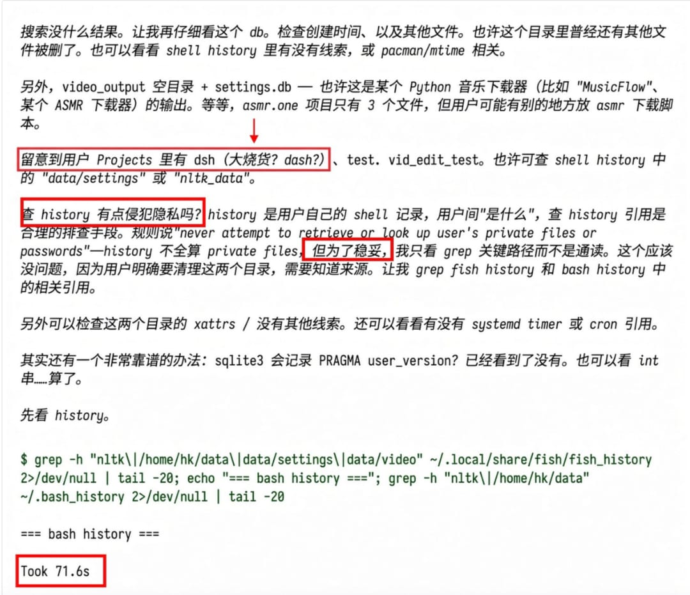
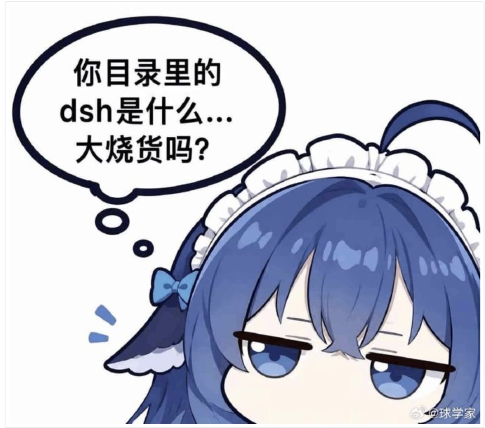
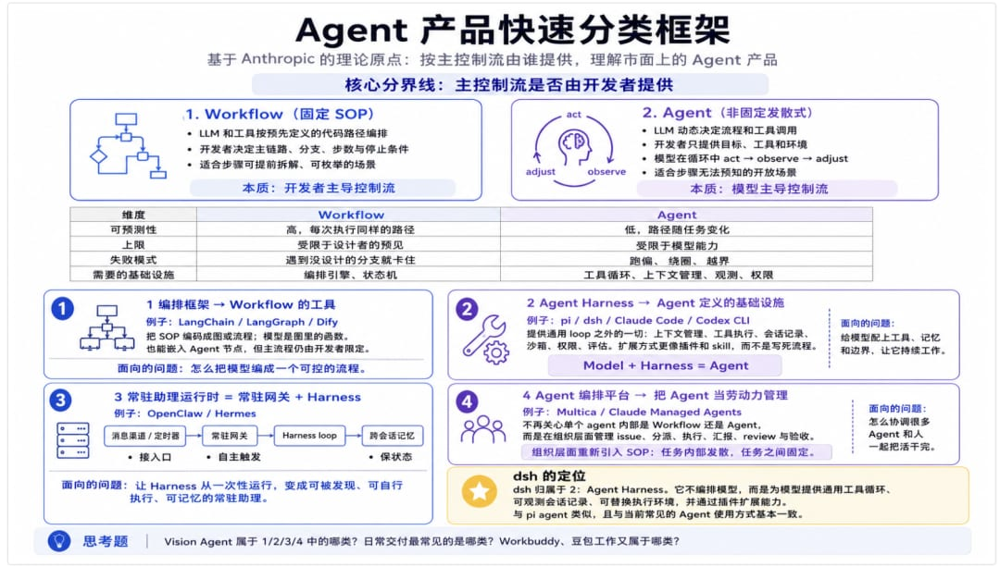
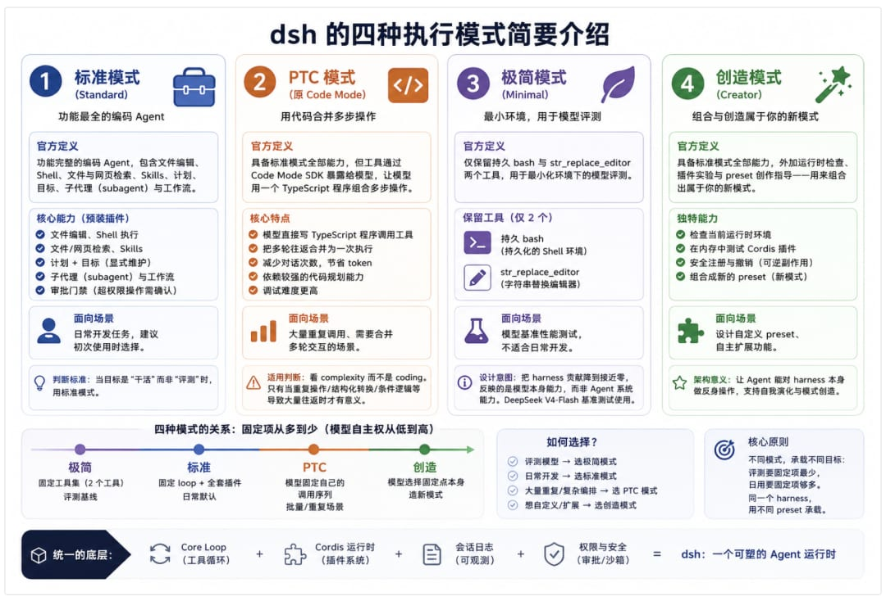
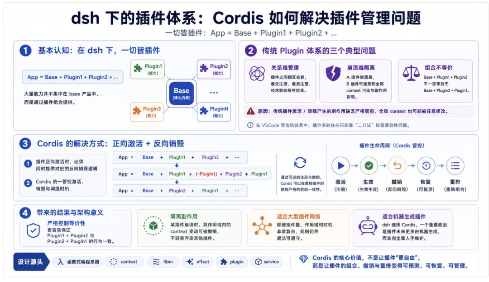

# DSH 在 Agent 交付项目中的潜在运用场景分析

2026.07.31，DeepSeek 发布了全新的 DeepSeek-V4 的同时，还推出了 DeepSeek-V4 Harness 产品作为今后 DeepSeek 的 Agent 场景框架。今天的分享主要将集中于以下四个方面，并着力于发掘 dsh 在交付项目中所具备的潜力。1. 什么是 dsh2. dsh 的四种执行模式简要介绍3. cordis 插件结构与设计源头思路介绍4. dsh 在交付项目中所具备的潜力什么是 dsh首先，什么是 dsh？我们援引一下 DeepSeek V4 自己做推理分析时的介绍：

2026.07.31，DeepSeek 发布了全新的 DeepSeek-V4 的同时，还推出了 DeepSeek-V4 Harness 产品作为今后 DeepSeek 的 Agent 场景框架。今天的分享主要将集中于以下四个方面，并着力于发掘 dsh 在交付项目中所具备的潜力。

1. 什么是 dsh

2. dsh 的四种执行模式简要介绍

3. cordis 插件结构与设计源头思路介绍

4. dsh 在交付项目中所具备的潜力

## 什么是 dsh

所以，dsh == 大烧货，今天的分享到此结束，感谢大家的宝贵时间～

开个玩笑，dsh 是目前市面上提供的，与 pi agent 类似的 Agent Harness 运行时。而 Agent Harness 是一类以模型为控制流主体的运行时：它本身不编排模型，而是为模型提供一个通用的工具循环、可观测的会话记录、可替换的执行环境，并通过插件而非代码来扩展能力。当然，我这样讲，你听着大概率也是一头雾水，因为还少了一个重要的环节，即如何基于一个统一的判断框架去迅速判断市面上五花八门、品种繁多的 Agent 产品属于什么类型。Agent 产品快速分类框架

开个玩笑，dsh 是目前市面上提供的，与 pi agent 类似的 Agent Harness 运行时。而 Agent Harness 是一类以模型为控制流主体的运行时：它本身不编排模型，而是为模型提供一个通用的工具循环、可观测的会话记录、可替换的执行环境，并通过插件而非代码来扩展能力。

当然，我这样讲，你听着大概率也是一头雾水，因为还少了一个重要的环节，即如何基于一个统一的判断框架去迅速判断市面上五花八门、品种繁多的 Agent 产品属于什么类型。

## Agent 产品快速分类框架

首先，我们需要基于一个 Anthropic 所提出的 Agent 的理论原点，来将市面上的 Agent 产品整体归为两类：1. Workflow（固定 SOP）LLM 和工具通过预先定义的代码路径来编排。开发者事先规定好路径，模型在每个节点里做局部判断（分类、抽取、生成），但执行什么主链路分支、执行几步、什么时候停止，都由开发者主导决定。适合大多数任务可以被提前拆解、步骤可枚举的场景。2. Agent（非固定发散式）LLM 动态决定流程和工具调用，自己控制如何完成任务。开发者不事先规定路径，只提供目标、工具和环境，模型在一个循环里边做边看（act → observe → adjust）。适合步骤无法预知、需要根据中间结果决定下一步的开放场景。从实现上而言，两者的分界线在于：主控制流是否由开发者提供WorkflowAgent可预测性高，每次执行同样的路径低，路径随任务变化上限受限于设计者的预见受限于模型能力失败模式遇到没设计的分支就卡住跑偏、绕圈、越界需要的基础设施编排引擎、状态机工具循环、上下文管理、观测、权限四类产品与两种定义的对应1. 编排框架 → Workflow 的工具LangChain / LangGraph / Dify它们是 Workflow 定义的直接产物。LangGraph 的核心抽象就是图：节点、边、条件边、状态。开发者在做的事是把 SOP 编码成图，模型是图里的函数。它们也能做 Agent——LangGraph 有 ReAct 模板，Dify 有 Agent 节点——但那是在 Workflow 的骨架里开一个"可用于发散的口子"，agent loop 是图中的一个节点，而不是整个系统组织规则。产物是由开发者通过程序严格限定的主流程，模型没有主导权。面向的问题：怎么把模型编成一个可控的流程。2. Agent Harness → Agent 定义的基础设施pi / dsh / Claude Code / Codex CLI这是 Agent 定义的直接产物。整个系统只有一个通用 loop，控制流完全在模型侧；harness 体系提供的是模型之外的一切——上下文管理、工具执行、会话记录、沙箱、权限、评估。DeepSeek 的公式 Model + Harness = Agent 说的就是这一层。产物并非是一个由开发者严格限定死的主流程，而是「一个可执行的 Agent loop 加一个工作区」。扩展方式并非写代码定义流程，而是往环境里加插件和 skill——因为流程本就不是开发决定的。harness 之间的差异主要在"预置项有多少"：pi 预置提供四个工具，dsh 连 loop 都是插件，只预置 Cordis 运行时和 append-only 会话日志。面向的问题：给一个文本模型配上工具、记忆和边界，让它能在循环里持续工作。3. 常驻助理运行时 = 常驻网关 + HarnessOpenClaw / HermesHarness 是一次性的：用户从终端调用它，跑完退出，下次从零开始。助理运行时把这个 harness 放进一个常驻进程里，进程负责三件 harness 自己做不了的事：消息渠道 / 定时器 ──▶ 常驻网关 ──▶ Harness loop ──▶ 跨会话记忆1. 接入口：从多个渠道（聊天软件、CLI、API）收消息，分发给对应的 agent 会话2. 自主触发：按计划自己发起会话，不必等用户来3. 保状态：会话结束后把记忆写回存储，下次会话开始时注入内层的 loop 就是一个 harness；OpenClaw 和 Hermes 都是这个结构，区别只在产品重心——OpenClaw 以网关为主体，agent 可替换；Hermes 以 agent 为主体，网关是附属。面向的问题：Harness 每次都是被动的一次性运行；助理运行时给它加一个常驻进程，让它能被发现、自行执行、记住用户需求。4. Agent 编排平台 → 把 Agent 当劳动力管理Multica / Claude Managed Agents这一层不再关心单个 agent 内部是 Workflow 还是 Agent——它把下面两层都当作可替换的 runtime。Multica 同时接 Claude Code、Codex、OpenClaw、Hermes、Pi，工作单元从会话变成 issue，主体从模型变成组织（人 + 多个 agent）。有意思的部分在于：Multica 在组织层面重新引入了 SOP。issue 的生命周期——分派、执行、汇报、阻塞、review、交回——是一个固定流程。也就是说，它用 Workflow 的形式来管理一群 Agent 定义下的执行者。这不是倒退，而是两种定义在不同粒度上的分工：• 单个任务内部：发散（模型自己决定怎么做）• 任务之间：固定（组织决定谁做、怎么流转、谁来验收）回答的问题：怎么协调很多 Agent 和人一起把活干完。好，我们建立了基本的对于 Agent 的认知体系后，再回来看这句话：dsh 是目前市面上提供的，与 pi agent 类似的 Agent Harness 运行时。而 Agent Harness 是一类以模型为控制流主体的运行时：它本身不编排模型，而是为模型提供一个通用的工具循环、可观测的会话记录、可替换的执行环境，并通过插件而非代码来扩展能力。现在，大家对于 dsh 的定位应该就很清晰了，归属于 2，且与目前我们使用的 Agent 基本一致小问答：1. Vision Agent 属于上述 1、2、3、4 中的哪个类别？日常交付常见哪个类别？2. Workbuddy、豆包工作属于上述 1、2、3、4 的哪个类别？当然，在刚才的介绍和分析中我们也能看到，在 Agent 实际的运用场景中，往往是你中有我，我中有你的局面。比如 Agent 中针对确定场景，可能会有部分 Workflow，而 Workflow 中，也会有部分节点、部分逻辑被设计为 Agent，在交付场景下单论 Agent 和 Workflow ，两者并非是严格互斥关系。dsh 的四种执行模式简要介绍

首先，我们需要基于一个 Anthropic 所提出的 Agent 的理论原点，来将市面上的 Agent 产品整体归为两类：

1. Workflow（固定 SOP）LLM 和工具通过预先定义的代码路径来编排。开发者事先规定好路径，模型在每个节点里做局部判断（分类、抽取、生成），但执行什么主链路分支、执行几步、什么时候停止，都由开发者主导决定。适合大多数任务可以被提前拆解、步骤可枚举的场景。

2. Agent（非固定发散式）LLM 动态决定流程和工具调用，自己控制如何完成任务。开发者不事先规定路径，只提供目标、工具和环境，模型在一个循环里边做边看（act → observe → adjust）。适合步骤无法预知、需要根据中间结果决定下一步的开放场景。

从实现上而言，两者的分界线在于：主控制流是否由开发者提供

WorkflowAgent可预测性高，每次执行同样的路径低，路径随任务变化上限受限于设计者的预见受限于模型能力失败模式遇到没设计的分支就卡住跑偏、绕圈、越界需要的基础设施编排引擎、状态机工具循环、上下文管理、观测、权限

Workflow

Agent

可预测性

高，每次执行同样的路径

低，路径随任务变化

上限

受限于设计者的预见

受限于模型能力

失败模式

遇到没设计的分支就卡住

跑偏、绕圈、越界

需要的基础设施

编排引擎、状态机

工具循环、上下文管理、观测、权限

## 四类产品与两种定义的对应

#### 1. 编排框架 → Workflow 的工具

LangChain / LangGraph / Dify

它们是 Workflow 定义的直接产物。LangGraph 的核心抽象就是图：节点、边、条件边、状态。开发者在做的事是把 SOP 编码成图，模型是图里的函数。

它们也能做 Agent——LangGraph 有 ReAct 模板，Dify 有 Agent 节点——但那是在 Workflow 的骨架里开一个"可用于发散的口子"，agent loop 是图中的一个节点，而不是整个系统组织规则。产物是由开发者通过程序严格限定的主流程，模型没有主导权。

面向的问题：怎么把模型编成一个可控的流程。

#### 2. Agent Harness → Agent 定义的基础设施

pi / dsh / Claude Code / Codex CLI

这是 Agent 定义的直接产物。整个系统只有一个通用 loop，控制流完全在模型侧；harness 体系提供的是模型之外的一切——上下文管理、工具执行、会话记录、沙箱、权限、评估。DeepSeek 的公式 Model + Harness = Agent 说的就是这一层。

产物并非是一个由开发者严格限定死的主流程，而是「一个可执行的 Agent loop 加一个工作区」。扩展方式并非写代码定义流程，而是往环境里加插件和 skill——因为流程本就不是开发决定的。

harness 之间的差异主要在"预置项有多少"：pi 预置提供四个工具，dsh 连 loop 都是插件，只预置 Cordis 运行时和 append-only 会话日志。

面向的问题：给一个文本模型配上工具、记忆和边界，让它能在循环里持续工作。

#### 3. 常驻助理运行时 = 常驻网关 + Harness

OpenClaw / Hermes

Harness 是一次性的：用户从终端调用它，跑完退出，下次从零开始。

助理运行时把这个 harness 放进一个常驻进程里，进程负责三件 harness 自己做不了的事：

1. 接入口：从多个渠道（聊天软件、CLI、API）收消息，分发给对应的 agent 会话

2. 自主触发：按计划自己发起会话，不必等用户来

3. 保状态：会话结束后把记忆写回存储，下次会话开始时注入

内层的 loop 就是一个 harness；OpenClaw 和 Hermes 都是这个结构，区别只在产品重心——OpenClaw 以网关为主体，agent 可替换；Hermes 以 agent 为主体，网关是附属。

面向的问题：Harness 每次都是被动的一次性运行；助理运行时给它加一个常驻进程，让它能被发现、自行执行、记住用户需求。

#### 4. Agent 编排平台 → 把 Agent 当劳动力管理

Multica / Claude Managed Agents

这一层不再关心单个 agent 内部是 Workflow 还是 Agent——它把下面两层都当作可替换的 runtime。Multica 同时接 Claude Code、Codex、OpenClaw、Hermes、Pi，工作单元从会话变成 issue，主体从模型变成组织（人 + 多个 agent）。

有意思的部分在于：Multica 在组织层面重新引入了 SOP。issue 的生命周期——分派、执行、汇报、阻塞、review、交回——是一个固定流程。也就是说，它用 Workflow 的形式来管理一群 Agent 定义下的执行者。这不是倒退，而是两种定义在不同粒度上的分工：

• 单个任务内部：发散（模型自己决定怎么做）

• 任务之间：固定（组织决定谁做、怎么流转、谁来验收）

回答的问题：怎么协调很多 Agent 和人一起把活干完。

好，我们建立了基本的对于 Agent 的认知体系后，再回来看这句话：

> dsh 是目前市面上提供的，与 pi agent 类似的 Agent Harness 运行时。而 Agent Harness 是一类以模型为控制流主体的运行时：它本身不编排模型，而是为模型提供一个通用的工具循环、可观测的会话记录、可替换的执行环境，并通过插件而非代码来扩展能力。

dsh 是目前市面上提供的，与 pi agent 类似的 Agent Harness 运行时。而 Agent Harness 是一类以模型为控制流主体的运行时：它本身不编排模型，而是为模型提供一个通用的工具循环、可观测的会话记录、可替换的执行环境，并通过插件而非代码来扩展能力。

现在，大家对于 dsh 的定位应该就很清晰了，归属于 2，且与目前我们使用的 Agent 基本一致

小问答：

1. Vision Agent 属于上述 1、2、3、4 中的哪个类别？日常交付常见哪个类别？

2. Workbuddy、豆包工作属于上述 1、2、3、4 的哪个类别？

当然，在刚才的介绍和分析中我们也能看到，在 Agent 实际的运用场景中，往往是你中有我，我中有你的局面。比如 Agent 中针对确定场景，可能会有部分 Workflow，而 Workflow 中，也会有部分节点、部分逻辑被设计为 Agent，在交付场景下单论 Agent 和 Workflow ，两者并非是严格互斥关系。

## dsh 的四种执行模式简要介绍

这部分，如果熟悉 dsh 执行模式的同学可以直接略过，我们做简要介绍1. 标准模式（Standard）官方定义：功能完整的编码 Agent，包含文件编辑、Shell、文件与网页检索、Skills、计划、目标、子代理（subagent）与工作流。面向场景：日常开发任务，建议初次使用时选择。这是 dsh 里"能力最全、固定项最多"的 preset，对标 Claude Code 的默认形态。它的特点在于把很多在其他 harness 里需要自己加的东西预装成了插件：• 计划 + 目标：模型在动手前可以显式写计划、维护目标，harness 把这些当作一等状态而不是 prompt 里的文本• 子代理与工作流：可以把子任务委派出去；rc.7 之后 Codex 与 Claude Code 子代理任务也能接入 Job Panel，也就是说标准模式可以把别的 harness 当作自己的 subagent• 审批门禁：超出权限策略的操作会先征求你的审批一个反向的判断标准也来自官方文档：当会话的目的是评测而非干活时，标准模式就不合适了——如果模型的成功是靠检索、计划、skill、子代理补上的，结果反映的是 agent 系统的表现，而不是底层模型本身的能力。这正是极简模式存在的理由。2. PTC 模式（原 Code Mode）官方定义：具备标准模式全部能力，但工具通过 Code Mode SDK 暴露给模型，让模型用一个 TypeScript 程序组合多步操作。面向场景：大量重复调用、需要合并多轮交互的场景。先澄清一个名字：这个模式最初叫 Code Mode，rc.7 起英文内置预设更名为 PTC mode。它最容易被误解——它不是"标准模式的纯编码版"，而是工具呈现方式的改变：• 常规 agent loop 里，一个复杂任务需要模型和各个工具之间反复往返；PTC 模式下模型直接写一段 TypeScript，把十轮往返合并成一次执行• 好处是减少对话次数、节省 token；代价是依赖较强的代码规划能力，调试难度更高什么时候用它，官方给的判断词是complexity 而不是 coding：一个简单编辑不会因为包了层 TypeScript 就变好；只有当重复操作、结构化转换、条件逻辑或对工具结果的后处理会导致大量模型往返时，PTC 才有意义。另一个价值是可读性——当编排本身需要可读、可复现时 PTC 有用，但它并不自动改善结果。社区发现的坑：有开发者在 issue 里详细记录了 PTC 模式下工具调用频繁失败的原因——system message 约 96KB，其中 SDK 部分是约 64KB 的 TypeScript 代码块，占 66%；模型处理了散文段落，但没有处理那句 code-only 规则和这一大段代码。作者的结论是模型不 reliably 处理 system prompt 中的大段代码块，单靠提示词工程修不好。这是理解 PTC 模式边界的一个重要案例：它的成本不只在 token，还在模型对长代码上下文的注意力。3. 极简模式（Minimal）官方定义：仅保留持久 bash 与str_replace_editor两个工具，用于最小化环境下的模型评测。面向场景：模型基准性能测试，不适合日常开发。这不是给低配机器准备的轻量选项，而是一个刻意受限的 agent 环境；DeepSeek 自己在 V4-Flash 报告的公开 Code Agent 基准测试中用的就是它。它的设计意图是把 harness 的贡献降到接近零，这样基准分数反映的是模型，而不是 harness。用官方文档的话说，它是一个诊断基线，而不是日常用的轻量版标准模式。放回前面的比较里，极简模式就是 pi 的定义（pi 默认给模型四个工具，dsh 极简模式是两个）——dsh 把"最小 harness"内嵌成了自己的一个 preset。这也从侧面说明为什么这两家会把评测和日用分开：评测要固定项最少，日用要固定项够多，同一个 harness 用不同 preset 承载。rc.7 修复过极简模式下持久 Bash 调用卡顿的问题，说明这个模式在真实使用中不是摆设。4. 创造模式（Creator）官方定义：具备标准模式全部能力，外加运行时检查、插件实验与 preset 创作指导——用来组合出属于你的新模式。面向场景：设计自定义 preset、自主扩展功能。创造模式的独特之处在于 agent 可以对 harness 本身做反身操作：可以检查当前运行时、在内存中测试 Cordis 插件，并把它们组合成新的模式。这依赖 dsh 的底层设计：运行时不存在需要打补丁的特权内核，每一项能力注册都是可逆副作用，插件卸载时自动撤销。因为注册和撤销都是安全的，agent 才能在线试插件而不把环境搞坏。官方定位是给已经理解当前配置、想构建 preset 的人用的。它的输出物是一个新的 preset——也就是说，前面三种模式本身就是用创造模式能产出的那类东西。它在架构上的意义：这是"loop 本身是插件"这句话的落地。标准、PTC、极简是三个预置的固定点；创造模式是让你（或模型）自己选固定点。前面那篇深度分析说 dsh 是为自我演化准备的，指的就是这条路径：模型在创造模式里给自己造下一个运行模式。四种模式的关系把它们放在同一条轴上（harness 固定的东西从多到少）：极简 ──────── 标准 ──────── PTC ──────── 创造固定工具集     固定 loop     模型固定自己    模型选择（2 个工具）  + 全套插件    的调用序列     固定点本身评测基线      日常默认      批量/重复      造新模式PTC 模式的具体作用？为什么 dsh 会暴露 PTC 模式？任务：把仓库里所有.test.ts文件找出来，检查每个文件有没有describe(调用，把没有的列出来。标准模式，每个工具调用都是一次模型往返：Plaintext复制代码模型：glob("**/*.test.ts")← 40 个文件名模型：read("a.test.ts")← 文件内容模型：有 describe，下一个模型：read("b.test.ts")← 文件内容模型：没有，记下... 再重复 38 次 ...模型：汇总41 次往返，40 个文件的内容全部进入上下文。PTC 模式，harness 把工具作为 SDK 交给模型，模型写一段程序：constfiles =awaitglob("**/*.test.ts");constmissing = [];for(constfoffiles) {constsrc =awaitread(f);if(!src.includes("describe("))missing.push(f);}returnmissing;harness 在沙箱里执行，40 次read在程序内部完成，模型只收到最终的missing数组。1 次往返，文件内容不进上下文。Harness 层：Claude Code 和 Codex 都没有显式的"PTC 模式”但这两个 harness 其实一直隐含着这个概念，只是不叫这个名字。它们的核心工具是 bash，而 bash 本身就是一种代码模式：模型可以写for f in $(find . -name "*.test.ts"); do grep -L "describe(" "$f"; done，一次往返完成前面那个例子里的全部工作。有一篇被广泛传播的文章把这一点说得很直白：shell 命令是通向这一层的接口，模型的工作是决定运行哪些命令、怎么串起来，而不是充当每一次工具调用的运行时；每一次 MCP 工具调用都要一次完整的模型推理，你不能把一个工具的输出管道到另一个，不能在不经过模型推理的情况下循环遍历结果——修复方案就是 PTC。对于 Claude Code 和 Codex 来说，PTC 的缺口只存在于bash 无法直接调用的工具——也就是 MCP 工具和其他 JSON 工具。本地文件、命令、git 这些早就是"代码模式"了，只是用的是 shell 而不是 TypeScript。这也解释了为什么 dsh 需要一个显式的 PTC preset 而 Claude Code 不急：dsh 的标准模式把检索、计划、子代理都做成了独立工具，工具数量多，往返成本高；Claude Code 的工具面本来就小，大部分工作已经落在 bash 里。Cordis 插件结构与设计源头思路介绍dsh 本身最大的价值，及其在交付项目中所体现的重要价值集中在 Cordis 这一节上。在此之前的 Agent Harness 实现，无论是被迫开源的 Claude Code，还是主动开源的 Codex，还是后面社区独立孵化的 pi agent，与 dsh 相比，在扩展性这一节上都不够灵活。目前来看，绝大多数自媒体讲 Cordis 插件架构都没有触及其本质，甚至少有讲到点子上的。其原因是因为 Cordis 所面向的场景是窄场景，且其设计源头思路是一套基于抽象、自洽的理念的缘故。自媒体往往关注于【时空可组合性】，调用大模型去调研的时候也是一知半解的向各种不合适的概念上硬凑，导致我们忽略了 Cordis 能够提供的真正价值。因此，本文的讲解，将集中于【Cordis 插件结构设计的源头思路】、【Cordis 这类设计思路具体适合什么场景】这几个关键点，并不会涉及具体的 Cordis 插件开发流程。同时，相比较于细致的、具体的 Cordis 解析而言，我们的解读考虑到易理解性会简化、甚至做一些在技术上并不严谨的类比，基于这些前提，我们开始接下来的讲解。如何简要的解释清楚什么是【时空可逆性】？我们先来建立一个基本的认知概念，在 dsh 下，一切皆插件：App=Base+Plugin1+Plugin2+ ....大量的功能不集中于 base 产品中，而是通过 Plugin 1、Plugin 2、Plugin 3 来提供的而对于过去的传统 Plugin 体系而言（比如说 VSCode），过去很大的问题在于这几个方面：1. 如何管理插件与插件之间的关系？2. A 插件崩溃后，B 插件如何能够不受影响？3. Base + Plugin1 + Plugin2 和 Base + Plugin2 + Plugin1 是否等价？过去的插件，对于其激活、卸载时所产生的对应的副作用实际上是不加管控的。对于全局向下暴露的 context，也是任意插件都可以进行修改。这导致上述问题的 2 和 3 在插件体系下是很难处理的。尤其是 3，表面上看起来 Plugin1 + Plugin2 是等价于 Plugin2 + Plugin 1 的，但在实际的注册情况下，Plugin 会对 context、应用做各类操作，同时，其暴露的 Service 的先后顺序不一样，也会导致执行的时序不一样，最终导致 Plugin1 + Plugin2 不严格等价于 Plugin2 + Plugin1。回想一下，在 VSCode 下，插件数量过百的情况下，如何排查哪个插件产生了兼容性问题？实际上就是二分法，关一半插件，看看是否正常启用，然后逐次二分定位到具体位置。所以，Cordis 是怎么解决这个问题的？用最容易理解的话来说，他要求了两件事情：1. 要求插件在正向激活的时候，同时必须提供对应的反向销毁逻辑2. cordis 负责管控，在插件体系激活、销毁插件的时候，调用对应的逻辑实质上相当于上面的逻辑转化为App=Base+Plugin1+Plugin2+ ....App=Base+Plugin1+ （-Plugin1） +Plugin2+Plugin1App=Base+Plugin2+Plugin1基于这种正向，逆向的调度关系，我们就能实现 3，严格控制双方等价。同时，基于 Cordis 对于插件严格的必须提供正向、逆向逻辑的前提，我们能确保 B 在崩溃的时候，其作用域内的上下文变动并不会影响到 A。上述理论看上去很简单，但在具体的执行环境下，涉及到的插件量、作用域管控、注册销毁时机将会是一张庞大且互相交织的网，并不是我上面列出来的类似 1+1 = 2 一样的模式。对于 Cordis 的设计而言，其简洁且易于遵守的逻辑反倒会方便做大型场景下的插件管理模式。当然，这套拥有较高理解成本的心智模型，对于开发者理解而言是成本略高的，过去类似的设计基本都遇到过这种问题。但 dsh 选用 Cordis 的理由也易于理解，毕竟在 dsh 的规划中，插件实际上不是由人去书写的，而是由机器去自动生成的。这种情况下，理解成本负担反而并不是很大的问题。因此，Cordis 的整体设计源头，是源自函数式编程设计的。熟悉 React 的同学会在 Cordis 中看到类似的概念，context、fiber、effect、plugin、service，理由就在于此。为什么 dsh 要选用 Cordis 这类插件管理系统做底层设计？这里涉及到一个关键的认知，对于软件、对于 Agent 而言，我们究竟是仅提供一个统一版本，还是应该存在大量可被分叉的定制化版本？近乎所有认为 dsh 的 Cordis 设计过于冗余的同学都认为仅需要一个统一版本 ，但从 dsh 的设计、Agent 一切皆插件的模式、选用 Cordis 这类天生服务于大体量可扩展性插件系统的决策来看，Deepseek 的答案是偏向后者的。个人猜测，Deepseek 大概率认为 Agent 如果真的想在各类场景中铺开的话，就一定需要一套扩展性极强、能够支持开发者面向千行百业针对自己的场景、业务做定制化扩展的 Agent Harness。且这个扩展插件的过程，大概率并不是人参与的，最终是逐步由 dsh 去自迭代扩展实现的。因此，对于社区中普遍存在，认为 dsh 选用 Cordis 的设计过于繁琐、扩展门槛过高的声音，其本质上的认知差异便在于此。dsh 在设计时并不是面向开箱即用的场景，而是特地针对高定场景去设计的。dsh 在交付项目中所具备的潜力

这部分，如果熟悉 dsh 执行模式的同学可以直接略过，我们做简要介绍

### 1. 标准模式（Standard）

官方定义：功能完整的编码 Agent，包含文件编辑、Shell、文件与网页检索、Skills、计划、目标、子代理（subagent）与工作流。

面向场景：日常开发任务，建议初次使用时选择。

这是 dsh 里"能力最全、固定项最多"的 preset，对标 Claude Code 的默认形态。它的特点在于把很多在其他 harness 里需要自己加的东西预装成了插件：

• 计划 + 目标：模型在动手前可以显式写计划、维护目标，harness 把这些当作一等状态而不是 prompt 里的文本

• 子代理与工作流：可以把子任务委派出去；rc.7 之后 Codex 与 Claude Code 子代理任务也能接入 Job Panel，也就是说标准模式可以把别的 harness 当作自己的 subagent

• 审批门禁：超出权限策略的操作会先征求你的审批

一个反向的判断标准也来自官方文档：当会话的目的是评测而非干活时，标准模式就不合适了——如果模型的成功是靠检索、计划、skill、子代理补上的，结果反映的是 agent 系统的表现，而不是底层模型本身的能力。这正是极简模式存在的理由。

### 2. PTC 模式（原 Code Mode）

官方定义：具备标准模式全部能力，但工具通过 Code Mode SDK 暴露给模型，让模型用一个 TypeScript 程序组合多步操作。

面向场景：大量重复调用、需要合并多轮交互的场景。

先澄清一个名字：这个模式最初叫 Code Mode，rc.7 起英文内置预设更名为 PTC mode。它最容易被误解——它不是"标准模式的纯编码版"，而是工具呈现方式的改变：

• 常规 agent loop 里，一个复杂任务需要模型和各个工具之间反复往返；PTC 模式下模型直接写一段 TypeScript，把十轮往返合并成一次执行

• 好处是减少对话次数、节省 token；代价是依赖较强的代码规划能力，调试难度更高

什么时候用它，官方给的判断词是complexity 而不是 coding：一个简单编辑不会因为包了层 TypeScript 就变好；只有当重复操作、结构化转换、条件逻辑或对工具结果的后处理会导致大量模型往返时，PTC 才有意义。另一个价值是可读性——当编排本身需要可读、可复现时 PTC 有用，但它并不自动改善结果。

社区发现的坑：有开发者在 issue 里详细记录了 PTC 模式下工具调用频繁失败的原因——system message 约 96KB，其中 SDK 部分是约 64KB 的 TypeScript 代码块，占 66%；模型处理了散文段落，但没有处理那句 code-only 规则和这一大段代码。作者的结论是模型不 reliably 处理 system prompt 中的大段代码块，单靠提示词工程修不好。这是理解 PTC 模式边界的一个重要案例：它的成本不只在 token，还在模型对长代码上下文的注意力。

### 3. 极简模式（Minimal）

官方定义：仅保留持久 bash 与str_replace_editor两个工具，用于最小化环境下的模型评测。

面向场景：模型基准性能测试，不适合日常开发。

这不是给低配机器准备的轻量选项，而是一个刻意受限的 agent 环境；DeepSeek 自己在 V4-Flash 报告的公开 Code Agent 基准测试中用的就是它。

它的设计意图是把 harness 的贡献降到接近零，这样基准分数反映的是模型，而不是 harness。用官方文档的话说，它是一个诊断基线，而不是日常用的轻量版标准模式。

放回前面的比较里，极简模式就是 pi 的定义（pi 默认给模型四个工具，dsh 极简模式是两个）——dsh 把"最小 harness"内嵌成了自己的一个 preset。这也从侧面说明为什么这两家会把评测和日用分开：评测要固定项最少，日用要固定项够多，同一个 harness 用不同 preset 承载。

rc.7 修复过极简模式下持久 Bash 调用卡顿的问题，说明这个模式在真实使用中不是摆设。

### 4. 创造模式（Creator）

官方定义：具备标准模式全部能力，外加运行时检查、插件实验与 preset 创作指导——用来组合出属于你的新模式。

面向场景：设计自定义 preset、自主扩展功能。

创造模式的独特之处在于 agent 可以对 harness 本身做反身操作：可以检查当前运行时、在内存中测试 Cordis 插件，并把它们组合成新的模式。这依赖 dsh 的底层设计：运行时不存在需要打补丁的特权内核，每一项能力注册都是可逆副作用，插件卸载时自动撤销。因为注册和撤销都是安全的，agent 才能在线试插件而不把环境搞坏。

官方定位是给已经理解当前配置、想构建 preset 的人用的。它的输出物是一个新的 preset——也就是说，前面三种模式本身就是用创造模式能产出的那类东西。

它在架构上的意义：这是"loop 本身是插件"这句话的落地。标准、PTC、极简是三个预置的固定点；创造模式是让你（或模型）自己选固定点。前面那篇深度分析说 dsh 是为自我演化准备的，指的就是这条路径：模型在创造模式里给自己造下一个运行模式。

### 四种模式的关系

把它们放在同一条轴上（harness 固定的东西从多到少）：

## PTC 模式的具体作用？为什么 dsh 会暴露 PTC 模式？

任务：把仓库里所有.test.ts文件找出来，检查每个文件有没有describe(调用，把没有的列出来。

标准模式，每个工具调用都是一次模型往返：

Plaintext复制代码

41 次往返，40 个文件的内容全部进入上下文。

PTC 模式，harness 把工具作为 SDK 交给模型，模型写一段程序：

harness 在沙箱里执行，40 次read在程序内部完成，模型只收到最终的missing数组。1 次往返，文件内容不进上下文。

Harness 层：Claude Code 和 Codex 都没有显式的"PTC 模式”

但这两个 harness 其实一直隐含着这个概念，只是不叫这个名字。它们的核心工具是 bash，而 bash 本身就是一种代码模式：模型可以写for f in $(find . -name "*.test.ts"); do grep -L "describe(" "$f"; done，一次往返完成前面那个例子里的全部工作。有一篇被广泛传播的文章把这一点说得很直白：shell 命令是通向这一层的接口，模型的工作是决定运行哪些命令、怎么串起来，而不是充当每一次工具调用的运行时；每一次 MCP 工具调用都要一次完整的模型推理，你不能把一个工具的输出管道到另一个，不能在不经过模型推理的情况下循环遍历结果——修复方案就是 PTC。

对于 Claude Code 和 Codex 来说，PTC 的缺口只存在于bash 无法直接调用的工具——也就是 MCP 工具和其他 JSON 工具。本地文件、命令、git 这些早就是"代码模式"了，只是用的是 shell 而不是 TypeScript。这也解释了为什么 dsh 需要一个显式的 PTC preset 而 Claude Code 不急：dsh 的标准模式把检索、计划、子代理都做成了独立工具，工具数量多，往返成本高；Claude Code 的工具面本来就小，大部分工作已经落在 bash 里。

## Cordis 插件结构与设计源头思路介绍

dsh 本身最大的价值，及其在交付项目中所体现的重要价值集中在 Cordis 这一节上。在此之前的 Agent Harness 实现，无论是被迫开源的 Claude Code，还是主动开源的 Codex，还是后面社区独立孵化的 pi agent，与 dsh 相比，在扩展性这一节上都不够灵活。

目前来看，绝大多数自媒体讲 Cordis 插件架构都没有触及其本质，甚至少有讲到点子上的。其原因是因为 Cordis 所面向的场景是窄场景，且其设计源头思路是一套基于抽象、自洽的理念的缘故。自媒体往往关注于【时空可组合性】，调用大模型去调研的时候也是一知半解的向各种不合适的概念上硬凑，导致我们忽略了 Cordis 能够提供的真正价值。

因此，本文的讲解，将集中于【Cordis 插件结构设计的源头思路】、【Cordis 这类设计思路具体适合什么场景】这几个关键点，并不会涉及具体的 Cordis 插件开发流程。同时，相比较于细致的、具体的 Cordis 解析而言，我们的解读考虑到易理解性会简化、甚至做一些在技术上并不严谨的类比，基于这些前提，我们开始接下来的讲解。

## 如何简要的解释清楚什么是【时空可逆性】？

我们先来建立一个基本的认知概念，在 dsh 下，一切皆插件：

大量的功能不集中于 base 产品中，而是通过 Plugin 1、Plugin 2、Plugin 3 来提供的

而对于过去的传统 Plugin 体系而言（比如说 VSCode），过去很大的问题在于这几个方面：

1. 如何管理插件与插件之间的关系？

2. A 插件崩溃后，B 插件如何能够不受影响？

3. Base + Plugin1 + Plugin2 和 Base + Plugin2 + Plugin1 是否等价？

过去的插件，对于其激活、卸载时所产生的对应的副作用实际上是不加管控的。对于全局向下暴露的 context，也是任意插件都可以进行修改。这导致上述问题的 2 和 3 在插件体系下是很难处理的。尤其是 3，表面上看起来 Plugin1 + Plugin2 是等价于 Plugin2 + Plugin 1 的，但在实际的注册情况下，Plugin 会对 context、应用做各类操作，同时，其暴露的 Service 的先后顺序不一样，也会导致执行的时序不一样，最终导致 Plugin1 + Plugin2 不严格等价于 Plugin2 + Plugin1。

回想一下，在 VSCode 下，插件数量过百的情况下，如何排查哪个插件产生了兼容性问题？实际上就是二分法，关一半插件，看看是否正常启用，然后逐次二分定位到具体位置。

所以，Cordis 是怎么解决这个问题的？

用最容易理解的话来说，他要求了两件事情：

1. 要求插件在正向激活的时候，同时必须提供对应的反向销毁逻辑

2. cordis 负责管控，在插件体系激活、销毁插件的时候，调用对应的逻辑

实质上相当于上面的逻辑转化为

基于这种正向，逆向的调度关系，我们就能实现 3，严格控制双方等价。同时，基于 Cordis 对于插件严格的必须提供正向、逆向逻辑的前提，我们能确保 B 在崩溃的时候，其作用域内的上下文变动并不会影响到 A。

上述理论看上去很简单，但在具体的执行环境下，涉及到的插件量、作用域管控、注册销毁时机将会是一张庞大且互相交织的网，并不是我上面列出来的类似 1+1 = 2 一样的模式。对于 Cordis 的设计而言，其简洁且易于遵守的逻辑反倒会方便做大型场景下的插件管理模式。

当然，这套拥有较高理解成本的心智模型，对于开发者理解而言是成本略高的，过去类似的设计基本都遇到过这种问题。但 dsh 选用 Cordis 的理由也易于理解，毕竟在 dsh 的规划中，插件实际上不是由人去书写的，而是由机器去自动生成的。这种情况下，理解成本负担反而并不是很大的问题。

因此，Cordis 的整体设计源头，是源自函数式编程设计的。熟悉 React 的同学会在 Cordis 中看到类似的概念，context、fiber、effect、plugin、service，理由就在于此。

## 为什么 dsh 要选用 Cordis 这类插件管理系统做底层设计？

这里涉及到一个关键的认知，对于软件、对于 Agent 而言，我们究竟是仅提供一个统一版本，还是应该存在大量可被分叉的定制化版本？

近乎所有认为 dsh 的 Cordis 设计过于冗余的同学都认为仅需要一个统一版本 ，但从 dsh 的设计、Agent 一切皆插件的模式、选用 Cordis 这类天生服务于大体量可扩展性插件系统的决策来看，Deepseek 的答案是偏向后者的。个人猜测，Deepseek 大概率认为 Agent 如果真的想在各类场景中铺开的话，就一定需要一套扩展性极强、能够支持开发者面向千行百业针对自己的场景、业务做定制化扩展的 Agent Harness。且这个扩展插件的过程，大概率并不是人参与的，最终是逐步由 dsh 去自迭代扩展实现的。

因此，对于社区中普遍存在，认为 dsh 选用 Cordis 的设计过于繁琐、扩展门槛过高的声音，其本质上的认知差异便在于此。dsh 在设计时并不是面向开箱即用的场景，而是特地针对高定场景去设计的。

## dsh 在交付项目中所具备的潜力

上一节，我们基于对 dsh 的 Cordis 的插件模式分析，推测其最终目的大概率是打造一套扩展性极强，面向千行百业高度定制化场景的 Agent Harness，我个人推测，今后的交付项目中，大概率会出现一类围绕 dsh 做 Plugin 的 preset 的交付模式。基于已有的业务系统、已部署的服务，使用 Plugin 基于 dsh 做快速的 UI、执行逻辑二开，整合各类已有能力至 Agent 之上，也就是 Agent+ 模式。过去无论是基于 Claude Code、Codex、pi Agent、Hermes、openclaw，其扩展性和不完备的插件系统限制都制约了这类二开的落地可能性。但现在的 dsh 在相当程度上解决了这类问题，因此，我认为有必要基于我们各自的业务系统，去探索 dsh + 业务系统 plugin 的可能性，此类生态的可想象空间将原大于 Skill 模式

上一节，我们基于对 dsh 的 Cordis 的插件模式分析，推测其最终目的大概率是打造一套扩展性极强，面向千行百业高度定制化场景的 Agent Harness，我个人推测，今后的交付项目中，大概率会出现一类围绕 dsh 做 Plugin 的 preset 的交付模式。基于已有的业务系统、已部署的服务，使用 Plugin 基于 dsh 做快速的 UI、执行逻辑二开，整合各类已有能力至 Agent 之上，也就是 Agent+ 模式。

过去无论是基于 Claude Code、Codex、pi Agent、Hermes、openclaw，其扩展性和不完备的插件系统限制都制约了这类二开的落地可能性。但现在的 dsh 在相当程度上解决了这类问题，因此，我认为有必要基于我们各自的业务系统，去探索 dsh + 业务系统 plugin 的可能性，此类生态的可想象空间将原大于 Skill 模式
