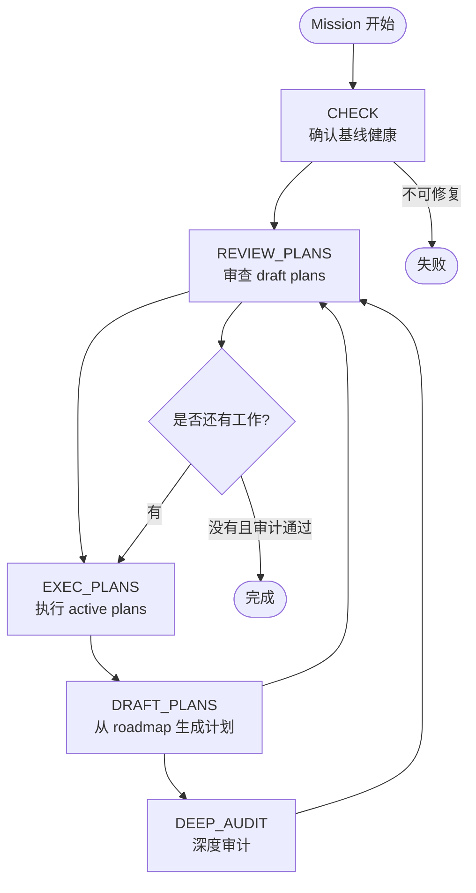

# Mission Driver 安装、使用与原理：把 AI 开发变成可审计的任务循环

很多 Coding Agent 的使用方式仍然是：用户提出一个需求，Agent 读代码、写代码、跑测试，然后输出一段总结。这个模式适合小修小补，但遇到跨模块功能、架构治理和持续数小时的工作时，问题会迅速暴露：任务边界不清晰，计划和实现脱节，验证容易被跳过，失败之后也很难恢复。

`mission-driver` 试图解决的不是“让模型更聪明”，而是给模型套上一条可重复的工程流水线。它把一个较大的开发目标写成 `mission`，再用状态机驱动 AI 依次完成健康检查、计划审查、计划执行、计划生成和深度审计。

一句话概括：

> **Mission Driver 不负责替你想出目标，它负责把目标变成一个可以反复执行、验证、审计和恢复的开发循环。**

本文以 `entropy-cloud/attractor-guided-engineering-template` 为例，介绍它的安装方式、基本使用、配置结构和运行原理，并给出在普通业务项目中更稳妥的接入方法。

---

## 一、Mission Driver 是什么

Mission Driver 是 Attractor-Guided Engineering（AGE）模板中的开发循环引擎。它不是一个新的大模型，也不是一个单独的 Prompt，而是由以下几部分组成：

```text
开发目标
  ↓
roadmap.md       人和 Agent 共同维护的任务队列
  ↓
mission.json     任务范围、验证命令、目录和模型配置
  ↓
flow JSON        状态机和阶段之间的转移规则
  ↓
AI step          每个阶段使用的 Prompt 与 Agent 子进程
  ↓
run-state.json   运行状态、重试次数和终态记录
  ↓
events.jsonl    可观察的事件流与审计材料
```

一个 Mission 通常对应一个相对长期的开发目标，例如：

- 完成一组 React v2 功能迁移；
- 拆分一批架构上的 God Service；
- 将一个 PRD 拆成多个可以独立验证的执行计划；
- 修复一条复杂的数据同步链路，并经过测试和审计；
- 对一个已经存在但长期没有闭环的技术债进行治理。

它不适合所有任务。单文件拼写修复、简单样式调整和十分钟内可以完成的小 Bug，不应该启动一整套 Mission。

### 1. Mission、Roadmap 和 Plan 的区别

这三个概念容易混在一起，实际上处于不同层级：

| 概念 | 作用 | 典型文件 |
| --- | --- | --- |
| Mission | 一次长期开发目标的运行配置 | `missions/<name>.json` |
| Roadmap | 任务队列和阶段顺序，回答“要完成什么” | `docs/backlog/<name>-roadmap.md` |
| Plan | 某一个 Work Item 的具体执行方案，回答“这一次怎么做” | `docs/plans/<name>/*.md` |
| Run State | 某次运行的机器状态，回答“现在跑到哪里” | `_tmp/<run>/run-state.json` |

Roadmap 不是执行计划。Roadmap 只维护工作项、状态和依赖；真正的文件修改、测试步骤和闭包条件应该写进 Plan。

### 2. 它和普通 Agent Loop 的区别

普通 Agent Loop 通常是：

```text
读取任务 → 调用模型 → 执行工具 → 把结果继续交给模型 → 直到模型停止
```

Mission Driver 增加了工程控制面：

```text
任务目标 → 健康检查 → 计划审查 → 执行计划 → 验证 → 审计 → 继续或终止
```

因此，Mission Driver 的核心价值不在于多调用几次模型，而在于把“不确定的模型行为”放进“确定的流程、文件和验证命令”中。

---

## 二、安装前的准备

### 1. 运行环境

上游模板要求：

- Node.js 18 或更高版本；
- Git；
- 一个可调用的 Agent CLI：默认是 `opencode`，也支持 `pi`；
- 项目自身可执行的测试、构建、Lint 或类型检查命令。

检查 Node.js 和 Git：

```bash
node --version
git --version
```

如果使用 Pi driver，再确认 Pi CLI 可用：

```bash
pi --help
```

如果使用 OpenCode：

```bash
opencode --help
```

Mission Driver 不替项目准备模型凭据。Pi 或 OpenCode 使用什么 Provider、模型和 API Key，需要先按对应工具完成配置。

### 2. 获取上游模板

上游项目地址：

```text
https://github.com/entropy-cloud/attractor-guided-engineering-template
```

最简单的方式是直接克隆：

```bash
git clone https://github.com/entropy-cloud/attractor-guided-engineering-template.git \
  ~/workspace/attractor-guided-engineering-template
```

模板里的引擎位于：

```text
tools/mission-driver/
```

可以先确认引擎入口存在：

```bash
node ~/workspace/attractor-guided-engineering-template/tools/mission-driver/src/main.js \
  --help
```

上游引擎本身不要求在 `tools/mission-driver/` 下安装额外 npm 依赖，部分命令使用仓库内置的 vendor 文件；监控 Dashboard 有独立的前端构建目录。

---

## 三、推荐接入方式：项目内缓存模板，仓库只提交 Shim

不要把整个 `tools/mission-driver/` 引擎复制进每个业务项目。更推荐使用“项目内本地缓存 + Git 忽略 + 启动 Shim”的结构：

```text
my-project/
├── .template/                                  # 本地缓存，不提交 Git
│   └── attractor-guided-engineering-template/
│       └── tools/mission-driver/
├── scripts/
│   └── init-mission-driver.sh                  # 克隆并固定模板版本
├── tools/
│   └── mission-driver.sh                       # 项目级启动入口
├── missions/
│   ├── base.json
│   └── my-project.json
├── docs/backlog/
│   └── my-project-roadmap.md
└── .env                                        # 本地路径和密钥，不提交
```

这个结构有三个好处：

1. **业务仓库不复制引擎源码**：引擎升级只需要更新本地模板缓存。
2. **每个项目都能锁定版本**：初始化脚本可以固定到某个 Git commit，而不是永远跟随上游 `main`。
3. **运行入口稳定**：团队成员只需要执行 `./tools/mission-driver.sh`，不必记住真实引擎路径。

### 1. 初始化脚本

初始化脚本至少应该完成以下动作：

- 创建 `.template/`；
- 克隆上游仓库；
- checkout 到经过验证的 tag 或 commit；
- 检查 `tools/mission-driver/src/main.js` 是否存在；
- 重复执行时不覆盖本地修改；
- 更新时检查模板工作树是否干净。

一个最小版本如下：

```bash
#!/usr/bin/env bash
set -euo pipefail

ROOT="$(cd "$(dirname "${BASH_SOURCE[0]}")/.." && pwd)"
TEMPLATE="$ROOT/.template/attractor-guided-engineering-template"
URL="https://github.com/entropy-cloud/attractor-guided-engineering-template.git"
COMMIT="fa9123d3c651a812e1be4f33f6e8f563810a14e0"

if [ ! -d "$TEMPLATE/.git" ]; then
  mkdir -p "$ROOT/.template"
  git clone --filter=blob:none "$URL" "$TEMPLATE"
fi

git -C "$TEMPLATE" checkout --detach "$COMMIT"
test -f "$TEMPLATE/tools/mission-driver/src/main.js"

echo "Mission Driver template: $(git -C "$TEMPLATE" rev-parse HEAD)"
```

生产使用时还应该像当前项目的初始化脚本一样，对已有目录和本地修改进行保护，避免 `--update` 意外覆盖用户自己改过的模板文件。

### 2. `.gitignore` 和 `.env`

`.gitignore` 至少加入：

```gitignore
.template/
_tmp/
.env
```

`.env.example` 中提供路径示例：

```bash
MISSION_DRIVER_HOME=.template/attractor-guided-engineering-template/tools/mission-driver
```

不要把真实 API Key 写入 `missions/*.json`，也不要把真实 `.env` 提交到仓库。

### 3. 启动 Shim

项目级 Shim 负责三件事：

1. 从环境变量或 `.env` 读取 `MISSION_DRIVER_HOME`；
2. 将相对路径解析成绝对路径；
3. 用当前项目根目录和 `missions/` 目录启动引擎。

核心调用类似这样：

```bash
exec node "$ENGINE_ROOT/src/main.js" \
  --dir "$PROJECT_ROOT" \
  --missions-dir missions \
  "$@"
```

这样无论模板在项目内、用户 Home 目录，还是 CI 的固定目录，Mission Driver 的业务入口都保持不变。

---

## 四、创建第一个 Mission

### 1. `missions/base.json`

`base.json` 存放所有 Mission 可以继承的默认值：

```json
{
  "model": "zai-coding-cn/glm-5.2",
  "parseModel": "zai-coding-cn/glm-4.7-flash",
  "driver": "pi",
  "agent": "build",
  "maxCycles": 8,
  "maxInnerCycles": 6,
  "maxTotalSteps": 500,
  "planGuide": "docs/exec-plans/README.md",
  "auditsDir": "docs/audits",
  "contextDir": "docs/context",
  "moduleDir": ".",
  "commands": {
    "test": "npm test",
    "build": "npm run build",
    "lint": "npm run lint",
    "typecheck": "npm run typecheck"
  },
  "commitFormat": "<type>(<scope>): <description>"
}
```

真实项目必须替换示例命令。Mission Driver 会把这些命令当成工程门禁，命令写错会让整个循环从错误基线开始。

### 2. Mission 配置

一个具体 Mission 通常继承 `base`，但应该显式写出自己的验证命令：

```json
{
  "extends": "base",
  "name": "tracker-system",
  "description": "Drive tracker-system changes through verification and audit closure.",
  "flowName": "mission-driver",
  "roadmapPath": "docs/backlog/tracker-system-roadmap.md",
  "plansDir": "docs/exec-plans/active/tracker-system",
  "planGuide": "docs/exec-plans/README.md",
  "auditsDir": "docs/audits/tracker-system",
  "contextDir": "docs/context",
  "moduleDir": ".",
  "commands": {
    "test": "npm --prefix apps/web run test && npm --prefix server run typecheck",
    "build": "npm --prefix apps/web run build && npm --prefix server run build",
    "lint": "npm --prefix apps/web run lint",
    "typecheck": "npm --prefix server run typecheck && npm --prefix apps/web run build"
  }
}
```

需要注意：每个 Mission 最好使用独立的 `plansDir`。如果多个 Mission 共用一个计划目录，不同目标产生的 active plan 可能会被错误地互相执行。

### 3. 创建 Roadmap

Roadmap 最关键的约定是状态区标题必须是：

```markdown
## Work Item Status
```

示例：

```markdown
# Tracker System Roadmap

## Purpose

完成 Tracker System 的 React v2 迁移和架构治理闭环。

## Work Item Status

- 1. 完成 React v2 功能迁移：`todo`
- 2. 收敛架构摩擦项：`todo`
- 3. 更新文档和回归测试：`todo`
```

状态只有三个：

| 状态 | 含义 |
| --- | --- |
| `todo` | 尚未开始，没有执行计划 |
| `planned` | 已有执行计划，等待执行 |
| `done` | 已执行并通过闭包验证 |

Roadmap 解析器依赖 `## Work Item Status` 这个精确标题。标题改成 `## Tasks` 或 `## Work Items`，可能导致 Dashboard 解析不到阶段，甚至影响终态判断。

### 4. 校验 Mission

正式运行前先校验配置：

```bash
node .template/attractor-guided-engineering-template/tools/mission-driver/src/mission-check.mjs \
  missions/tracker-system.json .
```

预期结果：

```json
{
  "valid": true,
  "name": "tracker-system"
}
```

---

## 五、日常使用命令

假设项目已经配置好 `tools/mission-driver.sh`：

### 1. 查看 Mission

```bash
./tools/mission-driver.sh list
```

### 2. 查看流程步骤

```bash
./tools/mission-driver.sh list-steps tracker-system
```

### 3. 执行完整任务

```bash
./tools/mission-driver.sh run tracker-system
```

### 4. 只执行某一个步骤

第一次使用建议先执行 `CHECK`：

```bash
./tools/mission-driver.sh run tracker-system \
  --step CHECK \
  --no-monitor
```

`--step` 适合调试单个阶段，不适合代替完整 Mission。

### 5. 从中间步骤恢复

如果前面的计划已经完成，希望从执行阶段继续：

```bash
./tools/mission-driver.sh run tracker-system \
  --from-step EXEC_PLANS
```

### 6. 限制循环预算

长任务必须设置预算，避免模型在无法收敛时无限重试：

```bash
./tools/mission-driver.sh run tracker-system \
  --max-cycles 3 \
  --max-inner-cycles 3 \
  --max-total-steps 30
```

### 7. 打开监控面板

默认运行会启动 Monitor，通常在：

```text
http://localhost:9300
```

如果只在 CI 或后台执行：

```bash
./tools/mission-driver.sh run tracker-system --no-monitor
```

监控面板可以查看最近的 Run、阶段状态、事件流、日志和 Roadmap 进度。

### 8. 查看运行产物

每次运行会在项目的 `_tmp/` 下生成目录：

```text
_tmp/<timestamp>-mission-driver/
├── run-state.json
├── events.jsonl
├── <mission>.log
└── step logs...
```

这些文件是运行时证据，不应该混入业务源码，也不应该被 `.gitignore` 忽略后就完全不看。出现失败时，先看 `run-state.json` 和 `events.jsonl`，再看对应 Step 日志。

---

## 六、内部原理：一个状态机如何驱动开发

Mission Driver 的核心不是一段超长 Prompt，而是 Flow JSON 描述的状态机。默认主流程可以简化为：



### 1. CHECK：从确定性基线开始

CHECK 的任务不是解决所有问题，而是回答：当前代码库是否适合开始 Mission？

它通常会检查：

- 是否存在未解决的 Git 冲突；
- 测试、构建、Lint 或类型检查是否通过；
- 项目上下文和必要文档是否存在；
- 是否有上一次运行留下的孤儿进程或运行锁。

如果一开始基线就是红的，后续 Agent 很难判断错误到底是历史遗留还是本次修改引入的。因此 CHECK 是“归因边界”，不是普通的欢迎页。

### 2. REVIEW_PLANS：审查计划，而不是直接写代码

Roadmap 中的工作项不会直接变成代码。Agent 先创建 draft plan，再由 REVIEW_PLANS 判断：

- 计划是否属于当前 Mission；
- 文件范围是否合理；
- 验证命令是否真实存在；
- 是否定义了退出条件；
- 是否违反项目上下文和受保护区域。

通过后，draft plan 才会进入 active 状态。

### 3. EXEC_PLANS：一个计划一个执行子流程

每个 active plan 会进入独立的 plan-execution 子流程，通常包括：

```text
EXECUTE
  → CLOSURE_SCRIPT_CHECK
  → CLOSURE_AUDIT
  → BUILD_VERIFY
```

这一步的关键是把“实现”和“完成”分开：代码写完不代表计划完成，只有验证和闭包审查都通过，计划才应该进入 completed。

### 4. DRAFT_PLANS：从 Roadmap 补齐执行计划

当 Roadmap 中仍有 `todo` 工作项，但没有可执行的 active plan 时，DRAFT_PLANS 会让 Agent 根据上下文生成一个或多个计划。

好的计划应该是一个可闭环的垂直切片：

- 范围足够小，通常能在一次执行中完成；
- 有明确的目标文件和验证命令；
- 有明确的非目标，避免顺手扩张；
- 能够独立通过 Closure Audit。

“重构整个系统”不是一个好 Work Item；“拆分 Dashboard Router 并保持所有现有 API 响应不变”才更接近可执行计划。

### 5. DEEP_AUDIT：发现计划没有发现的问题

执行计划完成后，仍然可能存在：

- 文档没有同步；
- 测试只覆盖了成功路径；
- 状态标记和真实代码不一致；
- 不同计划之间出现重复实现或边界冲突；
- 代码虽然通过测试，但破坏了原有用户行为。

DEEP_AUDIT 的作用是从更高的角度重新检查 Mission，并把需要修复的问题重新转成 Roadmap Work Item 或 remediation plan。

### 6. Marker 和 Transition：Agent 如何告诉引擎下一步

每个 AI Step 都有结构化结果标记，例如：

```text
<AI_STEP_RESULT>pass</AI_STEP_RESULT>
```

引擎读取这个 marker，然后根据 Flow JSON 中的 transition 决定下一步：

```text
pass       → 下一个步骤
needs_fix  → 重试当前步骤
all_complete → 跳过当前子流程
fail       → 进入失败终态
```

这比让 Agent 在自然语言里说“我觉得差不多完成了”更可靠。自然语言用于解释，marker 用于驱动状态机。

---

## 七、Driver、模型和会话

### 1. OpenCode Driver

默认 Driver 是 OpenCode：

```bash
./tools/mission-driver.sh run tracker-system --driver opencode
```

OpenCode 模式一般以参数形式传递 Prompt，并可以使用 OpenCode 自身的 session 能力。

### 2. Pi Driver

也可以使用 Pi：

```bash
./tools/mission-driver.sh run tracker-system --driver pi
```

Pi 模式通常使用 stdin 接收较长 Prompt，并通过 Agent persona、工具列表和磁盘上的 Roadmap/Plan/Run State 恢复上下文。

Pi 模式的一个重要现实限制是：不同 Step 默认不一定共享同一个交互会话。跨 Step 的连续性主要依赖磁盘文件，而不是依赖一个永远存在的聊天上下文。

### 3. 主模型和解析模型

Mission 可以分别配置：

```json
{
  "model": "zai-coding-cn/glm-5.2",
  "parseModel": "zai-coding-cn/glm-4.7-flash"
}
```

- `model`：执行 CHECK、DRAFT、EXECUTE、REVIEW、AUDIT 等主要工作的模型；
- `parseModel`：处理 marker 解析失败、纠正重试等轻量任务的模型。

把解析任务交给更便宜、更快的模型，可以降低异常路径的成本；如果不配置，解析任务通常回退到主模型。

---

## 八、设计它时最重要的工程原则

### 1. Roadmap 是队列，不是作文

Roadmap 的价值在于能被人和机器同时读取。它应该记录目标、状态和依赖，不应该塞进几十个实现步骤。

### 2. Mission 配置必须显式

虽然可以通过 `extends: "base"` 继承默认值，但每个具体 Mission 仍然应该显式写自己的 `commands`。否则未来修改 `base.json` 时，某个 Mission 的验证范围可能被静默改变。

### 3. 计划目录必须隔离

每个 Mission 使用独立的 `plansDir`，这是避免计划串线的最低成本措施。

### 4. 验证命令是真相，不是装饰

不要在配置中写不存在的命令，也不要用 `echo ok` 冒充真实验证。Mission Driver 的闭环质量，首先取决于项目是否能提供可信的测试、构建和类型检查。

### 5. 失败要暴露，不要用 fallback 掩盖

如果计划无法通过验证，应该进入失败、重试或审计分支，而不是静默把状态改成完成。假成功会让后续 Agent 读取错误的世界状态，代价通常比一次明确失败更高。

### 6. 控制任务规模和模型预算

长循环不等于高质量。为每个 Mission 设置：

- 最大主循环次数；
- 子流程最大循环次数；
- 总 Step 数上限；
- 单个计划的合理文件范围。

如果一个 Mission 经常碰到预算上限，优先拆小 Roadmap，而不是盲目提高预算。

---

## 九、安全注意事项

### 1. 首次运行前检查 Git 状态

Mission Driver 会让 Agent 读写项目文件，某些执行模式还可能触发提交。正式运行前先执行：

```bash
git status --short
git branch --show-current
```

重要本地修改先提交或备份。

### 2. 不要把 dry-run 当成零副作用

`--dry-run` 不调用真实模型，但仍可能：

- 创建 `_tmp/` 运行目录；
- 写入 run-state 和 events 文件；
- 启动 Monitor；
- 执行启动时的孤儿进程检查。

因此运行 dry-run 前仍然要确认本机没有重要的孤儿构建进程。

### 3. 注意 orphan reaper

Mission Driver 为了恢复上一次异常退出的任务，可能扫描并清理被判定为孤儿的进程。这个机制解决了“上次 Agent 崩溃后进程还挂着”的问题，但误判时会影响本机其他工具。

建议：

- 不要在重要构建、数据库迁移或长时间测试运行时启动 Mission Driver；
- 首次使用先阅读上游版本的 reaper 规则；
- CI 和个人开发环境分别设置不同的清理策略；
- 保留 `_tmp/` 日志，出现异常时先确认到底是哪一个进程被处理。

### 4. 限制 Agent 权限

Mission Driver 能否安全运行，不只取决于引擎，也取决于 Driver 的权限模式。生产项目不要默认给 Agent 无限制的系统权限；至少应通过仓库规则、工具白名单、分支保护和人工审查限制：

- 删除文件；
- 修改认证和权限；
- 数据库迁移；
- 部署配置；
- Git push、强制重置和发布动作。

---

## 十、一个适合落地的最小工作流

如果你准备把 Mission Driver 接入自己的项目，可以按这个顺序开始：

### 第一步：先补齐项目上下文

至少准备：

```text
docs/context/project-context.md
docs/context/codebase-map.md
AGENTS.md
```

其中必须写清楚真实的测试和构建命令。没有可靠上下文，Mission Driver 只会把不确定性放大。

### 第二步：创建一个小 Mission

不要一开始就用“重构整个项目”作为目标。选择一个有明确边界的任务，例如：

```text
拆分 Dashboard Router，保持已有 API 行为不变，并补充相关测试。
```

### 第三步：手写 Roadmap，先不让 Agent 自己发散

先写 2 到 4 个可验证 Work Item，把目标边界固定下来。Roadmap 是人类负责的方向盘，Agent 负责把一个工作项变成计划并执行。

### 第四步：只跑 CHECK

```bash
./tools/mission-driver.sh run my-mission \
  --step CHECK \
  --no-monitor
```

先确认基线、路径和验证命令正确，再进入完整循环。

### 第五步：限制预算运行一轮

```bash
./tools/mission-driver.sh run my-mission \
  --max-cycles 2 \
  --max-total-steps 20
```

观察它生成的 plan、日志和状态，再决定是否扩大预算。

### 第六步：用证据而不是摘要判断完成

检查：

- `run-state.json` 的终态；
- `events.jsonl` 的关键事件；
- Plan 的验证输出；
- Roadmap 的状态是否真实变化；
- Git diff 是否只包含当前 Work Item 的范围。

---

## 十一、Mission Driver 的边界

Mission Driver 不能替代以下工作：

- 产品负责人定义目标和优先级；
- 架构师决定系统边界；
- 人类确认高风险数据、权限和部署变更；
- 测试体系本身的建设；
- 代码审查者对用户可见行为的最终判断。

它更像一个“工程流程放大器”：项目文档、测试命令和状态模型写得好，它就能帮助团队持续推进；如果项目没有真实上下文、测试只是占位符、Roadmap 没有边界，那么它只会更快地产生混乱。

最终应该记住的不是某个命令，而是它背后的分工：

```text
人类：定义目标、边界、优先级和不可接受的风险
Agent：阅读上下文、生成计划、执行工作、解释结果
引擎：驱动阶段、保存状态、限制重试、连接验证与审计
仓库：保存 roadmap、plan、证据和长期记忆
```

这就是 Mission Driver 的工程价值：它把一次性的 Agent 对话，变成一个可重复、可恢复、可审计的开发过程。

---

## 参考资料

- 官方模板：[Attractor-Guided Engineering Template](https://github.com/entropy-cloud/attractor-guided-engineering-template)
- 当前项目接入示例：`scripts/init-mission-driver.sh`、`tools/mission-driver.sh`、`missions/tracker-system.json`
- AGE 项目文档：`docs/`、`AGENTS.md`
