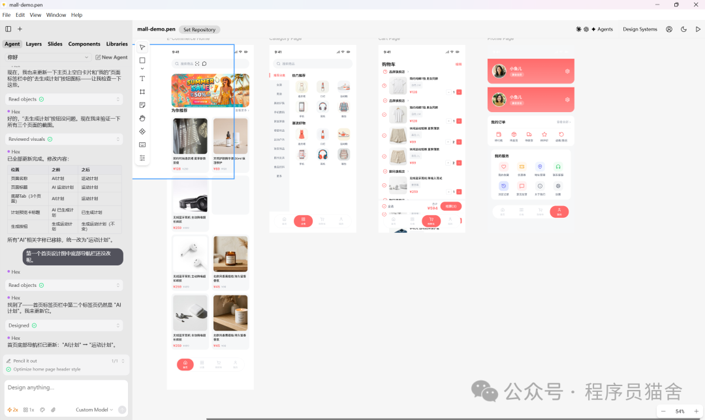

# Pencil + Claude Code：用对话做设计

> 不会 Figma 的后端/全栈开发者，用对话 + .pen 文件就能做设计。**Pencil（AI 驱动的设计工具）+ Claude Code = 对话即设计**。

<!-- more -->

## 痛点

作为后端/全栈开发者，写代码是舒适区，但以下时刻会卡住：

- 老板说"做个活动页"
- 产品说"管理后台的界面你也搭一下"
- 自己 side project 想快速上线

结果：**要么凑合用（丑），要么项目拖着等设计资源（慢）**。

## 解决方案：Pencil + Claude Code

### 什么是 Pencil

**Pencil 是一个 AI 驱动的设计工具**。设计稿是 `.pen` 文件——**本质上是结构化的 JSON**，和写代码天然亲和。

### 什么是 Claude Code

Anthropic 的 AI 编程助手，直接读写文件、理解项目上下文。

### 结合后的体验

**你不需要打开任何设计软件**，只需要在终端里用自然语言描述你要什么，Claude Code 帮你生成、修改 `.pen` 设计稿。

- 不需要学 Figma
- 不需要拖拽画布
- 不需要懂设计理论
- **对话，就是你的设计工具**

## 四个核心能力

### 1. 对话即设计

只需说清楚你要什么：
> "帮我做一个电商首页，顶部轮播图，中间商品网格列表，底部 TabBar。"

Claude Code 直接生成完整的 `.pen` 设计文件（页面结构、布局、配色、组件层级）。打开 Pencil 就能看到渲染好的界面。

### 2. 设计与代码双向流转

`.pen` 文件是 JSON 格式，Claude Code 可以直接读取、理解、修改：

- **设计稿 → 代码**：从 `.pen` 文件直接提取结构，生成 React、Vue 等前端组件
- **代码 → 设计稿**：已有前端代码？根据代码反向生成 `.pen` 设计文件

**设计和开发不再是两个割裂的环节**。设计稿不是"最终效果图"，而是**可以和代码持续同步的活文档**。

### 3. 一句话快速迭代

传统工具里，换个配色方案可能要改十几个图层。在 Pencil + Claude Code 流程里：

> "把整体配色换成深色主题。"
> "顶部导航栏改成毛玻璃效果。"
> "商品卡片之间的间距加大一点。"

Claude Code 直接修改 `.pen` 文件中的对应参数。支持**变量和主题系统**，一套设计轻松切换多套风格。

### 4. 零设计基础也能上手

- 不需要懂色彩理论
- 不需要知道"视觉层次"和"留白"
- **Pencil 内置了合理的设计默认值**（配色、间距、字体、圆角都有基准）

对**小团队和个人开发者**来说，不再需要专职设计师，也能做出合格的界面。

## 工作流示例

```
1. 用对话让 Pencil 生成 UI 原型图
2. 保存 .pen 文件
3. 把 .pen 文件路径告诉 Claude Code
4. Claude Code 直接生成前端代码
```

## 截图示例



*通过对话的方式，让 Pencil 生成 UI 原型图，保存后将 .pen 文件路径告诉 CC，即可生成前端代码*

## 核心洞察

> Pencil + Claude Code 给开发者提供了一种全新的设计方式：
> **不依赖设计工具的操作技能，不依赖设计师的排期**，
> 用你已经熟悉的"描述需求 → 获得结果"的工作流来做设计。

**写代码的人，终于可以用写代码的方式做设计了**。

门槛极低——一个 `.pen` 文件，一段对话，就够了。

## 关联概念

- [[harness-engineering]] — Prompt→Context→Harness 进化的同类工具集
- [[mattpocock-skills]] — 把流程封装成可调用的 skill
- [[agentic-engineer]] — 本专栏：Agent 工程的架构设计
- 工具组合：Pencil（设计）+ Claude Code（执行）= 端到端开发流

## 参考链接

- 原文：https://mp.weixin.qq.com/s/fJMmfTEKtv5Wjs02dRtI7g
- Pencil 项目：[相关链接（原文未给出）]
