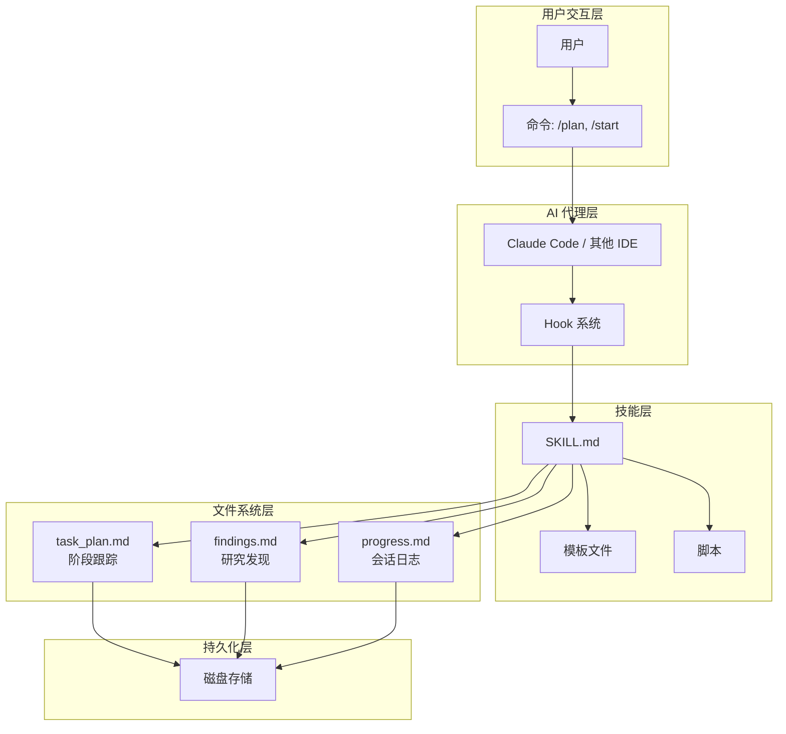
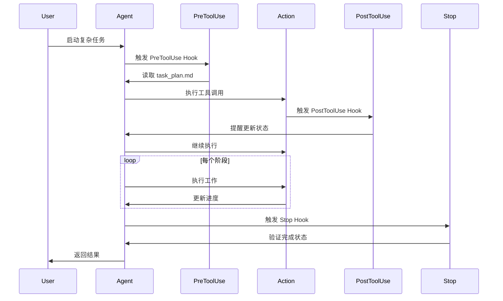
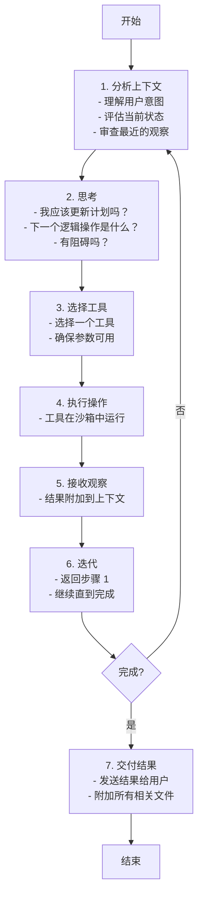

# Planning with Files 原理文档

## 核心原理

Planning with Files 基于 Manus AI 的上下文工程原则，将文件系统作为 AI 的"外部记忆"。核心公式是：

```
Context Window = RAM (易失性，有限)
Filesystem = Disk (持久化，无限)

→ 任何重要信息都写入磁盘
```

### 解决的问题

AI 代理面临的核心挑战：
- **易失性记忆** - TodoWrite 工具在上下文重置后消失
- **目标漂移** - 50+ 次工具调用后，原始目标被遗忘
- **隐藏错误** - 失败未被跟踪，导致重复错误
- **上下文填充** - 所有内容都塞入上下文而非存储

## 架构图

### 系统架构



### Hook 工作流程



## 三文件模式

### 文件用途

| 文件 | 用途 | 更新时机 |
|------|------|----------|
| `task_plan.md` | 阶段、进度、决策 | 每个阶段完成后 |
| `findings.md` | 研究、发现 | 任何发现后 |
| `progress.md` | 会话日志、测试结果 | 整个会话期间 |

### 文件结构示例

**task_plan.md:**
```markdown
## Goal
构建用户认证系统

## Phases
- [ ] Phase 1: 数据库设计
- [ ] Phase 2: API 端点开发
- [ ] Phase 3: 测试
- [ ] Phase 4: 文档

## Errors Encountered
| Error | Attempt | Resolution |
|-------|---------|------------|
```

**findings.md:**
```markdown
## Database Decisions
- 选择 PostgreSQL 因为...
- 用户表结构: ...

## API Design
- RESTful 端点: /api/auth/*
- JWT 认证流程
```

**progress.md:**
```markdown
## Session Log
- 2026-05-11: 创建数据库 schema
- 2026-05-11: 实现 /login 端点
- 2026-05-11: 编写单元测试
```

## 详细用法

### 快速开始

1. **创建 `task_plan.md`** - 使用 `templates/task_plan.md` 作为参考
2. **创建 `findings.md`** - 使用 `templates/findings.md` 作为参考
3. **创建 `progress.md`** - 使用 `templates/progress.md` 作为参考
4. **决策前重读计划** - 刷新注意力窗口中的目标
5. **每个阶段后更新** - 标记完成，记录错误

### 命令调用

**Claude Code:**
- `/planning-with-files:plan` - 输入 `/plan` 自动补全 (v2.11.0+)
- `/planning-with-files:start` - 输入 `/planning` 自动补全
- `/planning-with-files` - 仅当手动复制到 `~/.claude/skills/` 时

### 自动化脚本

**初始化脚本:**
- `scripts/init-session.sh` - 初始化所有规划文件
- `scripts/init-session.ps1` - Windows PowerShell 版本

**完成检查:**
- `scripts/check-complete.sh` - 验证所有阶段完成
- `scripts/check-complete.ps1` - Windows PowerShell 版本

**会话恢复:**
- `scripts/session-catchup.py` - 从之前的会话恢复上下文

## 最佳实践

### 1. 创建计划优先

永远不要在没有 `task_plan.md` 的情况下开始复杂任务。这是不可协商的。

### 2. 双操作规则

> "每进行 2 次 view/browser/search 操作后，立即将关键发现保存到文本文件。"

这可以防止视觉/多模态信息丢失。

### 3. 决策前读取

在做出重大决策之前，读取计划文件。这可以将目标保持在注意力窗口中。

### 4. 行动后更新

完成任何阶段后：
- 标记阶段状态：`in_progress` → `complete`
- 记录遇到的错误
- 注明创建/修改的文件

### 5. 记录所有错误

每个错误都进入计划文件。这可以建立知识并防止重复。

### 6. 三次错误协议

```
尝试 1: 诊断并修复
  → 仔细阅读错误
  → 识别根本原因
  → 应用针对性修复

尝试 2: 替代方法
  → 相同错误？尝试不同方法
  → 不同工具？不同库？
  → 永远不要重复完全相同的失败操作

尝试 3: 更广泛的重新思考
  → 质疑假设
  → 搜索解决方案
  → 考虑更新计划

3 次失败后: 升级给用户
  → 解释你尝试了什么
  → 分享具体错误
  → 请求指导
```

### 读取 vs 写入决策矩阵

| 情况 | 操作 | 原因 |
|------|------|------|
| 刚写入文件 | 不要读取 | 内容仍在上下文中 |
| 查看图像/PDF | 立即写入发现 | 多模态 → 文本，防止丢失 |
| 浏览器返回数据 | 写入文件 | 屏幕截图不持久 |
| 开始新阶段 | 读取计划/发现 | 上下文陈旧时重新定位 |
| 发生错误 | 读取相关文件 | 需要当前状态来修复 |
| 间隔后恢复 | 读取所有规划文件 | 恢复状态 |

### 何时使用此模式

**适用于:**
- 多步骤任务（3+ 步骤）
- 研究任务
- 构建/创建项目
- 跨越许多工具调用的任务
- 任何需要组织的任务

**跳过:**
- 简单问题
- 单文件编辑
- 快速查找

## Manus 六大原则

### 原则 1: 围绕 KV-Cache 设计

> "KV-cache 命中率是生产 AI 代理最重要的单一指标。"

**统计数据:**
- ~100:1 输入到输出 token 比率
- 缓存 token: $0.30/MTok vs 未缓存: $3/MTok
- 10 倍成本差异！

**实现:**
- 保持提示前缀稳定（单 token 变化会使缓存失效）
- 系统提示中没有时间戳
- 使上下文仅追加，具有确定性序列化

### 原则 2: 掩码，不要移除

不要动态移除工具（破坏 KV-cache）。使用 logit 掩码代替。

**最佳实践:** 使用一致的操作前缀（例如 `browser_`、`shell_`、`file_`）以便于掩码。

### 原则 3: 文件系统作为外部记忆

> "Markdown 是我在磁盘上的'工作记忆'。"

**压缩必须可恢复:**
- 即使删除 Web 内容也保留 URL
- 删除文档内容时保留文件路径
- 永远不要丢失指向完整数据的指针

### 原则 4: 通过复述操纵注意力

> "在整个任务中创建和更新 todo.md，将全局计划推入模型的近期注意力跨度。"

**问题:** 约 50 次工具调用后，模型会忘记原始目标（"迷失在中间"效应）。

**解决方案:** 在每次决策前重新读取 `task_plan.md`。目标出现在注意力窗口中。

### 原则 5: 保留错误内容

> "将错误转弯留在上下文中。"

**原因:**
- 带有堆栈跟踪的失败操作让模型隐式更新信念
- 减少错误重复
- 错误恢复是"真正代理行为的最清晰信号之一"

### 原则 6: 不要被少样本化

> "一致性导致脆弱性。"

**问题:** 重复的动作-观察对导致漂移和幻觉。

**解决方案:** 引入受控变化：
- 稍微变化措辞
- 不要盲目复制粘贴模式
- 在重复任务上重新校准

## 代理循环

Manus 在连续的 7 步循环中运行：



## 五问题重启测试

如果你能回答这些问题，你的上下文管理就很扎实：

| 问题 | 答案来源 |
|------|----------|
| 我在哪里？ | task_plan.md 中的当前阶段 |
| 我要去哪里？ | 剩余阶段 |
| 目标是什么？ | 计划中的目标陈述 |
| 我学到了什么？ | findings.md |
| 我做了什么？ | progress.md |

## 反模式

| 不要这样做 | 改为这样做 |
|------------|------------|
| 使用 TodoWrite 进行持久化 | 创建 task_plan.md 文件 |
| 陈述一次目标就忘记 | 决策前重新读取计划 |
| 隐藏错误并静默重试 | 将错误记录到计划文件 |
| 将所有内容塞入上下文 | 将大内容存储在文件中 |
| 立即开始执行 | 首先创建计划文件 |
| 重复失败的操作 | 跟踪尝试，改变方法 |
| 在技能目录中创建文件 | 在你的项目中创建文件 |

---

## 参考资源

- [Planning with Files GitHub](https://github.com/OthmanAdi/planning-with-files)
- [Manus AI 上下文工程原则](https://github.com/manus-ai/context-engineering)
- [Claude Code Skills 文档](https://docs.anthropic.com/en/docs/claude-code/skills)
