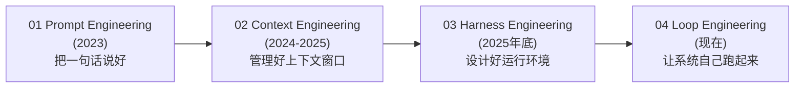
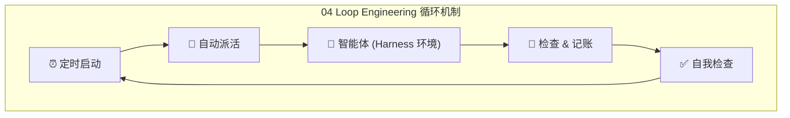
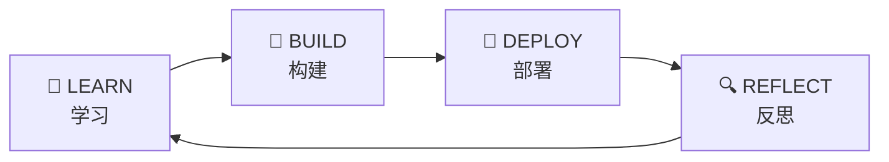
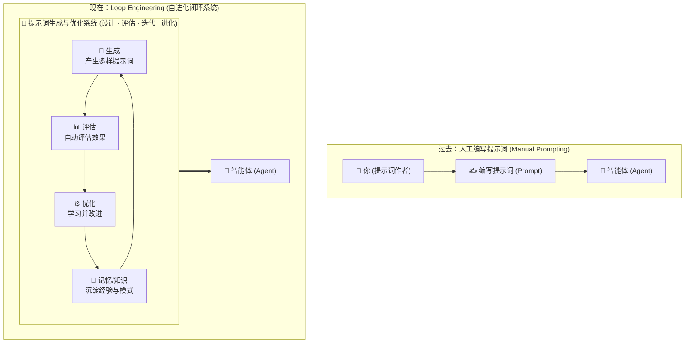
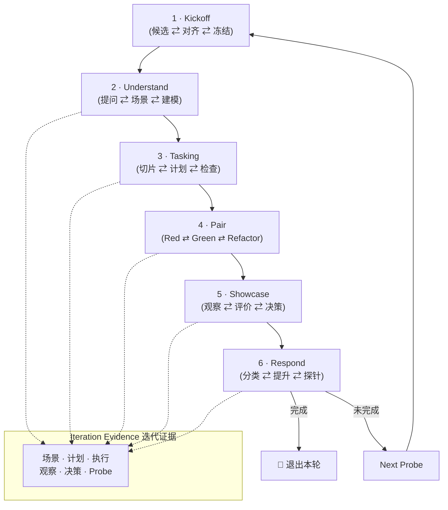
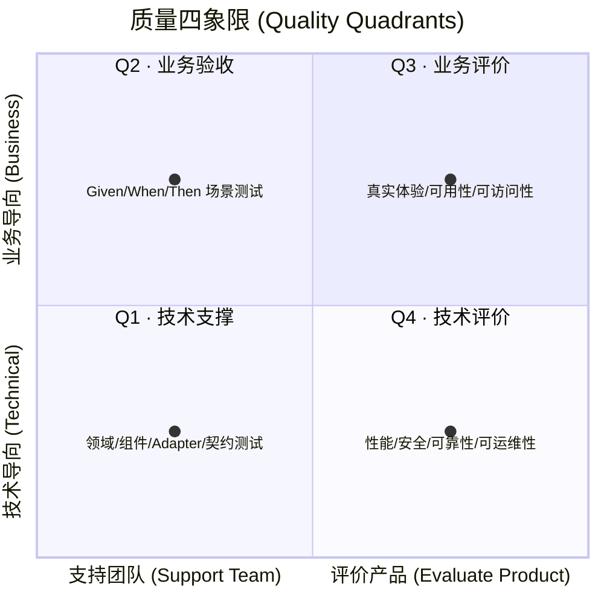
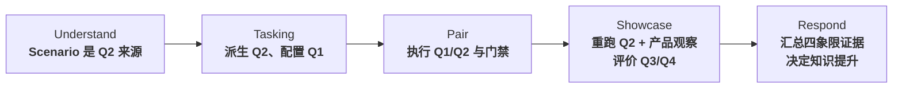

# User Harness：从工程演进到 PI Delivery Loop 交付闭环

> 从 Prompt、Context、Harness 到 Loop Engineering 的四代范式演进，深入解析 **Loop Engineering（循环进化工程）** 的设计哲学与自进化机制，以及在 Harness 体系中落地的 **PI Delivery Loop** 六阶段交付循环与质量四象限（Q1–Q4）证据沉淀体系。核心主张：**命令通过不能替代产品观察，评价必须有证据**。

---

## 1. AI 工程的四代演进

AI 软件开发经历了四个关键演进阶段，从「教 AI 说话」走向「让系统自主闭环运行」：

| 阶段 | 核心定位 | 核心技能 | 人与 AI 关系 | 关键要素 |
|------|----------|----------|-------------|----------|
| **01 Prompt Engineering** (2023) | 单次对话优化 | **把一句话说好** | 人：操作员 AI：高级补全工具 | • 写清需求 • 给足示例 • 措辞讲究（一问一答） |
| **02 Context Engineering** (2024–2025) | 上下文空间管理 | **管理好一个上下文窗口** | 人：信息编排者 AI：上下文理解者 | • 代码库结构 • 文档/资料 • 历史对话与动态检索 *「决定质量的是模型看到了什么」* |
| **03 Harness Engineering** (2025 年底) | 运行约束与控制 | **设计好一个运行环境** | 人：环境架构师 AI：受约束的智能体 | • 可调用的工具集 • 权限控制与边界 • 错误拦截机制 • 日志与审计追踪 |
| **04 Loop Engineering** (现在) | 自主驱动闭环 | **让系统自己跑起来** | 人：目标设定者 AI：闭环自治执行体 | • 定时启动与任务调度 • 自动派活与任务分解 • 自我检查与记账 *「由系统去戳智能体，而不是由你」* |

---

## 2. Loop Engineering：让系统学会循环进化

> **核心口号**：*Build once. Evolve continuously. Loop. Improve. Repeat.*  
> **核心跃迁**：**不再手写提示词，设计一个替你写提示词的系统。从「写提示词」走向「设计循环」。**

### 2.1 循环进化的四大支柱

Loop Engineering 的本质是闭环思维驱动的持续进化：

- **LEARN（学习）**：吸收历史经验、执行日志与反馈，沉淀领域模式。
- **BUILD（构建）**：基于学习结果，自动化组装 Prompt、编排上下文与配置 Harness。
- **DEPLOY（部署）**：将任务分发给智能体并在约束边界内执行。
- **REFLECT（反思）**：评估执行效果与质量证据，识别偏差并回传给系统。

### 2.2 范式对比：人工编写 vs Loop Engineering

| 维度 | 过去：人工编写提示词 | 现在：Loop Engineering |
|------|----------------------|------------------------|
| **驱动主体** | 人工反复手工调优 Prompt | 系统自动生成、评估与优化 |
| **迭代方式** | 试错式人工修改单条输入 | 闭环驱动的算法级自我进化 |
| **知识留存** | 散落在工程师个人脑海或文档 | 沉淀为系统级记忆与经验模式库 |
| **规模上限** | 受限于单人精力和单上下文窗口 | 自动化持续演进，无限次迭代 |

---

## 3. PI Delivery Loop 全景架构

在 Harness 与 Loop 体系下，**PI Delivery Loop** 提供了一套以「用户 Story」为核心单位的严谨软件交付闭环：

---

## 4. 质量四象限（Quality Quadrants）

质量保障按两个维度划分：**支持团队 vs 评价产品**，以及 **业务导向 vs 技术导向**。

### 四象限明细

| 象限 | 核心定位 | 核心问题 | 覆盖内容与规则 | 执行时机 |
|------|----------|----------|----------------|----------|
| **Q1 · 技术支撑** | 技术导向 支持团队 | **失败具体发生在哪里？** | • 领域 / 组件 / Adapter / 契约 • **规则**：每个 Q1 支撑 Q2；共享项去重 | Tasking 规划 Pair 阶段 Red/Green |
| **Q2 · 业务验收** | 业务导向 支持团队 | **预期业务行为实现了吗？** | • Given / When / Then 场景测试 • **规则**：每个 Scenario / Then 必须覆盖 | Pair 执行 Showcase 重跑并观察 |
| **Q3 · 业务评价** | 业务导向 评价产品 | **真实使用体验是否合适？** | • 探索性 / 可用性 / 可访问性 • 兼容性 / 其他业务评价 | Showcase 投险评价 |
| **Q4 · 技术评价** | 技术导向 评价产品 | **现实约束下是否可靠？** | • 性能 / 安全 / 可靠性 • 可运维性 / 其他技术评价 | Showcase 投险评价 |

> **⚠️ Q3 / Q4 纪律**：`required` 必须执行并留证；`not_required` 也要明确记录理由。

---

## 5. 证据流转链路（Quality Evidence Through the Loops）

质量证据在循环全流程中层层递进、环环相扣：

### 完整证据流

$$\text{Scenario} \xrightarrow{\text{派生}} \text{Q2 验收意图} \xrightarrow{\text{支撑}} \text{Q1 定位支撑} \xrightarrow{\text{编码}} \text{代码与门禁} \xrightarrow{\text{观察}} \text{Q2 产品观察} + \text{Q3/Q4 风险证据} \xrightarrow{\text{沉淀}} \text{Respond 知识提升}$$

---

## 6. 六大阶段详细规约

### 1 · Kickoff

| 维度 | 规约内容 |
|------|----------|
| **目标** | 从 Inbox 候选形成唯一、人工确认的 Story |
| **活动** | 冻结 Intake；确认、修订、拆分或延期 |
| **完成** | 生成本轮唯一 `US-xxx Story Card` |
| **质量** | 尚不设计测试；锁定后续所有质量活动的 Story 边界 |

### 2 · Understand（关联象限：Q2）

| 维度 | 规约内容 |
|------|----------|
| **目标** | 形成完整 Scenario Set 与明确模型结论 |
| **活动** | 单问题 TQA；确认场景、Profile 和模型影响 |
| **完成** | 人类确认场景集合及模型结论 |
| **质量** | 每个 Then 成为后续 Q2 验收意图的权威来源 |

### 3 · Tasking（关联象限：Q2、Q1）

| 维度 | 规约内容 |
|------|----------|
| **目标** | 把 Scenario 转换为可执行测试和有序任务 |
| **活动** | 派生 Q2；添加并去重 Q1；锚定命令与门禁 |
| **完成** | Desk Check 批准并锁定 Story 计划 |
| **质量** | 每个 Q1 支撑至少一个 Q2；每个 Then 都有 Q2 |

### 4 · Pair（关联象限：Q1、Q2）

| 维度 | 规约内容 |
|------|----------|
| **目标** | 按批准计划交付可验证代码增量 |
| **活动** | 逐 TEST Red/Green；Refactor；全部质量门禁 |
| **完成** | 全绿，且人工批准完整 Story 编码 |
| **质量** | Q1 快速定位；Q2 证明自动化业务行为 |

### 5 · Showcase（关联象限：Q2、Q3、Q4）

| 维度 | 规约内容 |
|------|----------|
| **目标** | 重新观察真实产品行为、价值和风险 |
| **活动** | 重跑 Q2；人工产品观察；评价 required Q3/Q4 |
| **完成** | 无未决 concern，且人类 accept |
| **质量** | **命令通过不能替代产品观察；评价必须有证据** |

### 6 · Respond（关联象限：Q1、Q2、Q3、Q4）

| 维度 | 规约内容 |
|------|----------|
| **目标** | 把本轮验证过的学习沉淀为可复用知识 |
| **活动** | 综合四象限证据，提出提升、延期或拒绝 |
| **完成** | 知识响应获人工批准，输出 next Probe |
| **质量** | **只提升被场景、执行与评价共同验证的知识** |

---

## 7. 核心工程原则

1. **一轮一个 Story**：Kickoff 阶段冻结边界，严禁在迭代中途塞入未经确认的新需求。
2. **人类确认是硬门禁**：Understand 的场景集、Tasking 的 Desk Check、Pair 的编码批准、Showcase 的验收、Respond 的知识提升，每一环都有明确的人类检查点。
3. **Q2 是业务行为的权威来源**：从 Scenario 的 Given/When/Then 派生出 Q2，全生命周期贯穿。
4. **Q1 永远从属于 Q2**：不写孤立的技术测试，Q1 必须支撑至少一个 Q2 且共享项去重，保证测试金字塔的精简高效。
5. **验收不等于评价**：自动化测试全绿（Q1/Q2）仅代表「按要求实现了」，真实用户体验与非功能风险（Q3/Q4）必须在 Showcase 中人工观察与评估。
6. **双层循环驱动**：外层是 **Loop Engineering（让系统自进化）**，内层是 **PI Delivery Loop（让每个 Story 高质量交付）**，实现从代码生成到架构演进的全面自动化。
