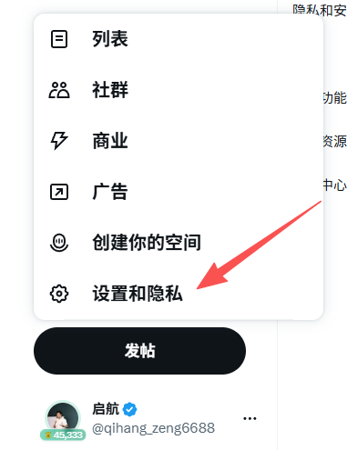
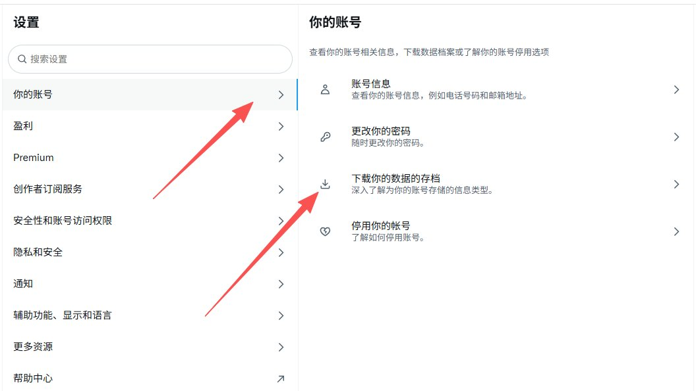
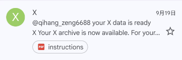
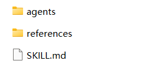
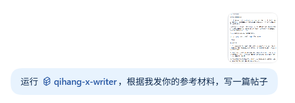

# 手把手教你创建一个专属于自己的创作Skill

如何创建自己的一个 X 创作 Skill，将过往发布内容沉淀为风格统一、可重复调用的创作 Agent。

## 一、详细实操过程

### 1.1 找到 X 的设置功能



### 1.2 点击账号 - 下载数据存档



### 1.3 填写邮箱验证码，点击索取存档


### 1.4 等待接收邮件通知，完成数据下载

通常需等待至少 24 小时，邮箱会收到允许下载文件的邮件，随后回到 X 下载数据包。




### 1.5 解压 ZIP 文件并导入知识库

解压后放置于本地知识库（如 Obsidian）中作为长期素材源。


### 1.6 发给 Codex 分析并生成专属 Skill

将历史帖子与 Skill 诉求发给 Codex 分析，整理出风格统一的原创规范，生成专属 `SKILL.md`。提示词模板如下：

```markdown
帮我为自己的 X 账号创建一个“个人写作 Skill”。

这个 Skill 的作用是：以后我只要给你一个素材、链接、截图、观点或选题，你就能按照我的账号定位、内容结构和语言习惯，帮我写成能直接发布的 X 帖子。

请不要直接写帖子。先根据我提供的信息，整理成一份完整的 `SKILL.md` 文档。

## 1. 我的账号定位

我主要写的领域是：

[例如：AI、GitHub、工具、创业、商业案例、投资、职场、热点观察]

我的读者是：

[例如：想用 AI 做内容、做项目、提高效率、找副业机会的人]

我希望读者关注我后，能获得：

[例如：实用工具、项目思路、行业判断、实操经验、避坑提醒]

我不想把账号做成：

[例如：AI 新闻搬运号、空喊口号的鸡汤号、只会发工具链接的资源号]

## 2. 我常写的内容类型

我希望 Skill 支持这些内容：

[例如：工具推荐帖、教程帖、GitHub 项目帖、热点观察帖、观点帖、清单帖、线程帖、个人复盘帖、商业案例拆解帖]

请分别为每一种内容设计：

1. 适合什么选题  
2. 推荐的写作结构  
3. 开头怎么写  
4. 正文重点讲什么  
5. 结尾怎么收  
6. 常见错误是什么  

不要让所有内容都写成同一种套路。

## 3. 我的选题判断标准

我认为什么内容值得写：

[例如：普通人能马上用、有真实场景、能省时间、有新信息、有案例、有明确需求]

我认为什么内容不值得写：

[例如：只靠热度、没有实际用途、夸大赚钱、只有项目名没有解释、信息过时]

当内容涉及 AI 工具、GitHub 项目、创业案例、赚钱机会时，请重点判断：

- 它到底解决什么问题  
- 谁适合用  
- 普通人上手门槛高不高  
- 是否真的免费、开源、可商用  
- 有没有隐私、账号、费用、部署或合规风险  
- 是真实需求，还是看起来很酷  

## 4. 我的语言习惯

我的语气是：

[例如：直接、口语化、像和朋友聊天、不端着]

我常用的表达方式：

[例如：先讲发生了什么，再讲它有什么用，最后给自己的判断；喜欢用数字和具体场景；句子偏短]

我不喜欢的表达：

[例如：兄弟们、家人们、太疯狂了、颠覆、遥遥领先、AI 改变一切、硬装狠]

我希望文章读起来像：

[例如：一个真的在研究工具和项目的人，把复杂事情讲成人话]

我希望避免：

[例如：AI 味太重、假装亲测、空泛、过度营销、强行煽动情绪]

## 5. 事实与风险规则

请把这些规则写进 Skill：

- 不确定的信息不能写死  
- 没有亲测过的内容，不能假装亲测  
- 第三方数据、公开资料、作者演示和我的个人体验，要明确区分  
- 开源不等于免费，免费不等于无限制，能运行不等于好用  
- 项目 Star 多不等于稳定、安全、适合普通人  
- 收入不等于利润，个例不等于人人可复制  
- 涉及账号、隐私、支付、数据上传时，要主动提醒风险  
- 涉及热点或实时信息时，优先核实来源和时间  

## 6. 最终输出要求

请输出一份完整的个人写作 Skill，至少包含：

1. Skill 的目标和适用范围  
2. 账号定位  
3. 读者画像  
4. 内容类型与对应结构  
5. 选题判断规则  
6. 语言风格规则  
7. 事实核查与风险边界  
8. 发布前检查清单  
9. 收到素材后，应该如何产出一篇完整帖子  

整体要具体、能执行，不要写成空泛的“保持专业”“有吸引力”这类话。

最后，再根据以上内容补充一份“我以后给你素材时的标准提问模板”。
```

### 1.7 Skill 的组成规范

`SKILL.md` 文件内部定义了个性化规格，可以自行根据需要修改和定制。



### 1.8 如何使用 Skill

将生成的 Skill 文件放置于项目指定目录，或直接将文件路径提供给 Codex/Claude Code，Agent 即可自动加载并遵循该规则集进行创作。



---

## 二、个人创作 Skill 核心架构剖析

### 2.1 账号定位

- **写什么**：聚焦 AI、GitHub、实用工具、创业商业案例与热点观察，拒绝纯新闻搬运或盲目喊单。核心是将复杂的工具和项目翻译成普通人能看懂、能判断、能落地的知识。
- **读者画像**：想用 AI 提效、探索副业项目、对开源生态感兴趣但不知如何上手的实践者。
- **价值承诺**：每篇内容发布前必须回答——**读者看完，到底能拿走什么？** 可以是工具、判断方法、实操路径或避坑指南。


### 2.2 七类常见内容模型与对应结构

1. **工具教程帖**：
   - 结构：痛点引入 → 工具能力 → 具体场景 → 门槛与限制说明 → 下一步行动。
   - 重点：讲清解决什么问题、谁适合用、替代了什么旧流程。
2. **干货资源帖**：
   - 结构：分类推荐，逐项讲清“干什么、适合谁、先用哪个核心功能”，避免泛泛罗列链接。
3. **热点观察帖**：
   - 结构：先讲确凿事实，再给出独立判断，重点回答“这件事和普通人有什么关系”。
4. **个人观点帖**：
   - 结构：先抛明确结论，再用具体案例和数据支撑，克制情绪化表达。
5. **线程帖（Thread）**：
   - 结构：首帖概括主旨与收益，后续每条拆解独立要点，拒绝无意义拆分。
6. **清单帖**：
   - 结构：标题承诺数量，正文完整讲透对应数量的每一项用途，不单纯看 Star 数量。
7. **个人复盘帖**：
   - 结构：目标 → 实操过程 → 卡点 → 调整路径 → 当前认知判断，还原真实过程。

### 2.3 选题判断的五重标准


1. 普通人到底能不能用
2. 能帮人省什么时间、资金或步骤
3. 有没有真实的使用场景
4. 有没有新的增量信息或独特视角
5. 是否与读者的核心痛点相关

### 2.4 写作结构与语言风格

- **开头**：直切痛点或结论，不绕圈子。
- **正文**：多用短句、数字与具象场景，将“Agent 工作流”等抽象概念翻译成人话。
- **忌用词**：避免 AI 腔调、夸大词汇（“颠覆”、“遥遥领先”、“太疯狂了”）及生硬的人设口吻。

### 2.5 事实核查与风险兜底

- 未亲测内容必须注明信息来源（如“按官方文档说明”）。
- 明确区分“开源 ≠ 免费”、“能运行 ≠ 好用”、“营收 ≠ 利润”。
- 涉及账号、密钥、支付与数据隐私时，强制提示安全风险。

### 2.6 发布前检查清单（Pre-flight Checklist）

- [ ] 核心主题是否明确？
- [ ] 读者阅读后是否有具体的行动项或增量信息？
- [ ] 是否存在把第三方体验当成亲测的虚假表述？
- [ ] 是否过度渲染了“赚钱”、“开源”、“必备”等词汇？
- [ ] 专业概念是否已完成通俗化解释？

---

## 关于作者

**启航**｜内容创作者，关注 AI 效率工具、GitHub 开源生态与内容工程化实践。

[[@qihang_zeng6688](https://x.com/qihang_zeng6688)](https://x.com/@qihang_zeng6688)
