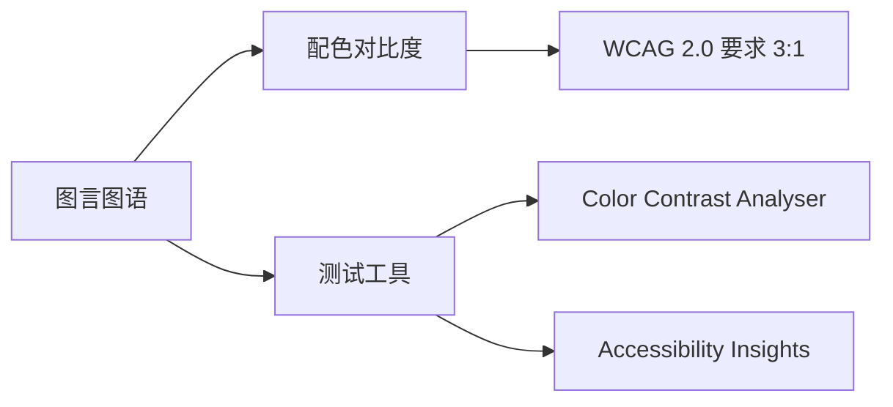

> **摘要** — 图言图语探讨如何用图形化方式表达思想。核心要点包括：图形前景/背景对比度应达到 WCAG 2.0 要求的 3:1 标准；白色前景文字搭配浅色背景通常只有 1.4~2:1 对比度，不满足无障碍要求；使用 Color Contrast Analyser（macOS）或 Accessibility Insights for Windows 测试对比度。



```markmap height=200
# 图言图语
## 配色建议
- WCAG 2.0 要求对比度 3:1
- 白色文字+浅色背景只有 1.4~2:1
## 测试工具
- macOS: Color Contrast Analyser
- Windows: Accessibility Insights
```

---

# 图言图语


## 关于配色的建议：

从可用性的角度，WCAG 2.0 关于色彩对比度要求图形前景/背景对比度至少要达到 3:1（[Color contrast - Accessibility - MDN Web Docs](https://developer.mozilla.org/en-US/docs/Web/Accessibility/Understanding_WCAG/Perceivable/Color_contrast) ），我测试了一下，白色前景文字搭配浅色背景的图片，对比度只有 1.4~2:1，都不满足 WCAG 要求（macOS 可以用 Color Contrast Analyser 测试，Windows 可以用 Accessibility Insights for Windows 测试）。


