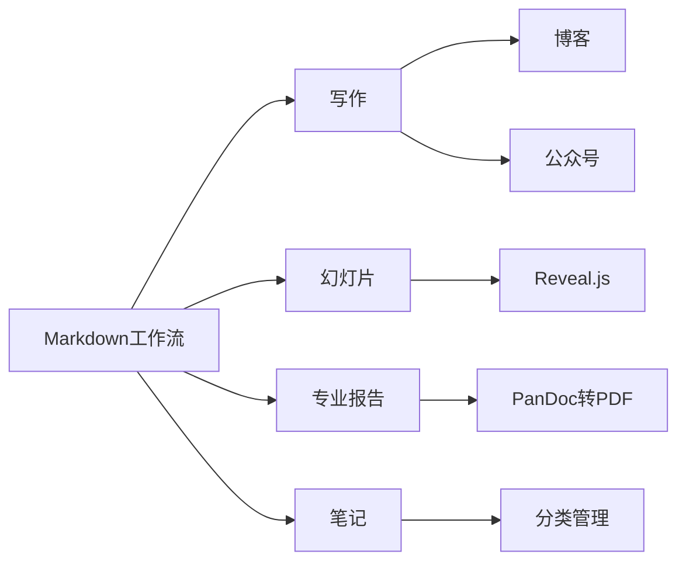

> **摘要** — Markdown 是 John Gruber 于 2004 年创立的纯文本标记语言，可用于写作（博客、知乎专栏、微信公众号）、幻灯片、专业报告、笔记等场景。搭配 Hugo、Netlify、PlantUML 等工具可构建完整的内容创作工作流，一次投资，终生受益。



```markmap height=280
# Markdown 可以做什么
## 核心用途
- 写作：博客、知乎专栏、公众号
- 幻灯片：Reveal.js/Hugo Slide
- 专业报告：PanDoc 转 Latex PDF
- 笔记：分类目录管理
## 工作流
- Markdown 写文章
- git push 推送
- Netlify 自动构建
- 多平台同步发布
## 工具链
- Hugo 生成博客
- PlantUML 绘图
- PanDoc 转换格式
```

---

### Markdown 是什么

Markdown 由 John Gruber 于 2004 年创立，它是一种纯文本标记语言，实际上这篇文章排版就是用 Markdown 生成的，在这里可以看到它的[源文件](https://raw.githubusercontent.com/bmpi-dev/bmpi.dev/master/content/dev/what-markdown-can-do/index.zh-cn.md) [1](#fn:1)。


在这里可以体验下 Markdown 的具体用法：[微信公众号 Markdown 在线排版](https://wechat.bmpi.dev/) [2](#fn:2)

### Markdown 工作流


上述思维导图使用 VSCode 插件 [`PlantUML`](https://plantuml.com/zh/)[3](#fn:3) 预览纯文本生成的，纯文本如下：

```
@startmindmap
skinparam monochrome true
* Markdown 排版
** 写作
*** 博客
*** 知乎专栏
*** 微信公众号
** 幻灯片
** 专业报告
** 笔记
@endmindmap
```

用 Markdown 记录笔记
---------------


如上图红框，我一般将某个主题相关的笔记用一个 Markdown 记录，放入相应类别的目录。比如学习类别中，关于 SEO 的学习资料都会放入`seo_study.md`，所有学习的 md 文件都放入 `study` 目录。

用 Markdown 生成博客
---------------

本博客使用基于 Markdown 的 [Hugo](https://gohugo.io/)[4](#fn:4) 程序生成，源文件都托管至 [GitHub 仓库](https://github.com/bmpi-dev/bmpi.dev) [5](#fn:5)，最后用 [Netlify](https://www.netlify.com/)[6](#fn:6) 服务发布至网上。

所以写作的流程一般是：

1.  用 Markdown 写一篇新文章。
2.  将新文章使用 `git push` 推送到 GitHub 仓库。
3.  Netlify 会自动触发构建从而将新文章上线到网站。
4.  将博客新文章复制到微信公众号 / 知乎专栏 / 其他社区同步发布。

用 Markdown 生成幻灯片
----------------

本博客的 [Talk 子域名](https://talk.bmpi.dev/) [7](#fn:7) 也是用 Hugo 的一个 [Slide 主题](https://reveal-hugo.dzello.com/#/) [8](#fn:8) 搭建，源码存放于这个 [GitHub 仓库](https://github.com/bmpi-dev/talk.bmpi.dev) [9](#fn:9)。


用 Markdown 写 PPT 的好处在于不需要耗费很多时间去排版，再次修改也是对纯文本的更改，缺点是你需要花一点时间（不超过一小时）去学习一些规则。我觉得这是一笔值得的投资，一次投资，终生受益。

该主题还支持幻灯片导出成 PDF 格式。只需要加`?print-pdf` 后缀到网址 URL 后面即可。

用 Markdown 生成专业报告
-----------------


如何用 Markdown 生成如上这种学术期刊类的报告呢？

这需要我们做一些基本的设置，详细的安装设置可以参考我的笔记[《使用 PanDoc 将 Markdown 转化成 Latex 学术期刊 PDF 模版》](https://wiki.bmpi.dev/#%E4%BD%BF%E7%94%A8PanDoc%E5%B0%86Markdown%E8%BD%AC%E5%8C%96%E6%88%90Latex%E5%AD%A6%E6%9C%AF%E6%9C%9F%E5%88%8APDF%E6%A8%A1%E7%89%88)[10](#fn:10)

设置好后，可以按照下面的格式：


效果如下：


Markdown 是一种非常简单的排版方法，以上是我的一些经验，如果你有更好的使用方法，请留言给我，互相学习交流。

#### _References_

[](https://twitter.com/madawei2699)> 本文由 [简悦 SimpRead](http://ksria.com/simpread/) 转码， 原文地址 [www.bmpi.dev](https://www.bmpi.dev/dev/what-markdown-can-do/)

> 本文介绍了零成本用 Markdown 搞定博客网站、笔记文档、演讲胶片与年终总结报告，彻底抛弃 Word 与 PPT

你是否遇到这些问题：写报告需要打开 Word/PPT，每次浪费不少时间在排版上？写博客需要在管理后台网页里排版？在这篇文章里我将会介绍如何使用一种纯文本标记语言 Markdown 去排版各类型文档。

本文大纲如下：

*   基于 Markdown 的工作流
*   用 Markdown 生成笔记 / 博客 / 幻灯片 / 专业报告

开始之前，如果觉得本文不错，可以分享给你的朋友。让我们开始吧！

基于 Markdown 的工作流
----------------

### Markdown 是什么

Markdown 由 John Gruber 于 2004 年创立，它是一种纯文本标记语言，实际上这篇文章排版就是用 Markdown 生成的，在这里可以看到它的[源文件](https://raw.githubusercontent.com/bmpi-dev/bmpi.dev/master/content/dev/what-markdown-can-do/index.zh-cn.md) [1](#fn:1)。


在这里可以体验下 Markdown 的具体用法：[微信公众号 Markdown 在线排版](https://wechat.bmpi.dev/) [2](#fn:2)

### Markdown 工作流


上述思维导图使用 VSCode 插件 [`PlantUML`](https://plantuml.com/zh/)[3](#fn:3) 预览纯文本生成的，纯文本如下：

```
@startmindmap
skinparam monochrome true
* Markdown 排版
** 写作
*** 博客
*** 知乎专栏
*** 微信公众号
** 幻灯片
** 专业报告
** 笔记
@endmindmap
```

用 Markdown 记录笔记
---------------


如上图红框，我一般将某个主题相关的笔记用一个 Markdown 记录，放入相应类别的目录。比如学习类别中，关于 SEO 的学习资料都会放入`seo_study.md`，所有学习的 md 文件都放入 `study` 目录。

用 Markdown 生成博客
---------------

本博客使用基于 Markdown 的 [Hugo](https://gohugo.io/)[4](#fn:4) 程序生成，源文件都托管至 [GitHub 仓库](https://github.com/bmpi-dev/bmpi.dev) [5](#fn:5)，最后用 [Netlify](https://www.netlify.com/)[6](#fn:6) 服务发布至网上。

所以写作的流程一般是：

1.  用 Markdown 写一篇新文章。
2.  将新文章使用 `git push` 推送到 GitHub 仓库。
3.  Netlify 会自动触发构建从而将新文章上线到网站。
4.  将博客新文章复制到微信公众号 / 知乎专栏 / 其他社区同步发布。

用 Markdown 生成幻灯片
----------------

本博客的 [Talk 子域名](https://talk.bmpi.dev/) [7](#fn:7) 也是用 Hugo 的一个 [Slide 主题](https://reveal-hugo.dzello.com/#/) [8](#fn:8) 搭建，源码存放于这个 [GitHub 仓库](https://github.com/bmpi-dev/talk.bmpi.dev) [9](#fn:9)。


用 Markdown 写 PPT 的好处在于不需要耗费很多时间去排版，再次修改也是对纯文本的更改，缺点是你需要花一点时间（不超过一小时）去学习一些规则。我觉得这是一笔值得的投资，一次投资，终生受益。

该主题还支持幻灯片导出成 PDF 格式。只需要加`?print-pdf` 后缀到网址 URL 后面即可。

用 Markdown 生成专业报告
-----------------


如何用 Markdown 生成如上这种学术期刊类的报告呢？

这需要我们做一些基本的设置，详细的安装设置可以参考我的笔记[《使用 PanDoc 将 Markdown 转化成 Latex 学术期刊 PDF 模版》](https://wiki.bmpi.dev/#%E4%BD%BF%E7%94%A8PanDoc%E5%B0%86Markdown%E8%BD%AC%E5%8C%96%E6%88%90Latex%E5%AD%A6%E6%9C%AF%E6%9C%9F%E5%88%8APDF%E6%A8%A1%E7%89%88)[10](#fn:10)

设置好后，可以按照下面的格式：


效果如下：


Markdown 是一种非常简单的排版方法，以上是我的一些经验，如果你有更好的使用方法，请留言给我，互相学习交流。

#### _References_

[](https://twitter.com/madawei2699)> 本文由 [简悦 SimpRead](http://ksria.com/simpread/) 转码， 原文地址 [www.bmpi.dev](https://www.bmpi.dev/dev/what-markdown-can-do/)

> 本文介绍了零成本用 Markdown 搞定博客网站、笔记文档、演讲胶片与年终总结报告，彻底抛弃 Word 与 PPT

你是否遇到这些问题：写报告需要打开 Word/PPT，每次浪费不少时间在排版上？写博客需要在管理后台网页里排版？在这篇文章里我将会介绍如何使用一种纯文本标记语言 Markdown 去排版各类型文档。

本文大纲如下：

*   基于 Markdown 的工作流
*   用 Markdown 生成笔记 / 博客 / 幻灯片 / 专业报告

开始之前，如果觉得本文不错，可以分享给你的朋友。让我们开始吧！

基于 Markdown 的工作流
----------------

### Markdown 是什么

Markdown 由 John Gruber 于 2004 年创立，它是一种纯文本标记语言，实际上这篇文章排版就是用 Markdown 生成的，在这里可以看到它的[源文件](https://raw.githubusercontent.com/bmpi-dev/bmpi.dev/master/content/dev/what-markdown-can-do/index.zh-cn.md) [1](#fn:1)。


在这里可以体验下 Markdown 的具体用法：[微信公众号 Markdown 在线排版](https://wechat.bmpi.dev/) [2](#fn:2)

### Markdown 工作流


上述思维导图使用 VSCode 插件 [`PlantUML`](https://plantuml.com/zh/)[3](#fn:3) 预览纯文本生成的，纯文本如下：

```
@startmindmap
skinparam monochrome true
* Markdown 排版
** 写作
*** 博客
*** 知乎专栏
*** 微信公众号
** 幻灯片
** 专业报告
** 笔记
@endmindmap
```

用 Markdown 记录笔记
---------------


如上图红框，我一般将某个主题相关的笔记用一个 Markdown 记录，放入相应类别的目录。比如学习类别中，关于 SEO 的学习资料都会放入`seo_study.md`，所有学习的 md 文件都放入 `study` 目录。

用 Markdown 生成博客
---------------

本博客使用基于 Markdown 的 [Hugo](https://gohugo.io/)[4](#fn:4) 程序生成，源文件都托管至 [GitHub 仓库](https://github.com/bmpi-dev/bmpi.dev) [5](#fn:5)，最后用 [Netlify](https://www.netlify.com/)[6](#fn:6) 服务发布至网上。

所以写作的流程一般是：

1.  用 Markdown 写一篇新文章。
2.  将新文章使用 `git push` 推送到 GitHub 仓库。
3.  Netlify 会自动触发构建从而将新文章上线到网站。
4.  将博客新文章复制到微信公众号 / 知乎专栏 / 其他社区同步发布。

用 Markdown 生成幻灯片
----------------

本博客的 [Talk 子域名](https://talk.bmpi.dev/) [7](#fn:7) 也是用 Hugo 的一个 [Slide 主题](https://reveal-hugo.dzello.com/#/) [8](#fn:8) 搭建，源码存放于这个 [GitHub 仓库](https://github.com/bmpi-dev/talk.bmpi.dev) [9](#fn:9)。


用 Markdown 写 PPT 的好处在于不需要耗费很多时间去排版，再次修改也是对纯文本的更改，缺点是你需要花一点时间（不超过一小时）去学习一些规则。我觉得这是一笔值得的投资，一次投资，终生受益。

该主题还支持幻灯片导出成 PDF 格式。只需要加`?print-pdf` 后缀到网址 URL 后面即可。

用 Markdown 生成专业报告
-----------------


如何用 Markdown 生成如上这种学术期刊类的报告呢？

这需要我们做一些基本的设置，详细的安装设置可以参考我的笔记[《使用 PanDoc 将 Markdown 转化成 Latex 学术期刊 PDF 模版》](https://wiki.bmpi.dev/#%E4%BD%BF%E7%94%A8PanDoc%E5%B0%86Markdown%E8%BD%AC%E5%8C%96%E6%88%90Latex%E5%AD%A6%E6%9C%AF%E6%9C%9F%E5%88%8APDF%E6%A8%A1%E7%89%88)[10](#fn:10)

设置好后，可以按照下面的格式：


效果如下：


Markdown 是一种非常简单的排版方法，以上是我的一些经验，如果你有更好的使用方法，请留言给我，互相学习交流。

#### _References_

[](https://twitter.com/madawei2699)> 本文由 [简悦 SimpRead](http://ksria.com/simpread/) 转码， 原文地址 [www.bmpi.dev](https://www.bmpi.dev/dev/what-markdown-can-do/)

> 本文介绍了零成本用 Markdown 搞定博客网站、笔记文档、演讲胶片与年终总结报告，彻底抛弃 Word 与 PPT

你是否遇到这些问题：写报告需要打开 Word/PPT，每次浪费不少时间在排版上？写博客需要在管理后台网页里排版？在这篇文章里我将会介绍如何使用一种纯文本标记语言 Markdown 去排版各类型文档。

本文大纲如下：

*   基于 Markdown 的工作流
*   用 Markdown 生成笔记 / 博客 / 幻灯片 / 专业报告

开始之前，如果觉得本文不错，可以分享给你的朋友。让我们开始吧！

基于 Markdown 的工作流
----------------

### Markdown 是什么

Markdown 由 John Gruber 于 2004 年创立，它是一种纯文本标记语言，实际上这篇文章排版就是用 Markdown 生成的，在这里可以看到它的[源文件](https://raw.githubusercontent.com/bmpi-dev/bmpi.dev/master/content/dev/what-markdown-can-do/index.zh-cn.md) [1](#fn:1)。


在这里可以体验下 Markdown 的具体用法：[微信公众号 Markdown 在线排版](https://wechat.bmpi.dev/) [2](#fn:2)

### Markdown 工作流


上述思维导图使用 VSCode 插件 [`PlantUML`](https://plantuml.com/zh/)[3](#fn:3) 预览纯文本生成的，纯文本如下：

```
@startmindmap
skinparam monochrome true
* Markdown 排版
** 写作
*** 博客
*** 知乎专栏
*** 微信公众号
** 幻灯片
** 专业报告
** 笔记
@endmindmap
```

用 Markdown 记录笔记
---------------


如上图红框，我一般将某个主题相关的笔记用一个 Markdown 记录，放入相应类别的目录。比如学习类别中，关于 SEO 的学习资料都会放入`seo_study.md`，所有学习的 md 文件都放入 `study` 目录。

用 Markdown 生成博客
---------------

本博客使用基于 Markdown 的 [Hugo](https://gohugo.io/)[4](#fn:4) 程序生成，源文件都托管至 [GitHub 仓库](https://github.com/bmpi-dev/bmpi.dev) [5](#fn:5)，最后用 [Netlify](https://www.netlify.com/)[6](#fn:6) 服务发布至网上。

所以写作的流程一般是：

1.  用 Markdown 写一篇新文章。
2.  将新文章使用 `git push` 推送到 GitHub 仓库。
3.  Netlify 会自动触发构建从而将新文章上线到网站。
4.  将博客新文章复制到微信公众号 / 知乎专栏 / 其他社区同步发布。

用 Markdown 生成幻灯片
----------------

本博客的 [Talk 子域名](https://talk.bmpi.dev/) [7](#fn:7) 也是用 Hugo 的一个 [Slide 主题](https://reveal-hugo.dzello.com/#/) [8](#fn:8) 搭建，源码存放于这个 [GitHub 仓库](https://github.com/bmpi-dev/talk.bmpi.dev) [9](#fn:9)。


用 Markdown 写 PPT 的好处在于不需要耗费很多时间去排版，再次修改也是对纯文本的更改，缺点是你需要花一点时间（不超过一小时）去学习一些规则。我觉得这是一笔值得的投资，一次投资，终生受益。

该主题还支持幻灯片导出成 PDF 格式。只需要加`?print-pdf` 后缀到网址 URL 后面即可。

用 Markdown 生成专业报告
-----------------


如何用 Markdown 生成如上这种学术期刊类的报告呢？

这需要我们做一些基本的设置，详细的安装设置可以参考我的笔记[《使用 PanDoc 将 Markdown 转化成 Latex 学术期刊 PDF 模版》](https://wiki.bmpi.dev/#%E4%BD%BF%E7%94%A8PanDoc%E5%B0%86Markdown%E8%BD%AC%E5%8C%96%E6%88%90Latex%E5%AD%A6%E6%9C%AF%E6%9C%9F%E5%88%8APDF%E6%A8%A1%E7%89%88)[10](#fn:10)

设置好后，可以按照下面的格式：


> 本文由 [简悦 SimpRead](http://ksria.com/simpread/) 转码， 原文地址 [www.bmpi.dev](https://www.bmpi.dev/dev/what-markdown-can-do/)

> 本文介绍了零成本用 Markdown 搞定博客网站、笔记文档、演讲胶片与年终总结报告，彻底抛弃 Word 与 PPT

你是否遇到这些问题：写报告需要打开 Word/PPT，每次浪费不少时间在排版上？写博客需要在管理后台网页里排版？在这篇文章里我将会介绍如何使用一种纯文本标记语言 Markdown 去排版各类型文档。

本文大纲如下：

*   基于 Markdown 的工作流
*   用 Markdown 生成笔记 / 博客 / 幻灯片 / 专业报告

开始之前，如果觉得本文不错，可以分享给你的朋友。让我们开始吧！

基于 Markdown 的工作流
----------------

### Markdown 是什么

Markdown 由 John Gruber 于 2004 年创立，它是一种纯文本标记语言，实际上这篇文章排版就是用 Markdown 生成的，在这里可以看到它的[源文件](https://raw.githubusercontent.com/bmpi-dev/bmpi.dev/master/content/dev/what-markdown-can-do/index.zh-cn.md) [1](#fn:1)。


在这里可以体验下 Markdown 的具体用法：[微信公众号 Markdown 在线排版](https://wechat.bmpi.dev/) [2](#fn:2)

### Markdown 工作流


上述思维导图使用 VSCode 插件 [`PlantUML`](https://plantuml.com/zh/)[3](#fn:3) 预览纯文本生成的，纯文本如下：

```
@startmindmap
skinparam monochrome true
* Markdown 排版
** 写作
*** 博客
*** 知乎专栏
*** 微信公众号
** 幻灯片
** 专业报告
** 笔记
@endmindmap
```

用 Markdown 记录笔记
---------------


如上图红框，我一般将某个主题相关的笔记用一个 Markdown 记录，放入相应类别的目录。比如学习类别中，关于 SEO 的学习资料都会放入`seo_study.md`，所有学习的 md 文件都放入 `study` 目录。

用 Markdown 生成博客
---------------

本博客使用基于 Markdown 的 [Hugo](https://gohugo.io/)[4](#fn:4) 程序生成，源文件都托管至 [GitHub 仓库](https://github.com/bmpi-dev/bmpi.dev) [5](#fn:5)，最后用 [Netlify](https://www.netlify.com/)[6](#fn:6) 服务发布至网上。

所以写作的流程一般是：

1.  用 Markdown 写一篇新文章。
2.  将新文章使用 `git push` 推送到 GitHub 仓库。
3.  Netlify 会自动触发构建从而将新文章上线到网站。
4.  将博客新文章复制到微信公众号 / 知乎专栏 / 其他社区同步发布。

用 Markdown 生成幻灯片
----------------

本博客的 [Talk 子域名](https://talk.bmpi.dev/) [7](#fn:7) 也是用 Hugo 的一个 [Slide 主题](https://reveal-hugo.dzello.com/#/) [8](#fn:8) 搭建，源码存放于这个 [GitHub 仓库](https://github.com/bmpi-dev/talk.bmpi.dev) [9](#fn:9)。


用 Markdown 写 PPT 的好处在于不需要耗费很多时间去排版，再次修改也是对纯文本的更改，缺点是你需要花一点时间（不超过一小时）去学习一些规则。我觉得这是一笔值得的投资，一次投资，终生受益。

该主题还支持幻灯片导出成 PDF 格式。只需要加`?print-pdf` 后缀到网址 URL 后面即可。

用 Markdown 生成专业报告
-----------------


如何用 Markdown 生成如上这种学术期刊类的报告呢？

这需要我们做一些基本的设置，详细的安装设置可以参考我的笔记[《使用 PanDoc 将 Markdown 转化成 Latex 学术期刊 PDF 模版》](https://wiki.bmpi.dev/#%E4%BD%BF%E7%94%A8PanDoc%E5%B0%86Markdown%E8%BD%AC%E5%8C%96%E6%88%90Latex%E5%AD%A6%E6%9C%AF%E6%9C%9F%E5%88%8APDF%E6%A8%A1%E7%89%88)[10](#fn:10)

设置好后，可以按照下面的格式：


效果如下：


Markdown 是一种非常简单的排版方法，以上是我的一些经验，如果你有更好的使用方法，请留言给我，互相学习交流。

#### _References_

[](https://twitter.com/madawei2699)
效果如下：


Markdown 是一种非常简单的排版方法，以上是我的一些经验，如果你有更好的使用方法，请留言给我，互相学习交流。

#### _References_

[](https://twitter.com/madawei2699)