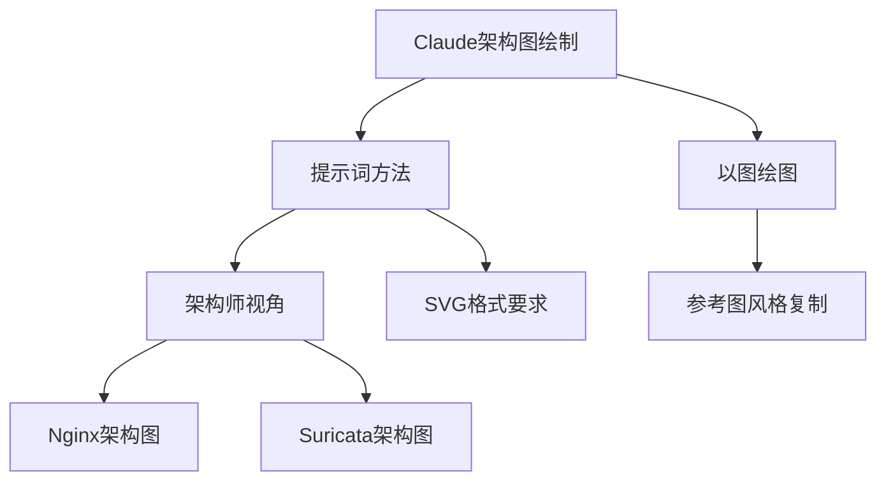

> **摘要** — 探讨如何用 Claude 生成专业架构图。核心方法：使用"架构师视角"提示词描述 SVG 格式要求（元素不重叠、精确专业术语、适当字体层级），并支持"以图绘图"复制参考图风格。适用 Nginx、Suricata 等开源软件架构图绘制。



```markmap height=280
# Claude 架构图绘制
## 提示词方法
- 架构师视角描述
- SVG 格式要求
- 元素不重叠
- 精确专业术语
## 字体层级
- 架构标题：Fira Code Bold + 思源宋体 Bold 24pt
- 技术术语：JetBrains Mono + 方正书宋 14pt
- 数学公式：Latin Modern Math 12pt
## 以图绘图
- 复制参考图的风格
- 避免盗图风险
- 生成可用架构图
```

---

对于程序员来说，经常绘制的就是架构图了，自己设计软件的时候需要绘制，学习开源软件的时候，也需要参考开源软件的架构图加以理解，正所谓一图胜千言，一个绘图正确、漂亮的架构图能让入门者轻松理解新的架构。

### 2.1 Nginx 架构图

#### 2.1.1 提示词绘图

对于 Nginx 这个常用的开源软件，它的架构图如何让 Claude 生成那，我先让 DeepSeek 给我一个提示词，然后喂给 Claude，发现效果还不如直接让 Claude 自己总结绘制，经过了几轮改进，总结的提示词如下：

```
架构师的视角绘制Nginx核心架构图（SVG）
要求：
- 元素不重叠，避免内容过于拥挤
- 如有必要，则添加小型公式来解释关键计算
- 使用精确的专业术语
- 架构标题    Fira Code Bold + 思源宋体 Bold    24pt
- 技术术语    JetBrains Mono + 方正书宋    14pt
- 数学公式    Latin Modern Math    12pt
- 浅色背景框
```

效果图如下，先不管内部逻辑，这个图的味道是对了的。![][img-0]

对于 suricata，这个开源的 IDS 系统，让 Cluade 绘制看看，提示词如下：

```
以流量系统架构师的视角绘制suricata核心架构图（SVG）
要求：
- 元素不重叠，避免内容过于拥挤
- 框图内的内容不能超过边界
- 使用精确的专业术语
- 架构标题    Fira Code Bold + 思源宋体 Bold    24pt
- 技术术语    JetBrains Mono + 方正书宋    14pt
- 数学公式    Latin Modern Math    12pt
- 浅色背景框
```

![][img-1]suricata 架构图

### 2.1.2 以图绘图

上面让 Claude 总结的绘图，效果还不错，但是如果我们网上看到架构表述更清晰，布局更合理的图，能不能让 Claude 来防图那，这样我们写文章就可以直接用了，不存在盗图的风险，如下： 原图:（来自：https://cloud.tencent.com/developer/article/2392977）![][img-2]

**总结：**

*   基本能满足以图绘图的要求；
    
*   提示词一定要强调不能存在重叠，文字和图经常出现覆盖的问题；
    

三 软件原型图的绘制
----------

对于后端工程师来说，前端的技术，学习下还能马马虎虎，但是对于设计 UI，这种，虽然我审美在线，但是设计上是一塌糊涂，让 Claude 作为专业的 UI 设计师，来设计下 UI，看看效果如何。

假如想开发一款给初中生学习用的在线知识测试系统，用以下的提示词来看看效果：


```
#角色 
你是位资深精通产品规划和UI的设计师

#设计风格
1、界面风格要简洁、清爽、有活力，使用FontAwesome等开源图标库，让原型显得更精美和接近真实；
2、配色要护眼、清爽、有活力，使用FontAwesome等开源图标库，让原型显得更精美和接近真实；
3、界面要符合现代APP的设计规范，使用户在使用APP时感到舒适、流畅、自然；
4、信息层级通过微妙的阴影过渡与模块化卡片布局清晰呈现、用户视线嗯呢自然聚焦核心功能；
5、精心打磨的圆角；细腻的微交互；舒适的视觉比例；
6、强调色：按APP类型选择；单个页面尺寸为 375x812PX，带有描边，模拟手机边框
7、样式必须引入 tailwindcss CDN来完成

#设计任务
我想开发一个初中生使用的在线知识测试APP,思考用户需要APP实现哪些功能,
结合用户需求，以产品经理的视角去规划APP的功能、页面和交互；
将刻意练习等好的学习思路融入到产品中；
最后给我出一个html页面，包含前端的所有设计图界面。
```


来看看效果，惊艳到了，搞的我真想开发这个了：）![][img-3]

![][img-4]App 设计图 2

四 手绘风格
------

有时候，精致的图看久了，更喜欢返璞归真，喜欢看些手绘风格的图，亲切，有趣，直指本质。 提示词：

```
用黑白手绘的风格说明什么是AI智能体的本质？输出svg手绘图，要求，线条自然，逻辑清晰。
```

出图:![][img-5]

图有点丑，继续：![][img-6]

再绘制一个最近很火的 MCP 协议：![][img-7]

总结
--

**当 AI 突破设计次元壁，每个想法都自带可视化基因——Claude 正在重新定义数字时代的创造力方程式。**顺便说一句，Claude 想在国内用不容易，我是淘宝上买的账号:)。

[img-0]:images/02-01-claude-architecture/p01.jpg

[img-1]:images/02-01-claude-architecture/p02.jpg

[img-2]:images/02-01-claude-architecture/p03.jpg

[img-3]:images/02-01-claude-architecture/p04.jpg

[img-4]:images/02-01-claude-architecture/p05.jpg

[img-5]:images/02-01-claude-architecture/p06.jpg

[img-6]:images/02-01-claude-architecture/p07.jpg

[img-7]:images/02-01-claude-architecture/p08.jpg
