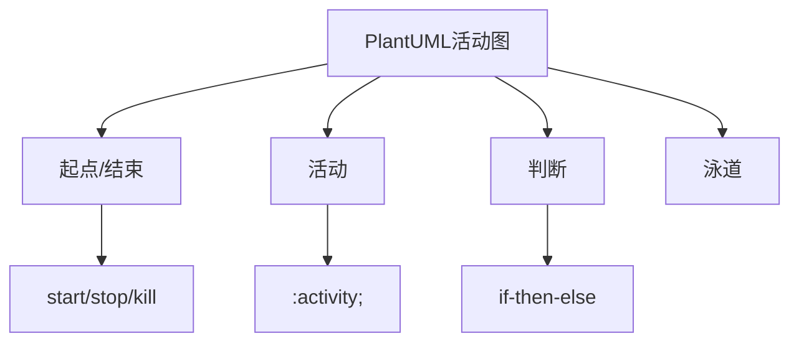

> **摘要** — PlantUML 是开源的 UML 绘图工具，支持活动图、时序图、类图等。活动图包含六个部分：起点、活动、判断、泳道、执行顺序、结束。语法简洁，基于文本描述生成图表，配合 VSCode/Sublime 插件可实时预览。



```markmap height=280
# PlantUML 活动图
## 组成要素
- 起点 / 活动 / 判断 / 泳道 / 结束
## 语法
- start / stop / kill / detach
- if-then-else 条件判断
- :activity; 活动描述
- 泳道 swimlane
## 工具
- VSCode 插件
- Sublime 插件
- 命令行 / Server
```

---

一般活动图包含一下几个部分

1.  起点
2.  活动
3.  判断
4.  泳道
5.  执行顺序
6.  结束

### 2.1 活动图示例

        下面就是一副以在充值 APP 上进行一次手机充值的活动图

![][img-2]

 三、如何使用 PlantUML 绘制[时序图](https://so.csdn.net/so/search?q=%E6%97%B6%E5%BA%8F%E5%9B%BE&spm=1001.2101.3001.7020)
-------------------------------------------------------------------------------------------------------------

### 3.1 开始 / 停止 / 结束 /

<table border="1" cellpadding="1" cellspacing="1"><tbody><tr><td>说明</td><td>语法</td></tr><tr><td>开始</td><td>start</td></tr><tr><td>结束</td><td>end</td></tr><tr><td>停止</td><td>stop</td></tr><tr><td>杀死活动</td><td>kill</td></tr><tr><td>摆脱活动</td><td>detach</td></tr></tbody></table>

#### 3.1.1 示例代码

```
!pragma useVerticalIf on
start
  if(条件A) then(yes)
   :条件A操作;
   detach
  elseif(条件B) then(yes)
   :条件B操作;
   kill
  else(default)
    : 默认操作;
  endif
stop
```

效果图：

![][img-3]

###  3.2 普通活动

   普通活动最简单几本语法就是

> : 活动说明;

### 3.3 条件选择

        条件选择主要就是 ifelse 和 switch

#### 3.3.1 if/else

  条件判断的语法格式是 if(...) then(...) elseif(...) else endif.

上文中的示例图就是基于 ifelse 条件选择

#### 3.3.3 switch

 switch 的语法格式如下：

```
start
switch(测试)
case (条件A)
:TextA;
case (条件B)
:TextB;
case (条件C)
:TextC;
endswitch
stop
```

![][img-4]

### 3.4 循环

        循环主要就是 while 和 repeat，goto 还是属于实验性质，效果不佳

#### 3.4.1 while

      下面示例就是 while 的基本语法

```
 start
    while(更多数据?) is(not empty)
     :读取数据;
     :生成图片;
     endwhile(empty)
    stop
```

![][img-5]

#### 3.4.2 repeat

下面示例就是 repeat 的基本语法

```
start
repeat
  :读取数据;
  :生成图片;
repeat while (更多数据?)
 
stop
```

![][img-6]

3.5 并行与分割
---------

#### 3.5.1 并行

可以使用`fork`，`fork again`和`end fork` 或者 `end merge` 等关键字表示并行处理。

首先看看简单的并行处理（fork .... fork again.... end fork）

```
start
fork
  :行为 A;
fork again
  :行为 B;
end fork {或}
stop
```

![][img-7]

 在看看合并以及结束子行为是如何处理的。

```
start
fork
  :行为 A;
fork again
  :行为 B;
  end
fork again
 :行为 C;
 detach
fork again
 :行为 D;
 stop
fork again
 :行为 E;
 kill
fork again
 :行为 F;
end merge
stop
```

![][img-8]

#### 3.5.2 分割

使用 `split`, `split again` 和 `end split` 关键字去表达分割处理，下文通过使用 split 来处理多输入和多输出。

```
'多输入'
split
-[hidden]->
 :行为 A;
split again
-[hidden]->
 :行为 B;
end split
 -[#green,dashed]->
:处理分发;
split
-[#blue]->
 :行为 A;
 kill
split again
 #red:行为 B;
 detach
split again
 end
split again
stop
end split
```

![][img-9]

3.6 泳道
------

泳道使用 “| 泳道名称 |” 来定义泳道

3.7 样式与颜色
---------

#### 3.7.1  改变活动颜色

对于活动的颜色可以 #颜色: 行为; 来改变行为颜色

>  #red: 行为 B;

#### 3.7.2 改变连接线颜色

可以使用 -[# 颜色, 线型]-> 来改变连接线类型和颜色

如：

```

<table border="1" cellpadding="1" cellspacing="1"><tbody><tr><td>语句</td><td>说明</td></tr><tr><td>-[#red,dashed]-&gt;</td><td>红色虚线</td></tr><tr><td>&nbsp;-[#blue,dotted]-&gt;</td><td>蓝色点状线</td></tr><tr><td>-[#red]-&gt;</td><td>红色实线</td></tr></tbody></table>
```


3.7.3 改变泳道颜色

> |#lightYellow | 用户 |

四、综合运用
------

 下一就是文章开头活动图的代码

```
@startuml
|#lightYellow|用户|
start
:输入手机号;
:选择话费套餐;
|#lightBlue|充值APP|
:生成，提交订单;
|#lightgray|服务商|
:生成订单;
|充值APP|
:展示支付方式;
|用户|
:选择支付方式;
:支付套餐金额;
|服务商|
:支付结果通知;
split
:更新订单状态;
|充值APP|
:展示支付结果;
|用户|
:获取支付结果;
kill
split again
 |服务商|
  -[dashed]->
 if(支付成功) then(成功)
 :向运营商发起充值请求;
 |#pink|运营商|
 :接收到充值请求;
 :执行充值;
 :通知充值结果;
 |服务商|
 :更新订单状态;
 |充值APP|
 :展示充值结果;
 |用户|
 :获取充值结果;
 floating note left #red:充值流程结束
  end
 else(失败)
 |服务商|
 :失败处理流程;
 kill
 
@enduml
```

[img-0]:https://csdnimg.cn/release/blog_editor_html/release2.1.4/ckeditor/plugins/CsdnLink/icons/icon-default.png?t=M5H6

[img-1]:images/03-01-plantuml-activity/p01.png

[img-2]:images/03-01-plantuml-activity/p02.png

[img-3]:images/03-01-plantuml-activity/p03.png

[img-4]:images/03-01-plantuml-activity/p04.png

[img-5]:images/03-01-plantuml-activity/p05.png

[img-6]:images/03-01-plantuml-activity/p06.png

[img-7]:images/03-01-plantuml-activity/p07.png

[img-8]:images/03-01-plantuml-activity/p08.png

[img-9]:images/03-01-plantuml-activity/p09.png
