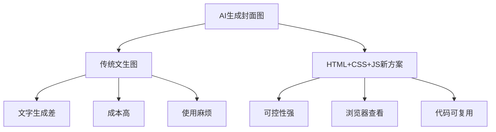

> **摘要** — 传统文生图模型生成封面图的痛点：文字控制差、成本高、使用麻烦。解决方案：利用 AI 大模型生成 HTML + CSS + JS 代码获得图片。优势：内容样式可控、浏览器直接查看、代码可复用快速生成同风格图片。



```markmap height=280
# DeepSeek 生成封面图
## 传统方案痛点
- 文字生成效果差
- 精细化控制困难
- 分辨率越高越慢
## 新工作流
- AI 生成 HTML + CSS + JS
- 生成内容和样式可控
- 浏览器直接查看
## 优势
- 修改代码即可调细节
- 无需开发环境
- 复用布局快速生成
```

---

每次公众号发文都需要制作文章封面图，原来我是通过这个网站 Cover View 制作每篇文章的封面，但是公众号封面的长宽比例比较特殊，大图是`2.35:1`, 缩略图是 `1:1`, 这个网站上并没有对应比例的模板，所以我一般使用 16:9 的比例制作封面，上传到公众号的时候再手动截图调整，截出来的图看起来并不美观，一些现成的微信公众号封面制作模板没有我想要的效果，就凑合用这个方式制作封面

![][img-1] 公众号封面图比例

可以看到每次文章封面都不太一样，实属不太美观

![][img-2]封面图

⛔ 难以精确控制的文生图模型
--------------

曾经我尝试使用文生图模型来生成封面图，可惜效果都不太理想，缺点很多：

*   文生图模型对文字生成能力一般，无法进行局部精细化控制
    
*   很多模型对文字生成的效果很糟糕
    
*   如果要进行精细化控制还得自己搭 Comfyui 等工具控制图片细节
    
*   分辨率越高的图片生成速度越慢
    
*   ......
    

相信用过文生图 AI 的朋友都有上面类似的体会，总结就是：**成本高、使用麻烦、效果不好**

✨ AI 助力新工作流
-----------

随着 AI 大模型写代码的能力不断提升，尤其是前端代码的生成能力，可以说十分惊艳，这给我们制作图片提供了一种新思路：

**让 AI 生成 HTML + CSS + JS 代码获得想要的图片**

这种方式有什么好处呢？

**1. 生成的图片内容和样式可控**

相比微调 AI 模型生成的图片，直接修改 HTML + CSS + JS 的代码要可控得多，即便对代码不熟悉的朋友，通过跟 AI 对话也可以快速调整生成的代码，AI 还会指出哪里发生了调整。

**2. 只要有浏览器就能查看图片**

因为生成代码只有 HTML + CSS + JS 代码，无需任何的开发环境，只要把文件丢到浏览器里就能运行

**3. 生成的代码可以不断复用**当你用 AI 生成好想要的封面图片的布局和样式，只要修改里面的具体内容就可以快速生成相同风格的图片

**4. 制作成本低廉**文生图模型基本都比文生文模型要贵得多，用这种方式制作一张图片可能才几分钱

正式教程前，先给大家看看几个 AI 生成的风格迥异的封面图，十分惊艳！

![][img-3]样例 1![][img-4] 样例 2![][img-5] 样例 3

🧾 教程
-----

### 提示词

打开 DeepSeek 官网，在对话框中输入以下提示词（基于归藏老师分享改造）：

```
# 公众号封面提示词

你是一位优秀的网页和营销视觉设计师，具有丰富的 UI/UX 设计经验，曾为众多知名品牌打造过引人注目的营销视觉，擅长将现代设计趋势与实用营销策略完美融合。
请使用 HTML 和 CSS 代码按照设计风格要求部分创建一个的微信公众号封面图片组合布局。我需要的设计应具有强烈的视觉冲击力和现代感。

## 基本要求：

- **尺寸与比例**：
- 整体比例严格保持为 3.35:1
- 容器高度应随宽度变化自动调整，始终保持比例
- 左边区域放置 2.35:1 比例的主封面图
- 右边区域放置 1:1 比例的朋友圈分享封面
- **布局结构**：
- 朋友圈封面文字要跟左边区域展示的文字一致
- 文字必须成为主封面图的视觉主体，占据页面至少 70%的空间
- 两个封面共享相同的背景色和点缀装饰元素
- 最外层卡片需要是直角
- **技术实现**：
- 使用纯 HTML 和 CSS 编写
- 如果用户给了背景图片的链接需要结合背景图片排版
- 严格实现响应式设计，确保在任何浏览器宽度下都保持 16:10 的整体比例
- 在线 CDN 引用 Tailwind CSS 来优化比例和样式控制
- 内部元素应相对于容器进行缩放，确保整体设计和文字排版比例一致
- 使用 Google Fonts 或其他 CDN 加载适合的现代字体
- 可引用在线图标资源（如 Font Awesome）
- 代码应可在现代浏览器中直接运行
- 提供完整 HTML 文档与所有必要的样式
- 最下方增加图片下载按钮，点击后下载整张图片

## 用户输入内容

- 公众号标题为：[一套提示词帮你实现封面自由！]

## 风格要求：奢华自然意境风

### 设计风格

- **高级沉稳色调**：暗调景观背景配以细腻光影，营造高端内敛氛围
- **意境式呈现**：不仅展示实景，更表达一种与自然共融的精神状态
- **奢华隐喻元素**：通过构图和文字暗示高端生活方式与品质追求
- **空间层次丰富**：通过前景、中景、远景的搭配创造空间深度感
- **东西方美学融合**：中式意境与西方现代摄影美学的和谐结合
- **沉浸式体验设计**：画面设计引导观者产生身临其境的感受

### 文字排版风格

- **悬浮式标题定位**：文字悬浮于景观之上，形成虚实对比
- **中西文混合排版**：英文与中文标题组合使用，增强国际化气质
- **层级分明的字阶**：主标题、副标题和说明文字尺寸差异明显
- **优雅字体选择**：英文多用细腻的衬线体，中文选用简约现代字体
- **巧妙的文字拆分**：文字的艺术性拆解处理
- **留白与文字平衡**：大面积留白中点缀核心文字，强化重点信息
- **边缘式辅助信息**：次要文字信息常放置于画面边缘，不干扰主视觉

### 视觉元素风格

- **摄影级光影处理**：专业摄影级别的光线捕捉，展现自然光影魅力
- **景深虚化技巧**：背景适度虚化，突出主体，增强画面层次感
- **半透明叠加处理**：文字与背景间常有微妙的半透明效果
- **隐性品牌符号**：品牌元素融入自然场景，不刻意张扬
- **导航指示符号**：左右导航箭头简洁统一，融入整体设计
- **水墨意境渲染**：部分元素带有东方水墨画的意境处理
- **大气构图法则**：遵循三分法或黄金分割构图，画面大气平衡


```

不需要深度思考和联网查询，反选掉这两个选项

![][img-6]deepseek

DeepSeek 后生成的代码如下，我们在本地创建一个空白的 html 文件，将下面的代码粘贴进去

```
<!DOCTYPE html>
<html lang="zh-CN">
<head>
    <meta charset="UTF-8">
    <meta >
    <title>微信公众号封面设计</title>
    <script src="https://cdn.tailwindcss.com"></script>
    <link rel="stylesheet" href="https://cdnjs.cloudflare.com/ajax/libs/font-awesome/6.4.0/css/all.min.css">
    <link href="https://fonts.googleapis.com/css2?family=Noto+Serif+SC:wght@400;700&family=Playfair+Display:wght@700&display=swap" rel="stylesheet">
    <style>
        body {
            font-family: 'Noto Serif SC', serif;
            background-color: #f5f5f5;
            padding: 20px;
        }
        .container {
            max-width: 1200px;
            margin: 0 auto;
        }
        .cover-container {
            aspect-ratio: 3.35 / 1;
            display: flex;
            background-color: #1a1a1a;
            box-shadow: 010px30pxrgba(0, 0, 0, 0.3);
            position: relative;
            overflow: hidden;
        }
        .main-cover {
            flex: 2.35;
            position: relative;
            overflow: hidden;
        }
        .main-cover::before {
            content: '';
            position: absolute;
            top: 0;
            left: 0;
            right: 0;
            bottom: 0;
            background: linear-gradient(135deg, rgba(0,0,0,0.3) 0%, rgba(0,0,0,0.7) 100%);
            z-index: 1;
        }
        .main-cover-bg {
            position: absolute;
            width: 100%;
            height: 100%;
            object-fit: cover;
            opacity: 0.9;
        }
        .main-content {
            position: relative;
            z-index: 2;
            height: 100%;
            display: flex;
            flex-direction: column;
            justify-content: center;
            padding: 05%;
        }
        .title-en {
            font-family: 'Playfair Display', serif;
            font-size: 1.8vw;
            color: rgba(255, 255, 255, 0.7);
            letter-spacing: 0.3em;
            margin-bottom: 0.5vw;
            text-transform: uppercase;
        }
        .title-cn {
            font-size: 3.5vw;
            font-weight: 700;
            color: white;
            line-height: 1.3;
            margin-bottom: 1.5vw;
            text-shadow: 02px10pxrgba(0, 0, 0, 0.5);
        }
        .subtitle {
            font-size: 1.2vw;
            color: rgba(255, 255, 255, 0.8);
            line-height: 1.6;
            max-width: 70%;
            border-left: 2px solid rgba(255, 255, 255, 0.3);
            padding-left: 1.5vw;
        }
        .decoration {
            position: absolute;
            z-index: 1;
        }
        .decoration-1 {
            top: 10%;
            right: 5%;
            width: 15vw;
            height: 15vw;
            border: 1px solid rgba(255, 255, 255, 0.1);
            transform: rotate(45deg);
        }
        .decoration-2 {
            bottom: 15%;
            left: 5%;
            width: 8vw;
            height: 8vw;
            border: 1px solid rgba(255, 255, 255, 0.1);
            transform: rotate(15deg);
        }
        .share-cover {
            flex: 1;
            position: relative;
            overflow: hidden;
            display: flex;
            align-items: center;
            justify-content: center;
        }
        .share-content {
            width: 80%;
            height: 80%;
            position: relative;
            display: flex;
            flex-direction: column;
            justify-content: center;
            align-items: center;
            text-align: center;
        }
        .share-title-en {
            font-family: 'Playfair Display', serif;
            font-size: 1.2vw;
            color: rgba(255, 255, 255, 0.7);
            letter-spacing: 0.3em;
            margin-bottom: 0.5vw;
            text-transform: uppercase;
        }
        .share-title-cn {
            font-size: 2vw;
            font-weight: 700;
            color: white;
            line-height: 1.3;
            margin-bottom: 1vw;
            text-shadow: 02px10pxrgba(0, 0, 0, 0.5);
        }
        .share-qrcode {
            width: 6vw;
            height: 6vw;
            background-color: rgba(255, 255, 255, 0.1);
            display: flex;
            align-items: center;
            justify-content: center;
            margin-top: 1vw;
        }
        .share-qrcodei {
            color: rgba(255, 255, 255, 0.5);
            font-size: 3vw;
        }
        .download-btn {
            margin-top: 20px;
            background-color: #333;
            color: white;
            border: none;
            padding: 10px20px;
            font-size: 16px;
            cursor: pointer;
            transition: all 0.3s;
            display: flex;
            align-items: center;
            justify-content: center;
        }
        .download-btn:hover {
            background-color: #555;
        }
        .download-btni {
            margin-right: 8px;
        }
        @media (max-width:768px) {
            .cover-container {
                flex-direction: column;
                aspect-ratio: 1 / 1.5;
            }
            .main-cover {
                flex: 2;
            }
            .share-cover {
                flex: 1;
            }
            .title-en {
                font-size: 3.5vw;
            }
            .title-cn {
                font-size: 6vw;
            }
            .subtitle {
                font-size: 2.5vw;
                max-width: 90%;
            }
            .share-title-en {
                font-size: 2.5vw;
            }
            .share-title-cn {
                font-size: 4vw;
            }
            .share-qrcode {
                width: 12vw;
                height: 12vw;
            }
            .share-qrcodei {
                font-size: 6vw;
            }
        }
    </style>
</head>
<body>
    <div class="container">
        <div class="cover-container">
            <!-- 主封面区域 -->
            <div class="main-cover">
                
                <div class="decoration decoration-1"></div>
                <div class="decoration decoration-2"></div>
                <div class="main-content">
                    <div class="title-en">Prompt Design</div>
                    <div class="title-cn">一套提示词帮你实现封面自由！</div>
                    <div class="subtitle">掌握AI视觉表达的核心方法论，创作属于你的奢华意境风格作品</div>
                </div>
            </div>

            <!-- 朋友圈分享封面区域 -->
            <div class="share-cover">
                
                <div class="share-content">
                    <div class="share-title-en">Prompt Design</div>
                    <div class="share-title-cn">一套提示词帮你实现封面自由！</div>
                    <div class="share-qrcode">
                        <i class="fas fa-qrcode"></i>
                    </div>
                </div>
            </div>
        </div>

        <button class="download-btn" onclick="downloadCover()">
            <i class="fas fa-download"></i> 下载封面图片
        </button>
    </div>

    <script>
        function downloadCover() {
            // 在实际应用中，这里应该使用html2canvas或其他库来生成图片
            alert('在实际应用中，这里会使用html2canvas库将封面转换为图片并下载。\n\n由于这是一个演示，下载功能未完全实现。');
        }
    </script>
</body>
</html>


```

### 微调代码

每次生成的代码有一定随机性，例如上面的例子就没有实现下载图片的功能，我们继续用对话的方式微调

![][img-7]deepseek 微调

通过两次对话基本成型，打开代码修改部分文字内容就可以当封面使用

![][img-8]deepseek 生成封面图

比例完美适配~ 妈妈再也不用担心我公众号文章封的制作了

![][img-9]公众号文章封面

📒 总结
-----

以前我们只能用各种网页模板或者 PS 等专业图片软件来制作图片，AI 时代，打开了一种图片制作的全新思路：**让 AI 生成个性化的前端代码制作图片**

以前这么做效率太低，还需要有大量的专业知识，现在即便不懂代码的人（当然懂代码更得心应手），通过提示词和 AI 几轮对话就能以极低的成本制作出个性化的图片，而且任何对话模型都可以实现这种方式的图片生成

通过上面的教程的教程，我们可以举一反三制作各种定制化长宽比例和风格的封面例如：

*   小红书封面
    
*   推特 OG 图
    
*   B 站视频封面
    
*   抖音视频封面
    
*   .......
    

其实不仅仅是封面制作，是否一些简单的动画效果也可以通过这种方式生成 gif 图呢？留给大家自己探索，也欢迎读者朋友跟我分享自己的经验

[img-0]:images/04-02-deepseek-cover/p01.jpg

[img-1]:images/04-02-deepseek-cover/p02.jpg

[img-2]:images/04-02-deepseek-cover/p03.jpg

[img-3]:images/04-02-deepseek-cover/p04.jpg

[img-4]:images/04-02-deepseek-cover/p05.jpg

[img-5]:images/04-02-deepseek-cover/p06.jpg

[img-6]:images/04-02-deepseek-cover/p07.jpg

[img-7]:images/04-02-deepseek-cover/p08.jpg

[img-8]:images/04-02-deepseek-cover/p09.jpg

[img-9]:images/04-02-deepseek-cover/p10.jpg
