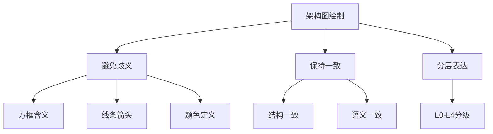

> **摘要** — 架构图绘制 12 条实践指南：避免方框/线条/颜色歧义、避免单独元素、避免缩略语含糊、保持层级一致性等。L0-L4 分层框架帮助清晰表达架构，SalesForce 分为文档实现类和市场销售类。核心原则：结构一致性、语义一致性、有图示说明、使用 UML 标准。



```markmap height=280
# 架构图绘制指南
## 12条实践指南
- 方框/形状含义明确
- 线条/箭头语义清晰
- 颜色使用有文档说明
- 避免单独元素
- 避免含糊缩略语
- 保持层级一致性
## L0-L4 分层
- SalesForce 分类框架
- Documentation vs Implementation
- Marketing / Strategy / Sales
## 实践原则
- 结构一致性
- 语义一致性
- 图示说明
- UML 标准
```

---

如果有一些点没有注意，会让图的自我表达变差。

1.  1. 方框或其他形状表示什么意思？随意使用方框或其他形状可能会引起误解。
    
2.  2. 形状的边线表示什么意思？虚线、点线等多种形状的边线可能会引起误解。
    
3.  3. 线条或箭头表示什么意思？线条或箭头可以被理解为数据流，也可以表示元素间的关系（比如组件 A 依赖组件 B）。
    
4.  4. 线条或箭头表示哪一种类型的交互或关联？交互类型有流程、数据流，关联类型有依赖、继承、实现等。
    
5.  5. 颜色代表什么意思？一般颜色在架构图里的作用不是非常大，如果使用了多种颜色的架构图却没有适当的文档说明很容易引起误解。
    
6.  6. 不应该单独的元素或实体，不管是从结构还是从行为角度来看，每一个元素或实体都应该依赖系统的其他部分，或者与它们之间存在某些联系。
    
7.  7. 费解的缩略语或含糊不清的名词，切忌使用费解缩略语（HQ/MQ）、含义不清的名称（业务流程、通用模块等可以更具体），这样容易引起困惑。
    
8.  8. 表达内容是与受众关注的重要信息，比如是个业务流程图，不应该包含无关紧要的技术实现细节。一些技术实现
    
9.  9. 在同一个架构图里混杂运行时元素和静态元素。例如运行时的状态流转图，不要与静态数据结构图放一起，导致表达不清晰，可以分开两张图表达。
    
10.  10. 试着把所有必要的信息都包含在架构图里，而不是事后加以说明，不然容易丢关键信息。
    
11.  11. 层级冲突或混合抽象，在同一个架构图里添加不同层级的抽象可能会导致冲突的出现，例如，把组件添加到上下文架构图里，或者把类加到部署图里。
    
12.  12. 使用混乱或含糊不清的架构图表达过量的信息或无效的细节，需要谨慎地选择信息的层级和粒度。
    

实践指南
----

1.  1. 保持架构图的结构一致性和语义一致性，也会让整张图的逻辑非常严谨。方框、形状、边框、线条、颜色等在一张图内，一种情况，在一张图内表达的语义必须是一致的，没有二义性。更好的情况，是整个公司内做好规范，这些定义在同一类图里是一个语义。
    
2.  2. 图上有图示说明，注明每个架构图元素的用意（比如方框、形状、边框、线条、颜色、缩略语，等等）。
    
3.  3. 使用业内标准的架构描述语言，如 UML，按其标准定义来制作。
    

5.  例如：  
    
6.  ![][img-1]  
    

架构图分级 L0～L4
-----------

核心是要有统一的分级的框架结构，下面给大家看一些实践的分级案例。

（PS：这里可以说很多，时间有点不够简单列一列）  

### SalesForces 的分级框架

SalesForce 把图分为两类：偏文档说明和实现（Documentation & Implementation）, 偏市场、销售策略（Marketing, Strategy & Sales）

1.**Marketing, Strategy & Sales**

*   **Purpose**: Help viewers understand concepts or a vision for a solution.
    
*   **Audience**: Business & Executive Stakeholders, Technical Influencers
    

![][img-2]

**2.Documentation & Implementation**

**Purpose:** Help viewers understand an implementation or product-related technical detail.

**Audience:** Delivery Teams, Technical Stakeholders

![][img-3]

**四级框架 Level1~Level4**

![][img-4]

明确图表的意图和受众，决定什么样的细节最能支持你的目的，使用 “分级” 的概念来帮助将不同的细节划分为易于选择的类别。选择合适的级别可以看清楚一些的细节，使是高度复杂的图表也可以很容易地让查看。当您从 Level 1 级看到 Level 4 级时，可以放大更大的细节级别，更细的粒度。

更详细的可以看原文链接：https://architect.salesforce.com/diagrams/framework/overview

一些现成的 Demo 链接：https://architect.salesforce.com/diagrams#template-gallery

### 某大厂的分级框架

![][img-5]

### 按架构分层来定义

1  

![][img-6]

  
2

![][img-7]

1.  基本跟应用整体的分层逻辑对应，上面给了两个分层逻辑。
    

3.  1. L0 是业务线的全局架构；
    
4.  2. L1 是中台 / 平台级别；
    
5.  3. L2 是领域级别，用户、会员、互动营销、员工；
    
6.  4. L3 是应用 / 模块级别；
    

这里的粒度可以根据公司和组织架构情况做一些适当调整，例如公司有时候会进行团队拆分和合并，比如把员工、帐号、权限合成一个大的基础团队，这里你会发现团队不管怎么拆合，员工、帐号这个领域级别是相对稳定的，可以以个相对稳定的级别做基准，再做适度上下分级，让每个级别的图有一个对应的团队负责维护是比较合适的。可以更好得长期更新维护架构图，让其能与真实的系统情况保持一致。

[img-0]:images/05-01-architecture-layers/p01.png

[img-1]:images/05-01-architecture-layers/p02.png

[img-2]:images/05-01-architecture-layers/p03.png

[img-3]:images/05-01-architecture-layers/p04.png

[img-4]:images/05-01-architecture-layers/p05.png

[img-5]:images/05-01-architecture-layers/p06.png

[img-6]:images/05-01-architecture-layers/p07.png

[img-7]:images/05-01-architecture-layers/p08.png
