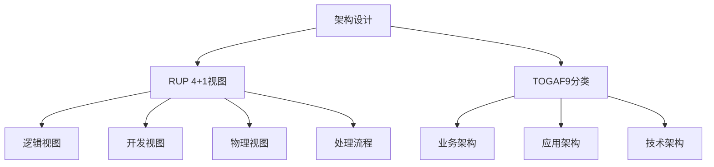

> **摘要** — 架构设计方法论：RUP 4+1 视图（逻辑、开发、物理、处理流程）和 TOGAF9 架构分类（业务、应用、数据、技术、代码、部署）。业务架构是战略，应用架构是战术，技术架构是装备。4A 视图：战略目标→业务功能→组织结构→业务流程→业务数据。



```markmap height=280
# 架构三部曲
## RUP 4+1 视图
- 逻辑视图：功能拆解
- 开发视图：模块划分
- 物理视图：硬件部署
- 处理流程：通信时序
## TOGAF9 分类
- 业务架构：战略
- 应用架构：战术
- 技术架构：装备
## 4A 视图
- 为什么干：战略目标
- 干什么：业务功能
- 谁来干：组织结构
- 怎么干：业务流程
```

---

**一、架构设计方法的分类**(http://ksria.com/simpread/) 转码， 原文地址 [mp.weixin.qq.com](https://mp.weixin.qq.com/s?__biz=Mzg2NTkxOTEzMw==&mid=2247484786&idx=1&sn=e8794f992bdb459bb53bceefea8e931d&chksm=cff527d5ce90136c4f20c499385f44e9898bc8d618f78326ffd7ece686122277eeb27a211468&mpshare=1&scene=1&srcid=091265vPJ3fmBMDJXlExKciN&sharer_shareinfo=1c856c94864e55251fc9e08a9f12d020&sharer_shareinfo_first=a671f340ac5b67dab1da9131af024d31#rd)

**一、架构设计方法的分类**

在 EA 架构领域，有两种常见架构方法 RUP 和 TOGAF，这两个框架也是我们常常了解架构分类的两个维度。

**RUP4+1 架构视图**

1995 年，Philippe Kruchten 在《IEEE Software》上发表了题为《The 4+1 View Model of Architecture》的论文，引起了业界的极大关注，并最终被 RUP 采纳。即 RUP4+1 架构方法。该方法主要采用用例驱动，在软件生命周期的各个阶段对软件进行建模, 从不同视角对系统进行解读，从而形成统一软件过程架构描述。该方法的不同架构视图承载不同的架构设计决策，支持不同的目标和用途。

逻辑视图：用于描述系统软件功能拆解后的组件关系, 组件约束和边界, 反映系统整体组成与系统如何构建的过程。关注功能和逻辑层。

开发视图：描述系统的模块划分和组成, 以及细化到内部包的组成设计, 服务于开发人员, 反映系统开发实施过程。

物理视图：描述软件如何映射到硬件，反映系统在分布方面的设计，系统的组件是如何部署到一组可计算机器节点上, 用于指导软件系统的部署实施过程。

处理流程视图：用于描述系统软件组件之间的通信时序, 数据的输入输出, 反映系统的功能流程与数据流程, 通常由时序图和流程图表示。关注进程、线程、对象等运行时概念以及相关的并发、同步、通信等问题。

运用 4+1 视图方法：针对不同需求进行架构设计。

![][img-0]

**TOGAF9 架构分类**

TOGAF9 来对架构分类：

![][img-1]

由于不同架构方法论，定义的架构分类也不同，RUP4+1 架构方法主要是以架构生命周期为视角进行描述，而 TOGAF9 按架构涉及内容维度来描述。因此我结合两者细分为业务架构、应用架构、数据架构、技术架构, 代码架构, 部署架构。

TOGAF 即 The Open Group Architecture Framework （开放组体系结构框架），是由致力于技术标准制定和推广的非盈利组织 The Open Group 制定的用于开发企业架构（Enterprise Architecture）的一套方法和工具。

![][img-2]

业务架构是战略，应用架构是战术，技术架构是装备。其中应用架构承上启下，一方面承接业务架构的落地，另一方面影响技术选型。熟悉业务，形成业务架构，根据业务架构，做出相应的应用架构，最后技术架构落地实施。

![][img-3]

### **二、架构 4A 视图详解**

TOGAF 的架构模型

· 为什么干——战略目标、业务动机

· 干什么——业务功能、业务能力

· 谁来干——组织结构、业务角色

· 怎么干——业务流程、业务规则

· 用到的数据——业务数据

· 用到的应用——应用系统

· 用到的技术——技术设施

企业 4A 架构  

4A 架构关键词：

**业务架构：**战略，价值链，端到端，业务流程，业务组件，自上而下分解

**应用架构：**系统建设，系统集成，中台，自下而上抽象

**技术架构：**技术选型，框架，PaaS 平台，云原生，DevOps，微服务，容器化，部署架构

**数据架构：**数据标准，数据采集加工，数据入湖，数据治理，数据共享服务，数据安全，数据质量，数据架构

4A 架构之间的关系如图：

![][img-4]

![][img-5]

1. 业务架构：

目的：根据企业战略，以价值链梳理分析业务开展流程，识别上下游依赖关系，从业务和产品的视角，描述整个平台或者产品的实现

设计步骤：

1.  1. 识别战略，走访业务部门，问卷调查
    
2.  2. 外部因素，根据宏观背景（风口），行业空间（天花板），竞争情况（赛道），上下游产业链做规划
    
3.  3. 内部因素，根据商业模式，技术壁垒和资源投入进行规划
    

如何绘制业务架构图：

一理场景画流程，二列页面和模块，三把功能来聚类，四五纵横法上阵

![][img-6]

2. 应用架构

目的：支持业务和数据处理需要哪些应用系统，完成从业务到 IT 的转换

设计步骤：

1.  1. 根据业务架构图，做业务到 IT 的转换，识别应用程序和组件 （上接业务）
    
2.  2. 优化应用程序和组件，该拆分就拆分，该聚合就聚合 （核心设计）
    
3.  3. 设计应用与业务功能，流程，数据的关系（核心设计）
    
4.  4. 设计应用集成，交互，开发 （下接开发）
    

如何绘制应用架构图：![][img-7]

3. 技术架构  

目的：支持应用系统所需的技术架构，技术组件，技术选型

设计步骤：

1.  1. 根据应用架构，进行技术支撑分析，识别技术支撑的必要条件
    
2.  2. 技术选型，包括开发架构，技术产品，开发技术栈，开发平台，运行平台
    
3.  3. 技术影响分析，成本，难易度，规划，治理
    

如何绘制技术架构图：

![][img-8]

4. 数据架构

目的：描述企业数据来源，数据资产管理，数据治理，数据共享开放

设计步骤：

1.  1. 上接业务，分析数据需求，识别数据类型，采集数据
    
2.  2. 数据模型设计，概念模型（识别业务域），逻辑模型（实体关系 ER），物理模型（表字段）
    
3.  3. 数据治理，数据安全合规，数据质量管理
    
4.  4. 数据共享开放，支撑业务决策，业务创新
    

如何绘制数据架构图：![][img-9]

### **三、架构 4+1 视图详解**

### 01 逻辑视图

用于描述系统的功能需求，即系统给用户提供哪些服务；以及描述系统软件功能拆解后的组件关系、组件约束和边界，反映系统整体组成与系统如何构建的过程。

下面 springcloud 微服务的逻辑视图示例（仅部分），就描述了 springcloud 中各个功能组件。从这个图中，基本可以对 springcloud 有一个大颗粒度的了解。

![][img-10]

### 02 物理视图

开发出的软件系统，最终是要运行在物理或软件环境上。物理环境可能是服务器、PC 机、移动终端等物理设备；软件环境可以是虚拟机、容器、进程或线程。部署视图就是对这个部署信息进行描述。在 UML 中通常由部署图表示。

![][img-11]

### 03 进程视图

处理视图，又称过程视图、运行视图。用于描述系统软件组件之间的通信时序，数据的输入输出。在 UML 中通常由时序图和流程图表示，如下图所示：

![][img-12]

### 04 开发视图

开发视图关注的是架构如何指导开发流程，在这个视图中，软件系统会被分解成小的子程序或软件包，并为每个子程序或软件包定义接口。系统设计人员会根据这些分解的子程序和软件包分配工作内容。

![][img-13]

### 05 场景视图

场景视图是 4+1 架构模型中最重要的视图，其他 4 个视图都是以场景视图为核心的。它用于描述系统的参与者与功能用例间的关系，反映系统的最终需求和交互设计。在 UML 中通常由用例图表示：

![][img-14]

[img-0]:images/05-02-architecture-trilogy/p01.jpg

[img-1]:images/05-02-architecture-trilogy/p02.jpg

[img-2]:images/05-02-architecture-trilogy/p03.jpg

[img-3]:images/05-02-architecture-trilogy/p04.jpg

[img-4]:images/05-02-architecture-trilogy/p05.jpg

[img-5]:images/05-02-architecture-trilogy/p06.jpg

[img-6]:images/05-02-architecture-trilogy/p07.jpg

[img-7]:images/05-02-architecture-trilogy/p08.jpg

[img-8]:images/05-02-architecture-trilogy/p09.jpg

[img-9]:images/05-02-architecture-trilogy/p10.jpg

[img-10]:images/05-02-architecture-trilogy/p11.jpg

[img-11]:images/05-02-architecture-trilogy/p12.jpg

[img-12]:images/05-02-architecture-trilogy/p13.jpg

[img-13]:images/05-02-architecture-trilogy/p14.png

[img-14]:images/05-02-architecture-trilogy/p15.png
