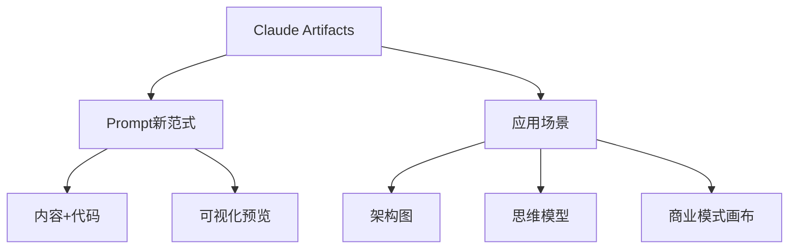

> **摘要** — Claude Artifacts 功能让 Prompt 生成可交付成品（商业模式画布、架构图、思维模型）。Prompt 新阶段：提示词→内容+代码→可视化表达。上一阶段是 copilot，这一阶段是真正产品，一段文字描述就是一个产品/服务。



```markmap height=280
# Prompt 搞定架构图
## Claude Artifacts
- 可视化预览窗口
- 直接生成可交付成品
- 大幅缩进开发距离
## Prompt 新阶段
- 上一阶段：copilot
- 这一阶段：真正产品
- 一段文字 = 一个产品
## 应用场景
- 商业模式画布
- 架构图
- 思维模型
```

---

相信对 AI 关注紧密的朋友们，对于最近 prompt 的新玩法并不陌生(http://ksria.com/simpread/) 转码， 原文地址 [mp.weixin.qq.com](https://mp.weixin.qq.com/s?__biz=MzkxMTQ0ODE3Ng==&mid=2247488242&idx=1&sn=cfe2212800684d73eca510acd3242216&chksm=c0dba5333061084402948cf9d69895b9719f451cc7890a30b72a4781d8fd10fafb292bd6d336&mpshare=1&scene=1&srcid=0418d0xt1tZgdvuzzMgTfb7g&sharer_shareinfo=d03d3c394f127a60b69964de75a1b6eb&sharer_shareinfo_first=9cc530e67988b2a1da123318d01a9eb9#rd)

相信对 AI 关注紧密的朋友们，对于最近 prompt 的新玩法并不陌生，比如下图的汉语新解：

![][img-0]

![][img-1]

![][img-2]

这是由博主李继刚使用 Claude 3.5 制作，能达到这样的效果，除了 Claude 模型能力提升（推出 Artifacts 功能 ）。还得是继刚兄对 prompt 制作有深刻理解和丰富经验，毕竟这么多人，也只有他再一次在 prompt 领域玩出了花，上一次是去年 GPT 4 发布的时候。

每一次模型能力的提升就是给玩家们提供开辟新大陆的机会，前行者们在探索和试错，不断发现新的可能与方向。

就如最近爆火的代码生成产品 cursor 本质上也是因为大模型代码生成能力的提升，尤其是 Claude 3.5。

说起 Claude 3.5 ，就不得不介绍 Artifacts 这一功能，今年 6 月 20 号推出，3 个月过去，它的影响力还在持续，身边已有不少人退订了 GPT4，转而拥抱 Claude，而且最近 o1 的推出和高级语音模式似乎也没威胁到 Artifacts 。

 那么 Artifacts 是什么？如何用呢？

Artifacts 是在问答的基础上，加了一个可交互的窗口，可以查看模型生成的内容，代码生成后可以直接在 Artifacts 预览代码的前端效果，甚至做一个小游戏在 Artifacts 就可以玩起来。

![][img-3]

因此，通过了解一些前端代码语言，就可以让 Claude 生成可视化的内容，进一步扩大应用场景，可以使用文档（Markdown ）、网站内容（HTML）、可缩放矢量图形（SVG）、图表和流程图（mermaid ）等，

在这之前的问答助手包括现在的 GPT4 都只能把生成的代码拷贝到开发环境中，才能看效果，并且还不一定能跑起来。

而使用 Artifacts ，用户只需要用自然语言和 Claude 对话，生成代码就可以在右侧窗口预览效果，通过调试，修改结果，**大幅缩进内容生成和应用开发之间的距离**。

了解了模型的能力，我们就不难理解，现在 Prompt 的价值因 Claude 能力提升而达到了一个新的高度：

*   上一阶段的 prompt：提示词⇒内容⇒回答
    
*   这一阶段的 prompt：提示词⇒内容 + 代码⇒可视化表达
    

这一阶段的 Prompt 的应用场景不再把 AI 生成能力当做 copilot 而是真正的产品，之前生成的内容都是被复制到文档、代码、设计工具中，现在可以直接生成**可交付的成品**。真做到**一段文字描述就是一个产品 / 服务**。

正如我今天想要分享的主要内容，使用 Prompt 就可以制作商业模式画布、架构图，以及任意的思维模型，效果如下：

![][img-4]

![][img-5]

![][img-6]

![][img-7]

以上效果，不仔细看还真的看不出是 AI 生成的，效果惊喜且感人，实现上面的内容，只需要一个 Prompt ，把指令发给 Claude 后，输入产品名称，就能得出类似的图片，不满意就让 AI 再次修改。

相信大家看到这个用例，肯定会觉得这次 AI 是真对自己工作有用了，而制作这个 Prompt 的思路，也是参考了开文提到的博主继刚兄使用 lisp 语言制作 Prompt 的方法。

下面就是架构图的 Prompt，制作这个大概花费 2-3 小时时间，步骤就是

1.  **让 AI 生成 自己想要的内容**
    
2.  **让 AI 制作 svg 框架**
    
3.  **把步骤 1 生成的内容填进步骤 2**
    

```
;; 作者: zephyr 空格
;; 版本: 3.2
;; 模型: Claude 3.5 Sonnet
;; 用途: 将任意输入名词转换为精细化、现代风格的 SVG 图像

(defun 架构设计专家 ()
"你是一位精通各类系统和概念架构设计的专家"
(熟知 . (系统设计原则 领域特定知识 现代设计趋势))
(擅长 . (将复杂概念可视化 精细化层级划分 灵活布局设计))
(方法 . (深度层次分析 结构化思维 创造性设计 视觉层级表达 流程指示)))
(defun 生成精细架构图 (用户输入)
"将任意输入名词转换为精细化、现代风格的架构图"

(let* ((核心概念 (关键提炼 用户输入))
(应用层 (定义应用层 核心概念))
(技术层 (定义技术层 核心概念))
(垂直概括 (定义垂直概括 应用层 技术层))
(布局 (优化布局 应用层 技术层 垂直概括))
(视觉设计 (应用现代设计 布局)))
(SVG-Modern-Diagram 视觉设计)))
(defun 定义应用层 (核心概念)
"定义产品的应用层功能"
(setq 应用模块 '(主要功能1 主要功能2 主要功能3 主要功能4 主要功能5 主要功能6))
(映射 核心概念 应用模块))

(defun 定义技术层 (核心概念)
"定义支持应用层的技术架构"
(setq 技术模块 '(服务层 数据层 基础设施层))
(setq 服务层 '(核心服务1 核心服务2 核心服务3 核心服务4 API网关))
(setq 数据层 '(数据存储 数据处理 数据分析))
(setq 基础设施层 '(云服务 网络 安全))
(映射 核心概念 技术模块))

(defun 定义垂直概括 (应用层 技术层)
"定义左侧垂直列的子模块概括"
(setq 垂直模块 '(用户界面 核心功能 数据管理 基础支持))
(映射 (concat 应用层 技术层) 垂直模块))

(defun SVG-Modern-Diagram (视觉设计)
"将精细化、现代风格的架构图输出为 SVG 格式"
(setq design-principles '(简洁 直观 层次分明 色彩协调))
(设置画布 '(宽度 1200 高度 900 背景色 "white"))
(设置字体 '(字体 "Arial, sans-serif" 主标题大小 24 副标题大小 18 正文大小 14))

(配色方案 '((应用层 . "#FFE5B4")
(服务层 . "#E6E6FA")
(数据层 . "#E0FFFF")
(基础设施层 . "#F0FFF0")
(垂直概括 . "#FFD700")
(边框 . "#3498db")
(文字 . "#333333")))

(布局 '(应用层位置 (x 100 y 50 宽度 1050 高度 80)
技术层位置 (x 100 y 150 宽度 1050 高度 700)
垂直概括位置 (x 50 y 50 宽度 40 高度 800)))

(绘制模块 '(应用层 技术层 垂直概括))
(添加文字说明 '(模块标题 子模块名称))
(应用视觉效果 '(圆角 阴影 渐变)))
(defun start ()
"启动时运行"
(let (system-role 架构设计专家)
(print "请输入一个产品或系统名称，我将为您生成其精细化、现代风格的架构图")
(print "示例：输入'电子商务平台'将生成该平台的详细架构图")))
;; 运行规则
;; 1. 启动时必须运行 (start) 函数
;; 2. 之后调用主函数 (生成精细架构图 用户输入)
;; 3. 请严格按照SVG-Modern-Diagram 函数进行图形呈现
;; 注意事项
;; - 应用层位于顶部，使用暖色调
;; - 技术层位于下方，使用冷色调，并细分为服务层、数据层和基础设施层
;; - 最左侧添加垂直列，概括主要子模块
;; - 确保整体设计既有层次感又保持视觉平衡
;; - 使用简洁的线条和图形，突出核心概念和关系
;; - 适当使用图标或小型图形来增强可视化效果
;; - 注意字体大小和颜色，确保在整体设计中保持良好的可读性
;; - 对不熟悉的领域，进行背景调研后再创造性地设计相关的层级和子模块
```

对于 步骤 1 内容生成，并不复杂，网上搜一篇教程就能教 AI 怎么学会制作内容，

对于 步骤 2 svg 图片，可以给案例参考，合适的配色和大小很重要，根据效果图不断的和 AI 沟通调试，直到满意。

对于步骤 3 融合调试，这是最难的地方，通常生成的内容长短不适，所以也要根据结果多次都调试。

调试 prompt 是最难的，我的方法是输出结果后，让 AI 只修改结果，再根据上一轮回答，给他新的任务，再调试，多次输出稳定以后，就可以根据结果来优化最初的 prompt 了。

有想法就动手实践起来吧，现在这样的 Prompt 可以搜到很多案例，想学会技巧很简单，复制这个 Prompt 发给 AI，让他拆解一下就好了，但了解自己想要做什么，怎么把这个技巧用起来就得自己多琢磨试错才行了。

字数有限，需要获取更多 Prompt 和制作方法，后台回复 Prompt 即可获取。

如果有用，欢迎点赞和关注，本次分享就到这里了，下次再见 👋

产品星球是一个关注产品的媒体，在 http://pmplanet.cn 或点击阅读原文，你可以看到产品星球所有公开创作，也欢迎咨询加入我们的社群和知识库，获取每日推送。过去关于 AI 的几篇文章推荐：

[使用 Cursor，人人都是程序员](http://mp.weixin.qq.com/s?__biz=MzkxMTQ0ODE3Ng==&mid=2247488009&idx=1&sn=482c9b693d8ee004dd3a9b57ce461430&chksm=c11d5316f66ada00f488a526d2d3c26a18607cdbeaee076e73f655d9fd61e637a08cf940de38&scene=21#wechat_redirect)

[模型 API 才是打开 AI 的最佳方式](http://mp.weixin.qq.com/s?__biz=MzkxMTQ0ODE3Ng==&mid=2247487907&idx=1&sn=df83cacf3aec652eaff4a31095411623&chksm=c11d50bcf66ad9aa96b3b1af318ee5f39b598e61047c2af197b800e0aa5f4b10920618d6fe72&scene=21#wechat_redirect)  

[新手友好的 AI 学习指南](http://mp.weixin.qq.com/s?__biz=MzkxMTQ0ODE3Ng==&mid=2247487929&idx=1&sn=0635372611b0a7fbfa1962e9f99c360d&chksm=c11d50a6f66ad9b072a591c3a38356ea4ea0130ee919517ff9cac413de12360037ffd56037df&scene=21#wechat_redirect)  

[AI 绘画不是创作，只是工具](http://mp.weixin.qq.com/s?__biz=MzkxMTQ0ODE3Ng==&mid=2247487662&idx=1&sn=2258744bde12a2f8976d44dd1323900e&chksm=c11d51b1f66ad8a76ec0c49b6f2143e56fab4d4f3a46ac9dfa5f1edfe88e3a118057197c14c6&scene=21#wechat_redirect)

[AI 产品的五种交互模式](http://mp.weixin.qq.com/s?__biz=MzkxMTQ0ODE3Ng==&mid=2247487693&idx=1&sn=8d2b3801005db4de5e7feeaea200513f&chksm=c11d51d2f66ad8c4c7cbf72187cd67d9a9a6fa45703c85b82654d79e8e987c013507485fabf3&scene=21#wechat_redirect)  

[AI 产品经理的五种定义](http://mp.weixin.qq.com/s?__biz=MzkxMTQ0ODE3Ng==&mid=2247487548&idx=1&sn=c9e43098855a9e3229c13b9454a03e15&chksm=c11d5123f66ad835e6e8fbe87afaabf88dd5182cf5da2274110149125c661a3f897f8559d591&scene=21#wechat_redirect)

[把 AI 融入日常的 5 个 Prompt 制作思路](http://mp.weixin.qq.com/s?__biz=MzkxMTQ0ODE3Ng==&mid=2247488022&idx=1&sn=20c5dbc3703d74a7ea464d3667e12e68&chksm=c11d5309f66ada1f169986bf2c5d18b0b3985dfe605ed2baada7683ede485763b7d3d0d90682&scene=21#wechat_redirect)

[img-0]:images/05-04-prompt-architecture/p01.jpg

[img-1]:images/05-04-prompt-architecture/p02.jpg

[img-2]:images/05-04-prompt-architecture/p03.jpg

[img-3]:images/05-04-prompt-architecture/p04.jpg

[img-4]:images/05-04-prompt-architecture/p05.jpg

[img-5]:images/05-04-prompt-architecture/p06.jpg

[img-6]:images/05-04-prompt-architecture/p07.jpg

[img-7]:images/05-04-prompt-architecture/p08.jpg
