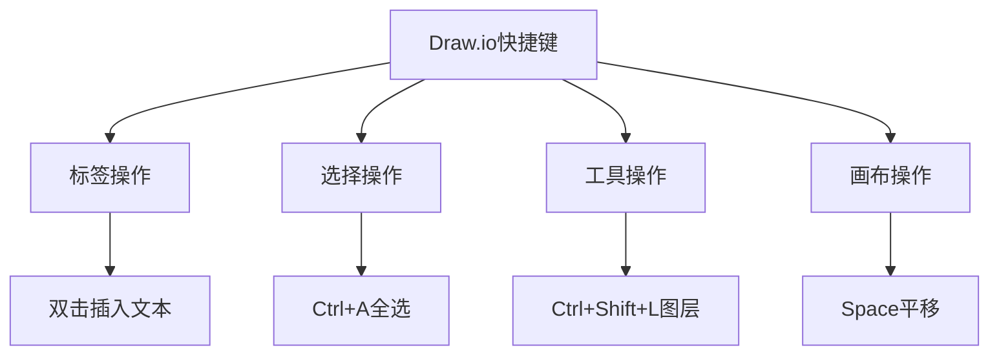

> **摘要** — Draw.io 快捷键大全，涵盖标签操作、选择操作、工具操作、画布操作、图形连接、文档操作、样式操作等。常用快捷键：Ctrl+S 保存、Ctrl+Z 撤销、Ctrl+G 生成组、Ctrl+R 旋转、F2 编辑等。



```markmap height=280
# Draw.io 快捷键
## 标签操作
- 双击：插入文本
- Enter：换行
- F2：编辑文字
## 选择操作
- Ctrl+A：全选
- Shift+Tab：选择上一个
- Alt+Click：切换选中
## 工具操作
- Ctrl+Shift+L：图层工具栏
- Ctrl+Shift+P：格式工具栏
- Ctrl+K：生成正方形
## 画布操作
- Ctrl+X/C：剪切/拷贝
- Ctrl+G：生成组
- Ctrl+R：旋转 90°
## 文档操作
- Ctrl+S：保存
- Ctrl+Z：撤销
- Ctrl+Y：重做
```

---

drawio 或者 [drawon](https://www.drawon.cn?useSource=csdn) 中的快捷键基本一致，如下我们按照[不同的](https://so.csdn.net/so/search?q=%E4%B8%8D%E5%90%8C%E7%9A%84&spm=1001.2101.3001.7020)类别进行归类描述。

为了便于大家更直观的理解，我们在 b 站上给大家录了讲解与演示教程：  
[https://www.bilibili.com/video/BV13Q4y1L7Dv/?spm_id_from=333.337.search-card.all.click&vd_source=16e8748b5af6de2606217e1f5d76f317](https://www.bilibili.com/video/BV13Q4y1L7Dv/?spm_id_from=333.337.search-card.all.click&vd_source=16e8748b5af6de2606217e1f5d76f317)

### 标签操作

<table><thead><tr><th>快捷键</th><th>操作</th></tr></thead><tbody><tr><td><strong>双击</strong></td><td>插入文本或添加边缘标签</td></tr><tr><td><strong>Enter / Shift+Enter</strong></td><td>换行</td></tr><tr><td><strong>Enter / Tab</strong></td><td>标签中的换行符 / 制表符 / 缩进</td></tr><tr><td><strong>Enter / F2</strong></td><td style="">开始编辑所选单元格的文字</td></tr><tr><td><strong>Ctrl+Enter / Shift+Tab / F2 / Esc</strong></td><td style="">停止编辑</td></tr><tr><td><strong>Ctrl+B / Ctrl + I / Ctrl+U</strong></td><td>在所选文本上切换粗体 / 斜体 / 下划线</td></tr><tr><td><strong>Ctrl+ ,</strong></td><td>所选文本的下标</td></tr></tbody></table>

### 选择操作

<table><thead style=""><tr style=""><th style="">快捷键</th><th style="">操作</th></tr></thead><tbody><tr><td><strong>(Shift+)Tab</strong></td><td style="">选择下一个 / 上一个</td></tr><tr><td><strong>Alt + Tab</strong></td><td style="">选择父级图形</td></tr><tr><td><strong>Shift + Drag</strong></td><td style="">切换到所选内容</td></tr><tr><td><strong>Alt + Drag</strong></td><td style="">开始选择 / 选择交叉点</td></tr><tr><td><strong>Ctrl+(Shift+)A</strong></td><td style="">全选 / 取消选中</td></tr><tr><td><strong>Ctrl+Shift+I / E</strong></td><td style="">选中所有图形 / 选中所有连接线</td></tr><tr><td><strong>Ctrl / Shift+Select</strong></td><td style="">切换选中状态</td></tr><tr><td><strong>Alt+Click</strong></td><td style="">切换为选中或未选中</td></tr></tbody></table>

### 工具操作

<table><thead style=""><tr style=""><th style="">快捷键</th><th style="">操作</th></tr></thead><tbody><tr><td><strong>Ctrl+Shift+L</strong></td><td style="">切换显示图层工具栏</td></tr><tr><td><strong>Ctrl+Shift+O</strong></td><td>打开缩略图工具栏</td></tr><tr><td><strong>Ctrl+Shift+P</strong></td><td style="">打开格式工具栏</td></tr><tr><td><strong>Ctrl+Shift+K</strong></td><td>生成一个圆图形</td></tr><tr><td><strong>Ctrl+K</strong></td><td style="">生成一个正方形</td></tr><tr><td><strong>Ctrl+Shift+M</strong></td><td style="">编辑几何图形</td></tr><tr><td><strong>Ctrl+M</strong></td><td style="">编辑元数据</td></tr><tr><td><strong>F1</strong></td><td>打开关于模态框</td></tr></tbody></table>

### 改变页面或光标快捷键

<table><thead style=""><tr style=""><th style="">快捷键</th><th style="">操作</th></tr></thead><tbody><tr><td><strong>Cursor</strong></td><td>滚动 / 移动单元格 （pt）</td></tr><tr><td><strong>Shift+Cursor</strong></td><td>移动单元格（网格）或页面</td></tr><tr><td><strong>Ctrl+Cursor</strong></td><td>调整单元格大小 （pt） 或选择页面</td></tr><tr><td><strong>Ctrl+Shift+Cursor</strong></td><td style="">调整单元格大小（网格大小）</td></tr><tr><td><strong>Alt+Shift+Cursor</strong></td><td>克隆和连接</td></tr><tr><td><strong>Alt+Cursor</strong></td><td>滚动页面</td></tr><tr><td><strong>Ctrl+Shift+Pg Up</strong></td><td>上一页</td></tr><tr><td><strong>Ctrl+Shift+Pg Down</strong></td><td>下一页</td></tr></tbody></table>

### 画布操作

<table><thead><tr><th>快捷键</th><th>操作</th></tr></thead><tbody><tr><td><strong>Ctrl+X / C</strong></td><td>剪切 / 拷贝</td></tr><tr><td><strong>Ctrl+V</strong></td><td>粘贴</td></tr><tr><td><strong>Ctrl+G</strong></td><td>生成组</td></tr><tr><td><strong>Ctrl+Shift+U</strong></td><td>取消组</td></tr><tr><td><strong>Ctrl+L / Alt+Shift+L</strong></td><td>锁定 / 解锁 / 编辑链接</td></tr><tr><td><strong>Ctrl+Enter / D</strong></td><td>复制一个选中的图形</td></tr><tr><td><strong>Backspace or Delete</strong></td><td>删除所选单元格</td></tr><tr><td><strong>Ctrl / Shift+Delete</strong></td><td>清除图形文本内容</td></tr><tr><td><strong>Ctrl+R</strong></td><td>顺时针旋转 / 旋转 90°</td></tr><tr><td><strong>Shift+Resize</strong></td><td>保持比例</td></tr><tr><td><strong>Ctrl+Resize</strong></td><td>居中调整大小</td></tr><tr><td><strong>Ctrl+Home</strong></td><td>折叠容器</td></tr><tr><td><strong>Ctrl+End</strong></td><td>展开容器</td></tr><tr><td><strong>Ctrl+Shift+Home</strong></td><td>退出组</td></tr><tr><td><strong>Ctrl+Shift+End</strong></td><td>输入组</td></tr><tr><td><strong>Ctrl+Shift+F / B</strong></td><td>置于顶层 / 置于底层</td></tr><tr><td><strong>Ctrl+F</strong></td><td>查找 / 替换</td></tr><tr><td><strong>Alt+Shift+C / T</strong></td><td>清除航点 / 编辑工具提示</td></tr><tr><td><strong>Ctrl+Shift+Y</strong></td><td>自动调整大小</td></tr><tr><td><strong>Ctrl / Shift+Drag</strong></td><td>克隆 / 交换 / 约束</td></tr></tbody></table>

### 视图操作

<table><thead><tr><th>快捷键</th><th>操作</th></tr></thead><tbody><tr><td><strong>Alt+Wheel</strong></td><td>画布放大 / 缩小</td></tr><tr><td><strong>Ctrl+Shift+Wheel</strong></td><td>画布放大 / 缩小</td></tr><tr><td><strong>Wheel</strong></td><td>画布垂直滚动</td></tr><tr><td><strong>Shift+Wheel</strong></td><td>画布水平滚动</td></tr><tr><td><strong>Space / Right-click+Drag</strong></td><td>平移画布</td></tr><tr><td><strong>Alt+Ctrl+Shift+Drag</strong></td><td>创建 / 删除空间</td></tr><tr><td><strong>Alt+Resize / Move</strong></td><td>取消网格</td></tr><tr><td><strong>Shift+Home</strong></td><td>Home</td></tr><tr><td><strong>End</strong></td><td>刷新</td></tr><tr><td><strong>Enter / Home</strong></td><td>重置视图</td></tr><tr><td><strong>Ctrl+Shift+H</strong></td><td>选中图形适配页面</td></tr><tr><td><strong>Ctrl+J</strong></td><td>所有图形适配页面</td></tr><tr><td><strong>Ctrl+Shift+J</strong></td><td>整个画布适配页面</td></tr><tr><td><strong>Ctrl+0</strong></td><td>自定义缩放</td></tr><tr><td><strong>Ctrl + (Numpad)</strong></td><td>放大</td></tr><tr><td><strong>Ctrl - (Numpad)</strong></td><td>缩小</td></tr></tbody></table>

### 图形连接操作

<table><thead><tr><th>快捷键</th><th>操作</th></tr></thead><tbody><tr><td><strong>Alt+(Shift+)Drag shape from library</strong></td><td>禁用放置目标上的替换和连接（Shift 忽略当前样式）</td></tr><tr><td><strong>Alt+(Shift / Ctrl)+Click on a library shape</strong></td><td>插入并连接所选项目（Shift 忽略当前样式）</td></tr><tr><td><strong>Shift+Click on a library shape</strong></td><td>将所选项目替换为单击的项目</td></tr><tr><td><strong>Click on a library shape</strong></td><td>连接到所选边的未连接侧</td></tr><tr><td><strong>Alt / Shift+Connect</strong></td><td>忽略形状 / 连接到固定点</td></tr></tbody></table>

### 文档操作

<table><thead><tr><th>快捷键</th><th>操作</th></tr></thead><tbody><tr><td><strong>Ctrl+(Shift+)S</strong></td><td>保存</td></tr><tr><td><strong>Ctrl+Z</strong></td><td>撤销</td></tr><tr><td><strong>Alt+Shift+A</strong></td><td>连接箭头</td></tr><tr><td><strong>Alt+Shift+P</strong></td><td>连接点</td></tr><tr><td><strong>Hold Alt</strong></td><td>忽略鼠标下方的控点</td></tr><tr><td><strong>Ctrl+Shift+G</strong></td><td>切换网格</td></tr><tr><td><strong>Ctrl+P</strong></td><td>打印</td></tr><tr><td><strong>Ctrl+Y</strong></td><td>重做（windows）</td></tr><tr><td><strong>Ctrl+Shift+Z</strong></td><td>重做 (Linux/macOS)</td></tr><tr><td><strong>A / S / D / F / C</strong></td><td>添加文本 / 注释 / 矩形 / 椭圆 / 线条</td></tr><tr><td><strong>X</strong></td><td>切换手绘模式</td></tr><tr><td><strong>Ctrl / Right click</strong></td><td>上下文菜单</td></tr><tr><td><strong>(Ctrl / Shift)+Esc</strong></td><td>取消编辑 / 操作</td></tr></tbody></table>

### 样式操作

<table><thead><tr><th>快捷键</th><th>操作</th></tr></thead><tbody><tr><td><strong>Ctrl+Shift+R</strong></td><td>清除默认样式</td></tr><tr><td><strong>Ctrl+E</strong></td><td>编辑样式</td></tr><tr><td><strong>Ctrl+Shift+D</strong></td><td>设置为默认样式</td></tr><tr><td><strong>Ctrl+Shift+C</strong></td><td>Copy style</td></tr><tr><td><strong>Ctrl+Shift+V</strong></td><td>粘贴样式</td></tr><tr><td><strong>Alt+Shift+X / B</strong></td><td>复制大小 / 数据</td></tr><tr><td><strong>Alt+Shift+V / E</strong></td><td>粘贴尺寸 / 数据</td></tr><tr><td><strong>Drag</strong></td><td>移动单元格 / 平移画布</td></tr></tbody></table>