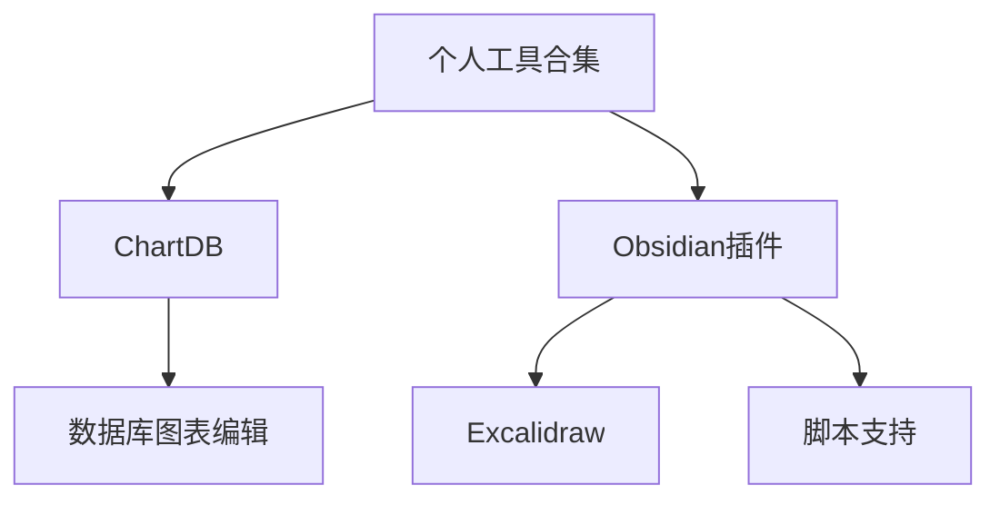

> **摘要** — 个人绘图和设计工具合集：ChartDB 数据库图表编辑器、Obsidian Excalidraw 相关插件（excalidraw-example-vault、excalidraw-scripts、excalidraw-plugin-ymjr）。开源工具推荐，适合技术文档和知识管理。



```markmap height=200
# 个人工具合集
## ChartDB
- 开源数据库图表编辑器
## Obsidian 插件
- Excalidraw Example Vault
- Excalidraw Scripts
- Excalidraw Plugin YMJR
```

---

## 个人工具合集

- [chartdb](https://github.com/chartdb/chartdb)
> Open-source database diagrams editor 

**obsidian魔改插件:**
`示例程序`
-  [obsidian-excalidraw-example-vault](https://github.com/Bowen-0x00/obsidian-excalidraw-example-vault)
- [obsidian-excalidraw-scripts](https://github.com/Bowen-0x00/obsidian-excalidraw-scripts)
- [obsidian-excalidraw-plugin-ymjr](https://github.com/Bowen-0x00/obsidian-excalidraw-plugin-ymjr)