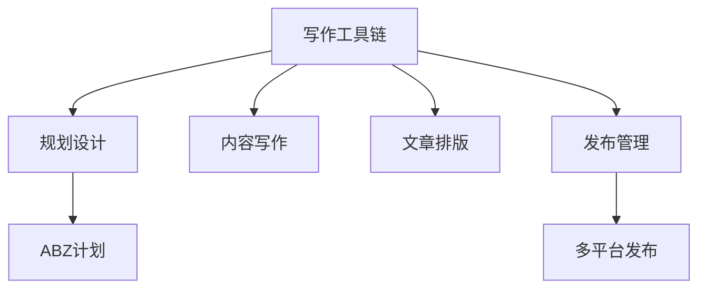

> **摘要** — 个人写作工具链基于 SOC（关注点分离）原则，拆解为四个方面：规划设计、内容写作、文章排版、发布管理。目标是围绕打造个人"资产"，脱离平台独立抵抗风险。以 B 计划 IP 写作作为驱动力，强迫对 A 计划不停思考迭代。



```markmap height=280
# 个人写作工具链
## SOC 原则
- 关注点分离
- 复杂问题分解
## 四方面
- 规划设计
- 内容写作
- 文章排版
- 发布管理
## 目标
- 打造个人资产
- 脱离平台独立
## ABZ 计划
- A 计划主业
- B 计划 IP 写作
```

---

最近在知乎上有这么一个问题，哪一件事让你意识到打工没出路？(http://ksria.com/simpread/) 转码， 原文地址 [mp.weixin.qq.com](https://mp.weixin.qq.com/s/s61JRl8P-1CmTHUSlZYoQw)

最近在知乎上有这么一个问题，哪一件事让你意识到打工没出路？

有个特别逗，但是却一针见血的回答：**打工的目的是为了赚钱早日赎身，不是为了给青楼当头牌**！

![][img-0]

而我自己在 2025 年春节假期，回到家里接触了一圈亲友之后，发现很多人生活非常不错，都是靠上班之外的收入。

对于三四线城市，相对于北上广来说，上班本身赚不到多少钱，只不过是一个行业的敲门砖、一个生存的保底而已。

反而九九六的职场牛马，没有一个是精神状态良好财务自由的，并且更焦虑更恐慌，因为自己的生死荣辱系于人手。

更让我确认了上班的终极目标，应该是围绕打造自己的 “ **资产** ”，有朝一日让自己可以脱离平台、组织而能独立抵抗风险，甚至能活得更好。

年前其实就梳理过自己的 ABZ 计划之间的关系。

其中 A 计划主业应该是与 B 计划相辅相成，而我自己的特色规划是以 B 计划的 IP 写作作为驱动力，强迫对 A 计划不停地思考、迭代提升。

但是，目前来看微信公众号、知乎等平台的编辑器对文章格式排版的支持一言难尽。

自己也曾经折腾了好久的从内容写作到排版，再到发布的完整工具链，提升自己的工作效能。

也算是一个总结，也分享给有需要的同学。

01
--

### SOC - 关注点分离原则

在介绍具体的写作工具链之前，先介绍一下写作工具链的基本原则：关注点分离。

**关注点分离** （Separation of Concerns，简称 SOC）是一种系统思维方法，广泛应用于日常生活和生产中，用于解决复杂问题。其基本思路是将复杂问题合理分解，分别研究问题的不同侧面（关注点），最后综合各方面的结果，形成整体的解决方案。

对于我的写作来说，也遵循这个原则，将整个过程拆解为如下 4 个方面：

1.  规划设计。
    
2.  内容写作。
    
3.  文章排版。
    
4.  多平台发布。
    

这样每次在零碎时间的时候就可以进行规划设计，而写作的时候聚焦在内容上不管排版，这也是我不选择 word 而使用 markdown 的原因。

内容写作完成之后，通过自动排版工具，使用样式模板进行排版。

最后在多平台的编辑器中发布。

一次只关注一个侧面。

02
--

### 规划设计

如果想要高频率的输出文章，每次靠自己的灵感大爆发是不行的，一些大 V 都有自己的文章框架。

例如李笑来，他的文章结构基本上按照如下几部分来写：我要说什么概念、它为什么重要、它通常会被误解为怎么回事、这个概念有什么意义、如何正确使用这个概念、错误使用这个概念有什么可怕之处、它与那些概念有关联。

因为李笑来的专注点在于认知提升，而他的一个理念就是升级人的大脑操作系统关键在于厘清概念。

概念的应用笔者在前面一篇文章《**从李笑来讲述的 “概念” 到工作推进中一点感悟**》中已经阐述过，所以我们可以看到他的文章结构，就是按照他的对于概念认知的基本原则来设计的。

说回到工具链上，笔者主要使用了 3 方面的工具。

> **首先，是支持各种插件的：Visual Studio Code，它作为基础写作平台**。

它是由微软开发的一个现代化、轻量级的代码编辑器，它支持几十种主流编程语言（如 JavaScript、Python、C++、Java、Go 等），并通过扩展提供更广泛的语言支持。

它实际上也可以用来写作文章，笔者同时也用它来开发一些 Python 工具、插件等。

> **其次，是 Visual Studio Code 上面的支持思维导图的插件：vscode-mindmap**。

![][img-1]

它可以让你在 vs code 中直接创建、编辑思维导图文件，它的好处是轻量级，可以与 markdown 文件并列窗口打开方便内容写作，不用再去安装 xmind 等重量级独立软件。

![][img-2]

> **最后，是文件模板插件 File Templates**。

对于常用固定格式的文件，可以直接预先配置好模板，后面直接在 vscode 中应用即可。

例如刚才说的李笑来的文章结构，笔者配置好了思维导图模板：

![][img-3]

每次想要设置新的细微导图文件时，直接在 vscode 中使用 Ctrl 键 +Shift 健 +P 健，选择自己想要的模板即可：

![][img-4]

03
--

### 内容写作

在规划设计完成之后，开始正式写作。笔者使用的是 vscode 中集成的 markdown 所见即所得插件。

> Office Viewer(Markdown Editor)。

可以理解为免费版的 Typora，集成在 vscode 中非常好用。

![][img-5]

如果还有一些画图需求，可以在 vscode 中使用 **Draw.io Integration** 插件，开源免费，极其强大。

04
--

### 文章排版

在完成文章内容的开发之后，到了发布前的关键环节排版了。

由于笔者使用 markdown 开发，几乎是原生的主题状态，而微信公众号、知乎等平台的编辑器对 markdown 语法支持并不友好，尤其是一些自定义的样式模板，存在较大的问题。

所以笔者使用了如下几个关键工具。

> Markdown Here

它是支持自定义 CSS 样式的的谷歌浏览器插件，笔者也是从李笑来的文章中发现这个工具，使用起来果然很香。安装完成插件之后，可以在红色方框内部输入自己的个性化配置即可使用。

![][img-6]

05
--

### 多平台发布

笔者在使用过程中发现还存在问题，把 markdown 内容等放在公众号编辑器里面，或者知乎的编辑器里面，使用 markdown 的话，并不能很好的生效，甚至发生错乱。

所以现在笔者的操作，是先打开邮箱或 simditor.tower.im 操作，复制 markdown 内容进去，使用 markdown here 插件一键排版。

然后将内容复制到微信公众号编辑器里面，上传调整图片等内容，保存草稿。

最后，将公众号编辑器里面的内容复制，直接黏贴在知乎的编辑器里面，就连同样式 + 图片一起保留了，直接保存或者发布即可了。

[img-0]:images/07-03-writing-tools/p01.jpg

[img-1]:images/07-03-writing-tools/p02.gif

[img-2]:images/07-03-writing-tools/p03.jpg

[img-3]:images/07-03-writing-tools/p04.jpg

[img-4]:images/07-03-writing-tools/p05.jpg

[img-5]:images/07-03-writing-tools/p06.jpg

[img-6]:images/07-03-writing-tools/p07.jpg
